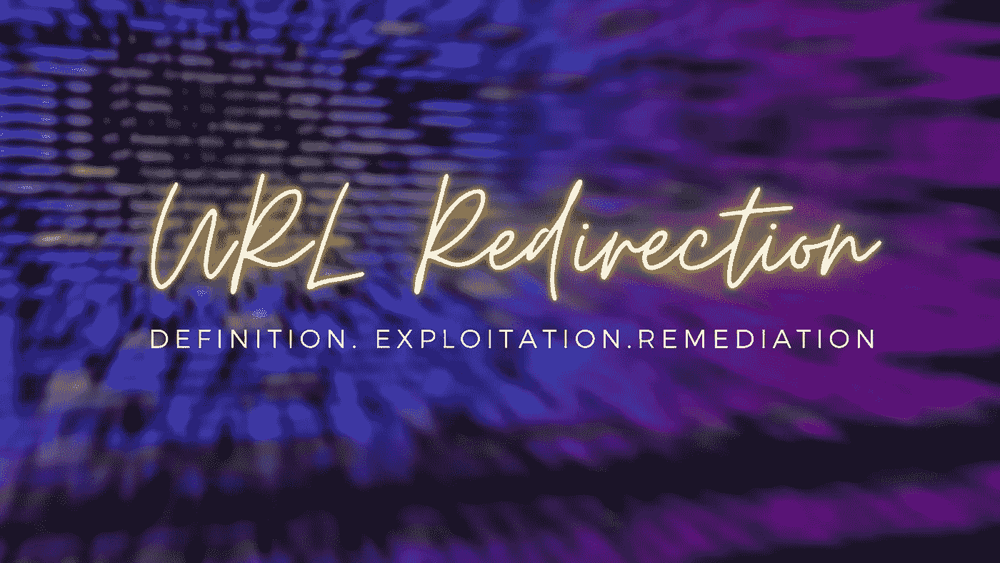
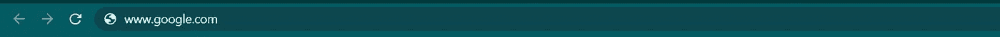
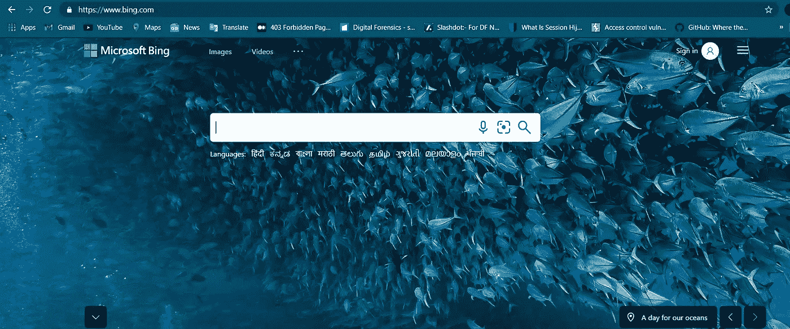
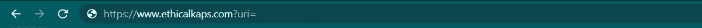
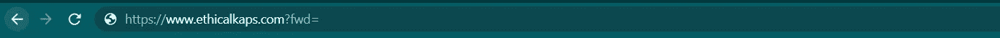
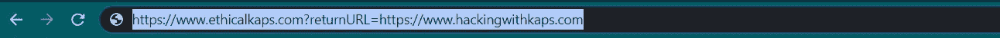
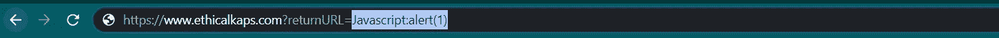
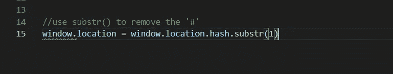
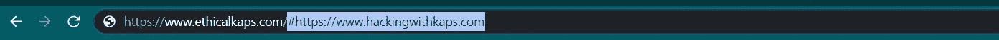
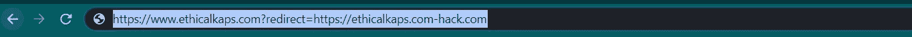

# URL 重定向:利用和缓解

> 原文：<https://infosecwriteups.com/url-redirection-exploitation-and-mitigation-8eed73007375?source=collection_archive---------1----------------------->

嘿**赛博朋克**，我希望你做得很好。我(伦理 kap)又带着另一个强大的话题回来了。在开始之前，我想给你介绍一下文章的**概述。这将是在 **3 个主要阶段**和 **1 个奖励阶段。我将分享一个漂亮的 URL 重定向脚本，你可以用在你的攻击中。因此，不浪费任何时间，让我们直接进入 URL 重定向的海洋。****

> **注**:我会尽量让题目简单，尽量用通俗易懂的语言解释。以便您能够抓住漏洞的根源，并在您的目标中找到这些错误，使它们更加安全。

> *(根💀伦理 kaps)-****概述。***
> 
> *(根💀* ***【伦理 Kaps】)【途径剥削。***
> 
> *(根💀【伦理道德】)* ***整治。***

# **概述**

如果你是这个漏洞的新手，那么你可能会疑惑到底什么是 URL 重定向？让我们举一个非常简单的例子。**假设**你在浏览器中输入了下面的 URL->

那么显而易见的结果应该是谷歌的首页。是的，你完全正确。但是现在，我们就拿**再来一个** **假设**。现在我告诉你在你的浏览器中输入下面的网址- >

如果它是易受攻击的，那么它将显示如下结果。这意味着 google.com 容易受到 URL 重定向的攻击。

我希望到现在为止你已经了解了漏洞的概念。我不会告诉你书生气的语言。因为我们是黑客，我们只用黑客语言交流(LOL！！！抱歉说了这些俚语。但是是的，那是< +rue >。为了让你理解，我仍然给你一个定义，即 URL 重定向是一种漏洞，攻击者强迫你的应用程序的用户在他们不知情的情况下重定向到一些其他恶意网站。

# 剥削的方式

1.  每当你注意到这样的事情，意味着域名前面的 **url=，uri=或 fwd=** ，然后尝试注入恶意链接(这是你要重定向到的域名)

2.每当您注意到类似 **301/302 的状态代码时。不要停止**你可能会找到让**高兴的事情。**

3.每当你注意到类似于 **returnURL=** 的东西，这就是你可能会发现这个 bug 的迹象

4.您也可以将 URL 重定向到 XSS。怎么会？非常简单，只需在参数中插入任意 JavaScript 代码。我们使用了 **Javascript:alert(1)** ，当成功执行时会弹出 **1** 的窗口。

5.如果您的页面使用 JavaScript 作为

这是存在开放重定向的情况。因为在这里你可以插入你的恶意链接并将用户重定向到你的 URL。

6.你可以使用这种技术提供合法域名(【ethicalkaps.com】**)然后是 a ( **-** )，然后是你的恶意站点(**【hack.com】**)。从下图中可以清楚地看出这一点**

这些是你下次追捕目标时可以使用的一些技巧。

# 补救

作为一个好人，每当我们遇到这种情况时，让**客户端/应用程序**所有者了解特定的漏洞是我们的首要责任。有一些**方法可以保护**您的应用程序免受这些类型的攻击

1.  您可以**简单地避免重定向并转发参数**。如果您正在使用它，那么不要允许 URL 作为目的地的用户输入。
2.  **如果**您**无法消除用户输入**，那么请确保提供的**值**有效，并且**授权**给用户。
3.  你可以把你网站的网址列入白名单。例如，如果你不想使用重定向作为查询参数(我指的是[**https://www.ethicalkaps.com？redirect=** )](https://www.ethicalkaps.com?redirect=)) 那你可以用([**【https://www.ethicalkaps.com/redirect】**](https://www.ethicalkaps.com?redirect=))**？externalpage=1**

*   这应该基于允许列表方法，而不是阻止列表。

4.你也可以使用一个**通知选项**来通知用户站点何时离开它的实际域名。

# **URL 重定向的有趣脚本**

这也可以在 HTML 注入下导致 URL 重定向。在你的记事本上试试。因此，无论您在哪里找到 HTML 注入，您都可以将该脚本嵌入到目标中，这将引导您进行 URL 重定向。

<html>
head>
<meta name = " viewport " content = " width = device-width，initial-scale = 1 ">

</head>
<body>
<marquee><h1 style = " background-color:slate blue；>等待拨动开关&悬停在它上面进行 URL 重定向</h1></marquee>
<marquee><h1>伦理 kaps</h1><marquee>

<a onmousseleave = " document . location . href = '[https://www . bing . com '](https://www.bing.com')"><label class = " switch ">
<input type = " checkbox ">

</label>

[https://www . bing . com '](https://www.bing.com')"><label class = " switch ">
<input type = " checkbox ">

</label>  <label class = " switch ">
<input type = " checkbox ">

</label></a>

[https://www . bing . com '](https://www.bing.com')"><label class = " switch ">
<input type = " checkbox ">

</label></a>

那么，这就是这篇文章的内容**，希望你喜欢。我会给你带来另一篇有用的文章。在那之前要小心，继续寻找。继续挖掘和学习新的东西。**

如果你喜欢这些内容，你可以在这里支持我:-**@**[**buymeacoffee.com/ethicalkaps**](http://buymeacoffee.com/ethicalkaps)

下一篇文章再见。在那之前保重。和平！

> 你可以在 [**Twitter**](https://twitter.com/EthicalKaps) 上关注我，在 [**Spotify**](https://open.spotify.com/show/49AHAyFgIy7E2NDjuGRaMm?si=lVPL_DBGRkGIC8DzfTXNbw) 上关注我的评论，在 [**Instagram**](https://www.instagram.com/iam_kapilchoudhary/) 上关注我。

## 如果你喜欢这个故事，请点击👏想按多少次就按多少次，并分享来帮助其他人找到它！欢迎在下方留言评论。