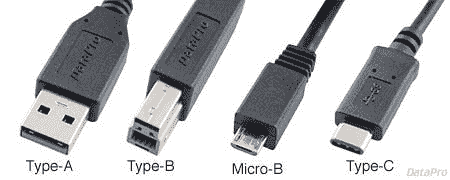
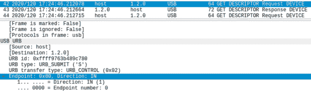
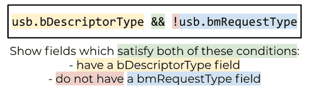
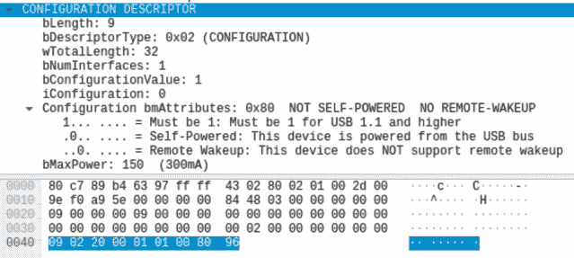
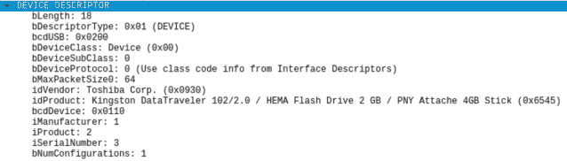
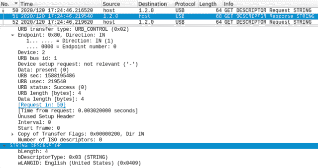
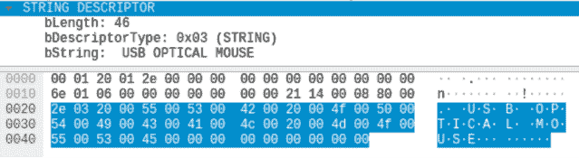
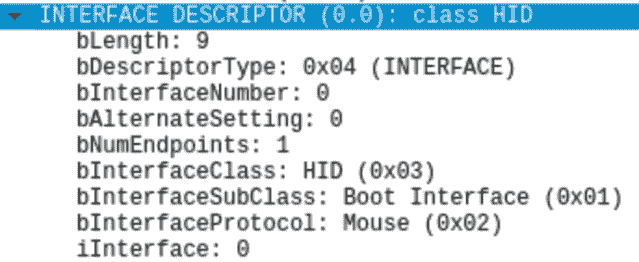
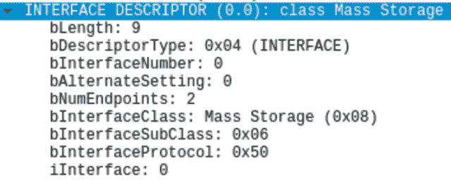

# USB 取证 101

> 原文：<https://infosecwriteups.com/usb-forensics-101-444faf737c4c?source=collection_archive---------3----------------------->

欢迎来到我的 USB 取证 101 指南。

受我完成的 USB 取证基础知识的 Pluralsight 课程的启发，我决定尝试自己解释这些基础知识。作为一个目标导向型的人，我知道决定写一篇博客将有助于我理解所学内容，并帮助我组织我头脑中的新知识——你知道他们说什么，一个人只有在能够向一个五岁的孩子解释一个话题时，才能完全理解这个话题。虽然这对于一个五岁的孩子来说可能有点沉重(尽管它可能会被证明是一个有效的睡前催眠曲)，但它应该传达了我从只知道 USB 的存在到理解它如何在引擎盖下工作所学到的东西。

# 基础

首先，我们来了解一下，在没有插入任何 USB 设备的情况下，主机看到自己的 USB 是什么样的。为此，我们将需要`lsusb`实用程序。让我们试一试——确保没有任何东西插入您的 USB 端口。

`lsusb`预装在 Linux 上。如果你像我一样使用 macOS，你需要先用`brew install lsusb`安装它。运行`lsusb -t`命令，将输出显示为一棵树。其他有用的语法可以是`lsusb | sort -k 2`，它根据总线号对输出进行排序，或者是`lsusb -v`，verbose 标志输出关于所列设备的更多详细信息。

```
Kingas-MacBook-Pro:~ kingakieczkowska$ lsusb -t
...
0.Dev 000: iBridge Bus, 
/:  Bus 000.Dev 001: USB 3.1 Bus, 
/:  Bus 128.Dev 000: Apple T2 Controller, 
/:  Bus 128.Dev 000: FaceTime HD Camera (Built-in), 
/:  Bus 128.Dev 000: Ambient Light Sensor, 
/:  Bus 128.Dev 000: Headset, 
    |__ Bus 128.Dev 008: Apple Internal Keyboard / Trackpad, 480M
/:  Bus 128.Dev 000: Touch Bar Display, 
/:  Bus 128.Dev 000: Touch Bar Backlight,
```

输出为我们提供了总线号、设备号、设备名和设备的最大信号速率(速度)——这是一行末尾的数字，上面用绿色标记。由于这可能比我们在机器上什么都没插的情况下看到的设备要多得多，所以让我们仔细看看:

*   iBridge 是一个 USB 设备，在内部用作 TouchBar 的接口；
*   USB 3.1 总线是所有用户设备将连接的总线；
*   总线 128 上的所有设备都被预先构建到机器中。

我有一台 MacBook Pro，所以要真正使用我的 USB，我需要一个该死的加密狗(是的，我知道，这很荒谬)。让我们看看当我插入一个带有另一个 USB C 端口和两个 USB A 端口的加密狗时会有什么变化(USB A 是您最常见的“常规”USB)。加密狗还有一个 HDMI 端口，允许 USB C 到 HDMI 的连接。



让我们检查一下插上加密狗后`lsusb`中出现了什么。

```
Kingas-MacBook-Pro:~ kingakieczkowska$ lsusb -t
...
0.Dev 000: iBridge Bus, 
  Bus 000.Dev 001: 3.0 root hub, 5000M
/:  Bus 000.Dev 001: USB 3.1 Bus, 
    |__ Bus 000.Dev 001: USB3.0 Hub, 5G
    |__ Bus 020.Dev 001: USB2.0 Hub, 480M
        |__ Bus 020.Dev 002: USB 2.0 BILLBOARD, 12M
/:  Bus 128.Dev 000: Apple T2 Controller, 
/:  Bus 128.Dev 000: FaceTime HD Camera (Built-in), 
/:  Bus 128.Dev 000: Ambient Light Sensor, 
/:  Bus 128.Dev 000: Headset, 
    |__ Bus 128.Dev 008: Apple Internal Keyboard / Trackpad, 480M
/:  Bus 128.Dev 000: Touch Bar Display, 
/:  Bus 128.Dev 000: Touch Bar Backlight,
```

淡紫色线条代表根集线器、两个新的集线器——USB 3.0 和 USB 2.0——以及一个新的广告牌设备。我们一个一个来看。
根 hub 是直接与我们机器的 USB 接口。接下来，您可能想知道为什么在插入一个 USB 加密狗后会出现两个 USB 集线器？这是因为为了向后兼容，实际上每个 USB3.0 都包含一个 USB2.0。USB3.0 架构与 USB2.0 有着天壤之别，否则就不可能使用与 USB3.0 不兼容的设备。您可以将 USB3.0 与 USB2.0 兼容的设备一起使用，但该设备只能达到 USB2.0 每秒 480 兆位的最大速度，而**不能达到** USB3.0 每秒 5 千兆位的最大速度。
最后，有一个 USB2.0 广告牌设备显示为连接到 USB2.0 集线器。这实际上是加密狗内的一个内置设备，便于 USB C < - > HDMI 连接。
让我们将 USB 记忆棒插入集线器/加密狗的一个可用端口，看看会发生什么。

```
Kingas-MacBook-Pro:~ kingakieczkowska$ lsusb -t
...
0.Dev 000: iBridge Bus, 
  Bus 000.Dev 001: 3.0 root hub, 5000M
/:  Bus 000.Dev 001: USB 3.1 Bus, 
    |__ Bus 000.Dev 001: USB3.0 Hub, 5G
 **|__ Bus 000.Dev 004: USB DISK, 5G**
    |__ Bus 020.Dev 001: USB2.0 Hub, 480M
        |__ Bus 020.Dev 002: USB 2.0 BILLBOARD, 12M
/:  Bus 128.Dev 000: Apple T2 Controller, 
/:  Bus 128.Dev 000: FaceTime HD Camera (Built-in), 
/:  Bus 128.Dev 000: Ambient Light Sensor, 
/:  Bus 128.Dev 000: Headset, 
    |__ Bus 128.Dev 008: Apple Internal Keyboard / Trackpad, 480M
/:  Bus 128.Dev 000: Touch Bar Display, 
/:  Bus 128.Dev 000: Touch Bar Backlight,
```

洋红色粗线表示 USB 磁盘存在。因为它兼容 USB3.0，所以它连接到 USB3.0 集线器，我们可以看到它的最大信号速率为 5 gbps。

接下来，让我们看看当我们连接一个旧键盘时会发生什么。

```
Kingas-MacBook-Pro:~ kingakieczkowska$ lsusb -t
...
0.Dev 000: iBridge Bus, 
  Bus 000.Dev 001: 3.0 root hub, 5000M
/:  Bus 000.Dev 001: USB 3.1 Bus, 
    |__ Bus 000.Dev 001: USB3.0 Hub, 5G
        |__ Bus 000.Dev 003: USB DISK, 5G
    |__ Bus 020.Dev 001: USB2.0 Hub, 480M
 **|__ Bus 020.Dev 005: Composite Device, 1.5M**
        |__ Bus 020.Dev 003: USB 2.0 BILLBOARD, 12M
/:  Bus 128.Dev 000: Apple T2 Controller, 
/:  Bus 128.Dev 000: FaceTime HD Camera (Built-in), 
/:  Bus 128.Dev 000: Ambient Light Sensor, 
/:  Bus 128.Dev 000: Headset, 
    |__ Bus 128.Dev 008: Apple Internal Keyboard / Trackpad, 480M
/:  Bus 128.Dev 000: Touch Bar Display, 
/:  Bus 128.Dev 000: Touch Bar Backlight,
```

开始了。我的旧键盘的信号速率是 1.5M，显然与 USB3.0 不兼容(它真的很旧了)——因此连接到 USB2.0 集线器。还有——复合设备到底是什么？有时被插设备的名称会提供不多的信息，因此明智的做法是习惯于比较插入东西前后`lsusb`的输出，这是识别您想要研究的设备的方法。

所有上述连接都是由主机控制器促成的。每台机器至少有一个在硬件层面管理 USB 总线上的数据。

# USB 主机通信

让我们深入了解 USB 设备实际上是如何与主机通信的。

# 端点

USB 端点是一条“虚拟线路”，它既是设备的数据接收器，也是设备的数据源。有四种类型的 USB 端点。这些类型还决定了在其上发生的数据传输的类型，因此下面同时是端点和传输类型:

*   **中断** 鼠标(就像我们上面看到的那个)和键盘使用，低速(事实证明鼠标和键盘并不经常发送那么多数据)。有趣的事实是:这个中断实际上并没有以任何方式中断主机。它必须等到被主机轮询后才能发送任何请求。
*   **控制**大多数 USB 设备使用的
    ；具有该端点的设备必须能够响应标准 USB 设备请求，如获取地址、设置地址、获取描述符、设置描述符、获取状态、清除特征、设置特征等。GET_STATUS 通知端点的状态。后者获取、设置、清除和设置设备上不同功能的布尔值。
*   **Bulk** 用于性能良好，不允许低速传输；被 USB 大容量存储(USBMS)设备广泛使用。
*   **同步**
    主要用于流媒体等对时间要求苛刻的应用；每当需要保证带宽时。

值得注意的是，每个端点都有一个指定的方向。该方向始终相对于主机，而不是设备:1 表示主机的输入，0 表示主机的输出。USB2.0 设备最多可以有 32 个端点(16 个输入，16 个输出)，而 USB3.0 设备支持更多端点(最多 96 个或 254 个，具体取决于底层架构)。重要的是要记住，单个设备可能会使用多个端点，更多信息请点击这里的。

您可以清楚地看到 Wireshark 中用于通信的端点类型。选择一个数据包，向下滚动到 USB URB (URB 代表 USB 请求块)部分，然后选择 Endpoint 以检查该特定数据包使用的传输类型和方向。



控制转移是有趣的，因为它将被用来发送描述设备的数据，如品牌、语言等。这对你的法医调查非常有帮助。这是通过描述符传达的。

# 描述符

你会看到主机向设备发送了相当多的请求，包括`GET_DESCRIPTOR Request`和设备相应的回复——`GET_DESCRIPTORS Response`。我们最感兴趣的是响应，因为它们包含了设备报告给主机的信息。在 Wireshark 中，您可以过滤您的捕获，只显示具有`bDescriptorType`字段的数据包，只需将`usb.bDescriptorType`放入过滤栏即可。这将向您显示请求和响应。为了只过滤响应，我们将在过滤栏中添加`&& !usb.bmRequestType`。这是因为只有请求才会有`bmRequestType`字段，添加感叹号会反转过滤器，留给我们所有没有`bmRequestType`字段的数据包。



许多不同类型的描述符携带了许多有趣的信息。它们都共享一个公共结构，当描述符的第一个字节指定描述符的长度，第二个字节指定类型，剩余的数据形成实际的描述符。描述符类型如下:

*   设备描述符(0x01)
*   配置描述符(0x02)
*   字符串描述符(0x03)
*   接口描述符(0x04)
*   端点描述符(0x05)

我们可以在任何包含描述符的包中观察到这一点。下面是一个**配置描述符**的例子；当在 Wireshark 中选择该部分的标题时，它将在下面的原始数据视图中突出显示字节，以便您可以亲自调查每个人。这是一个 USB 记忆棒的配置描述符——在法医调查情况下，我们可能不知道这一点，因此了解有关设备的详细信息，例如它不是自供电的，不具备远程唤醒的能力(就像鼠标或其他 HID 可能会做的那样)。



**设备描述符**提供了更多关于设备的详细信息，比如厂商和产品识别信息。



字符串描述符是一个有趣的描述符。它是可选的，您可以在其中找到的信息取决于设备。有趣的是，它支持由特定代码表示的多种语言——例如，英语(美国)是 0x0409，德语是 0x0407，这可能对您的法庭调查有意义。



字符串描述符中的信息是人类可读的格式，例如可以显示设备的名称，如下所示。



您可以使用 Wireshark 过滤器来缩小特定描述符的搜索范围——只需弹出`usb.bDescriptorType == 0x01`来过滤设备描述符，或者用十六进制值替换不同类型的描述符来过滤这些描述符。

# USB 设备类别

我们要看的 USB 协议的最后一个特征是设备类别。所有 USB 设备都有一个设备类别属性。完整列表可在此[获得](https://en.wikipedia.org/wiki/USB#Device_classes)以供参考。在某些情况下，设备类别将未指定(值将为 0x00)。然后，我们需要查看特定的接口类来确定设备是什么。


应用过滤器仅显示包含接口描述符的数据包—`usb.bDescriptorType == 0x04`—接口描述符可以很快找到，揭示设备的更多特征—例如是 HID 和鼠标…



…或者 USB 大容量存储设备。



# 额外收获:嗅探 USB 流量的实用技巧

**macOS:** 你必须运行`sudo ifconfig XHC20`才能在 Wireshark 中看到接口并嗅探它上面的流量。此外，在开始 Wireshark 捕获之前，请确保您确实断开了所有设备与 USB 端口的连接，因为您希望能够捕获它们的全部通信，因此一旦开始捕获，您就可以将它们插上电源。
**Linux:** 您需要运行 sudo `modprobe usbmon`，然后通过运行`sudo wireshark &`以 root 身份运行 Wireshark，以便能够嗅探 usbmon 接口上的流量。

如果你在 macOS 上，你想要嗅的接口将会是 XHC(扩展主机控制器)。接口号对应总线号— XHC20 是总线 020，XHC0 是总线 000，依此类推。不幸的是，当我直接在 Mac 上进行嗅探时，我无法正确显示数据，所以我将嗅探部分转移到 Kali VM 上。

嗯，那是相当多的东西，所以让我们暂时就此结束吧。我希望上面的内容能让我们了解 USB 通信是什么样子，以及它们由什么组成。接下来，我将调查大容量存储设备取证，所以请留意下一部分。

感谢收听！

***看看我下面这篇关于 USB 取证 102 的文章。***

[](https://medium.com/@kieczkowska/usb-forensics-102-42f275bd137b) [## USB 取证 102

### 欢迎来到 USB 取证 102，这是我的第 101 篇文章的继续，这篇文章探讨了使用 USB 时留下的取证人工制品…

medium.com](https://medium.com/@kieczkowska/usb-forensics-102-42f275bd137b) 

## 来源

*   [https://www . plural sight . com/courses/USB-forensics-fundamentals](https://www.pluralsight.com/courses/usb-forensics-fundamentals)
*   [http://www.usbmadesimple.co.uk/](http://www.usbmadesimple.co.uk/)
*   [https://www.beyondlogic.org/usbnutshell/](https://www.beyondlogic.org/usbnutshell/)
*   [https://www.usb.org/defined-class-codes](https://www.usb.org/defined-class-codes)
*   [https://www . cambrionix . com/articles _ support/endpoint-limit-USB-hubs](https://www.cambrionix.com/articles_support/endpoint-limitation-usb-hubs)