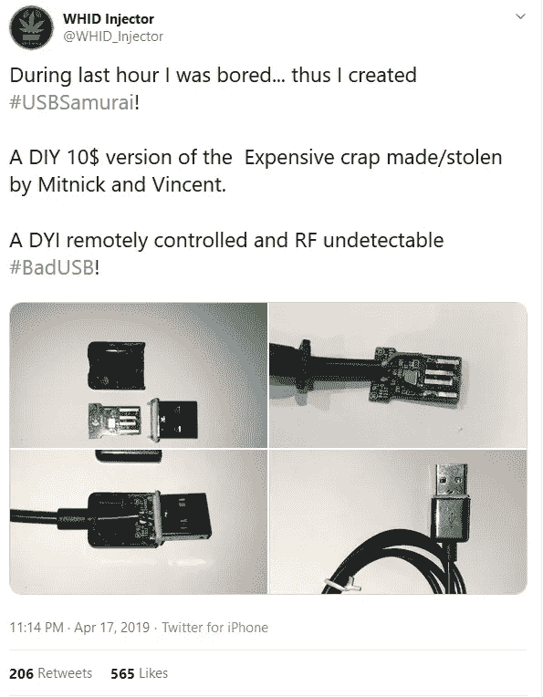
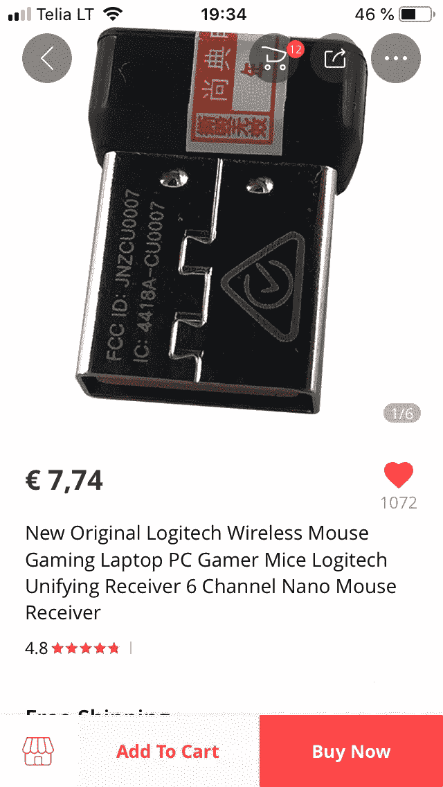
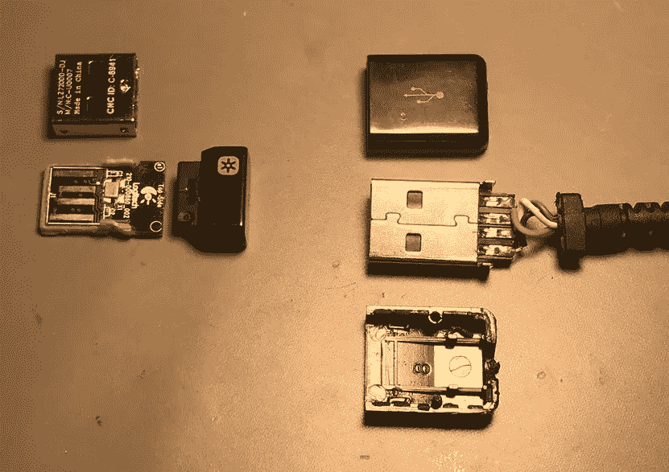
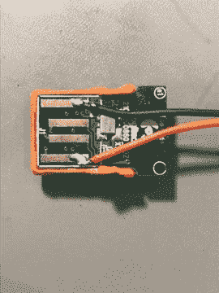
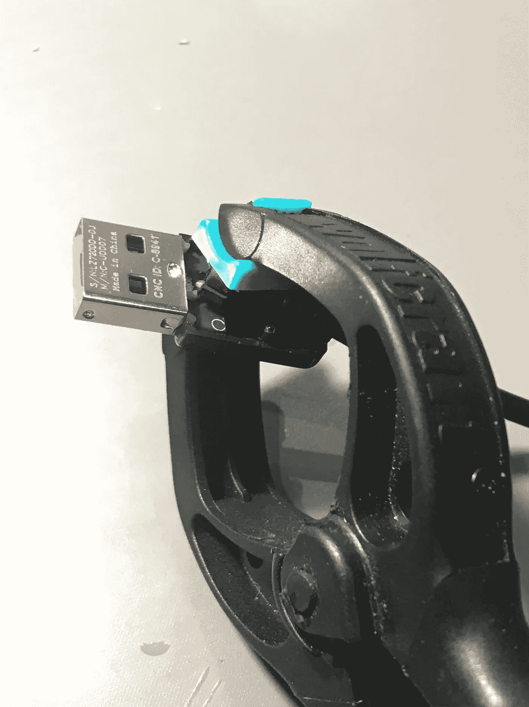
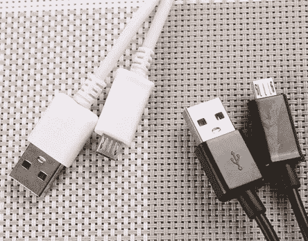
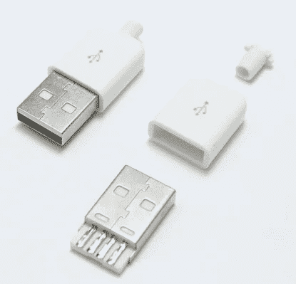
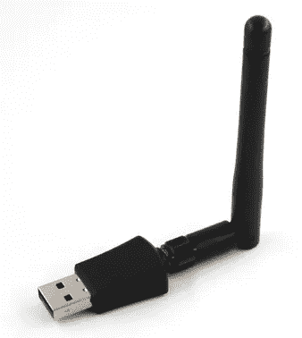

# USB samurai——价格不到 10 美元的远程控制恶意 USB HID 注入电缆

> 原文：<https://infosecwriteups.com/usbsamurai-a-remotely-controlled-malicious-usb-hid-injecting-cable-for-less-than-10-ebf4b81e1d0b?source=collection_archive---------0----------------------->

**TL；博士:**这个视频不言自明。(想知道怎么做？阅读下面的文章。)

一切都始于去年 4 月的这条推文，当时我想要一个能够注入按键的廉价 USB 植入物。

它必须是:

*   **可遥控**
*   **打字速度快**
*   **微小如 f***k**
*   **比一瓶伏特加便宜**

主要想法(硬件方面)是重复使用罗技廉价的统一加密狗作为 USB 电缆内的植入物。

**给你一个概念…** 这是这个加密狗多少钱(CU-0007): **7.74 欧！**

你需要做的事情非常简单:

*   取下顶部的黑色外壳，但不要弄坏加密狗；
*   拉出 PCB 和橙色塑料支架[用老虎钳轻轻握住金属外壳(用胶水将其突出)，然后用钳子轻轻地但坚定地拉出材料]；
*   打开一根 USB 电缆(我建议使用[1]或[2])，将 Vcc 和 GND 焊接到 CU-0007 上的相关引脚上。

*   一旦一切就绪，装回 USB 插头的金属外壳。
*   然后检查是否适合 USB 外壳，用一滴强力胶粘上。

完成了。**恭喜恭喜！**你刚刚创造了你的**第一个 USBsamurai** ！

**现在你只需要把它和@mame82 的 LOGITacker v.0.1.3-beta 配对就可以 pwn 目标了！**

记住首先使用命令`munifying unpairall`解除所有预配对设备的配对

G700 固件每次仅限一个配对设备！

对于软件方面，good @mame82 来帮助他的雄伟的 LOGITacker 框架！

到目前为止，它支持 4 种不同的基于 NRF 的主板:

*   北欧 nRF52840 加密狗
*   制造商 MDK 东乐
*   市场 MDK
*   四月兄弟 nRF52840 加密狗

我个人选择了第四个[3]，因为这是唯一一个带有外部天线(即更长的范围)。

[https://github . com/mame 82/logi tacker # 24-April-brother-NRF 52840-dongle](https://github.com/mame82/LOGITacker#24-april-brother-nrf52840-dongle)

只需按照 LOGITacker 的自述文件安装 v.0.1.3-beta 并安装[https://github . com/mame 82/logi tacker/releases/download/v 0 . 1 . 3-beta/logi tacker _ apr dongle . uf2](https://github.com/mame82/LOGITacker/releases/download/v0.1.3-beta/logitacker_aprdongle.uf2)

我录制了一个视频来解释如何轻松地将 USBsamurai 与 LOGITacker 配对。

享受:)

[1][https://aliexpress.com/item/33052091501.html](https://aliexpress.com/item/33052091501.html)

[2][https://aliexpress.com/item/32771548306.html](https://aliexpress.com/item/32771548306.html)

[3]https://www.aliexpress.com/item/32975184100.html

