# 初学走路的孩子对堆利用的介绍，在免费和双免费之后使用(第 4 部分)

> 原文：<https://infosecwriteups.com/use-after-free-13544be5a921?source=collection_archive---------1----------------------->

这篇文章是与 x64 Linux 二进制开发技术相关的系列文章的一部分。总结我以前的帖子，我们从探索简单的堆栈损坏错误及其缓解技术开始，并逐渐发展到更复杂的主题。在本文中，我将深入研究使用先前已经释放的内存的概念，在堆内存利用的上下文中，这种错误被称为**释放后使用** (UAF)。

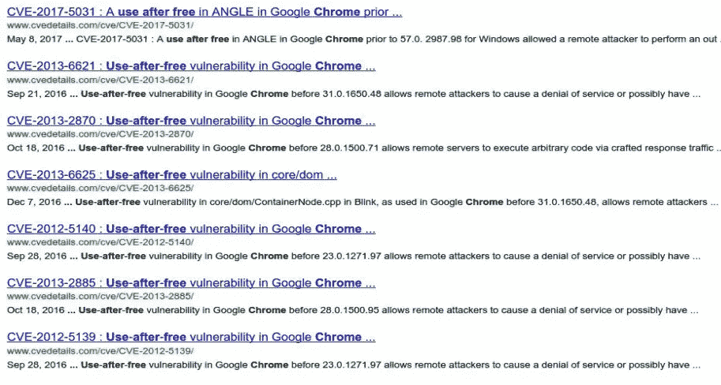

对于那些刚刚“加入”的人，这里是我到目前为止所介绍的内容:

**堆栈溢出:**

*   [基本缓冲区溢出(没有 ASLR，DEP/NX，堆栈加那利)](https://valsamaras.medium.com/introduction-to-x64-linux-binary-exploitation-part-1-14ad4a27aeef)
*   [返回 libc](https://valsamaras.medium.com/introduction-to-x64-binary-exploitation-part-2-return-into-libc-c325017f465)
*   [旋转链条](https://valsamaras.medium.com/introduction-to-x64-linux-binary-exploitation-part-3-rop-chains-3cdcf17e8826)
*   [堆叠鸭翼](https://valsamaras.medium.com/introduction-to-x64-linux-binary-exploitation-part-4-stack-canaries-e9b6dd2c3127)
*   [绕过地址空间布局随机化](https://valsamaras.medium.com/introduction-to-x64-linux-binary-exploitation-part-5-aslr-394d0dc8e4fb)

**堆利用:**

*   [动态内存分配](https://valsamaras.medium.com/the-toddlers-introduction-to-dynamic-memory-allocation-300f312cd2db)
*   [探索堆(竞技场、块、箱)](https://valsamaras.medium.com/the-toddlers-introduction-to-heap-exploitation-part-1-515b3621e0e8)
*   [Ptmalloc 内部构件](https://valsamaras.medium.com/the-toddlers-introduction-to-heap-exploitation-part-2-d1f325b74286)
*   [堆溢出](https://valsamaras.medium.com/the-toddlers-introduction-to-heap-exploitation-overflows-part-3-d3d1aa042d1e)

# 定义

回想一下我的[堆溢出](https://valsamaras.medium.com/the-toddlers-introduction-to-heap-exploitation-overflows-part-3-d3d1aa042d1e)帖子，一大块内存可以存在**两种状态:** **在用**或者**空闲**。**当*使用中(分配)*** *，*时，块连同**用户数据**一起携带关于其**大小的元数据**，**标志**(指示块是否属于主竞技场，它是否使用 mmap 分配，以及前一个块是否正在使用)以及关于前一个块的大小的信息(如果后一个块是空闲的)。这样，在需要新分配的过程之后，可以很容易地跟踪和重用它。

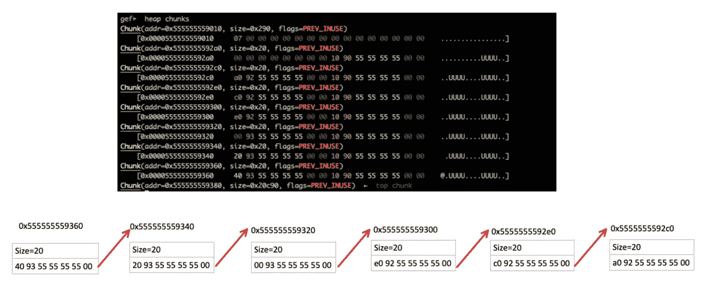

空闲块携带着关于它们的大小和其他块的内存地址的信息

当程序试图访问空闲块时，结果是不可预测的，主要取决于以下两个因素:

*   此事件之前和之后的程序状态，因为它定义了使用非法引用所依据的逻辑。
*   区块的当前内容。

试图使用先前已被释放的块被称为“*释放后使用”* (UAF)，这是最常见的错误之一，其影响从简单的程序崩溃到任意代码执行不等。

> u***se After Free***是一类当程序试图解引用指向已释放块的指针时发生的漏洞。

让我们以指针 **p** 为例，它指向包含函数 **f1 地址的块 **A** 。**让我们假设由于某种原因 **A** 已经被释放并被添加到空闲块列表中。现在，想象在某个时刻， **A** 再次被分配，这次包含了函数 **f2 的地址。**当 **p 仍然**指向 **A，**再次被访问时，将触发 **f2** 的执行:

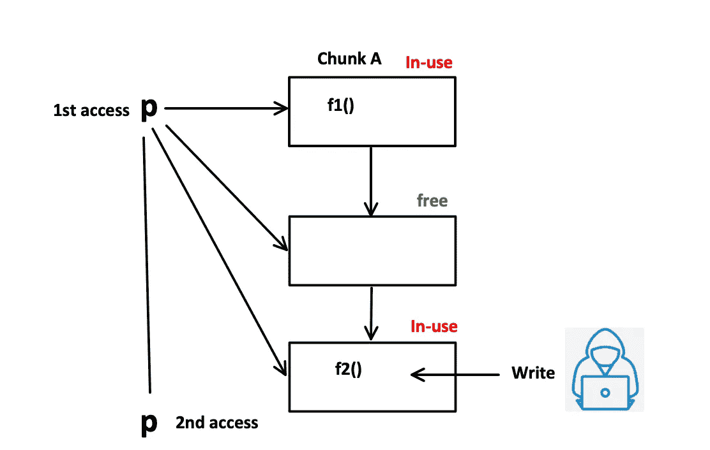

在第二次访问期间，p 仍然指向块 A，块 A 现在包含函数 f2 的地址

有各种各样的技术可以利用这类错误，我将在这篇文章以及我的下一篇文章中描述这些技术。

# 第一次适合

释放后使用漏洞类利用了 ptmalloc 分配器的行为，根据该行为，malloc 将返回第一个匹配内存需求的块的地址。下面的例子展示了这种行为，这个例子摘自[shellphish](https://github.com/shellphish)/[how 2 heap](https://github.com/shellphish/how2heap)回购:

如果我们编译并运行该程序，我们会观察到以下输出:

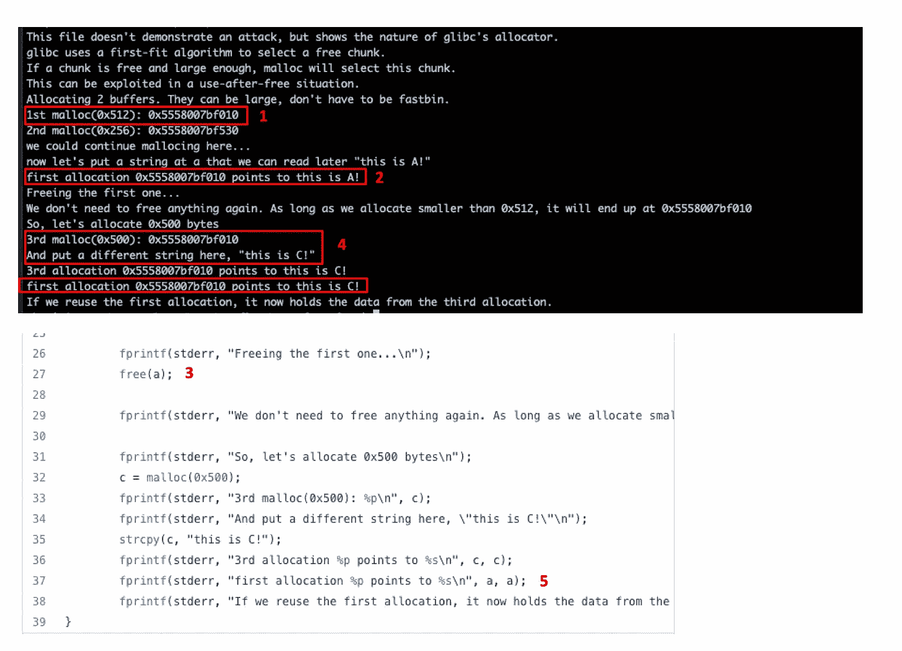

上图中( **1)和(2)** 反映了变量`a`指向包含字符串`**this is A**` **的`0x5558007bf010` 。**于( **3)** `a`获得自由。然后程序请求一个大小类似于分配给`a`的块(见第 32 行)。它使用`c`指向这个块，并将`**this is C!**`写入这个新分配的内存空间。在( **5)中，**作为指针`a`被再次访问(在空闲后使用)，它将打印`**this is C!**` 作为块的数据被覆盖。

## 第一次拟合 UAF 示例(1)

让我们看一个更有趣的例子，摘自[这篇](https://googleprojectzero.blogspot.com/2015/06/what-is-good-memory-corruption.html)帖子:

运行这段代码只会弹出一个 shell:

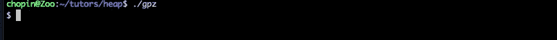

**但为什么是**？毕竟`*run_calc`已经被设置为 **0，**因此第 13 行的条件将为假，并且`execl`将永远不会运行。让我们在`gdb`加载程序，并在第一次 malloc 后设置一个断点，并将零值分配给`*run_calc`:

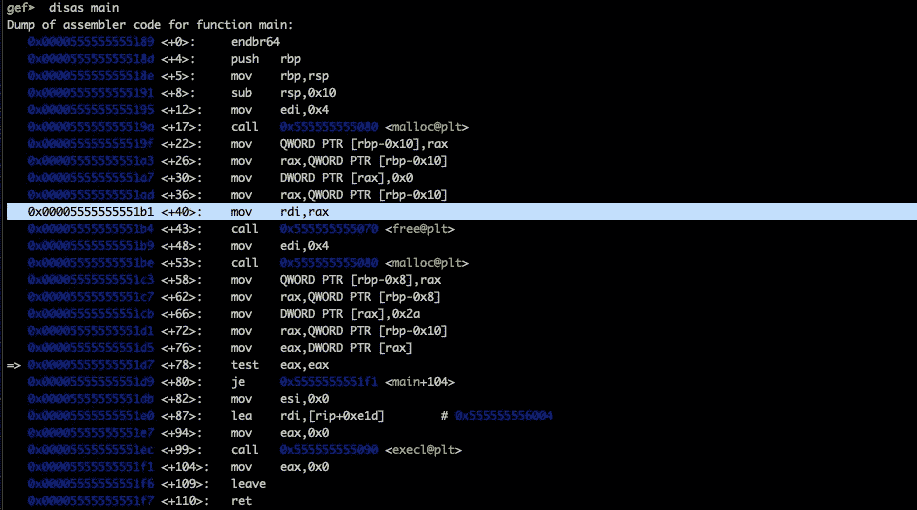

不出所料`run_calc` 指向包含零值的`0x00005555555592a0`:


`p_unicorn_counter` 将指向与`run_calc`相同的块，由于在**、**之前描述的*首次拟合逻辑*，因此在`Line 12`之后，块看起来如下:


当再次访问`run_calc` 时，它包含值 0x2a，因此 *if* 将允许调用`execl`。

## 第一次拟合 UAF 示例(2)

考虑下面描述的代码:

在**第 4 行**中，我们将`fp`定义为一个指向函数的指针，该函数不获取任何参数并返回 void。在**行 15** 中，我们定义了一个`fp`类型的指针，它指向`func1` ( **行 16** )。在**第 21 行**中，我们为`pointer1`调用函数`free`，并为`func2`和`pointer2`重复相同的过程。问题出现在**第 33 行**，因为我们正在重用一个之前释放的指针。如果我们编译并运行该程序，我们会得到以下输出:

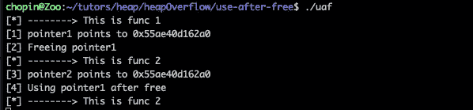

虽然在状态[4]之前一切都如预期的那样进行，但是我们注意到在调用`func2`之后，即使我们从未将`func2`的地址分配给指针`pointer1`。为了理解发生了什么，让我们将程序加载到 gdb，并在`malloc`和`free`调用后设置一些断点:

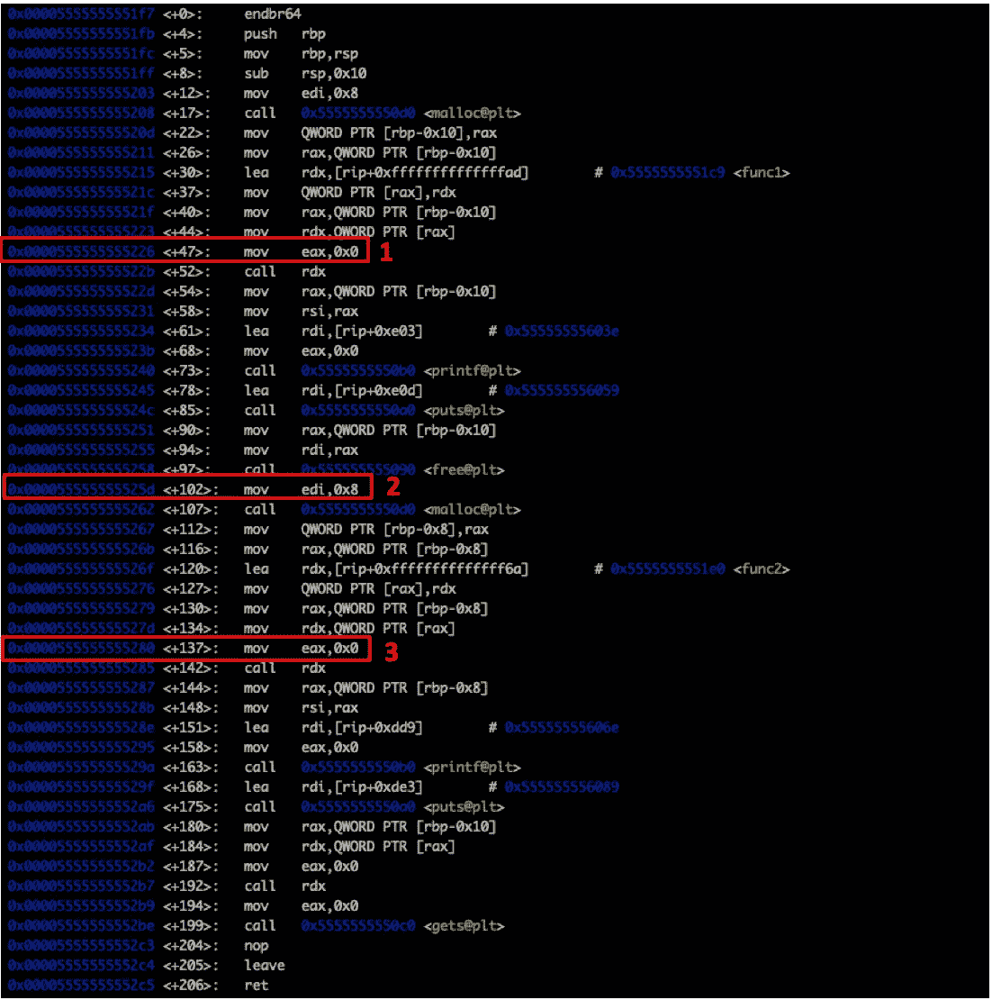

在第一个`malloc`和将`func1`地址分配给`pointer1`之后，我们有以下分配:

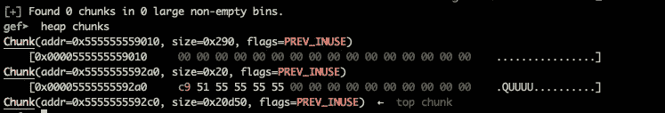

正如所料，`pointer1`指向`0x00005555555592a0`，其中包含与`func1`地址相对应的内存地址`0x00005555555551c9`:

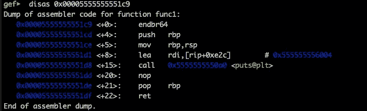

随后在`free`调用之后，`pointer1`指向的块被添加到`tcache`列表中:

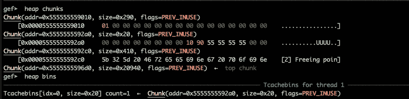

最后，在第二次 malloc 之后，`tcache`为空，因为`pointer2`的内存大小要求与`pointer1`相同，因此分配器将空闲块分配给`pointer2`:


由于`pointer1`仍然指向`0x00005555555592a0`，我们程序中第 33 行的`(*pointer1)();`调用将调用函数`func2`。

## 第一次拟合 UAF 示例(3)

让我们看看另一个取自(现已死亡)https://exploit-exersises.com/protostar/heap2 网站的例子:

该程序包含一个`while`循环(第 19-44 行),并根据从第 22 行获得的用户输入进行操作。发出一个`**auth**` 命令，后跟一个字符串，将触发第 25 行的早午餐。这将根据 auth struct 大小分配空间，并将分配的字节设置为零(第 26 行)。如果在`auth`之后给出的字符串小于 31 字节(第 27 行),内容将被复制到由`authVar->name`变量指向的内存空间。

`**service**` 命令将使用`[strdup](https://man7.org/linux/man-pages/man3/strdup.3.html#:~:text=The%20strdup()%20function%20returns,copies%20at%20most%20n%20bytes.)`通过 malloc 函数复制给定的字符串:

```
The **strdup**() function returns a pointer to a new string which is
a duplicate of the string *s*.  Memory for the new string is
obtained with [malloc(3)](https://man7.org/linux/man-pages/man3/malloc.3.html), and can be freed with [free(3)](https://man7.org/linux/man-pages/man3/free.3.html).
```

`**login**` 命令检查`authVar->auth`并将始终打印“请输入您的密码”，因为没有办法根据用户输入修改 auth 变量(或者也许有？).因此，这里的利用场景是让程序相信我们已经登录。最后，如果用户输入`**reset**`、**、**，程序将调用`free`函数获取`authVar`指针。该 bug 的出现是因为在对`free`的潜在调用之后，在第 38 行再次访问了`authVar`。

在我们在 gdb 中运行程序来看看发生了什么之前，让我们先做一下数学计算:

> **auth** **struct** 总共需要 **36 个字节**，其中 32 个字节用于名称，另外 4 个字节用于 auth 整数。分配器需要再添加 **8 个字节**来跟踪块的大小，这产生了对 **0x24** 字节的需求，由于 16 字节对齐，这将最终导致 **0x30** 字节分配。当程序调用`free`函数时，块将被添加到`tcache`中，以满足下一个(类似大小的)分配需求。这里是`**service**` 命令进入框架的地方。如果我们创建一个 0x30 字节的分配需求，释放的块将被分配给`*char *service*` 指针。既然控制了输入，根据第 35 行，我们可以用任意一个值覆盖`*auth*` *整数* *值并通过登录检查。*

让我们先试试这个假设:

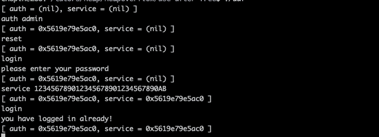

正如所料，123456789012345678901234567890 ab 值覆盖了允许我们以管理员身份登录的整数`authVar->auth`。让我们将程序加载到 gdb，以便更好地了解情况。让我们在 strcpy 函数后设置一个断点并运行程序:

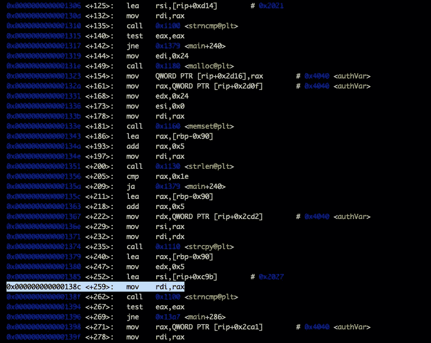

在“auth admin”输入之后，我们有以下块:

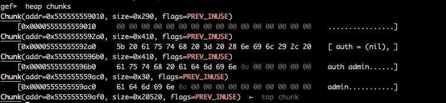

`authVar`指向`0x555555559ac0`，分配的块大小为 0x30 字节:

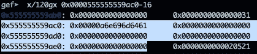

键入`reset`将触发分配块的 free 函数，因此它将被添加到 tcache:

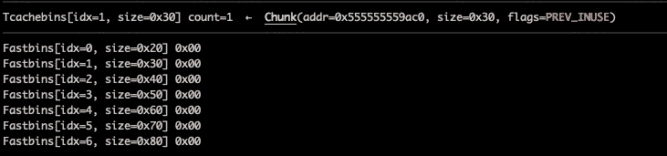

键入`service 123456789012345678901234567890AB`将创建一个 34 字节的需求(包括服务后的空间和新行)，因此`service`指针将指向与 authVar:

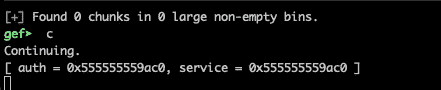

现在让我们键入`**login**` 并检查`0x555555559ac0`处的块

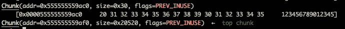

`0x0a42`值已经覆盖了 int auth，因此`if(authVal->auth`将被评估为 true 并允许我们登录。

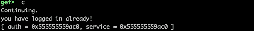

# 双倍免费

当对同一个指针多次调用 free 时，就会出现 Double free。让我们看一个来自 https://github.com/shellphish/how2heap 的例子

在**第 11–18 行，**程序正在填充 tcache 列表。

> **记住**:多达七个相同大小的块将会出现在同一个 tcache 子列表中。

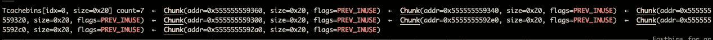

在**第 20-23 行，**程序再分配三个大小为`**0x8**` 的块，而在**第 30 行**我们第一次调用释放指针`**a**`。在**行**行 **39** 处，我们第二次调用`**free**`来获取**的一个**指针。在第 39 行之前，fastbins 列表将如下所示:

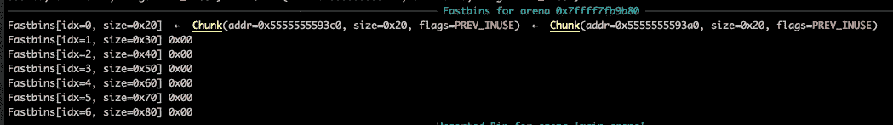

在第 39 行之后(注意列表顶端和末端的地址):

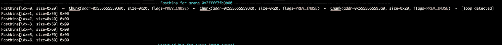

在**第 42 到 44 行**处，我们有三个分配需求，它们将从快速箱中得到满足，但是由于第一个和最后一个块是相同的，`**a**` 和`**c**` 将指向相同的位置`**0x5555555593a0**`。错误的分配可以通过简单地运行程序来验证:

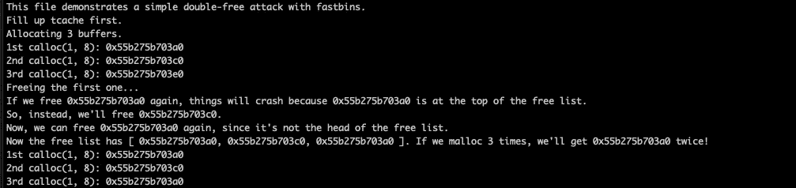

注意最后 3 行中的 **a** 和 **c** 指向`**0x55b275b703a0**`