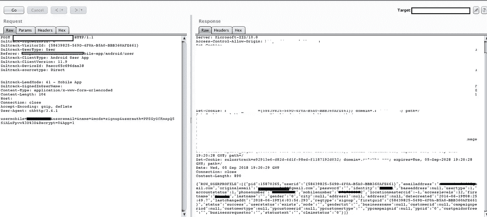
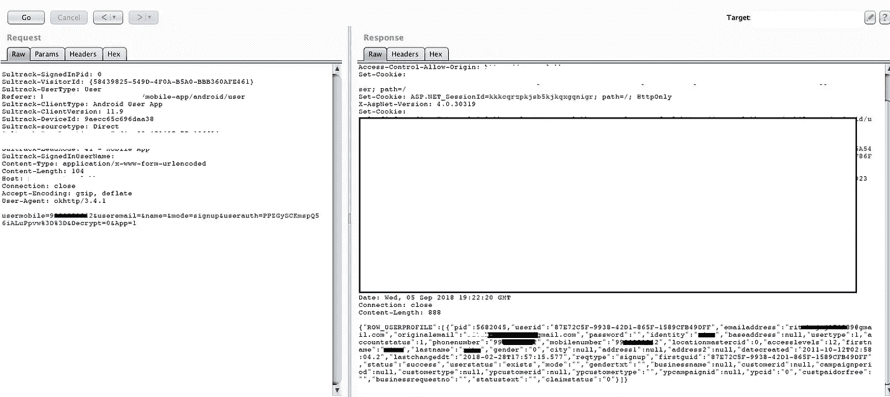

# 印度最大的数字商业公司的用户账户被接管

> 原文：<https://infosecwriteups.com/user-account-takeover-in-indias-largest-digital-business-company-c7b6d61dadb9?source=collection_archive---------0----------------------->

大家好，

最近，我在印度最大的数字商业组织之一发现了这个漏洞。虽然，这并不完全是为了 bug bounty，但我更担心的是，在这个互联网主导的时代，我们的数据是暴露的，并处于被滥用的高风险中。

作为新用户注册时，OTP 会发送到该帐户注册的手机号码。从您的移动设备提交 OTP 值并拦截请求。使用已注册的号码编辑手机号码。您可以作为应用程序中的另一个用户登录，并代表他执行操作。响应包括用户的电子邮件地址、姓名和联系电话。

在注册期间，OTP 不与用户的手机号码进行映射，也不在服务器端进行验证。实现服务器端验证总是强制性的。永远不要相信客户端控件。