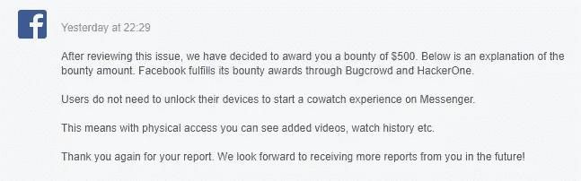

# 用户的私人观看历史/保存的视频通过锁定的 Android 设备中的呼叫暴露

> 原文：<https://infosecwriteups.com/users-private-watched-videos-list-saved-videos-etc-30faa8610b33?source=collection_archive---------0----------------------->

> 这篇文章是关于一个暴露用户私人观看视频列表、保存视频、共享视频等的漏洞。从锁定手机的“一起观看”功能。

> *一个月前，我从一位研究人员那里读到了一篇关于信使通话暴露用户在锁定手机上的私人好友名单的文章***。因此，我在同一天重新测试了它，以再次检查是否有其他信息在没有解锁手机的情况下泄露。那天我什么也没得到，脸书通过增加一个额外的安全层修复了漏洞，就在那之后；如果不解锁手机，任何人都无法使用该功能。**

*现在，最近脸书在 Messenger 中推出了' [**一起看**](https://messengernews.fb.com/2020/09/14/feel-together-messenger-introduces-watch-together/) '功能。所以，我在那里做了一些观察，并且在我开始使用这个功能后用打嗝测试了这个部分。那天我没发现什么有趣的东西。*

*但是，第二天。我刚想起来那个来自研究员的[有效 bug](https://bugreader.com/ahmad_halabi@viewing-facebook-contacts-on-locked-device-109) 。因此，我做了一些测试。有趣的是，我在“一起观看”部分发现了类似的漏洞，任何物理接触受害者设备的人都可以访问用户的私人观看视频列表、保存的视频列表以及聊天线程中共享的视频，而无需解锁手机。我赶紧用一个简短的 [**POC 视频**](https://drive.google.com/file/d/13KHl_ZyUgc_l17tqZIO1u0BVHfDDW69N/view?usp=sharing) 上报给了脸书。几周后，脸书修好了它。现在，您必须解锁手机才能使用“一起观看”功能。*

> ****复制步骤*** *==
> 1 .用户 A 的智能手机处于锁定状态。
> 2。用户 B 呼叫用户 a。入侵者接了电话。
> 4。入侵者进入“一起看”选项。
> 5。入侵者看到用户 A 观看的视频、保存的视频、在聊天线程中共享的视频等的全部私人列表。而不用解锁手机。**

*…*

> ****影响*** *===
> 该漏洞可以让任何物理访问受害者设备的人查看/访问用户私人保存的视频、用户观看的全部视频以及聊天线程中共享的视频，而无需解锁手机。这将严重影响用户的隐私/安全。**

*…*

> ****时间轴****
> 
> **报道—2020 年 10 月 17 日星期六**
> 
> **预审—2020 年 10 月 22 日星期四**
> 
> **已分庭——2020 年 10 月 22 日星期四**
> 
> **固定—2020 年 11 月 9 日星期一**
> 
> **已确认——2020 年 11 月 12 日星期四**
> 
> **悬赏——2020 年 11 月 12 日星期四**

**

*来自脸书的悬赏消息*

*感谢您阅读这篇关于一个简单漏洞的文章。如果您有任何建议/疑问，我可以在****/**[**insta gram**](https://www.instagram.com/samiparyal_/)**上找到您。*****

***尝试阅读更多关于 bug 的文章，让自己保持最新状态***