# 使用 PIE 二进制文件作为共享库— HCSC-2020 CTF 报道

> 原文：<https://infosecwriteups.com/using-a-pie-binary-as-a-shared-library-hcsc-2020-ctf-writeup-390a8a437f31?source=collection_archive---------0----------------------->

由匈牙利[国家网络安全中心](https://nki.gov.hu/)主办的[匈牙利网络安全挑战赛](https://nki.gov.hu/rendezvenyek/hcsc/) 2020 CTF 预选赛平台 [Avatao Next](https://next.avatao.com) 上的[挑战赛“基线测试”](https://next.avatao.com/events/hcsc-2020-qualifier/challenges/baseline-test/description)是一场难度**难度**的逆向工程大挑战。


# 挑战

> 点数:300
> 难度:**难度**
> 
> 回答一些简单的问题。
> 
> 说明
> 
> 基线测试是一种旨在测量任何情绪异常的检查。除了最初的测试，这个测试还有第二部分挑战合理性。回答每个问题以获取旗帜。

访问挑战是由 SSH 提供的(cmdline 包含在挑战描述中)，在容器中有一个名为“test”的 SUID 二进制文件，这实际上就是挑战。运行二进制测试开始问问题:

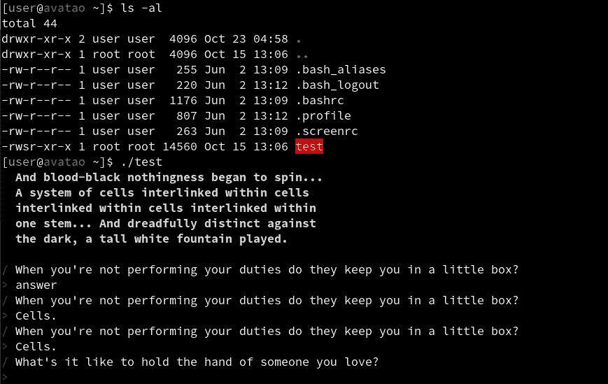

测试二进制文件应下载到本地机器进行逆向工程分析(例如使用 [scp](https://linux.die.net/man/1/scp) )。

如果你给出了错误的答案，或者给出了正确的答案，但速度不够快，那就回到起点。只有快速正确的答案才有效。通过所有问题后，SUID 二进制文件读取并输出文件/srv/flag.txt，该文件只能由 root 读取。(解释见下文。)。)

# 第一轮问题

使用 [Ghidra](https://ghidra-sre.org/) 反编译视图可以很容易地逆转这个工作流程:

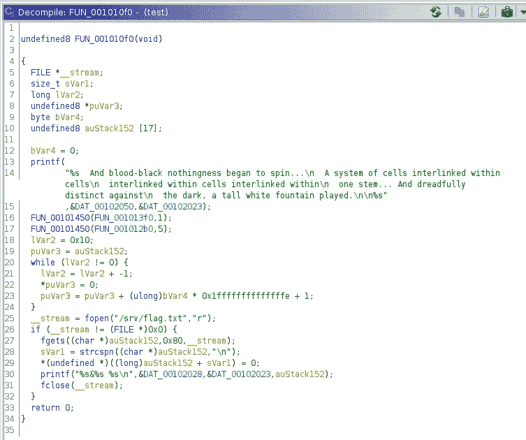

在不深入细节的情况下，FUN_001010f0()函数是 main()函数，FUN_00101450()管理问题，第一个参数是指向提供问题的函数的指针，第二个参数是以秒为单位的一个答案的超时。

问题提供程序函数使用以下参数提供问题和答案:

1.  问题的编号(0，1，2，…，7)
2.  指向答案字符串的指针
3.  答案字符串的长度

FUN_001013f0()函数提供第一轮问题，暂停时间很短，为 1 秒。这些是基本的、平凡的可逆静态问答对:第一个问题的答案是“细胞”另外 7 个问题的答案是“相通的”。

注意:如果没有任何静态反转方法，动态分析可能会有所帮助。只需将 [ltrace](https://linux.die.net/man/1/ltrace) 附加到运行测试流程中:

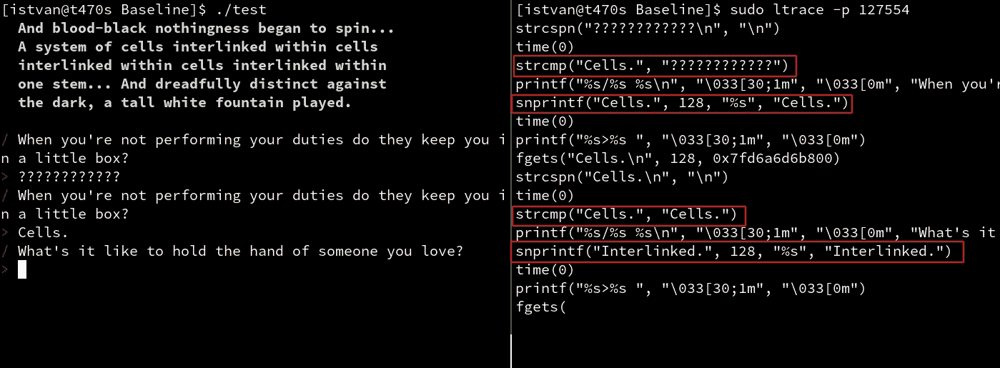

现在，正确的答案可以在输入答案后从 strcmp 调用中获取，也可以在回答前从 snprintf 调用中获取。

好吧，这真的很容易，但有趣(也更难)的部分是下面的一个(静态反转是不可避免的)。

# 与二进制文件交互

在进入第二部分之前，先简单介绍一下动手解决方案。

我最喜欢的与这种二进制文件交互的方法是使用 CTF 工具包 [pwntools](https://github.com/Gallopsled/pwntools) (当然；) ).

对于运行二进制文件(本地)和控制输入/输出，这种方式非常容易和舒适(Python 片段回答了第一个问题):

如果您想通过 SSH 与远程二进制文件交互，只需将`c = process("./test")`行改为:

现在有了正确的答案，我们可以进入第二部分(并切换到与`c.interactive()`的互动模式):

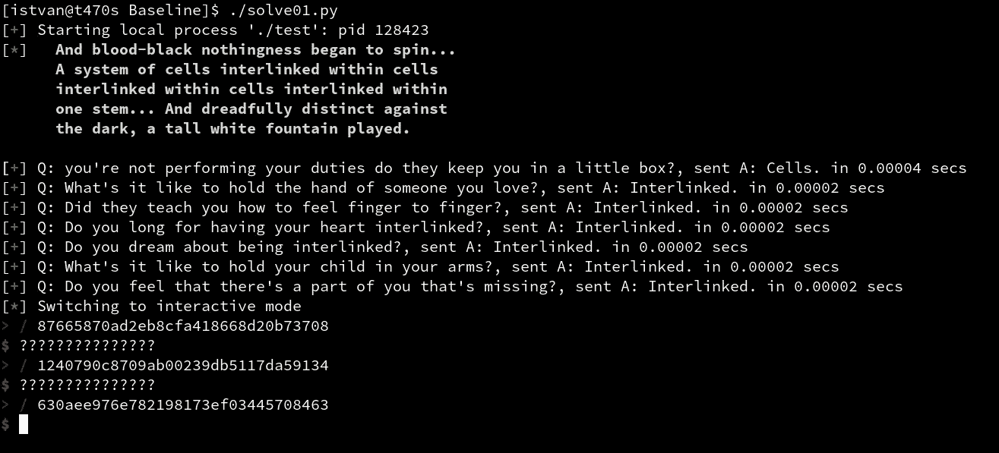

# 第二部分

第二轮问题是动态的(随机？)16 字节二进制数据(格式化为 32 长度的十六进制字符串)。看起来像是某种大麻。

使用 ltrace 进行动态分析:

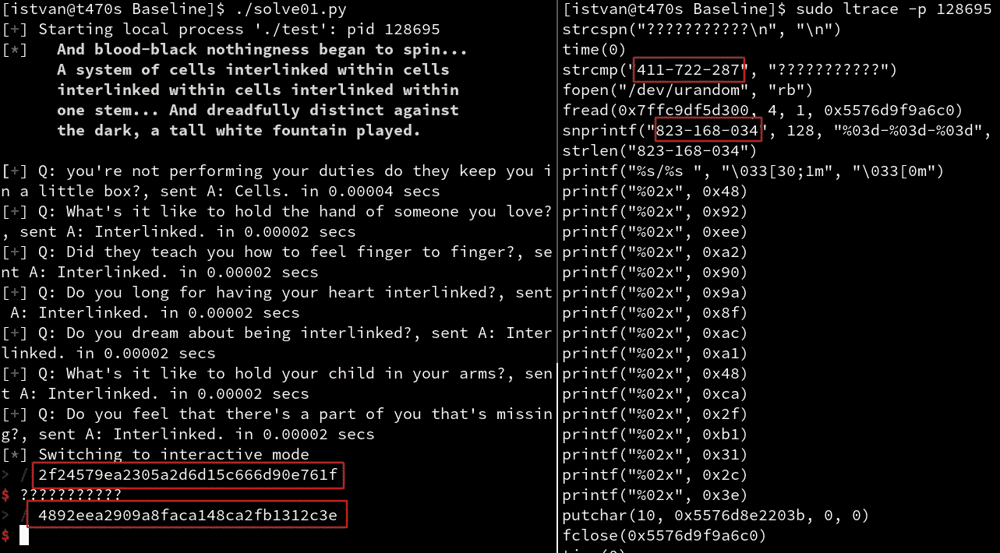

这意味着以下问答对(还可以继续):

```
+=========================================+================+
|         Question (hash)                 | Answer (plain) |
+=========================================+================+
| 2f24579ea2305a2d6d15c666d90e761f        | 411-722-287    |
+-----------------------------------------+----------------+
| 4892eea2909a8faca148ca2fb1312c3e        | 823-168-034    |
+-----------------------------------------+----------------+
```

让我们回到 Ghidra 的静态分析。

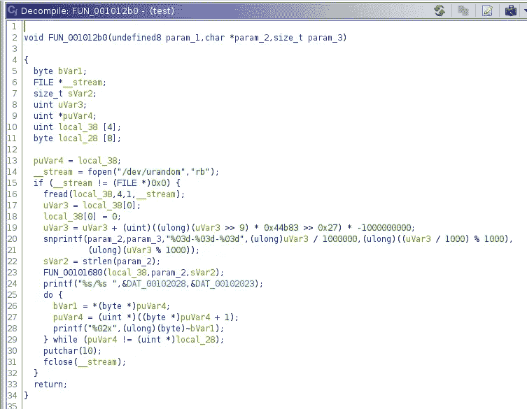

答案是随机整数(来自/dev/urandom ),分成三个 3 位数的块。问题由 FUN_00101680()以这些随机答案作为输入进行计算。

FUN_00101680()是做什么的？它非常类似于 MD5 散列计算，但略有不同(移位量似乎是正确的，正弦常数似乎是正确的，但初始值似乎是不同的，可能还有一些其他差异)。

我们如何回答这些问题？如果我们可以计算一个字符串的哈希值(就像“测试”二进制文件所做的那样)，我们可以通过尝试所有 XXX-XXX-XXX 模式的变体(其中 X 是一个任意的数字)来暴力破解目标哈希的明文。这意味着强行 1.000.000.000 变异。

这并非不可能(在类似 MD5 的操作中)。在我的英特尔酷睿 i5–7300 u CPU 上进行 MD5 计算基准测试(使用 [hashcat](https://hashcat.net/hashcat/) ):

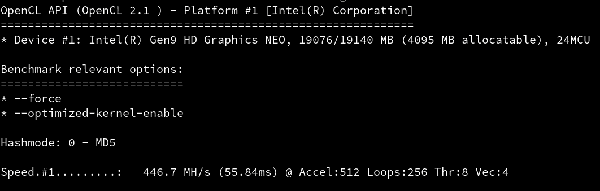

这意味着 1.000.000.000 MD5 哈希的时间少于 2.24 秒(我们在 5 秒的时间范围内；) ).但是这种方法需要对优化的 MD5 代码进行一些修改，因为我们的二进制文件中的代码不是标准的 MD5。

还有另一个选项，它需要一些准备，但不需要严格的反转和实现定制的优化算法。

# 使用二进制文件本身的函数

如果我们可以在“测试”二进制文件中重用二进制代码(未修改的),计算散列将会非常容易。用某个“XXX-XXX-XXX”参数(作为明文)调用 FUN_00101680()函数，得到计算出来的哈希值，那就太棒了。

理论上，这是可能的，因为我们的二进制文件(幸运的是)是一个 PIE(位置独立的可执行文件)，它的行为非常类似于共享库。

感谢 [Romain Thomas 的出色工作，](https://twitter.com/rh0main) [Quarkslab 的](https://quarkslab.com/)安全工程师， [LIEF 项目](https://github.com/lief-project/LIEF) ( **库到仪器可执行格式**)在实践中帮助做了以上工作。

LIEF 项目也有一个详细的[教程，关于将一个 ELF 可执行文件转换成一个库](https://lief.quarkslab.com/doc/latest/tutorials/08_elf_bin2lib.html)。简而言之，我们需要做的只是将所需的函数添加到导出函数的列表中(因为如果二进制文件没有被编译为库，它就是空的)。

我们来看看实践中怎么做。首先，我们需要 LIEF 的最新未发布版本，因为我们需要从转换的二进制文件/库中删除 DF_1_PIE 标志，以便绕过最近的 libc (≥2.29)版本中的 dlopen()限制，并且 DF_1_PIE 支持只出现在未发布的 master 分支中(因此有必要进行一点耗时(在我的普通 pc 上大约 60 分钟)的编译；如果不能接受，使用旧的 libc 并使用简单的`pip install`安装一个发布的二进制版本:

```
git clone [https://github.com/lief-project/LIEF](https://github.com/lief-project/LIEF)
python3 -m venv venv
. ./venv/bin/activate
pip install .
```

确认二进制文件是 PIE 可执行文件:

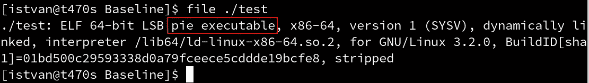

现在让我们将所需的函数(FUN_00101680)添加到导出列表中。在 Python 中:

现在 libtest.so 已经准备好了，可以调用 FUN_00101680()(作为 md5_custom())。用于调用 md5_custom()的 PoC 代码:

自定义 _md5.c

注意，在输出散列之前有一些否定操作数和字节交换，这来自于反转过程，它只是给 CTF 玩家造成一些麻烦:)。

编译为可执行文件:

```
gcc custom_md5.c -o custom_md5 -ldl
```

现在通过上述问答对进行测试(参见**第二部分**部分的开头):


很好，结果和上面一样。因此，这似乎是可行的。

但不幸的是，这不是一个优化的版本，用这个版本强制 1.000.000.000 哈希几乎肯定会超过 5 秒的障碍。

幸运的是，有一个时间-内存权衡解决方案来克服这个问题:使用预先计算的彩虹表。

# 彩虹桌

生成所需的 rainbow 表作为预计算的查找表与上面的 md5_custom()调用者 PoC 代码几乎相同。只需要在 1.000.000.000 变量上添加一个循环:

彩虹. c

编译是一样的:

```
gcc rainbow.c -o rainbow -ldl
```

生成的表的大小非常大(并且没有优化)，大约需要 45 GB 的空间，所以要保存在磁盘上(保存到一个名为 rainbow.txt 的文件中，计算和转储用了<20 mins on my pc):

```
./rainbow > rainbow.txt
```

The resulted rainbow.txt with 1.000.000.000 lines is:

```
34a14e65171d97079f631b9dce0d307e:000-000-000
279872821e4cd80dc5c79e6a247a637f:000-000-001
7797d3ac947f16c7311ca103309b5609:000-000-002
126d68f1dccf202eabf3eb77c4dafb1e:000-000-003
a9194f2b865cb1c155e9b310cf7d651d:000-000-004
...
...
...
feaf5e97a52937e6de30e5a40eee1cad:999-999-996
9ffe1659209465ebd7ed08a8ca773858:999-999-997
061e3c8b0ca20f035291c0a48f2b21f4:999-999-998
f81ccfa495e9856bdf2d74145884d86b:999-999-999
```

Searching a hash in this text file is really slow, so let’s optimize it by some structured indexing. Using the file based [SQLite](https://www.sqlite.org/index.html) 数据库对于这个任务来说是一个简单但有效的解决方案。

创建一个数据库和一个表，然后将创建的转储文件作为 csv 文件导入(大约需要 20 分钟，大约需要+55 GB 的磁盘空间):

```
sqlite3 rainbow.db
sqlite> CREATE TABLE hashes(hash TEXT, text TEXT);
sqlite> .separator :
sqlite> .import rainbow.txt hashes
```

最后，创建一个高效查找散列的索引(再次花费大约 20 分钟，大约需要+45 GB 的磁盘空间；但是，如果磁盘空间不足，现在可以删除 rainbow.txt 文件):

```
sqlite> CREATE INDEX hash ON hashes(hash);
```

现在对散列的查找应该非常快:

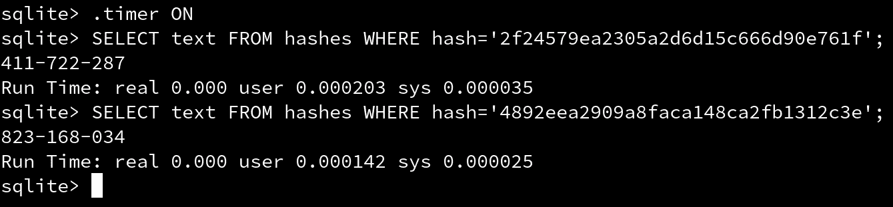

另外，不要忘记退出(避免数据库文件写入时的文件同步问题):

```
sqlite> .quit
```

现在一切都准备好了。

# 把所有的放在一起

我们有 sqlite db 形式的超快速查找表，所以没有什么可以阻止我们用 pwntools 构建最终的解决方案脚本。

以下是(也可以在我的 ctfs 文章 github repo， [solve.py](https://github.com/tothi/ctfs/blob/master/hcsc-2020/Baseline/solve.py) )中找到:

这就是它的作用:

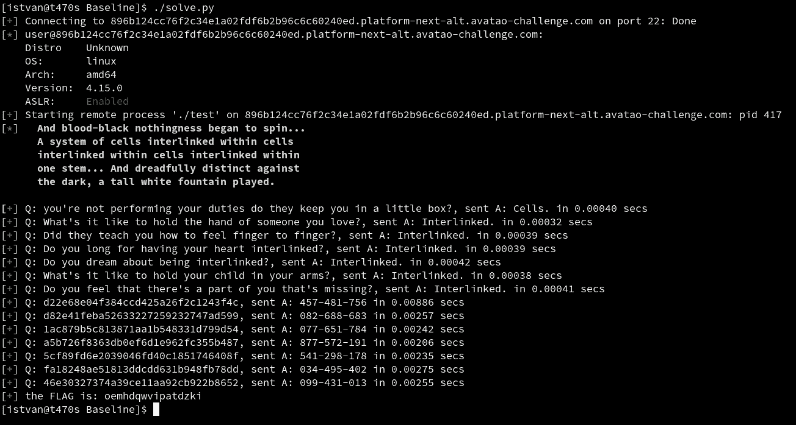

应对挑战的完整解决方案

看看哈希求解的回答时间，比 5 秒快了几个数量级:)

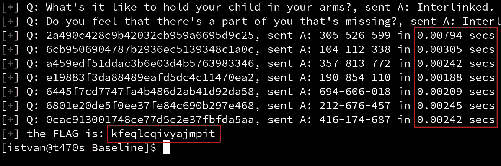

哈希查找速度超快

总之，我喜欢这个挑战，因为 PIE 二进制到共享库转换的优雅而健壮的方法，以及直接调用散列计算函数(不需要严格地重新实现和/或反转它)，但是也应该有其他解决方案，例如，识别和实现散列函数的优化版本，以及不需要预先计算的表的强力方法(5 秒钟就足够了)。

如果你有其他解决方案和/或任何问题，欢迎评论(在这里或在我的[推特](https://twitter.com/an0n_r0))。