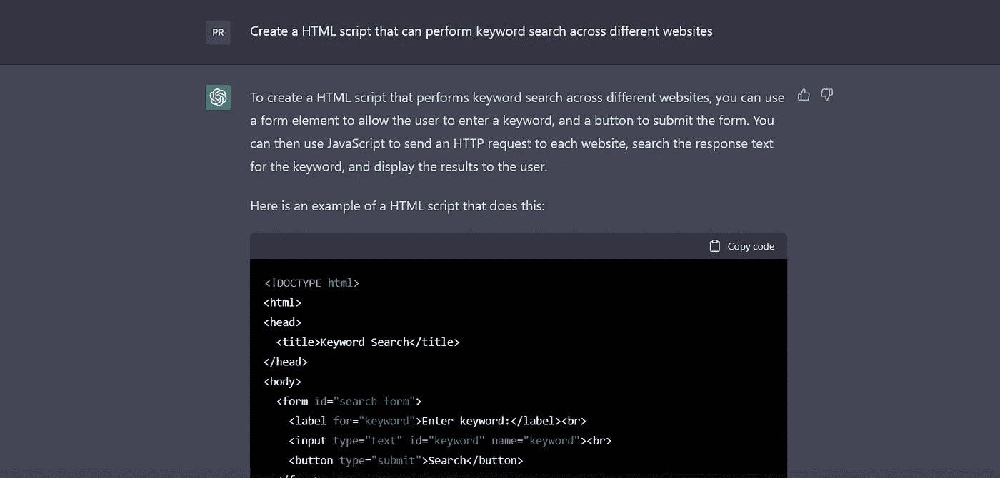

# 使用 ChatGPT 创建暗网监控工具

> 原文：<https://infosecwriteups.com/using-chatgpt-to-create-darkweb-monitoring-tool-7b7eeaab351f?source=collection_archive---------0----------------------->

## 在本文中，让我们看看如何用 ChatGPT 构建一个潜在的暗网监控工具


米兰·马尔科梅斯在 [Unsplash](https://unsplash.com?utm_source=medium&utm_medium=referral) 上拍摄的照片

黑暗网络是互联网中臭名昭著且经常被误解的一部分，因其匿名通信和买卖非法商品和服务而闻名。它不被传统的搜索引擎索引，只能通过专门的软件访问，如 Tor 浏览器。

虽然黑暗网络可能是犯罪活动的滋生地，但它也是网络安全公司、执法机构以及希望跟踪和监控非法活动的网络安全和威胁情报人员的宝贵资源。

暗网监控是许多网络安全公司提供的威胁情报服务之一。一些大玩家是 [CrowdStrike](https://www.crowdstrike.com/blog/how-falcon-intelligence-recon-mitigates-digital-risk-on-the-dark-web-and-beyond/) 、 [Rapid7](https://www.rapid7.com/solutions/dark-web-monitoring/) 、 [RecordedFuture](https://www.recordedfuture.com/threats/dark-web-monitoring) 、 [ThreatQuotient](https://www.threatq.com/threatq-platform/) 、 [ThreatConnect](https://threatconnect.com/threat-intelligence-platform/) 、 [Anomali](https://www.anomali.com/blog/monitoring-anonymizing-networks-tor-i2p-for-threat-intelligence) 、 [Zerofox](https://www.zerofox.com/products/dark-web-monitoring/) 、 [Nord](https://nordvpn.com/features/dark-web-monitor/) 等等。

> 但是如果你可以自己从头开始建造一个，而且还是免费的，那会怎么样呢？

一个强大的工具是 ChatGPT，它是由 OpenAI 开发的语言模型 T21。

> 在您继续之前，请提供您的意见。这将有助于我计划接下来的步骤。有关该计划的更多信息，请访问此博客:
> 
> 阅读:[寻求您的意见。这不是博客。这是一个民意调查](https://medium.com/@praveenjalasutram/seeking-your-input-this-is-not-a-blog-its-an-opinion-poll-463fb8d20448)。
> 
> 提前感谢。感谢您的时间:

# **什么是 ChatGPT？**

既然你在读，这意味着你现在一定知道了！ChatGPT 是一个强大的语言模型，可以根据给定的提示生成类似人类的文本。开发它是为了帮助创建聊天机器人和对话代理，但它也被证明是一个广泛的其他应用程序的有价值的工具，包括创建一个黑暗的网络监控工具。

与传统方法相比，使用 ChatGPT 创建暗网监控工具有许多优点。首先，它高度准确和高效，能够快速分析大量数据，并生成现实和连贯的报告。与手动监控相比，它的劳动强度要小得多，允许您在工具为您工作的同时专注于其他任务。

# 用 ChatGPT 创建一个黑暗的网络监控工具

## **第一步:获取 OpenAI API**

要使用 ChatGPT 创建一个黑暗网络监控工具，您首先需要获得对该模型的访问权，并熟悉它的功能和局限性。有几种不同的方法可以做到这一点，包括使用 OpenAI API 或训练您自己的模型版本。

## **步骤 2:设计您的监控模型需求**

一旦你可以访问 ChatGPT，你将需要设计一个系统来监控暗网和收集数据。这可能涉及使用专门的软件和技术来搜索非法活动中常用的特定关键词或术语，以及监控已知交易非法商品和服务的特定暗网论坛和市场。

## **第三步:利用 ChatGPT 分析并生成结果和报告**

一旦您收集了这些数据，您就可以使用 ChatGPT 对其进行分析，并根据您的特定需要和要求生成报告和警报。例如，您可以设置该工具，使其在每次检测到特定非法商品的销售或被盗个人数据的交易时生成警报。

> 迷茫从何入手？


Dex Ezekiel 在 [Unsplash](https://unsplash.com?utm_source=medium&utm_medium=referral) 上拍摄的照片

# 从建立一个关键词搜索工具开始

## **如果你是 Python 迷**:

使用 ChatGPT 创建 Python 脚本以在不同网站间执行关键字搜索:


ChatGPt 构建关键字搜索工具

以下是 python 代码:

```
import requests

# List of websites to search
websites = ['https://www.example.com', 'https://www.another-example.com']

# Keyword to search for
keyword = 'keyword'

# Search each website for the keyword
for website in websites:
    try:
        # Send a GET request to the website
        response = requests.get(website)
        # Get the response text
        text = response.text
        # Check if the keyword is in the response text
        if keyword in text:
            print(f'Keyword found on {website}')
        else:
            print(f'Keyword not found on {website}')
    except:
        print(f'Error accessing {website}')
```

```
# Another version of the code that can use your TOR connection. Tor uses 9050 port.
import requests

from bs4 import BeautifulSoup

session = requests.session()
session.proxies["http"] = "XXX://localhost:9050"
session.proxies["https"] = "XXX://localhost:9050"

url = "http://<SOME ONION WEBSITE>.onion/"
response = session.get(url)

soup = BeautifulSoup(response.content, "html.parser")

# title of the webpage
print("Page title: ", soup.title.string)

# get all the links on tha webpage
print("Links on the page: ")
for link in soup.find_all("a"):
    if link.get("href").startswith("/"):
        print(url + link.get("href"))
    else:
        print(link.get("href"))

# extract text from the webpage
print(soup.get_text())

# We can compile a list of a few popular onion websites to our script and 
# extract the links out of it and add those links to our list.
# Use existing search engines as seed lists and pass keywords in their search. 
# For example:
# - https://ahmia.fi/search/?q=a
# - https://ahmia.fi/search/?q=Google
# - https://ahmia.fi/search/?q=<Your company>
# Get the URLs from the above search to grow the seed list of URLs. 
```

> [不要被蒙在鼓里，保持领先:点击这里加入我的社区，学习真正的网络安全！](https://praveenjalasutram.medium.com/subscribe)

这个脚本使用`requests`库向列表中的每个网站发送 HTTP 请求，并检查关键字是否出现在响应文本中。如果找到了关键字，将打印一条消息，指示在该网站上找到了关键字。如果找不到关键字，则打印不同的消息。

这只是一个基本的例子，您可以根据自己的具体需要进行修改。例如，您可以向列表中添加更多 darkweb onion 网站，或者修改脚本处理响应文本的方式以提取更多信息。

## 如果你是 HTML 迷:

使用 ChatGPT 创建一个 HTML + Javascript 代码，在不同的网站上执行关键字搜索:



用于构建关键字搜索工具的 HTML 代码

当我要求 ChatGPT 创建一个可以在不同网站上进行关键词搜索的 HTML 脚本时，ChatGPT 是这样回答的:

"要创建跨不同网站执行关键字搜索的 HTML 脚本，您可以使用 form 元素允许用户输入关键字，并使用按钮提交表单。然后，您可以使用 JavaScript 向每个网站发送 HTTP 请求，在响应文本中搜索关键字，并向用户显示结果。

下面是一个执行此操作的 HTML 脚本示例:

```
<!DOCTYPE html>
<html>
<head>
  <title>Keyword Search</title>
</head>
<body>
  <form id="search-form">
    <label for="keyword">Enter keyword:</label><br>
    <input type="text" id="keyword" name="keyword"><br>
    <button type="submit">Search</button>
  </form>
  <div id="results"></div>
  <script>
    // List of websites to search
    const websites = ['https://www.example.com', 'https://www.another-example.com'];

    // Handle form submission
    document.getElementById('search-form').addEventListener('submit', function(event) {
      event.preventDefault();
      const keyword = document.getElementById('keyword').value;
      search(keyword);
    });

    // Search function
    function search(keyword) {
      // Clear previous results
      document.getElementById('results').innerHTML = '';
      // Search each website for the keyword
      for (const website of websites) {
        fetch(website)
          .then(response => response.text())
          .then(text => {
            if (text.includes(keyword)) {
              const result = `<p>Keyword found on ${website}</p>`;
              document.getElementById('results').innerHTML += result;
            } else {
              const result = `<p>Keyword not found on ${website}</p>`;
              document.getElementById('results').innerHTML += result;
            }
          })
          .catch(error => console.error(error));
      }
    }
  </script>
</body>
</html>
```

这个 HTML 脚本创建了一个带有关键字文本输入和提交按钮的表单。当提交表单时，使用关键字作为参数调用`search`函数。`search`功能使用`fetch`功能向列表中的每个网站发送 HTTP 请求，并检查关键字是否出现在响应文本中。如果找到该关键字，将显示一条消息，指示该关键字是在该网站上找到的。如果找不到关键字，将显示不同的消息。

这只是一个基本的例子，您可以根据自己的具体需要进行修改。例如，您可以将更多网站添加到列表中，或者您可以修改脚本处理响应文本的方式以提取更多信息”

> 是不是很神奇！！！


照片由 [Unsplash](https://unsplash.com?utm_source=medium&utm_medium=referral) 上的 [Afif Ramdhasuma](https://unsplash.com/@javaistan?utm_source=medium&utm_medium=referral) 拍摄

# **结论**

总之，ChatGPT 是一个强大的工具，可以用来创建一个暗网监控工具来跟踪和监控暗网上的非法活动。它能够生成真实连贯的文本，这使它成为创建报告和警报的理想工具，其效率和准确性使它成为执法机构和希望跟踪暗网上非法活动的个人的宝贵资源。你还在等什么？[去探索工具](https://chat.openai.com/chat)。

> 喜欢我的作品吗？那你为什么不支持我:
> 
> [给我买杯咖啡！](https://www.buymeacoffee.com/cybersec.sai)

> [不要被蒙在鼓里，保持领先:点击这里加入我的社区，学习真正的网络安全！](https://praveenjalasutram.medium.com/subscribe)

# 同样来自作者:

*   [如何在暗网上找到被攻破的凭证？](/how-to-find-compromised-credentials-on-darkweb-6e2af2b3a0e8)
*   [8 个免费网站检查你的邮箱地址是否被盗用？](https://medium.com/bugbountywriteup/8-free-websites-to-check-if-your-email-address-is-compromised-7e8742e099c6?source=your_stories_page-------------------------------------)
*   [使用 Python 和 Tor 创建暗网爬虫](/creating-darkweb-crawler-using-python-and-tor-53169d146301)
*   [使用 ChatGPT 创建暗网监控工具](/using-chatgpt-to-create-darkweb-monitoring-tool-7b7eeaab351f)
*   你知道暗网有自己的法庭和司法系统吗？
*   [利用这些表层网络资源探索暗网:暗网洋葱链接的大集合](/explore-darkweb-with-these-surface-web-resources-a-large-collection-of-darkweb-onion-links-92a426f9c0f9)
*   [我是如何赢得我的第一笔 1000 美元 Bug 赏金的](/how-i-earned-my-first-bug-bounty-reward-of-1000-9dc6643977e4)
*   如何随着时间的推移提高你的 Bug 赏金表现？
*   TOR 能让你匿名吗？查看 FBI 如何逮捕一名非法 TOR 用户
*   不要被逮捕！Bug 赏金猎人该不该用 VPN？
*   [俄国、中国、美国、乌克兰——地缘政治对你们的网络威胁情报战略意味着什么？](https://praveenjalasutram.medium.com/russia-china-us-ukraine-what-does-geopolitics-mean-to-your-cyber-threat-intelligence-strategy-e9edf206de60)
*   [网络威胁情报不仅仅是妥协的指标。事实核查！](https://praveenjalasutram.medium.com/cyber-threat-intelligence-is-not-just-indicators-of-compromise-fact-check-2fe25ac5e790)
*   [评估网络威胁的艺术:如何识别和减轻真正的风险](https://medium.com/@praveenjalasutram/the-art-of-assessing-cyber-threats-how-to-identify-and-mitigate-real-risks-as-a-pro-66fd491300a5)
*   [使用这个免费工具评估您的网络安全计划的成熟度](https://medium.com/bugbountywriteup/assess-maturity-of-your-cyber-security-program-with-this-free-tool-371c69a624ec?source=your_stories_page-------------------------------------)
*   [风险与威胁:你在安全策略中犯的致命错误](https://medium.com/bugbountywriteup/risk-vs-threat-the-fatal-mistake-youre-making-in-your-security-strategies-978b142006a?source=your_stories_page-------------------------------------)
*   [LockBit 勒索软件隐藏的秘密被揭露！！！](https://medium.com/coinmonks/hidden-secrets-of-lockbit-ransomware-revealed-538b85296afc)
*   [了解你的对手:古巴勒索软件](/know-your-adversary-cuba-ransomware-7b899be0410d)
*   [勒索软件谈判:该做什么不该做什么](https://praveenjalasutram.medium.com/ransomware-negotiations-dos-and-don-ts-5f89883be705)
*   [十大活跃勒索软件团伙:地缘政治、起源和目标](https://medium.com/coinmonks/top-10-active-ransomware-gangs-geopolitics-origin-and-targets-a8238ed1c098)
*   超越黑暗网络:Telegram 成为威胁行动者的新中心
*   ChatGPT 瘾:ChatGPT 会让你痴迷的 3 个理由！
*   [我的文章如何在搜索引擎优化的 Google #1 页面上排名](https://medium.com/illumination/how-my-article-ranked-on-google-1-page-with-seo-a4d0fa569401)
*   你不会相信这个人工智能工具是如何在几分钟内建立一个网站的！
*   [如何成功获得 Bug 赏金？](https://medium.com/@praveenjalasutram/how-to-succeed-in-bug-bounty-9b9ff5d0542f)
*   [成功完成臭虫奖励计划的 7 大技巧](https://praveenjalasutram.medium.com/top-7-tips-to-succeed-in-bug-bounty-programs-232e09716019)
*   [如何获得网络安全方面的工作？](https://medium.com/illuminations-mirror/how-to-get-a-job-in-cybersecurity-cdf6ec46d542)

## 来自 Infosec 的报道:Infosec 每天都有很多内容，很难跟上。[加入我们的每周简讯](https://weekly.infosecwriteups.com/)以 5 篇文章、4 个线程、3 个视频、2 个 GitHub Repos 和工具以及 1 个工作提醒的形式免费获取所有最新的 Infosec 趋势！