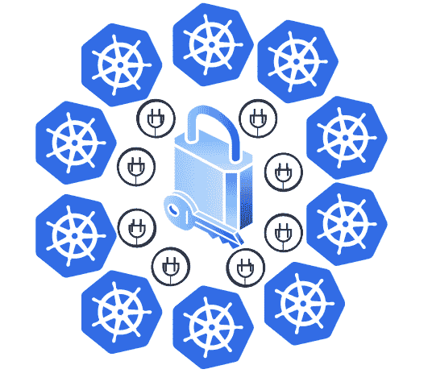
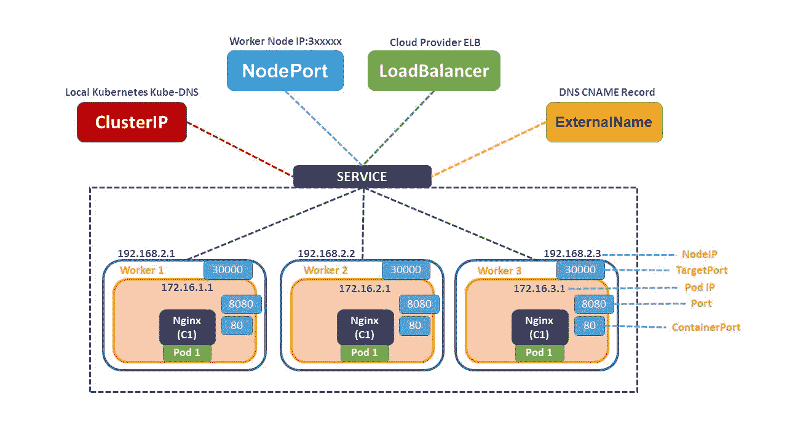

# 使用 Kubernetes 插件提高安全性

> 原文：<https://infosecwriteups.com/using-kubernetes-plugins-for-better-security-7b083cc3a7b7?source=collection_archive---------0----------------------->

## 扩展和维持集装箱安全



图片作者[作者](https://www.linkedin.com/in/jayachandra-sekhar-reddy/)

利用可扩展性构建出色的行业标准容器编排的能力使 Kubernetes 成为最优秀和最值得称赞的工具之一。可扩展性是一种观点，产生于对现有系统进行更多添加和贡献以提供更好和更安全的功能的愿望。

根据设计，Kubernetes 通过消除对底层特性应用补丁的需要来支持定制配置和特定于用例的属性。插件是扩展 Kubernetes 特性和交付开箱即用产品的手段。

保护 Kubernetes 吊舱使 RBAC、更新的 k8、防火墙、隔离吊舱和 [Kubernetes 准入控制器](https://www.armosec.io/blog/kubernetes-admission-controller/)浮现在脑海中。虽然目前的特性是可行的选择，但是插件提供了一种值得信赖的、更简洁的方法来保护 Kubernetes 中的容器。

Kubernetes 插件给平台带来了无数的安全好处:功能可以用你选择的语言动态开发。

# 插件提供了什么让它们变得优雅和实用？

Kubernetes 自身不断进化成一个连体生态系统。通过在 DevOps 中集成、重构和定制大多数排序后特性，Kubernetes 现在几乎拥有了一切。



[来源](https://www.learnitguide.net/2020/05/kubernetes-services-explained-examples.html)

但是，在企业希望实现超出范围的功能，并且需要实现定制操作的情况下，Kubernetes 的特性是不够的。虽然自定义实现是一种更好的可能性，但它并不总是安全的。

考虑这样一个场景，我们的实现需要 ssh 到云上的一个正在运行的 pod 中，比如说 GKE 或 AWS EKS，而不牺牲安全性。我们如何安全地访问来自多个证书颁发者的证书并更新或打印它们？

随着分布式和云不可知论者的采用，对定制特性的需求和需求激增。

从功能和安全性的角度来看，一个最佳的、经过计算的决策是利用插件。插件是对 Kubernetes 的扩展，它们是在考虑安全性的情况下精心设计和开发的。Kubernetes 通过集成众多值得信赖的插件扩展了它的支持。

# 使用插件扩展安全措施的不同方式

# 准入控制器插件

提交更改集群或对象状态的请求是一项常规操作。过滤哪个请求应该到达 API 服务器增强了安全性。

评估[准入控制者](https://kubernetes.io/docs/reference/access-authn-authz/admission-controllers/)可能非常有利可图，并且对安全有利。它们提供独有的管理和门控功能。

准入控制器插件充当网关，通过在对象持久化之前拦截请求，对 API 服务器的请求进行认证和授权。插件代码驻留在 API 服务器中，在使用之前必须编译成二进制代码。

该插件可以变异和验证传入的请求，有时会在允许它们进入 API 服务器之前应用系统配置的默认值。

```
--admission-control=MutatingAdmissionWebhook, DenyEscalatingExec
```

KubeAPI 标志允许用户启用准入控制器插件。

在集群中进行修改之前，插件接受逗号分隔的有序准入控制选项列表。

# RBAC 插件

分发和编目是 Kubernetes 的核心。集群驻留在远程服务器上，可以通过 Kubectl/gRPC 访问。通过策略管理和限制访问是提高隐私和安全性的关键。

[RBAC 插件](https://blog.knoldus.com/rbac-in-kubernetes/)允许管理员设计一种基于角色设置和管理用户权限的机制。角色可以是全局、项目、节点或用户定义的级别。

Kubectl 是一个设置 RBAC、描述和修改对象的平台。

```
--authorization-mode=node,RBAC — policies
```

KubeAPI 标志—授权模式允许配置角色。

实施 RBAC 需要授权策略和配置列表。

# 容器网络接口插件

通过网络，保护集群之间的通信协议至关重要。为了消除复杂性，Kubernetes 管理容器端口到主机端口的映射，并为集群中的每个 pod 分配唯一的集群范围的 IP 地址，从而形成向后兼容的沿袭。

[CNI](https://github.com/containernetworking/cni) 是一个云原生的基础，提供了开发配置网络接口插件的专用规范库。

CNI 仓库拥有大量插件。CNI 旗下的插件遵循安全准则，并与容器网络连接有关。插件使用脚本完成工作。

注意: CNI 插件是语言无关的。go lang 支持利用插件功能。

# 第三方插件

Kubernetes 的广泛有用和可靠的命令行工具 kubectl 支持插件管理器 [KREW](https://krew.sigs.k8s.io/plugins/) ，为开发人员提供了开发和托管特定用例插件的健壮选项。

KREW 展示了选择插件开发语言的灵活性。使用 Kubectl 安装和实现插件非常简单。这些插件驻留在一个名为 Krew-index 的集中存储库中。

插件是值得信任的，因为插件是根据决策标准被集中存储库接受的，并由社区根据具体情况进行评估。

突出显示的插件是通用的，强烈推荐。Kubernetes 生态系统提供了大量定制和内置选项来扩展您的集群功能和安全性。

# 结论

在部署和编排 Kubernetes 集群之前，安全性是要考虑的一个主要方面。插件提供了获得高级功能的可靠和安全的方法。

Kubernetes 插件只不过是为完成与专用 K8s 组件相关的特定任务而开发的可执行程序，例如准入控制器、RBAC、处理来自多个发行者的证书、进入云的 ssh、网络连接等等。

组织可以在市场上买到各种各样的插件。存在多个插件来完成相同的任务，但提供不同的功能和安全性。挑选/开发正确的插件是管理员的任务。

来自 Infosec 的报道:Infosec 上每天都会出现很多难以跟上的内容。 [***加入我们的每周简讯***](https://weekly.infosecwriteups.com/) *以 5 篇文章、4 个线程、3 个视频、2 个 Github Repos 和工具以及 1 个工作提醒的形式免费获取所有最新的 Infosec 趋势！*