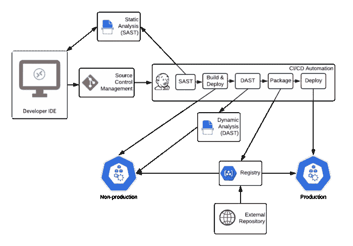
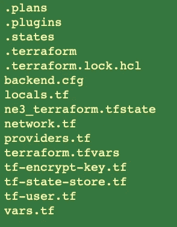
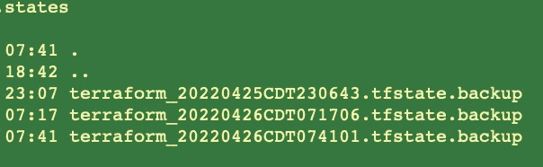
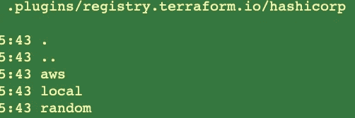
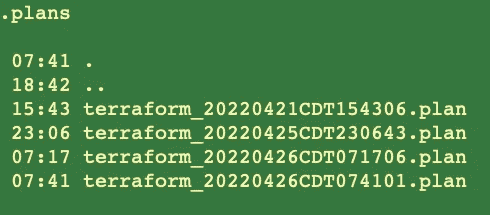

# 使用 PGP 增强平台运营的安全性和不可否认性

> 原文：<https://infosecwriteups.com/using-pgp-to-enhance-security-and-non-repudiation-of-terraform-ops-93c0b4bb209f?source=collection_archive---------1----------------------->

示例 devsecops 流程

[Terraform](https://www.terraform.io/) 已经转变为一种[通用语](https://en.wikipedia.org/wiki/Lingua_franca)，作为一种代码用于多云基础设施。由于敏感内容(取决于组织政策，密码、IP 地址、网络结构等可能被识别为敏感信息)存储为 terraform 计划和状态的一部分，大多数组织需要采取额外的控制措施，以确保 terraform 工件得到妥善保护。

Terraform 提供了将[变量](https://www.terraform.io/cloud-docs/workspaces/variables#sensitive-values)和[值](https://www.terraform.io/language/functions/sensitive)标记为敏感、加密[生成的](https://registry.terraform.io/providers/hashicorp/aws/latest/docs/resources/iam_access_key#pgp_key)密码和[存储](https://www.terraform.io/language/settings/backends/s3#kms_key_id) [加密的](https://www.terraform.io/language/settings/backends/gcs#encryption_key)状态的能力，以降低敏感数据泄露的可能性。本文探讨了在这些功能的基础上创建一个标准方法来实现安全性和不可否认性的方法。在这个过程中，它建立在[企业云安全:应用程序开发](https://medium.com/geekculture/enterprise-cloud-security-application-development-16a7efb2027f)中的高级思想之上。

# 考虑

Terraform 提供了可用于创建安全 devops 基础架构的功能，并且有许多文章介绍了这些功能的使用。同时，对于 terraform 安全性的当前状态有一些考虑。

## 安全性取决于提供商

大多数安全功能，如加密密码、将值标记为敏感、后端加密特性，都依赖于插件提供者(或者在后端实现的情况下)。这导致了跨提供商甚至在单个提供商内的特别安全方法(例如， [AWS IAM 访问密钥](https://registry.terraform.io/providers/hashicorp/aws/latest/docs/resources/iam_access_key#pgp_key)使用 PGP 来启用加密，但是数据库实例中的[密码以明文形式维护),这可能为多云场景创建不一致的安全方法。这就需要一种能够跨提供者工作，而不依赖于单个提供者能力的方法。](https://registry.terraform.io/providers/hashicorp/aws/latest/docs/resources/db_instance#password)

## 国家和超越

terraform 安全性的一个重要部分集中在保护状态文件。这主要是因为该文件以纯文本的形式包含密码和其他敏感数据，除非开发人员使用提供者功能对其进行了明确的保护。terraform 后端在保护状态文件的能力方面有所不同，从支持使用静态客户密钥加密的 [AWS](https://www.terraform.io/language/settings/backends/s3#kms_key_id) (服务器端加密)、 [GCS](https://www.terraform.io/language/settings/backends/gcs#encryption_key) (客户提供的加密)，到不提供任何此类能力的 [Azure](https://www.terraform.io/language/settings/backends/azurerm) 、 [Artifactory](https://www.terraform.io/language/settings/backends/artifactory) 。像服务器端加密这样的最佳可用安全措施仍然容易受到[深度包检查](https://en.wikipedia.org/wiki/Deep_packet_inspection#Encryption_and_tunneling_subverting_DPI)方法的影响(没有适当的[证书验证控制](https://docs.aws.amazon.com/cli/latest/userguide/cli-chap-troubleshooting.html#tshoot-certificate-verify-failed))。

除此之外，还有其他工件，如变量文件、计划，它们可能包含敏感内容，需要适当地保护。多个环境和相关的文件、配置会迅速增加开发团队为了安全需要跟踪的工件的数量。

## 不可否认性呢？

如何识别变更是作为 terraform 操作的一部分进行的，还是由有权访问 terraform 操作所用身份的流氓实体进行的。随着自动化的发展，非常需要确保明确识别授权的变更。这需要超越传统的安全控制，如使用对称密钥加密，以确保工件被签名并发布到正确的工具进行分析。

# 方法

为了提供一种安全性和不可否认性的方法，同时提供对多云、多环境场景的支持，已经开发并实现了一种自以为是的方法，该方法利用标准目录结构和 PGP 对工件进行加密/签名。执行这些操作的脚本可以在 [github](https://github.com/shekhar-jha/base-demo/tree/infra-core/infra/scripts) 上获得。

每个环境都有一个在设置期间生成的 PGP 密钥对(实现细节见 [setup.sh](https://github.com/shekhar-jha/base-demo/blob/infra-core/infra/aws/core/setup.sh) )。创建特定于 terraform 的目录结构，并复制所有相关文件。随后执行 terraform 验证、计划操作。计划的输出被存储以供下一步参考和使用。Terraform apply 创建状态备份，并使用之前创建的计划来应用更改。成功应用后，terraform 目录将被清除(*。tf 文件被移除，插件被打包到。插件目录)并打包。该文件被加密并保存到存储位置。

在下一次执行期间(通常使用 [apply.sh](https://github.com/shekhar-jha/base-demo/blob/infra-core/infra/aws/core/apply.sh) 执行)，保存的状态被加载、解密，然后执行 terraform apply 命令。这确保了所有内容在存储时都是加密的。这可以很容易地扩展到支持使用外部密钥的签名，以增加过程的不可否认性。

## 目录结构

传统上，特定于环境的变量文件已经被签入到源代码控制中，而计划和其他中间工件没有被跟踪。在这种方法中，我们为每个环境创建一个目录结构，并跟踪计划、状态、后端配置和变量。

地形目录结构

Terraform 目录有适当的计划目录(。计划)、状态备份(。状态)和用于审计目的的插件。

地形环境中各种目录的内容

这个目录构成了-chdir 选项的输入，以确保生成的所有内容(。terraform，. terraform.lock.hcl)，后端配置(backend.cfg)，变量值(terraform.tfvars)在单一位置管理。

地形操作在 [tf.sh](https://github.com/shekhar-jha/base-demo/blob/infra-core/infra/scripts/tf.sh) 中实现，并通过 [infra.sh](https://github.com/shekhar-jha/base-demo/blob/infra-core/infra/scripts/infra.sh) 进行抽象。它提供了初始化环境、应用更改和清理的功能。打包和解包方法清理不必要的文件，并创建 tar 和压缩文件进行存储

## 加密和签名

terraform 目录可以打包，然后存储，以重新创建环境并执行各种操作。该打包文件使用 PGP 密钥加密，PGP 密钥生成并存储在适当的存储器(例如 [AWS Secret Manager](https://aws.amazon.com/secrets-manager/) )中，以便在需要时检索。 [pgp.sh](https://github.com/shekhar-jha/base-demo/blob/infra-core/infra/scripts/pgp.sh) 文件提供了使用 [gpg](https://gnupg.org/) 包生成、存储、检索和删除 pgp 密钥的方法。除此之外，它还提供加密和解密文件的方法。

## 管理文件

使用包含存储密钥和文件的通用方法的 [store.sh](https://github.com/shekhar-jha/base-demo/blob/infra-core/infra/scripts/store.sh) 文件中的可用脚本，可以从选择的文件存储中存储和检索加密文件(目前支持 AWS S3)。aws.sh 提供了特定于 aws 的操作。

随着 terraform 成为基础设施代码的首选语言，开发控制措施以确保在生成环境的生命周期中保持适当的审计、日志记录、安全性和不可否认性水平，这带来了独特的挑战。本文分享了到目前为止所做的一些工作。这项工作将继续建立在当前工作的基础上，以增加对 GCP 和 azure 作为商店的支持，签署和验证文件的能力。