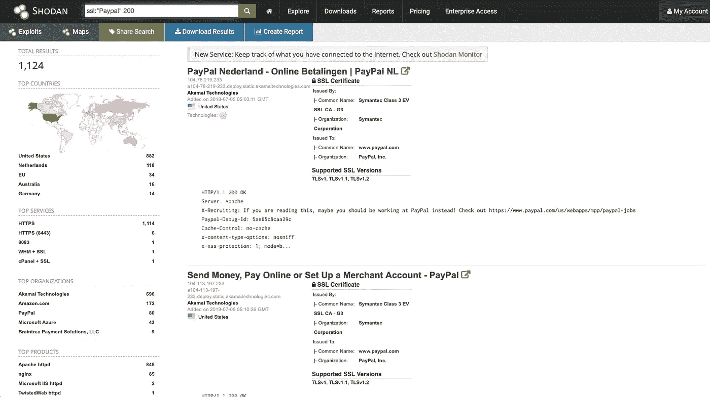
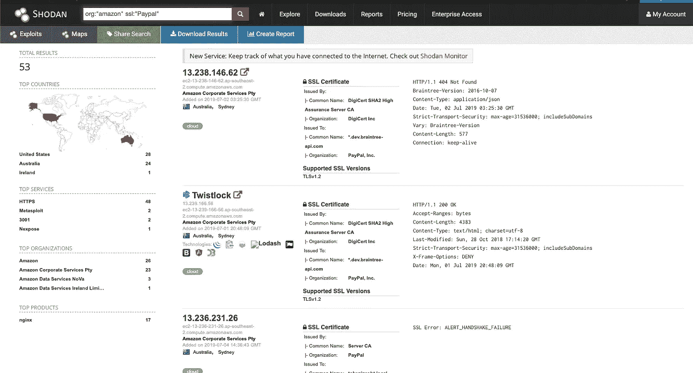

# 使用 Shodan 更好的方法！:)

> 原文：<https://infosecwriteups.com/using-shodan-better-way-b40f330e45f6?source=collection_archive---------0----------------------->

大家好！

我希望你们都有一个获得巨额奖金的好时光；)更不用说，它确实激励我去寻找那些获得奖金的人，让他们停止拖延，与其他黑客和睦相处。

老实说，很长一段时间以来，我一直是一个脚本小子，只是随意地到处复制粘贴有效载荷，但从未试图理解技术本身。

切换到开发模式对我更好地理解概念帮助很大，在那段时间里，我意识到有效载荷是如何有意义的。与此同时，我注意到许多人提到 shodan 和其他平台，如 censys、binaryedge 和 ZoomEye，作为他们的首选工具，我想知道人们如何找到这些隐藏的资产，因为大多数人已经知道它们。事实证明，秘密在于你如何寻找模式，以及你对你的目标了解多少。技术和工具对你们所有人都是可用的，但这完全取决于你如何使用它们。

在我学习的初始阶段，我总是用来搜索一个模式，如“site.com ”,就是这样，我希望一些 Jenkins 实例会弹出来，因为我相信我有好运:P 但这完全不是真的。

结果很好，但没有达到我的预期，因为大多数公司都有一个安全团队制定指导方针，这使得我们作为黑客的工作有点乏味。所以我开始学习(研究)如何让我的侦察更好更有效。

我经常做的第一步是在 Shodan.io 上搜索 SSL 证书。Shodan 有很多过滤器可以用来过滤结果中的垃圾。一个这样的过滤器是 **ssl:"target"** ，它将在 ssl 证书中搜索字符串 **target** 。

为了演示，我们将搜索 Paypal 的 SSL 证书。

> 【https://www.shodan.io/search?query=ssl%3A%22Paypal%22 

正如你所看到的，shodan 已经搜索了 Paypal 名下的证书，更不用说我们可以看到太多的垃圾，如访问被拒绝，这是因为 Akamai，但我们也可以通过在我们的搜索查询中添加 200(这是一个状态代码)来过滤掉它们，这样我们的查询看起来就像 **ssl:"paypal" 200** 。

过滤结果

> [https://www.shodan.io/search?query=ssl%3A%22Paypal%22+200](https://www.shodan.io/search?query=ssl%3A%22Paypal%22+200)

您还可以通过 append 在我们的查询中后跟模式，对您不希望搜索的特定内容进行反向搜索。

> [https://www.shodan.io/search?query = SSL % 3A % 22 paypal % 22+-% 22 akamaighost % 22](https://www.shodan.io/search?query=ssl%3A%22Paypal%22+-%22AkamaiGHost%22)

我不知道为什么，但我对管理亚马逊 AWS 上的资源很感兴趣。为了提高搜索效率，我使用了 **org:"Amazon" ssl:"target"**

亚马逊 AWS

> 【https://www.shodan.io/search? query = org % 3A % 22 Amazon % 22+SSL % 3A % 22 paypal % 22

我关注的另一个特定搜索模式是在 html 源中查找一些特定的内容，shodan 通过为同一个“HTML”引入过滤器使我们的工作变得简单。

我了解到版权页脚总是出现在应用程序中，所以我总是关注它，也许会有一些东西弹出来。

搜索查询应该类似于 **html:“模式”。**

也不要忘记，它帮助我找到一个特定技术后的资产很多。例如，为了搜索 Jenkins 实例，我倾向于使用**html:“Dashboard Jenkins”**或类似的东西。许多人会争辩说宁愿使用 **http.component:"jenkins"** 来搜索特定的技术或组件，但我更喜欢自己的方式。

> [https://www.shodan.io/search?query = http . component % 3A % 22 Jenkins % 22](https://www.shodan.io/search?query=http.component%3A%22jenkins%22)
> 
> [https://www.shodan.io/search?query = html % 3A % 22 dashboard+Jenkins % 22](https://www.shodan.io/search?query=html%3A%22Dashboard+Jenkins%22)

我提到要确保你注意到关于你的目标的所有事情，并照顾这些平台上的人，我还注意到在寻找私人程序时一些奇怪的事情。

我注意到一些资产在其证书中使用了 certmaster@redacted.com。所以我在一个对黑客友好的平台上照看它们，确实发现了一些开放的 Kube 实例，我相应地向它们报告了这些实例。

后来，我注意到许多应用程序工程师使用 staging environment 来开发一个新的特性或者他们正在开发的东西。所以我开始关注 ssl:“公司发展”之类的东西，后来我发现了一个对公众开放的 Django 应用程序。

同样在这个过程中，我发现了几个运行在开发模式下的 Ruby on Rails (ROR)应用程序，但当时没有公开的特殊漏洞(据我所知),所以我将它们保存在我的笔记中，几天后我给我的好朋友 Harsh Jaiswal 发了消息，后来发现一个 Rails 应用程序容易受到 RCE 的攻击。

没有这样的秘密工具可以找到所有秘密/隐藏的资产，但这取决于你和你的观察技巧。如果你想尝试不在你的 Bug Bounty 方法论下的新东西。不要害怕尝试新事物，确保你对你发现的任何事情都做笔记。

狩猎愉快！

*关注* [*Infosec 报道*](https://medium.com/bugbountywriteup) *获取更多此类精彩报道。*

 [## 信息安全报道

### 收集了世界上最好的黑客的文章，主题从 bug 奖金和 CTF 到 vulnhub…

medium.com](https://medium.com/bugbountywriteup)