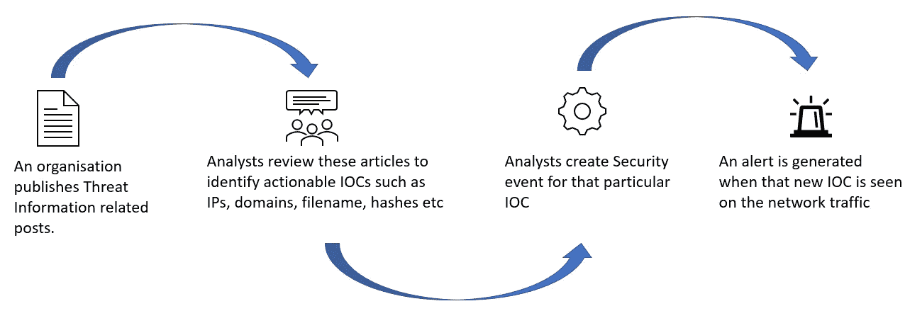
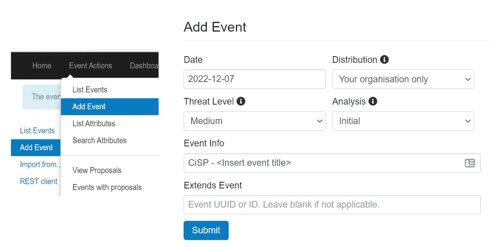
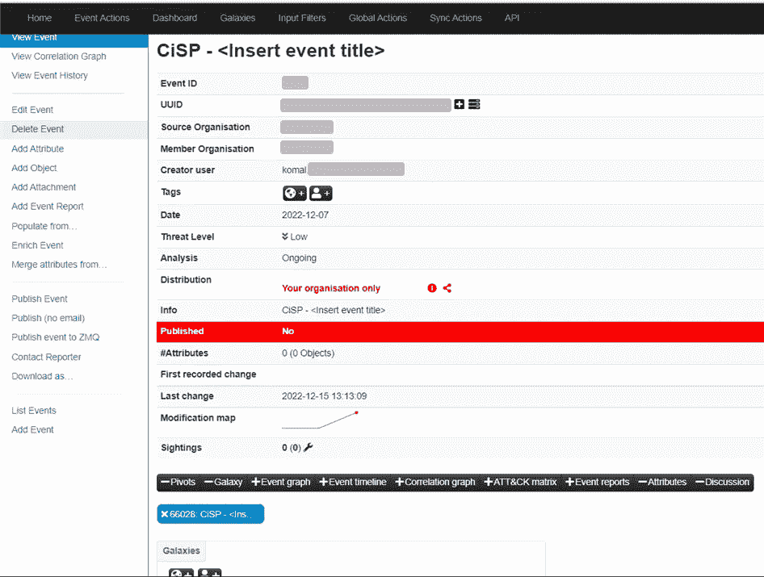
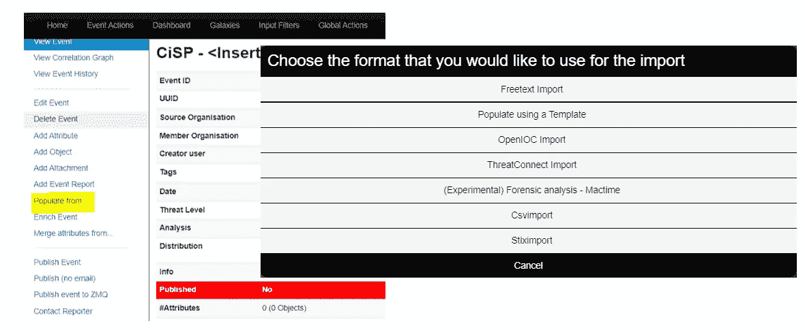
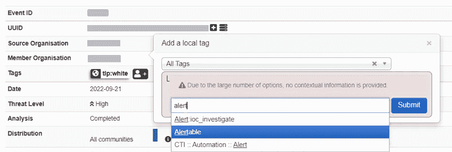
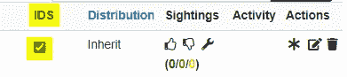

# 使用威胁情报数据生成 MISP 警报

> 原文：<https://infosecwriteups.com/using-threat-intelligence-data-to-generate-misp-alerts-b8a275df5131?source=collection_archive---------1----------------------->

有各种威胁情报来源相互共享威胁信息，以帮助识别组织中的威胁并应对这些问题。这些威胁情报平台包括:

*   [外星人金库](https://otx.alienvault.com/)
*   [恶意字节](https://www.malwarebytes.com/blog/category/threat-intelligence)
*   [CISA](https://www.cisa.gov/)
*   [WhoisXMLAPI](https://main.whoisxmlapi.com/collaborations)
*   [CiSP](https://www.ncsc.gov.uk/information/cyber-security-information-sharing-partnership--cisp-)
*   [米特尔 CRITS](https://www.mitre.org/our-impact/intellectual-property/collaborative-research-threats-crits)

在 MISP，这些威胁情报共享平台大多集成在一起，以自动创建安全事件和警报。但是，对于其中一些，需要手动审查威胁文章，以查找可操作的 IOC(IP、域、文件名、哈希)并创建安全事件和警报。

*在这里，我们将了解一个威胁共享组织，以确定 IOC，然后在 MISP 手动创建安全事件。*

# CiSP

> “[网络安全信息共享伙伴关系(CISP)](https://www.ncsc.gov.uk/information/cyber-security-information-sharing-partnership--cisp-) 是一个行业和政府联合数字服务，允许英国组织在安全和保密的环境中共享网络威胁信息。”

CiSP 是威胁信息共享平台之一，蓝队可以使用它来创建安全事件和警报。

登录您的 [CiSP 账户](https://share.cisp.org.uk/)，查看“新闻”版块的文章，尤其是 NCSC 发布的文章，并寻找任何可采取行动的 IOCs 然后，这些信息可以输入到收集和存储网络事件和威胁的网络威胁平台。支持这一点的众所周知的平台之一是 MISP 软件解决方案。

*CiSP 使用 TLP 按社区对每个帖子进行分类。*

# 在 MISP 创建安全事件

> “ [MISP](https://www.misp-project.org/) 是一个开源软件解决方案，用于收集、存储、分发和共享有关网络安全事件分析和恶意软件分析的网络安全指标和威胁。”

一旦在 CiSP 上确定了可操作的 IOCs，您现在可以:

*   登录您的 MISP 帐户，创建新的安全事件。选择“添加事件”。在这里，我创建了一个示例事件。

> ***分布:***
> 
> *仅限您的组织-只有该服务器上的组织成员才能看到。*
> 
> *只有 MISP 社区中的组织才能看到它。*
> 
> *Connect community——属于 MISP 社区或直接连接社区的组织都可以看到它。*
> 
> *所有社区-该活动将与所有 MISP 社区共享。*
> 
> ***威胁等级有:***
> 
> *高度复杂的 APT 恶意软件或零日风险*
> 
> *中度恶意软件*
> 
> *低质量恶意软件*
> 
> *未定义-无风险*
> 
> ***分析:***
> 
> *初始-事件刚刚被创建，并处于初始状态*
> 
> *正在进行-分析仍在进行*
> 
> *完成-事件创建者认为分析已经完成*

## 查看事件

这是活动简介页面创建后在 MISP 的外观。

## **将可操作的国际奥委会添加到赛事中**

接下来，要将 IOCs 添加到事件中，请选择“populate from…”并从要导入的列表中选择所需的格式。

## 向事件添加标签以触发警报

将所有相关的 IOC 添加到事件中后，将“Alertable”标记添加到该事件中。每当在网络流量日志中看到这些 IOC 时，都会触发警报。如果没有此标签，事件将不会触发警报。如果你愿意，还可以添加其他相关标签。

在适当的地方使用 TLP 标签。

## 确保应用了 IDS 检查

在事件配置文件页面中，确保选中了 id 框。如果没有，那么只需点击该框来打开 IDS。

## 发布活动！

点击“发布事件”是

安全事件创建现已完成！

感谢您阅读我的文章。

# 相关文章:

*   [调谐 MISP 警报](/fine-tuning-optimising-security-alerts-5b12a1f6d42f)

## 来自 Infosec 的报道:Infosec 每天都有很多内容，很难跟上。[加入我们的每周简讯](https://weekly.infosecwriteups.com/)以 5 篇文章、4 个线程、3 个视频、2 个 GitHub Repos 和工具以及 1 个工作提醒的形式免费获取所有最新的 Infosec 趋势！