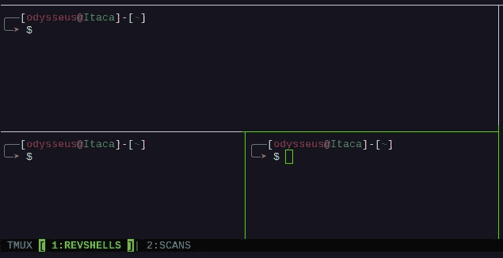
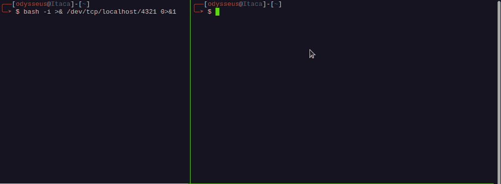
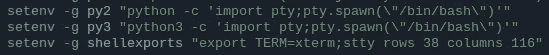
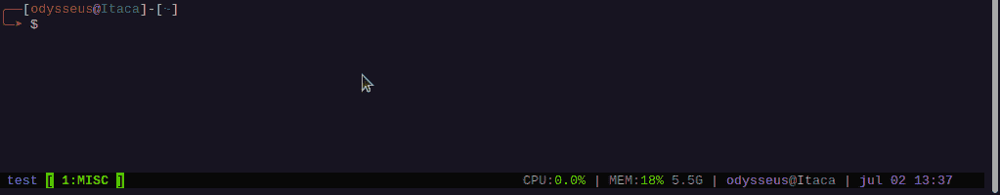
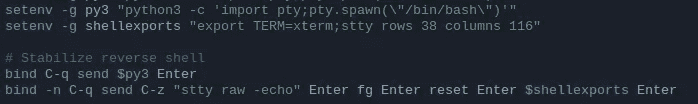
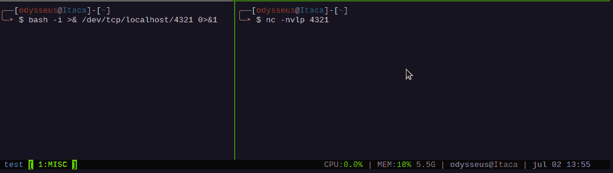

# 使用 tmux 自动化交互式反向外壳

> 原文：<https://infosecwriteups.com/using-tmux-for-automating-interactive-reverse-shells-630260740af3?source=collection_archive---------1----------------------->

## 将非交互式反向外壳转换为完全交互式 TTY 的过程自动化。

# 介绍

我最近读了一篇关于使用“expect”命令行工具将非交互式反向 shell 转换为完全交互式 TTY 的文章，这意味着通过这样做，可以使用标签完成、历史导航、清空屏幕等功能，还可以在不丢失访问权限的情况下点击 ***、Ctrl-c*** ，这让我非常高兴。

我发现这个帖子非常有趣，因为它使用了一种我从未见过的完全不同的方法。因此，由于我也有一个自动化这个过程的技术，我决定分享它，因为它是一个不同的视角，它也依赖于命令行实用程序: [tmux](https://github.com/tmux/tmux/wiki) 。

# 手动过程

手动创建交互式反向壳

上面的 gif 展示了如何将一个非交互式的反向外壳转换成交互式的。虽然这是一个相当简单的过程，但如果你需要经常这样做，它就会变成一种痛苦。

# 输入 tmux

Tmux 是一个终端多路复用器命令行实用程序，它允许您在一个屏幕上创建/控制多个 shells。它最强大的特性之一是能够自动将击键组合发送到 shells 中。除此之外，我还可以创建内部环境变量，这些变量可以作为大型命令的简短版本:

命令字符串存储为环境变量

现在，我只需打开 tmux 命令提示符，将其中一个字符串发送到当前活动的 tmux 窗格中:

使用 tmux 将字符串发送到 shells 中

# tmux 自动化的魔力

现在我们知道了 tmux 需要使用的所有特性，我们可以构建 tmux 快捷方式，或者键绑定，以便触发发送击键到当前活动窗格的动作。

用于发送击键的 Tmux 键绑定

上面的“tmux.conf”行由两个环境变量组成，这两个环境变量包含稍后将发送到终端的两个字符串，以及将首先发送密钥序列***python 3-c’import pty 的两个密钥绑定；pty . spawn(\ "/bin/bash \ ")'***后跟一个 ***<回车>*** ，然后发送序列 ***C-z "stty raw -echo "回车 fg 回车 reset 回车$shellexports 回车*** 。注意“Enter”不是单词本身，而是*击键*，也就是换行符。Tmux 有一组单词，它可以识别为某些键盘按键，“Enter”就是其中之一。

第一个 *bind* 命令必须在前缀组合键之后执行，在标准 tmux 中是 ***Ctrl-b*** ，但在我的例子中是 ***Ctrl-a*** 。第二个*绑定*命令，有标志 *-n* 可以不使用前缀组合执行。

这里你可能会想:“但是为什么你使用两个快捷方式，而不是一次发送所有内容？”答案很简单:我无法通过只使用一个键绑定来让它工作。如果你找到了方法，请联系我，因为我很想知道我错过了什么。

# 最后的结果

现在每次你得到一个非交互的 shell，你可以简单的点击 ***Ctrl-aqq*** 来触发第一次绑定( ***Ctrl-aq*** )然后发送第二部分( ***Ctrl-q*** )。享受:

完全自动化的交互式外壳，而非交互式外壳

\ x07 \ x44 \ x42 \ x01 \ x59 \ x13 \ x44