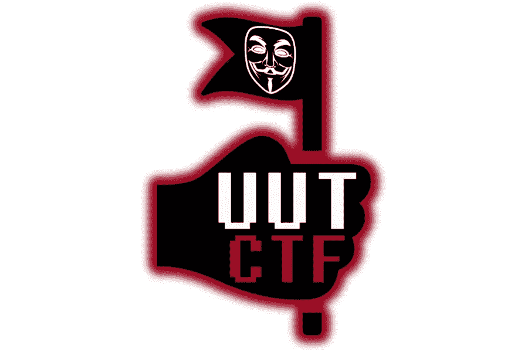
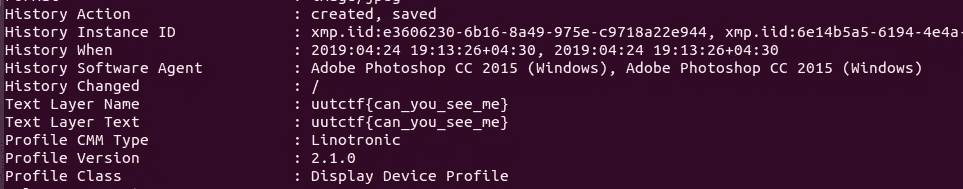
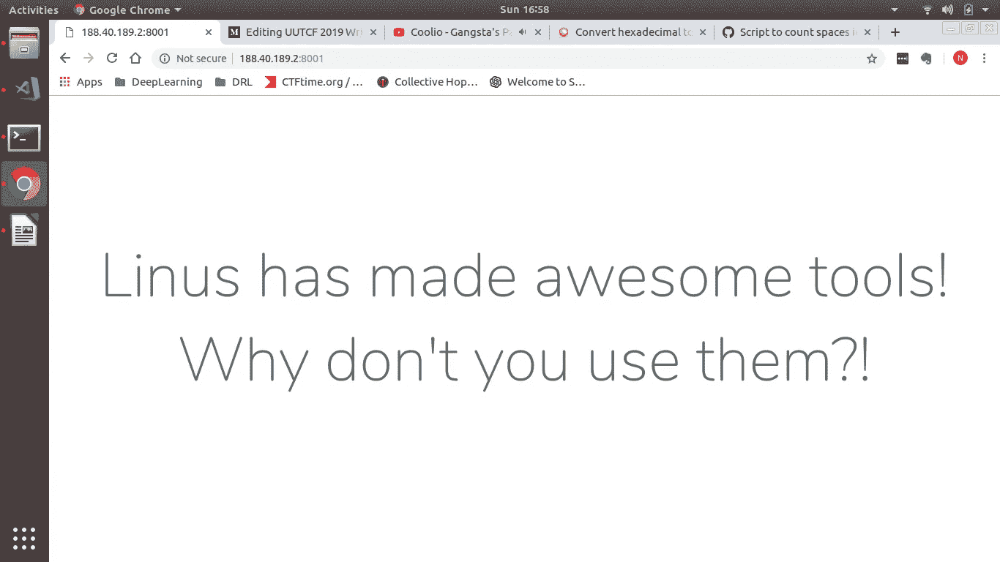
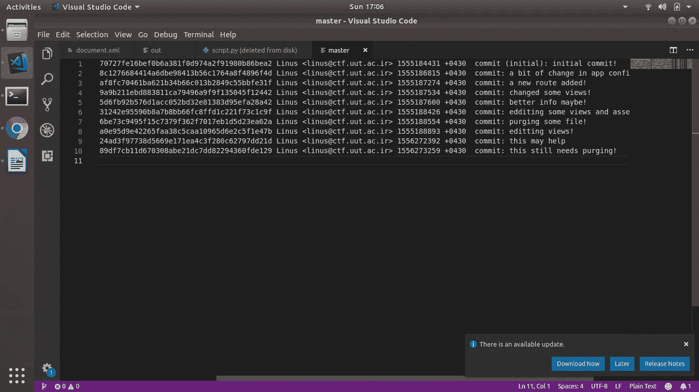
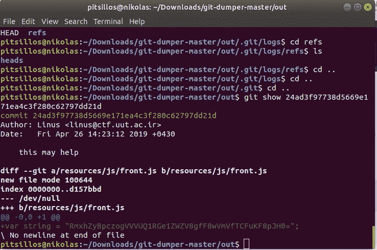

# UUTCTF 2019 年综述

> 原文：<https://infosecwriteups.com/uutcf-2019-writeups-6c11ea3f9d22?source=collection_archive---------0----------------------->

在这篇文章中，我将带你了解 UUTCTF 2019 的 3 个 CTF 挑战，2 个辩论和 1 个杂项。我很高兴几乎完全靠自己解决这些问题。感谢安德烈亚斯·波伊亚茨！

# 辩论术

## 层

> 层次在这里。

在这个挑战中，我们看到了下面的图像。



Layers.jpg

下载图片时，我用 *exiftool* 查看了图片:

```
>*exiftool* Layers.jpg
```

我们看到了图像文件的信息。稍微搜索一下，我们就可以在 *exiftool 返回的结果中找到这个标志。*



Exiftool 结果。

> Flag: uutctf{can_you_see_me}

## 找到单词 flag

> 在空的 DOCX 文件中，标志可以隐藏在哪里？查找并提交！

在这个挑战中，我们得到了一个 Word.docx 文件。打开它读下面的文字:

*注意文档内部的空隙*

起初我以为它指的是文本中的空格，但显然事实并非如此。我在网上搜索了一下类似的问题，发现你可以把 docx 当成一个压缩文件。使用命令:

```
>*unzip Word.docx*
```

我们可以获得表示 word 文档的 xml 文件。在创建的 word 目录中检查生成的文件 document.xml，我们可以看到几个长条的空格，因此有间隙。我的队友很快注意到这些是十六进制数字，其中每两个数字对应于 ASCII 表中的值。前两个数字是 5，指向字母 u。这是这种情况下，显然是指国旗。

我们现在要做的就是注意文档中的空白，即删除 xml 文件中出现在。docx 文件。这样做之后，剩下的挑战就变成了实现下面的脚本来计算空间和索引一个查找表。

这将返回以下十六进制数字字符串:

555544354467 b4d 65616 e 696 e 6766756 c 476158737d 11111111

忽略最后一串 1，我们可以很容易地将它转换成文本，从而得到标志。

> UUTCTF{MeaningfulGaXs}

# 混杂的

## 麻烦制造者

> 莱纳斯·托沃兹是个麻烦制造者！他做了一个隐藏旗子的网页。找到并抓住它！
> 
> 网页位于:[http://188.40.189.2:8001](http://188.40.189.2:8001)

将我们的浏览器指向该 IP 地址，我们会看到以下网站。



http://188.40.189.2:8001[网站](http://188.40.189.2:8001)

我立刻用谷歌搜索了李纳斯·托沃兹这个名字，看看他创造了什么工具。我发现他也创造了 git。这让我想起了你可以访问。git 目录，但是这导致了一个禁止的错误。

该网站不提供任何功能，所以我使用 git-dumper 工具下载该网站的所有文件。

```
>*git-dumper.py* [http://188.40.189.2:8001/](http://188.40.189.2:8001/) out
```

考虑到他是 git 的创建者，我继续检查。git 目录，更具体地说是日志目录，以检查提交消息。



在主机上提交消息。

正如我们看到的，有一条提交消息说:*这可能有帮助。*我以为这应该是个线索。所以我使用下面的命令来检查提交中所做的更改。

```
>*git* show 24ad3f97738d5669e171ea4c3f280c62797dd21d
```

这返回了以下结果:



git 显示结果

检查字符串变量，我们可以推断这是 base64 编码，使它非常有可能成为标志的候选。

解码字符串将返回标志。

> 标志为:UUTCTF{VVe_ |_0Ve_L！n(_)$}

# 结论

所以你有它的人！这些都是令人兴奋的挑战，这是我第一次独自解决几个 CTF 挑战(几乎没有帮助)。所以一致性和坚持是持之以恒的关键技能。