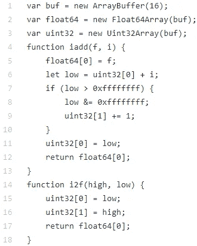
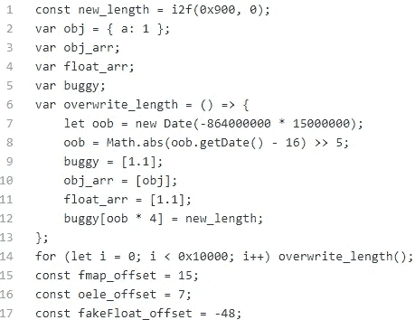
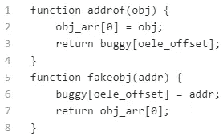
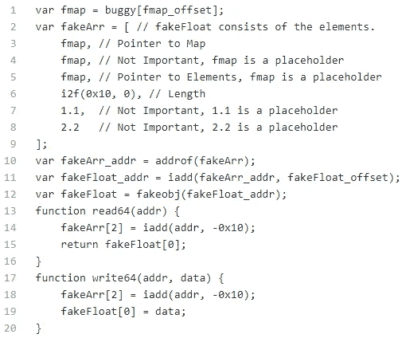
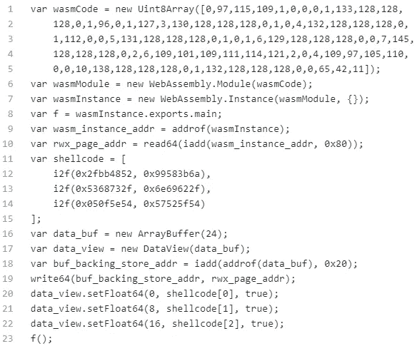

# V8 Array Overflow Exploitation: 2019 KCTF Problem 5 小虎还乡

> 原文：<https://infosecwriteups.com/v8-array-overflow-exploitation-2019-kctf-problem-5-%E5%B0%8F%E8%99%8E%E8%BF%98%E4%B9%A1-1aa51b9b2be6?source=collection_archive---------4----------------------->

# 1.介绍

你有没有想过利用动态生成的代码？您知道漏洞利用也可以是源代码而不是数据吗？这个 bug 的根本原因是 v8 的 JIT 编译器中的不一致性。这种不一致诱使 JIT 编译器动态生成包含数组溢出错误的代码。我们对 bug 的最后利用是一些源代码。这与利用数据的正常利用非常不同。

帖子对开发过程进行了总结。更多详情请访问此 [*链接*](https://pwnbykenny.com/2020/08/01/v8-array-overflow-exploitation-2019-kctf-problem-5-%e5%b0%8f%e8%99%8e%e8%bf%98%e4%b9%a1/) 。该链接还提供背景知识，如对象结构，帮助您理解开发过程。顺便说一下，链接指向我的个人博客。欢迎光临！

如果你把这篇文章中的所有代码片段连接起来，你将得到一个产生外壳的漏洞。但是，有时候你需要改变这篇文章中提供的偏移量:fmap_offset，oele_offset，fakeFloat_offset。这里提供的外壳代码是在 x86_64 & Linux 上测试的。不能保证外壳代码能在其他 CPU 架构和操作系统上运行。

# 2.V8 环境设置

如果你从[这里](https://drive.google.com/drive/folders/1D1yDMHILfvnD_h69tolE_Bj7p1adzzLy?usp=sharing)下载文件夹，你会看到里面有一个易受攻击的 d8。并且可以直接运行:。/d8。

# 3.辅助类型转换功能

辅助类型转换功能

开发中使用了 iadd 和 i2f 两个函数。iadd 向浮点格式的地址添加整数偏移量。i2f 将两个 32 位整数转换为 64 位浮点数。

# 4.在内存中准备对象

在内存中准备对象

第 9–11 行定义了 3 个数组对象:buggy，obj_arr，float_arr。这三个对象在堆中从低地址到高地址分配。bug 是溢出源。第 12 行使用溢出源将 buggy 的长度字段改写为 new_length。这一行使我们能够用 buggy 进一步访问 obj_arr 和 float_arr。第 14 行触发了数组溢出错误。循环触发 JIT 编译器。JIT 编译器动态生成一些代码。代码中存在 bug。所以当代码执行时，bug 就被触发了。

第 15–17 行定义了 3 个重要的偏移量。fmap_offset 是从 buggy 到 float_arr 的类型字段的偏移量。oele_offset 是从 buggy 到 obj_arr 的元素区域的偏移量。fakeFloat_offset 将在后面使用时解释。

# 5.泄露地址和伪造物品

原语:addrof，fakeobj

本节使用了 buggy 和 obj_arr。obj_arr 是对象数组。它存储对象的地址。obj_arr 中的每个元素都被 v8 视为一个对象。buggy 是双精度数组。它存储原始浮点数，没有任何修改，如[指针标记](https://pwnbykenny.com/2020/07/05/v8-objects-and-their-structures/#pointer-tagging)。

为了获得给定对象的地址，我们需要首先将这个对象存储到 obj_arr 中，这样它的地址就是 obj_arr 的一个元素。接下来，我们使用 buggy 读取元素，因为它不修改地址。oele_offset 是从 buggy 到 obj_arr 的第 0 个元素的偏移量。

为了从给定的地址伪造一个对象，我们首先使用 buggy 将地址放到 obj_arr 的第 0 个元素。接下来，我们使用 obj_arr 读取地址。这会给我们一个假对象，因为 obj_arr 中的元素总是被识别为对象。

# 6.任意读写

原语:read64，write64

代码中重要的是两个函数:read64 和 write64。它们被用来访问任意的内存地址。我从头解释一下。

fmap_offset 是从 buggy 到 float_arr 的类型字段的偏移量。第 1 行检索 float_arr 的类型。

在第 2 行，我们将我们的假对象保存在 fakeArr 的元素区域。伪对象是一个双精度数组。我们称之为 fakeFloat。它的结构应该与 JSArray 的结构一致。fakeArr 重要的是它的第 0、第 2 和第 3 个元素。第 0 个元素是指示 fakeFloat 是双精度数组的类型值。第二个元素是指向 fakeFloat 元素区域的指针。我们通过修改指针来进行任意的读写。第三个元素是 fakeFloat 中的元素数量。不一定要 0x10。我们使用 i2f 将 0x10 转换为浮点数，因为 fakeArr 是一个浮点数组。

第 3 行获取 fakeArr 的地址:fakeArr_addr。第 4 行向 fakeArr_addr 添加了一个偏移量，这样我们就得到了 fakeFloat 的地址:fakeFloat_addr。接下来我们用 fakeobj 让 v8 认为在地址 fakeFloat_addr 有一个对象。所以我们现在有了假物体——fake float。

第 6 行定义了 read64，它执行任意读取。为了读取一个内存地址，我们需要通过修改它的元素区指针，使该地址成为 fakeFloat 的元素区。这由第 14 行完成。接下来，我们通过直接使用 fakeFloat 读取其 oth 元素来获取地址中的值。

第 7 行定义了 write64，它允许我们进行任意的写操作。它的机制与 read64 相同。

# 7.RWX 页面和外壳代码注入

RWX 页面创建&外壳代码注入和执行

第 1 行到第 8 行是由 [WasmFiddle](https://wasdk.github.io/WasmFiddle/) 生成的 wasm 相关代码。第 1 行将原始 wasm 代码存储在一个数组中。第 6 行到第 8 行将其封装到一个函数 f 中。封装后，原始 wasm 代码被存储到一个 RWX 页面中。一个指向页面的指针保存在 wasmInstance 的结构中。

第 9 行获取 wasmInstance 的地址。第 10 行遵循它的结构并读出指针。

第 11 行是我们想要注入到指针指向的地址的外壳代码。外壳代码将生成一个外壳。

第 16 行到第 19 行准备一个 ArrayBuffer 对象。我们将其后备存储指针设置为 rwx_page_addr。0x20 是从 ArrayBuffer 的开头到其后备存储指针的偏移量。

第 20 行到第 22 行将外壳代码写入 rwx_page_addr。在第 23 行，我们通过调用 f 来执行 shell 代码，然后你会看到这个符号:$，这意味着生成了一个 shell。

# 8.摘要

帖子对开发过程进行了总结。更多详情和必要的背景知识，请访问此 [*链接*](https://pwnbykenny.com/2020/08/01/v8-array-overflow-exploitation-2019-kctf-problem-5-%e5%b0%8f%e8%99%8e%e8%bf%98%e4%b9%a1/) 。您将在那里找到更详细的演示。