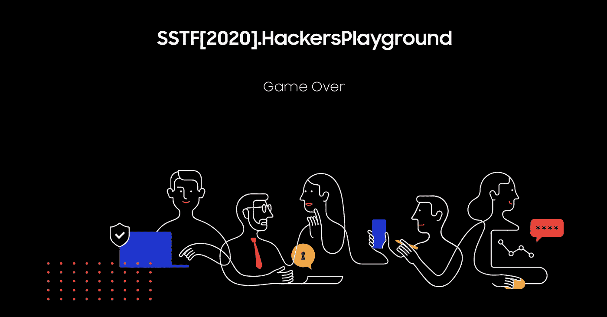
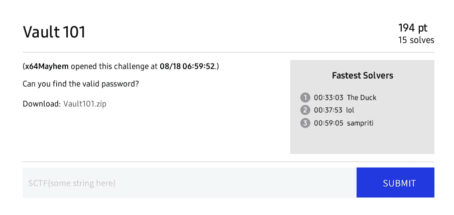
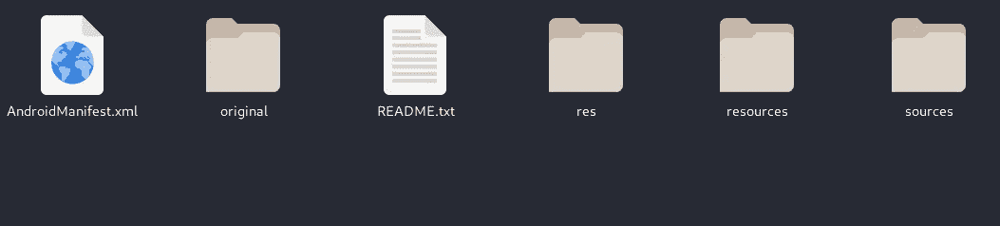
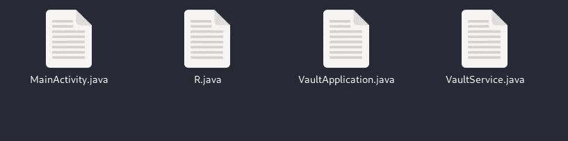
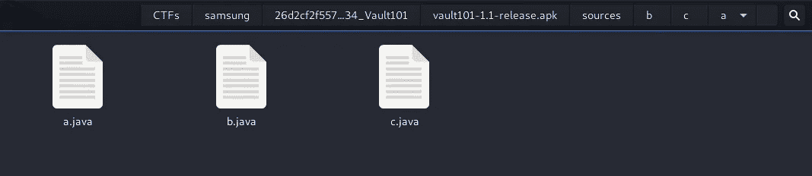
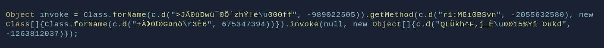
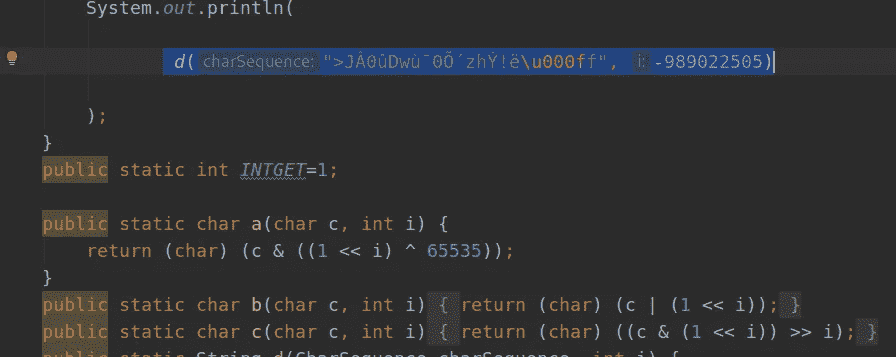
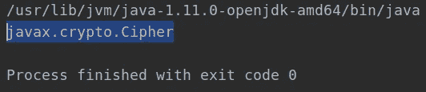
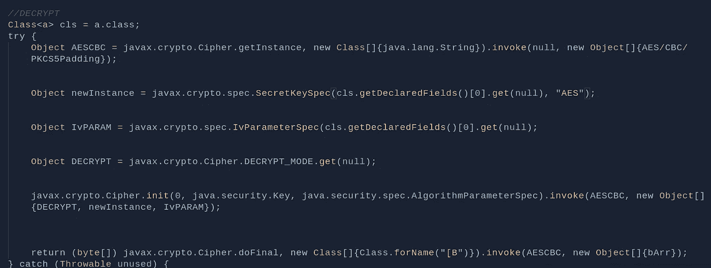
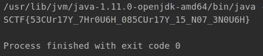

# 跳马 101:三星 CTF 应用逆向工程挑战赛报道

> 原文：<https://infosecwriteups.com/vault-101-samsung-ctf-android-reverse-engineering-challenge-write-up-d5a2b16a9212?source=collection_archive---------2----------------------->

## 报道三星 SCTF 的 Android 逆向工程挑战赛:使用基于逆向工程的纯静态分析的 Vault 101。



# 背景

不要浪费你太多的时间，奔向*好东西，*这里有一些基本信息。关于三星的虚拟 CTF 事件“**黑客的游乐场 2020** ”。

> 挑战:**找到密码。**
> 
> 给定的文件:**vault 101–1.1-release . apk**
> 
> 混淆级别= **高**
> 
> 求解数= 15

好消息来了。

# 应用分析

在挑战中，我们得到一个 apk 文件，你可以从[这里](https://github.com/FrigidSec/CTFWriteups/blob/master/SCTF/Vault101/_docs/challengeApp/Vault101-1.1-release.apk)下载。

作为静态分析过程的第一步，我们将使用 JADX 反编译应用程序。你可以通过你电脑上的工具或者使用任何可用的[基于网络的服务](http://www.javadecompilers.com/apk)来完成这项工作。

得到应用程序的反编译版本后，让我们开始吧。

## 查找主类



当应用程序被反编译时，您通常会看到类似这样的内容，因此我们将遵循主活动最常见的位置。



我们这里有一些有希望的东西。让我们打开 MainActivity.java 检查一下。

在上面的代码中我们可以看到，代码的这个突出部分负责显示好的或坏的消息:

> boolean a2 =***this*. s . a(*this*. p . gettext()。toString())；**
> 
> 吐司 toast =新吐司(*这个*)；
> 
> toast . set view(getLayoutInflater()。膨胀( **a2？r . layout . toast _ success _ layout:r . layout . toast _ fail _ layout**，(view group)findViewById(r . id . custom _ toast _ container))；

所以现在我们知道，我们需要从“s.a()”函数中获得“true”布尔值来获得好的 toast。

还要注意,“s.a”实际上是“public volatile b.c.a.b ”,因此我们需要导航到该类，该类将在各自的文件夹中提供，所以让我们转到那里:



让我们一起来看看 a.java:

现在这个类被高度混淆了，我们只看到它向`**c.java**'s **d()** function`发送了一些乱码数据

以类似的方式跟踪所有的类，我们得到以下信息

> `1\. c.java is performing some kind of string manipulation`
> 
> `2\. a.java is sending encoded function names to call and getting result from c.java`
> 
> `3\. we need to reconstruct function names by reversing the gibberish names via c.d()`

# 了解加密和反混淆

让我们看看 c.java

我们不需要反转它，因为这是用于规范化函数调用的函数。

检查一下，我在 java 程序中实现了相同的功能:

```
public static int *INTGET*=1;

public static char a(char c, int i) {
    return (char) (c & ((1 << i) ^ 65535));
}
public static char b(char c, int i) {
    return (char) (c | (1 << i));
}
public static char c(char c, int i) {
    return (char) ((c & (1 << i)) >> i);
}
public static String d(CharSequence charSequence, int i) {
    StringBuilder sb = new StringBuilder();
    if (i == 0) {
        return sb.toString();
    }
    for (int i2 = 0; i2 < charSequence.length(); i2++) {
        char charAt = charSequence.charAt(i2);
        char c = (char) (i >> (i2 % 4));
        int i3 = i2 % 3;
        if (i3 == 0) {
            for (int i4 = 0; i4 < 8; i4 += 2) {
                char c2 = (char) (*c*(charAt, i4) ^ *c*(c, i4));
                if (c2 == 0) {
                    charAt = *a*(charAt, i4);
                } else if (c2 == 1) {
                    charAt = *b*(charAt, i4);
                }
            }
        } else if (i3 == 1) {
            for (int i5 = 1; i5 < 8; i5 += 2) {
                char c3 = (char) (*c*(charAt, i5) ^ *c*(c, i5));
                if (c3 == 0) {
                    charAt = *a*(charAt, i5);
                } else if (c3 == 1) {
                    charAt = *b*(charAt, i5);
                }
            }
        } else if (i3 == 2) {
            for (int i6 = 0; i6 < 8; i6++) {
                char c4 = (char) (*c*(charAt, i6) ^ *c*(c, i6));
                if (c4 == 0) {
                    charAt = *a*(charAt, i6);
                } else if (c4 == 1) {
                    charAt = *b*(charAt, i6);
                }
            }
        }
        sb.append((char) (charAt ^ *INTGET*));
    }
    return sb.toString();
}
```

现在，如果我们将参数传递给函数，我们会看到它们被转换成 android 关键字。

例如:

这是在 a.java:



我们将把 d()的参数传递给我们的程序:



我们得到以下输出:



看到了吗？在对所有的 d()调用执行了此操作并清理了一些代码之后，我们得到了类似于:



看到了吗？整个 crypt 实现。

因此从这里我们得到以下信息:

> `1\. All the actual function calls are encoded in some custom encoding and can be reversed by implementing the same function in java`
> 
> `2\. Class 'a' is handling Encryption for the application`
> 
> `3\. Encryption used is AES with Cipher Block Chaining (CBC) and PKCS5Padding : this can be implemented in java also, we just need the key.`

# 获取标志

在清除上述所有代码并重新研究应用程序后，我们得到以下信息:

1.  用户输入一些字符串= **ustr**
2.  应用程序使用 AES 和一个 base64 硬编码密钥对字符串进行加密= **AES.e(ustr)**
3.  应用程序对 base64 =**b64 . e(AES . e(USTR))**中的密文进行编码
4.  然后将其与硬编码的字符串( **HcS** )进行比较，并返回布尔值

这意味着 HcS 也是使用名称流加密的，我们可以反转它

我们需要找到 **B64.d(AES.d(HcS)) = Flag**

为此，我用 java 重新构建了加密算法和所有参数。

他们将**键存储在资源中的 arrays.xml** 中，并将 **HcS 存储在资源中的 strings.xml** 中

这里需要注意的一点是，密钥也编码在我们之前找到的自定义算法中。但是因为我们已经重建了它，我们可以再次使用它来完成这一部分。在应用程序中，密钥通过

```
a.**class.getDeclaredFields()**[0].set(null,DECODEDKEY);
```

## 要破解的最终代码

我还删除了 a.java 的加密部分，因为我们不需要它。

运行上面的代码后，我们得到:



这是我们的旗帜:

**SCTF { 53 cur 17y _ 7 HR 0 u 6h _ 085 cur 17y _ 15 _ N07 _ 3n 0 u 6h }**

# 结论

这是一个有趣的挑战，找出使用的编码和代码的重建花费了 90%的时间。

自己试试，你会喜欢的！

如果你有足够的兴趣，[这里是这个解决方案的详细和更长的版本](https://saket-upadhyay.github.io/2020/08/18/sstf-vault-wtireup.html)，深入解释了这个方法。:)

下次再见，直到保持足够的咖啡因！

资源:

[](https://saket-upadhyay.github.io/2020/08/18/sstf-vault-wtireup.html) [## 三星 CTF 应用程序反向工程。详细记录

### 三星 CTF“黑客乐园 2020”逆向工程挑战赛综述积分:500 解答:15 我拿了…

saket-upadhyay.github.io](https://saket-upadhyay.github.io/2020/08/18/sstf-vault-wtireup.html) [](https://www.tutorialspoint.com/java/lang/class_getdeclaredfields.htm) [## Java . lang . class . getdeclaredfields()方法

### Java . lang . class . getdeclaredfields()方法返回一个 Field 对象数组，包括 public、protected、default…

www.tutorialspoint.com](https://www.tutorialspoint.com/java/lang/class_getdeclaredfields.htm) [](https://mkyong.com/java/java-aes-encryption-and-decryption/) [## Java AES 加密和解密-Mkyong.com

### 高级加密标准(AES，Rijndael)是分组密码加密和解密算法，最常用的…

mkyong.com](https://mkyong.com/java/java-aes-encryption-and-decryption/) [](https://developer.android.com/reference/android/os/Parcel.html) [## 包裹|安卓开发者

### AccessibilityServiceMagnificationController . OnMagnificationChangedListener

developer.android.com](https://developer.android.com/reference/android/os/Parcel.html)