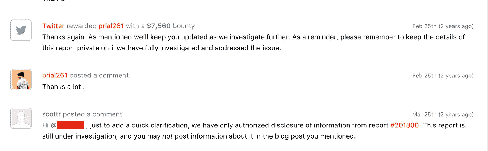

# Vine 用户的隐私信息泄露

> 原文：<https://infosecwriteups.com/vine-users-private-information-disclosure-f1c55a3abbb6?source=collection_archive---------1----------------------->

**你好**读者们，

这是来自孟加拉国的安全研究员 [**Prial Islam**](https://www.facebook.com/prial261) 。这是我的一个老发现，添加到我的博客中。

今天我将写一个关键的 **IDOR** 漏洞，它将导致**信息泄露**允许我获取任何 Vine 用户的敏感信息，包括 **Ip 地址/电话号码/电子邮件**。

我在 Hackerone 的 [bug 赏金计划中向 Twitter 安全团队报告了这个 Bug，他们奖励了我一笔 **7560 美元**的报告](https://hackerone.com/twitter/)。

$$$$ +博客帖子权限😾 😇

Vine 已经在他们的 [Vine 博客上发表了一份关于这个漏洞的声明，Hackerone 也在 hacker one](https://medium.com/@vine/47385e44ac2)[zero daily newsletter](https://www.hackerone.com/zerodaily/2017-07-11)上提到了这个漏洞。

*   **易受攻击的端点**:-https://vine.co/api/users/profiles/<用户 Id >

当我在测试 vine domains 的一些有趣的东西时。我注意到端点什么响应给我的帐户所有信息。我认为这是正常的，因为许多网站都有这种显示登录用户信息的端点。因此，我再次认为，如果配置错误，让我们尝试使用 **CORS** 来利用这一点。但是 CORS 的政策很到位。然后，我将**用户 id** 的值改为一个随机数，我震惊地发现，别人的用户信息就在我面前。通过更改 **user-id** 值，我能够获得任何 vine 用户的所有信息。

# 再现:

*   选择任意一个用户获取他的所有信息并收集他的**用户 ID**
*   现在将**用户 ID** 放入下面的端点并访问它。你会得到身体上的回应。

**https://vine.co/api/users/profiles/<用户 Id>**

**回应:**

> *{"code ":"，" data ":{ " follower count ":16271364，" includePromoted": 1，" captchasucceed ":0，" recordComment": null，" locale": "iUS "，" share URL ":"https://vine.co/████████"，" hiddenPhoneNumber": 0，" notPorn": 0，" userId": █████████，" private": 0，" likeCount": null，" commentCount": null，" platforms": ["android "，" ios"]，" postCount": null，" profilebackground ":" 0x 33 CBF "，" suspended ":暂停 jpg？version id = jijnvxtkbwpjvk 7 glyzixdqt 187 couhr "，" authoredPostCount": 598，" review _ result _ illegal _ review ":0，" review": null，" suspendedBy": null，" twitterId": ████████，" phoneNumber": "██████████"，" location ":"洛杉矶加州"，" notifyActivity": 1，" facebookConnected": 1，" explicitContentAdmin": 0，" statsTags": null，" hiddenEmail": 0，" unflaggable": 0，" username:" " " hidden witter ":0，" vineVerified": 1，" notifyMessages": 1，" needsPhoneVerification": 0，" repostCount": null，" twitterScreenname": "██████"，" secondary color ":" 0x 33 CBF "，" twitterVerified": 1，" captchar required ":0，" edition": null，" acceptsoutofnetworkconversations ":1，" disableAddressBook": 1，" description ":" insta gram/Twitter/shots/snapchat-@███用于预订去图书馆"，" escStrikeCount": 0，" review_result_explicit": 0，" notificationslastviewed*

仔细看看回复，你会得到用户**的大量私人信息【所有信息都被 twitter 安全部门删除，因为这些信息属于其他用户】**。其中一些是:

> *"平台":["android "，" IOs "]
> " flaggedcount ":7579
> " Twitter id ": "█████████"
> " phone number ":"█████"
> "位置":"洛杉矶加州"
> "修改":" 2017–01–29t 01:24:00.000000 "
> " notificationslastviewed ":" 2016–04–26t 21:03:30*

这里甚至**IP 地址/电子邮件/电话号码**都被披露。因此攻击者可以使用这些信息对任何 vine 用户进行恶意攻击。攻击者可以转储所有用户信息。

这也将影响 twitter 用户，因为 vine 用户可以使用他们的 twitter 帐户登录 vine 服务。我在另一个 bug bounty 程序 Edmodo 的网站上也有同样的漏洞。

感谢阅读。狩猎愉快。