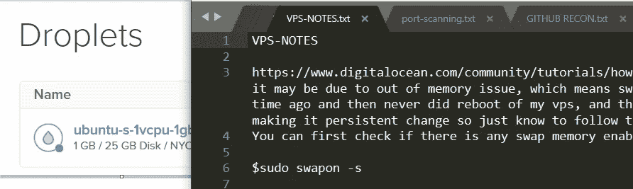

# 用于 bug 搜索的 VPS 备忘单

> 原文：<https://infosecwriteups.com/vps-cheatsheet-for-bug-hunting-bf0a5fe08ef4?source=collection_archive---------2----------------------->

我发现自己太多次忘记了某些命令，或者如何执行与 bug 搜索相关的特定操作。

解决方案:制作一个所有有用命令的备忘单。

我想，你可能会发现它很有用，或者你可能已经把它们都背熟了，这样的话，对你有好处。不管怎样，有一些关于作弊的个人笔记可以让你了解我的思维方式。无论好坏:)

**交换空间(对 msfconsole 有用):**

[https://www . digital ocean . com/community/tutorials/how-to-add-swap-space-on-Ubuntu-18-04](https://www.digitalocean.com/community/tutorials/how-to-add-swap-space-on-ubuntu-18-04)—对于被终止的进程，这可能是由于内存不足的问题，这意味着交换内存不存在，我实际上在一段时间前将它用于 metasploit，然后从未重新启动我的 vps，然后我删除了交换文件，我对进行持久的更改并不感兴趣，所以只要知道如果/当重新启动时遵循上面的内容，这里

您可以首先检查是否启用了任何交换内存。

`$sudo swapon -s`

如果它是空的，这意味着您没有启用任何交换。要添加 1GB 交换空间，请执行以下操作:

`$sudo dd if=/dev/zero of=/swapfile bs=1024 count=1024k`

`$sudo mkswap /swapfile`

`$sudo swapon /swapfile`

将下面一行添加到 fstab 中，使交换永久化。

//不确定现在是否要做，就在上面

`$sudo vim /etc/fstab`

`/swapfile none swap sw 0 0`

**RAM 清除(在无法启动时有用):**

[https://www . tecmint . com/clear-ram-memory-cache-buffer-and-swap-space-on-Linux/](https://www.tecmint.com/clear-ram-memory-cache-buffer-and-swap-space-on-linux/)—

对于不想启动的进程，可能是因为需要清除 ram，有三种方法，1 是简单的，2 是高级的，3 显然最好不要乱用以防万一，下面是快速命令[作为 root]:

`sync; echo 1 > /proc/sys/vm/drop_caches`

**针对 nginx/网站/子域/等。:**

[https://server fault . com/questions/424452/nginx-enable-site-command](https://serverfault.com/questions/424452/nginx-enable-site-command)

 [## 如何在 Ubuntu 18.04 | DigitalOcean 中为 Nginx 创建自签名 SSL 证书

### TLS，即传输层安全性，以及它的前身 SSL，即安全套接字层，都是 web 协议…

www.digitalocean.com](https://www.digitalocean.com/community/tutorials/how-to-create-a-self-signed-ssl-certificate-for-nginx-in-ubuntu-18-04) 

**nmap 和相关端口:**

因为当我忘记在 screen 中启动 nmap 或其他长时间运行的 cmd 时，这是如何强制它进入 screen 会话的:

[https://twitter.com/hakluke/status/1149209144416583680](https://twitter.com/hakluke/status/1149209144416583680)

要打开端口:

`ufw allow 1234/tcp`

**空间管理:**

对于 docker(当我空间不够时，可能是 docker):

[https://docs.docker.com/config/pruning/](https://docs.docker.com/config/pruning/)

清空文件以节省空间:

`echo * | xargs -n1 cp /dev/null` //用于 ffuf 输出、massdns 等。

**DNS 素材(ssrf 相关，DNS 重新绑定):**

禁用并停止 systemd 解析的服务:

`sudo systemctl disable systemd-resolved.service`

`sudo systemctl stop systemd-resolved.`

重新启动:

`systemctl restart systemd-resolved`

DNS 缓存刷新:

`systemd-resolve` —统计

`systemd-resolve` —刷新缓存

对于 dns 绑定配置(当我发现需要再次进入 DNS 时):

[https://www . digital ocean . com/community/tutorials/how-to-configure-bind-as-a-private-network-DNS-server-on-Ubuntu-18-04](https://www.digitalocean.com/community/tutorials/how-to-configure-bind-as-a-private-network-dns-server-on-ubuntu-18-04)

对于 tcpdump OOB DNS:

`tcpdump -n port 53 --immediate-mode -l | grep "myserver.tk"`

一个好一点的，特别是日志，所以不用担心屏幕和缓冲区:

`tcpdump -n port 53 --immediate-mode -l >> logtcp.txt & tail -f logtcp.txt | grep "myserver.tk"`

**ffuf 相关:**

对于 ffuf 输出信号:

`cut -d',' -f2,5,6 *csv | grep ',200,' |more`

对于按数字排序(基本上是帮助用 ffuf 和 cut 从非 fp-s 中找出 fp-s):

`sort -nk3 -t','`

对于删除匹配对的 uniq 排序(如果两个字符串相同，则与 sort -u 不同):

`sort input.txt | uniq -u > output.txt`

**对于 pip3:**

`python3 -m pip install some_module`(如果 pip3 install some_module 不工作)

**对于 bash 脚本**(不是真正的 vps 特定的，只是认为放在这里有意义):

 [## 如何使用 while 循环读取两个输入文件

### 如果你确定某个字符不会出现在第一个文件中，那么你可以使用粘贴。

unix.stackexchange.com](https://unix.stackexchange.com/questions/26601/how-to-read-from-two-input-files-using-while-loop) 

给你。请随意将它加入书签，或者拷贝到某个地方，添加内容等等。