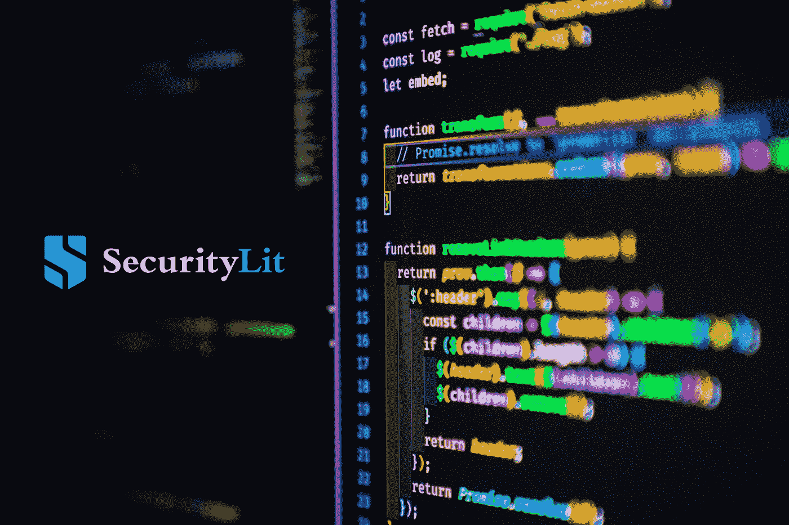
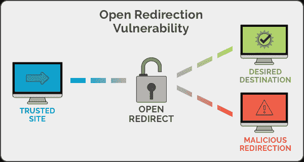
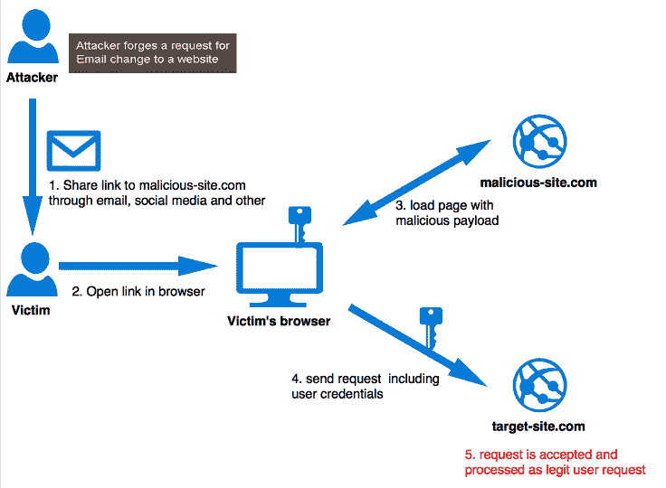

# 基于 JS 的应用程序中的漏洞

> 原文：<https://infosecwriteups.com/vulnerabilities-in-js-based-applications-397e0dc90124?source=collection_archive---------0----------------------->

琼·加梅尔在 [Unsplash](https://unsplash.com/s/photos/javascript?utm_source=unsplash&utm_medium=referral&utm_content=creditCopyText) 上的照片

**简介**

如今，开发人员越来越倾向于用 JavaScript 编写框架。当我们在为客户执行渗透测试的过程中前进时，我们会遇到大量基于 JS 的应用程序。由于 next.js、vue.js 和其他类似的东西具有针对漏洞的某些内置保护措施，相当多的 web3 开发者现在采用这些技术，以便更轻松地设计他们的网站。

由于各种原因，预计这一趋势在未来几年将会加剧。最常见的原因是它们内置了一些安全保护。例如，如果你考虑 Django，它在默认情况下对一些攻击免疫，如 CSRF 和 SQL 注入，因为他们通常有视图状态参数来对抗 CSRF 漏洞。如果你考虑基于 JavaScript 的框架，比如 React、VueJS、NextJS、NuxtJS 等等。他们内置了 XSS 投影。所以，除非你故意让它变得脆弱，否则你不会遇到 XSS(在大多数情况下)。

但是，XSS、CSRF、SQL 注入只是使应用程序易受攻击的几种攻击。仍然有很多易受攻击的漏洞。

在这篇博文中，我们将讨论一些你可以在基于 JS 的框架中发现的漏洞。

# **文件上传旁路**

当您能够绕过应用程序在上传文件时应用的限制时，就会出现上传绕过漏洞。

这些类型的文件上传漏洞会给组织带来很多威胁。它还能够将攻击传递到后端系统、客户端攻击、简单的破坏以及过载的文件系统或数据库。这取决于应用程序在文件上传后如何处理它，尤其是它将文件存储在哪里。

仅在客户端应用黑名单仍然非常普遍。这些应用程序大多只允许你上传一个. png。jpg 或. gif 文件。

但是您可以尝试上传一个恶意的 SVG 文件或任何其他文件来证明客户端的限制很容易被绕过。你也可以把一个恶意的负载放在一个 SVG 文件中，然后上传它。这些上传的 SVG 文件可用于许多不同的攻击，例如执行 XSS，将用户重定向到不同的网站，或者危害用户的 cookies(如果它们的范围是存储文件的子域)。

# **打开重定向**

[来源](https://spanning.com/blog/open-redirection-vulnerability-web-based-application-security-part-1/)

另一个常见的漏洞是开放重定向。当应用程序允许用户操作重定向或转发到不同的 URL 时，该应用程序就被称为存在开放重定向漏洞。如果应用程序不验证来自不受信任用户的输入，恶意用户可能会提供一个 URL，将不知情的受害者从真正的域引导到恶意用户控制的网络钓鱼站点。

例如，【https://login.company.com/login.aspx?】T4_ redirect = https://attack . XYZ

因此，在上面的 URL 中，攻击者可以很容易地操纵重定向参数，如果应用程序没有正确验证这一点，用户将被重定向到恶意域。

因此，一旦用户登录到应用程序，用户通常应该被重定向到开发人员指定的同一个域或不同的域，但由于我们已经将 _redirect 参数修改为 [https://attacker.xyz](https://attacker.xyz) ，受害者将被重定向到 [https://attacker.xyz](https://attacker.xyz) 。攻击者可以在他的站点上托管恶意软件，甚至是一个钓鱼页面，让用户暴露其凭据。

# **授权失败**

这种类型的错误在任何应用程序中都很常见。当用户能够访问或修改默认情况下他/她不能访问的资源时，就会出现授权问题。

因为在所有端点实现授权检查有些困难，所以执行授权测试可能非常有利可图，应该尽可能地进行。在许多情况下，授权失败的严重性要高于 XSS 漏洞。这些授权缺陷会导致对敏感信息的未授权访问、对属于其他用户的信息的修改以及对属于这些个人的信息的访问。

您可以手动检查授权和权限提升问题，也可以使用 Autorize 自动检查。Autorize 是一个 BurpSuite 扩展，它帮助您自动处理权限提升和授权问题。

# **认证旁路**

无论是单因素还是多因素身份认证，如果实施不当，都可能被绕过。这可能导致完全绕过登录屏幕。这可能是由于 SQL 注入、NoSQL 注入、XPATH 注入。

通常，当实现 2FA 时，您可以在输入有效密码后完全绕过它，只需打开一个不同的端点。这可能是由于会话混乱或简单的逻辑缺陷绕过造成的。

例如，您知道一旦您输入了密码和端点，网站就会将您带到/dashboard 端点。你可以核实这个信息。

您可以做的是，在输入密码后，当应用程序将您重定向到/otp 端点以输入 otp 时，您可以改为拦截请求并将端点更改为/dashboard。这可以通过将浏览器地址栏中的端点更改为/dashboard 来实现。

# **跨站点请求伪造(CSRF)**

[来源](https://medium.com/@ashifm4/protection-from-cross-site-request-forgery-csrf-9cf4f542e268)

跨站点请求伪造(CSRF)是一种客户端技术，用于攻击 web 应用程序的其他用户。这是一个漏洞，允许攻击者诱导用户执行他们不打算执行的操作。因为应用程序已经将 cookies 附加到发送到网站的请求中，所以攻击者可以利用这种情况的权限。这种攻击只需要一种简单的社会工程技术来实施攻击。

默认情况下，CSRF 攻击不会对 Django 框架起作用，但是基于 JavaScript 的框架仍然需要实现这个功能。因此，当特权或非特权用户执行任何功能时，CSRF 令牌丢失是很常见的。现在很多网站都有相同的站点 cookie 属性，默认情况下不会让 CSRF 攻击发生。

# **结论**

在博客的这篇文章中，我们讨论了在评估基于 JavaScript 的框架时应该注意的一些漏洞。除此之外，您还可以检查 OAuth 问题、信息泄漏、XXE 攻击和请求走私攻击。

即使这些能抵抗 XSS 有效载荷，确保没有也没什么坏处。我们经常在不同个人的用户面板上看到自我反映 XSS 的例子。因此，我们总是建议在网站上进行 VAPT，然后再把它们放到网上。