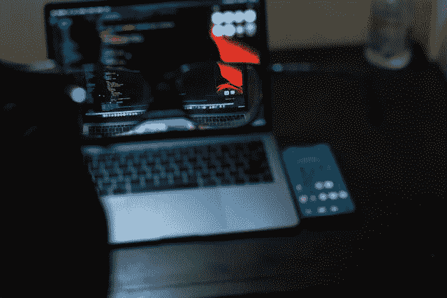
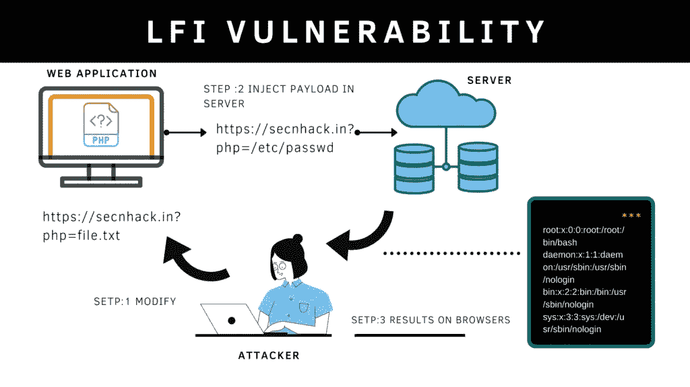
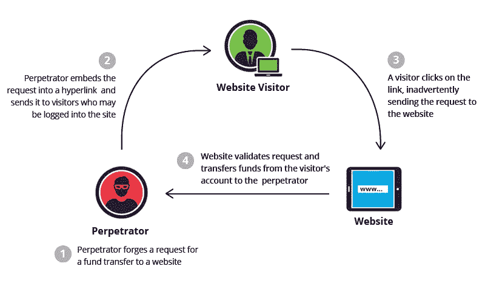
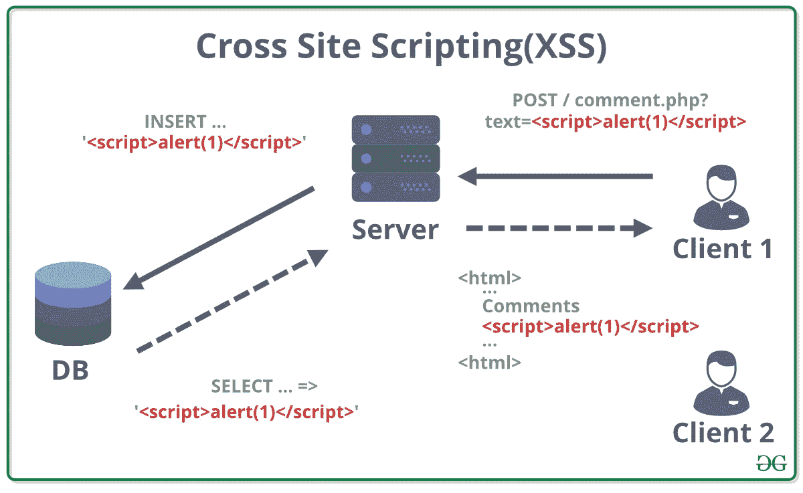

# 基于 PHP 的应用程序中的漏洞

> 原文：<https://infosecwriteups.com/vulnerabilities-in-php-based-applications-fb6224865d43?source=collection_archive---------0----------------------->



照片由 [Shamsudeen Adedokun](https://unsplash.com/@shams_ad?utm_source=unsplash&utm_medium=referral&utm_content=creditCopyText) 在 [Unsplash](https://unsplash.com/@shams_ad?utm_source=unsplash&utm_medium=referral&utm_content=creditCopyText) 上拍摄

# **简介**

到目前为止，PHP 是构建 web 应用时最常用的语言之一，其他语言有 JS、go 和 Ruby。PHP 无处不在，以至于像 WordPress 和 Joomla 这样的内容管理系统都是专门基于 PHP 构建的。

多年来，PHP 中已经发现了几个漏洞，PHP 开发团队已经发布了许多更新来纠正这些问题。

在这篇博客文章中，我们将讨论你在处理 PHP 应用程序时可能遇到的漏洞。一些漏洞是 PHP 特有的，而另一些则是普遍存在的。

# **类型杂耍**

你认为下面这行代码的结果会是什么？

```
if("7 hashes" == 7)
```

如果你说**正确**，恭喜你是对的。但是不应该是假的吗？它们不仅不同，而且数据类型也不同。现在让我们来看看怎么做。

在比较不同类型的值之前，PHP 将它们转换为单一的可比较类型。在上面的例子中，PHP 将尝试从字符串 **(7 个散列)**中提取整数 **7** ，然后将其与整数 7 进行比较，从而给出一个 **True** 值。

鉴于不同的语言如何提供严格的比较，这乍一看似乎很奇怪。类型欺骗会导致身份验证和业务逻辑绕过漏洞。

例如，看看这段代码

```
if ($_POST["password"] == "AdminIsHere")
{
    admin_login();
}
```

如果您提供一个整数，如 **0** ，您将作为**管理员**登录

然后，只需提交一个 0 的整数输入就可以成功地以管理员身份登录，因为这将计算为真:

```
(0 == "AdminIsHere") -> True
```

**缓解**:

您应该使用三重等号(===)而不是双等号(==)，因为它将检查值以及操作数的类型是否相等。

# **空字节注入**

在 PHP 5 . 3 . 4 及更高版本中，空字节已得到修复。但是如果你遇到一个建立在 PHP 版本< 5.3.4 上的应用程序，检查一下空字节注入是值得的。*除了 PHP，空字节注入在 c 语言中也是可能的*

空字节简单来说就是指 **0x00(十六进制)**，**% 00(URL 编码)**。

PHP 会忽略空字节之后的任何内容。这有什么用？我们举个例子。

假设有一个应用要求你上传头像。头像需要有扩展名。要上传的 png。测试是否可以上传反向 shell 的最简单方法是使用 PHP 创建一个反向 shell，并将其重命名为 **reverseshell.php%00.png** 。

只要文件以 long 扩展名结尾，它就会被客户端上载，这将允许它逃避各种安全检查，因为。png 扩展名。但是，在解析它时，跟在%00 后面的部分将被省略，因为它是空字节。通俗地说，空字节被视为一个信号，表示一个进程的结束。因此，它将被服务器解释为 PHP 脚本，并被执行。结果会上传外壳，这将允许您在服务器上执行它，从而破坏它。

**缓解**

将您的 PHP 更新到高于或等于 5.3.4 的版本，并在处理用户输入之前对其进行清理。

# **信息披露和差错处理问题**

对于开发人员来说，在处理项目时忘记打开调试器模式是很常见的。这可能会导致完整路径的泄露，其中可能包含机密密钥、硬编码的凭据或注释等。

将意外值传递给程序可能会导致发生错误，这可能会导致堆栈跟踪或其他内部信息从应用程序中泄漏。通常，它还会显示错误发生的源代码行的上下两行。考虑当您在网站的用户名或密码字段中输入引号(')时，SQL 查询显示的错误消息。

攻击者可以使用这些信息对应用程序做出有根据的假设，这可能使他更容易侵入系统。然而，这不仅适用于基于 PHP 的应用程序，也适用于用其他编程语言编写的程序。这可用于揭示完整路径、SQL 查询中的错误，从而揭示完整查询等。

**缓解措施**

关闭代码中的调试器模式，执行源代码审查，并测试哪些参数可能导致错误。如果出现错误，请确保将用户重定向到 404 页面，并确保执行正确的错误处理。

# **危险功能的使用**

假设您正在构建一个计算器。您可以考虑使用 **exec()** 函数，而不是为每个操作编写复杂的逻辑，这可能会使代码变得很长。

这似乎是一个救命的功能，但实际上，它会损害应用程序的完整性。像 **exec()** 、 **system()** 这样的函数，通过使用 PHP 来执行系统/操作系统命令。

这可能导致在系统上执行任意代码和远程代码。

**缓解**

**移除 exec()、system()、passthru()等函数。**如果有必要保留这些函数，请确保使用 escapeshellarg()或 escapeshellcmd()来确保用户无法诱骗系统执行任意命令。

# **加密技术的不安全使用**

加密库和插件用于签署会话密钥、cookies、加密敏感数据、生成密码和数据的散列。不建议使用安全加密方案。要么遵循您公司的策略，使用 **SHA256/SHA512** 进行哈希处理(也考虑使用 salts 来增加复杂性)，使用 AES256 进行加密。**还要确保种子短语 IV 加密密钥不是硬编码的**。如果泄露，任何恶意用户都可以冒充任何其他用户，包括管理员帐户，并解密敏感信息。

**注意存储加密密钥的目录/文件**。如果框架或库有一个默认名称，如果可能的话，请尝试重命名它。这将确保即使用户能够找到目录遍历漏洞，他也不能轻易猜出文件/文件夹的名称。总是建议对密码进行哈希运算，而不是加密。所有的 PII 信息必须通过加密存储，密钥必须存储在一个安全的地方；大多数组织使用密钥管理器来管理这些密钥。

**缓解**

使用 mcrypt 库/包来实现加密方案。避免使用硬编码值作为加密方案的密钥和 IV。

# **文件包含**



[来源](https://secnhack.in/local-file-inclusion-lfi-types-mitigation-and-exploit/)

应用程序从本地或远程位置读取文件是很常见的。但是当用户能够本地或远程读取任何文件时，这被称为文件包含漏洞。当应用程序使用用户可控制的参数从服务器获取文件时，会出现此漏洞，因此用户将能够操纵文件路径并从服务器读取敏感文件。如果恶意参与者能够从服务器本身读取文件，则称为本地文件包含，但如果他能够从远程源读取文件，则称为远程文件包含。详细的博文可以参考这篇[文章](https://securitylit.medium.com/everything-about-path-traversal-vulnerability-9658dd4191ee?source=user_profile---------23-------------------------------)。

**缓解**

不要简单地将用户输入传递给 includes()函数。对用户的输入进行验证。您还可以维护用户可以访问的文件的白名单。

# **会话劫持**

会话是分配给每个用户的一次性标识符。它有助于区分每个用户，以维护用户会话的状态(验证他们是否登录)和每个用户角色。当恶意参与者能够控制用户的会话 cookie 并使用它来冒充网络上的其他用户时，就会发生会话劫持。大多数情况下，当用户登录后应用程序没有生成新的会话 cookie 时，就会出现这种情况。如果应用程序创建的会话密钥的熵值很低并且很容易被猜到，它也可能会遇到这个问题。在这种情况下，攻击者可以轻易猜出会话令牌，并使用它来访问帐户。

缓解措施:

1.  确保所有与会话相关的重要 cookies 都设置了 http 标志。
2.  确保在用户从服务器端注销后删除会话 cookie。
3.  确保生成的会话令牌应该具有高熵并且不容易被猜测。

# **CSRF**



[来源](https://www.imperva.com/learn/application-security/csrf-cross-site-request-forgery/)

**CSRF 代表跨站点请求伪造**。*跨站点请求伪造(CSRF)是一个漏洞，允许攻击者欺骗用户执行他们不想完成的操作*。他们将收到一封带有链接的电子邮件，在他们点击该链接后，将向服务器发出请求，根据具体情况，请求可能是更改电子邮件地址或任何其他信息。黑客可以利用该漏洞部分规避同源策略，该策略旨在阻止各种网站之间的交互。在 CSRF 攻击中，恶意用户可以在受害者不知情的情况下让受害者发出命令。这可能会导致用户帐户的删除、资金转移、自动注销，以及用户可以引入的几乎任何操作。

**缓解**

使用名为 CSRF 令牌的唯一令牌。对于用户发出的每个请求，还会发送一个 CSRF 令牌。攻击者不知道受害者的 CSRF 令牌，因此所有请求都将被视为无效。

# **XSS**



[来源](https://www.geeksforgeeks.org/how-to-prevent-xss-with-html-php/)

XSS 代表跨站脚本。当应用程序接受用户输入，但不对用户输入执行任何类型的清理时，就会出现此漏洞，因此浏览器会认为源代码是应用程序的一部分，并最终执行它。XSS 会导致严重的漏洞，例如窃取 cookies、将用户重定向到不同的网站等等。这可能导致页面变形、会话劫持、帐户接管等。

定制的应用程序最容易受到跨站点脚本攻击。

**缓解**

对用户的任何输入进行输入净化和验证。

# **SQL 注入**

应用程序使用数据库来存储用户信息，如他们的登录名和密码，以及其他信息，如用户的个人资料图像等。SQL 是大多数基于 PHP 的应用程序使用的最流行的数据库类型；然而，NoSQL 数据库正迅速受到欢迎。

当用户提供的输入直接传递到 SQL 查询中时，就存在 SQL 注入漏洞。因此，攻击者可以将任意 SQL 查询注入 SQL 数据库，从而允许他们转储存储在 SQL 数据库中的所有数据。这些信息可能包括各种项目，如用户密码哈希、个人身份信息(PII)等等。关于 SQL 攻击更详细的描述和类型，可以参考这篇[文章](https://securitylit.medium.com/a-definitive-guide-to-sql-injection-8d8932e51816)。

**缓解**

在将用户输入传递给 SQL 查询之前，必须对所有用户输入执行用户输入清理

# **结论**

尽管开发人员越来越多地转向其他语言，如 JS、Go 和 Ruby，但仍然有大量的应用程序正在开发，而且已经用 PHP 开发了。这篇博文包含了许多在基于 PHP 的应用程序中相对常见的漏洞，并对它们进行了详细的讨论。我们从一些最关键的漏洞开始，逐步深入到更普遍的漏洞。