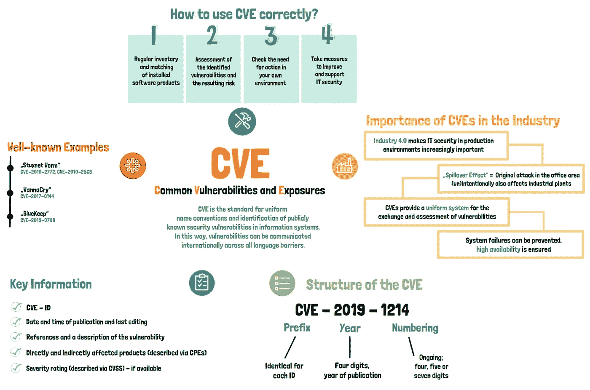

# 动摇互联网的漏洞

> 原文：<https://infosecwriteups.com/vulnerabilities-that-shook-the-internet-4cb82a22d3ff?source=collection_archive---------1----------------------->


来自 Pexels 的马体·米罗什尼琴科的照片

# **简介**

每个月的每一天都会报告大量的安全漏洞，其中许多会对您的应用程序、网站和网络基础设施造成严重后果，其中许多会导致远程代码执行，例如 log4j 漏洞。在这篇博文中，我们将讨论一些在公司中经常被滥用的漏洞，如果被成功利用，这些漏洞有可能接管整个组织。如果您正在开发应用程序或为企业进行渗透测试，您可能会遇到这些漏洞之一。

# **什么是 CVE？**



[来源](https://www.ondeso.com/wp-content/uploads/2020/09/cve-summary-freebie-ondeso.pdf)

假设，研究人员能够在 2020 年、2021 年和 2022 年发现一些与应用程序 app1 相关的不同漏洞，这些应用程序可能是开源的，或者可能会影响许多不同的用户。你认为我将如何向你解释漏洞是什么，利用它们需要什么条件以及它们的利用代码(如果有的话)。我不能简单的说是 2020 年或者 2021 年发现的。那些年里发现了很多。这就是为什么我们有 CVE。

**CVEs 代表常见漏洞和暴露**。按照其通常的定义，“**是一系列公开披露的计算机安全缺陷**”它由 MITRE Corporation 维护，当我们提到 CVE 时，通常会将其与数字联系起来。

```
The format of a CVE is **CVE-YYYY-ID**
```

例如，如果在 1999 年总共发现了 4 个漏洞，我们可以将它们写成 CVE-1999–1，CVE-1999–2，CVE-1999–3，CVE-1999–4。只有那些有可能影响大量网站或互联网用户的漏洞才会被授予 CVE 编号。假设您正在向某个网站报告跨站点脚本(XSS ),并且 XSS 仅在该特定网站上执行。因此，这不能添加到 CVE；但是，如果你在 JavaScript 库中发现了一个被大量网站使用的 XSS，这个 XSS 会影响大量网站，将来需要足够的跟踪；因此，我们将给它一个 CVE 奖。

# **1。log4j 2021–44228**

Apache Log4j 是一个用 Java 编写的日志软件，由 Apache 软件基金会开发。它是用 Java 编写的，是一个可以在 Java 日志系统中找到的包。它包含在许多不同的 Java 日志框架中。已在 Java 日志记录包 log4j 中发现一个零日漏洞，该漏洞可能允许远程代码执行。

日志库通常将消息写到日志文件或数据库中。在将字符串写入日志文件之前，通常会对其进行处理。例如，指定为 **$variable** 的变量可以扩展为日期、时间或用户名。＄{ user . username }表达式可以通过使用诸如**log . info("＄{ user . username } not found ")**之类的表达式，用当前用户的实际用户名来更改。这类似于在 PowerShell 中使用$()来扩展和解析文本。

大多数网站通常会记录一些常见的标题，如用户代理或自定义标题，如 X-Forwarded-For 等。在某些情况下，应用程序会在日志中写入用户的信息，如电子邮件、他们的姓名等，以便进行日志跟踪，如果您在这些日志中添加了有效负载，也可能会被利用。

漏洞脚本已经在线提供，防止 log4jshell 的最简单方法是更新到 Log4j 2 . 16 . 0 或更高版本。

# **2。弹簧壳 CVE-2022–22965**

Spring Framework 的非正式名称是 Spring Framework，它是一个开源应用程序框架，为基于 Java 的 web 应用程序的开发提供基础设施支持。2022 年 3 月，该框架中的两个远程代码执行漏洞被发现。框架中称为“Spring Cloud Functions”的组件容易受到第一个漏洞的攻击，第一个漏洞会影响“Spring Core”中的一个组件，它也被称为框架的“心脏”。

对于易受此问题攻击的服务器来说，许多东西需要放在正确的位置。

例如，JDK 9+需要安装在服务器上，运行有漏洞的 Spring 框架版本，Apache Tomcat 作为服务器运行。**Spring 框架的易受攻击版本是 5.2、5.2.0 到 5.2.19 以及 5.3.0 到 5.3.17 之前的版本**

利用这个漏洞非常容易，而且漏洞代码也可以在网上找到。如果使用此框架创建的 web 应用程序以 root 或管理员身份运行，这可能会导致攻击者获得 web 服务器的管理权限。

# **3。LFI 和 RCE 在阿帕奇 CVE-2021–41773 和 CVE-2021–42013**

2021 年发布的 Apache 2 . 4 . 49 版易受本地文件包含漏洞的攻击，这可能导致远程代码执行。它被指定为 CVE 编号 2021–41773，该公司很快在最近的版本 2.4.50 中发布了一个补丁。然而，人们发现，更新版本也容易受到同样的弱点，所有用户必须做的是编码他的有效载荷两次，以规避这一问题。这被指定为 CVE 编号 2021–42013。他们很快推出了另一个更新，幸运的是包含了对这些漏洞的修复。

由于大量的 web 应用程序使用 Apache，这些漏洞被攻击者广泛利用。该漏洞可以在互联网上找到。

补救措施是将其更新到 2.4.51

# **4。Windows 后台打印程序远程代码执行漏洞 CVE-2021–34527**

这是过去和现在都被攻击者严重利用的漏洞之一。

在计算中，打印机假脱机程序是一个简单的程序，它管理从计算机发送到打印机或打印服务器的纸张打印任务。启用打印队列或缓冲区，可以在其中存储多个打印作业，直到它们被打印机或打印服务器检索到。

当大量打印作业被提供给单个打印机时，使用打印机假脱机程序。众所周知，计算机打印机在打印时速度很慢，因此其他打印作业被放在缓冲区或打印队列中以节省时间。当打印机准备好下一个作业或文档时，它会从打印队列中获取任何未完成的打印作业，并一次打印一个作业，直到所有文档都打印完毕。

事实证明，攻击者可以使用 Print Spooler 在系统上执行特权命令。当 Windows 后台打印程序服务不正确地执行特权文件操作时，会出现这种情况。攻击者可以利用此漏洞安装程序、查看、更改或删除数据，甚至创建具有完全管理员/系统权限的新帐户。

自从它的漏洞利用代码公开以来，它的漏洞利用呈指数级增长。

确保您的服务器安装了最新的补丁程序。

# **5。Microsoft Exchange Server 远程代码执行漏洞 CVE-2021–26855**

Microsoft Exchange Server 是一个邮件服务器，是微软的**电子邮件、日历、联系人、日程安排和协作平台。**它只能在 Windows Server 操作系统上运行。

这种攻击需要恶意用户建立到 Exchange server 端口 443 的不可信连接。如果攻击者能够让管理员打开恶意文件，也会触发这种情况。建议管理员在面向外部的 Windows 服务器上安装更新。

# **6。baigo CMS v 3.0-alpine-2 CVE-2022–26607**

Baigo 是一个用 PHP 编写的内容管理系统。在 Baigo CMS v3.0-alpine-2 中发现了一个远程代码执行漏洞，当恶意制作的 PHP 文件上载到 CMS 时，该漏洞允许无限制的文件上载。该漏洞的技术细节和易受攻击的功能目前还不清楚。

由于该漏洞目前未被利用，因此市场上存在对该漏洞的需求。截至这个[网页](https://vuldb.com/?kb.exploitprices)，其漏洞可能定价在 0 美元到 5000 美元之间。

# **结论**

在这篇博客文章中，我们讨论了互联网上一些最常见的服务和应用。讨论的所有漏洞都已经分配了一个 CVE，它们的漏洞利用都可以在网上找到，只有 Baigo 例外，由于漏洞利用处于保密状态，它尚未公开披露。除了这些，我们将在后续的博客中了解列表中的其他内容。