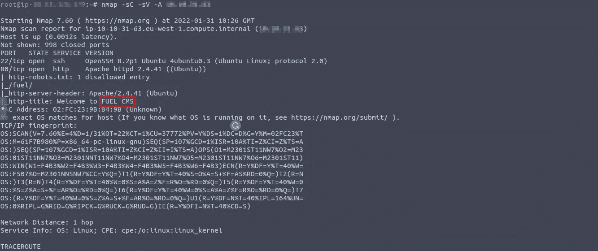
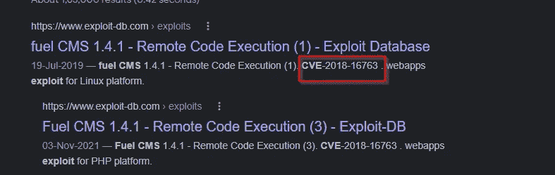
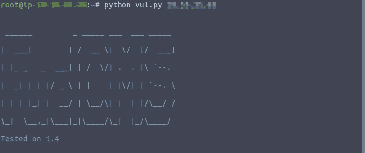
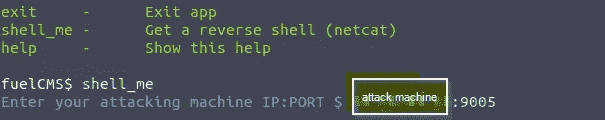
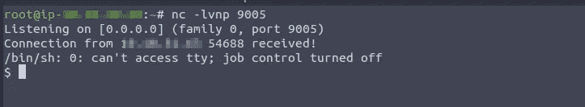
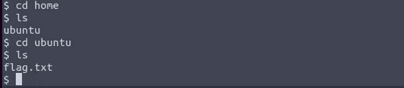

# 漏洞顶点— Tryhackme

> 原文：<https://infosecwriteups.com/vulnerability-capstone-tryhackme-b0e520720dcf?source=collection_archive---------0----------------------->

## 脆弱性研究

欢迎回来，各位黑客，在这个博客中，我们将看到 Tryhackme 演练中的漏洞顶点，非常有趣。让我们进入演练。

在我得到有用的信息后，我首先扫描了我给定的目标。

在易受攻击的机器上运行的应用程序的名称是什么？

燃料 cms

该应用程序的版本号是多少？

1.4

允许攻击者在此应用程序上远程执行代码的 CVE 的编号是多少？

**形式:** CVE-XXXX-XXXXX

**CVE**-2018–16763

下载漏洞并修改目标 IP 的 URL。

> searchsploit fuel cms 1.4

在终端中键入这个，显示远程代码执行信息，并且必须下载。

search sploit-m Linux/web apps/47138 . py 和这个命令在您的机器上下载漏洞。

在运行漏洞启动监听器并导航到主目录后，您得到了标志。

# 🔈 🔈Infosec Writeups 正在组织其首次虚拟会议和网络活动。如果你对信息安全感兴趣，这是最酷的地方，有 16 个令人难以置信的演讲者和 10 多个小时充满力量的讨论会议。[查看更多详情并在此注册。](https://iwcon.live/)

 [## IWCon2022 - Infosec 书面报告虚拟会议

### 与世界上最优秀的信息安全专家建立联系。了解网络安全专家如何取得成功。将新技能添加到您的…

iwcon.live](https://iwcon.live/)