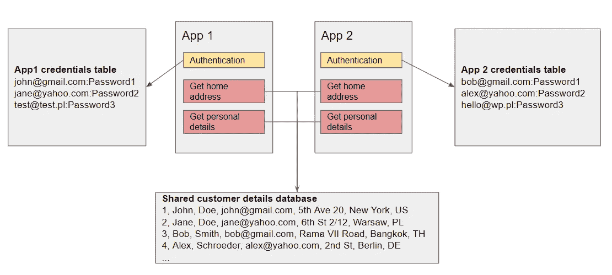
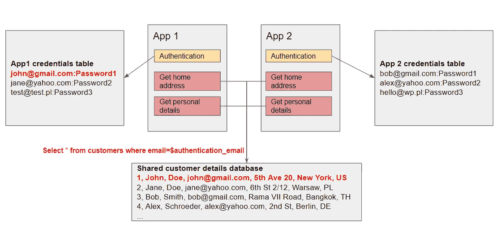
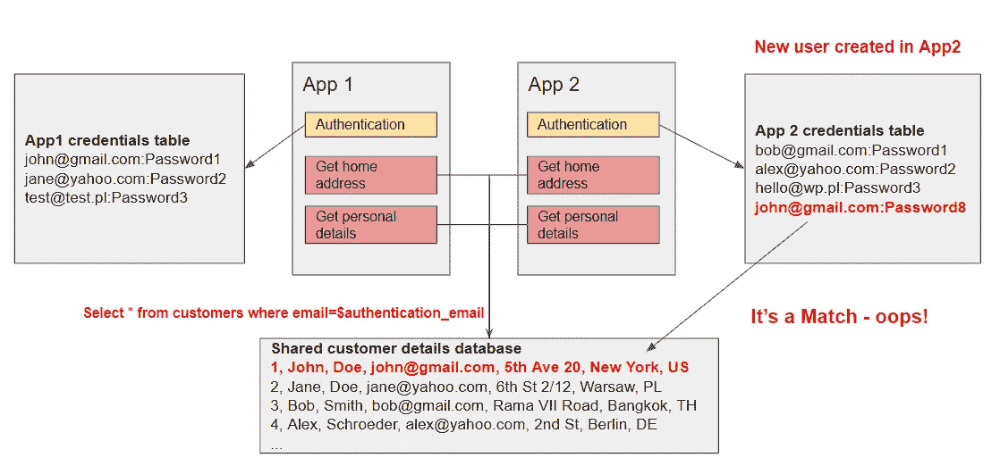

# 易受攻击的设计导致个人数据泄露——这是应用程序间漏洞的又一个例子…

> 原文：<https://infosecwriteups.com/vulnerable-design-leads-to-personal-data-leakage-yet-another-case-of-an-inter-application-8a9d7e2d0f1a?source=collection_archive---------1----------------------->

# 序

距离我发表第一篇关于现代 web 应用程序中应用程序间漏洞的文章已经有一段时间了。最近我在 bug 赏金猎人中发现了其中的一个，我个人认为它太好了，不应该与更广泛的社区分享。

如果你是 tl 之一；伙计们，我们在这里谈论的是由于应用程序的跨系统依赖和集成而存在的问题。长话短说——单独来看，两个应用程序都没有漏洞，但是当把它们看作一个整体时，您会有很大的安全隐患。

这种情况…

如果你想更多地了解这个概念，我鼓励你阅读我 2018 年的[文章。](https://medium.com/bugbountywriteup/inter-application-vulnerabilities-and-http-header-issues-23e961c55421)

# 背景

漏洞是在一家大型国际公司的漏洞奖励计划中发现的，出于保密原因，我不能透露细节。

公司的 bug bounty 计划的范围包括多个域(应用程序)，用于非常相似的目的。在测试这些应用时，你很容易注意到其中某些功能的代码是共享的。我这么说是什么意思？这两个应用程序似乎都查询了同一个后端数据源来获取一些关于用户的信息。

# 这不是问题，对吗？不对。

还有一个问题。在我们的案例中，共享的机制包括处理(读/写)敏感个人数据的机制，这些数据可以在成功注册后更新。然而，注册机制本身显然是分离的。

我试着在下图中想象我们的处境。

脆弱的设计

数据检索过程相对简单。如果身份验证成功，应用服务器将向后端数据源发送请求，根据身份验证期间提供的电子邮件地址查询个人数据。

易受攻击的设计—从数据库中查询数据

你可能已经知道它要去哪里。如果没有，试着猜猜如果有人使用已经在 App1 中注册的相同电子邮件地址在 App2 中注册会发生什么。

易受攻击的设计—访问其他用户的数据

哎呀！我们可以通过知道他的电子邮件地址来访问任何在数据库中注册的用户的个人数据！顺便说一下，既没有账户激活电子邮件，也没有任何其他机制来防止这种攻击。

想象一下这样一种情况:互联网上的电子邮件地址被随意泄露。我们可以简单地通过易受攻击的 App1 传输所有这些地址，如果幸运的话，我们将获得与其中一些地址相关的个人详细信息。然后，我们对 App2 再次进行同样的练习，收集更多的个人信息。不错吧。至少好到能拿到赏金。

# 摘要

建立安全的系统比发现系统中的漏洞要困难得多。如果您需要集成您无法真正影响的多个应用程序设计，构建会变得更加困难。祝建筑商和建筑师好运。我希望这篇文章能让您避免系统中的应用程序间漏洞。

*关注* [*Infosec 报道*](https://medium.com/bugbountywriteup) *获取更多此类精彩报道。*

 [## 信息安全报道

### 收集了世界上最好的黑客的文章，主题从 bug 奖金和 CTF 到 vulnhub…

medium.com](https://medium.com/bugbountywriteup)