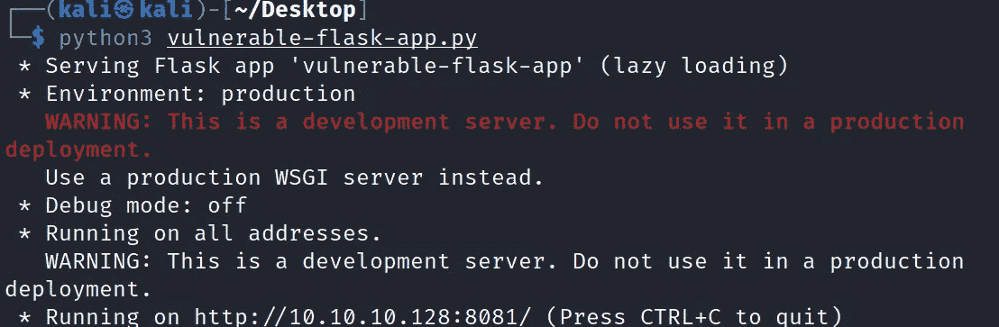

# 易受攻击的烧瓶应用

> 原文：<https://infosecwriteups.com/vulnerable-flask-app-881bcc960889?source=collection_archive---------4----------------------->

Erlik 2 —易损烧瓶应用程序

已测试— Kali 2022.1

 [## GitHub-Anil-yelken/Vulnerable-Flask-App:Erlik 2-Vulnerable-Flask-App

### erlik 2-Vulnerable-Flask-App Tested-Kali 2022.1 它是一个易受攻击的 Flask Web App。这是一个创建的实验室环境…

github.com](https://github.com/anil-yelken/Vulnerable-Flask-App) 

# 描述

这是一个易受攻击的 Flask Web 应用程序。这是一个为那些想在 web 渗透测试领域提高自己的人创建的实验室环境。

# 特征

它包含以下漏洞。

-HTML 注入

XSS

SSTI

-SQL 注入

-信息披露

-命令注入

蛮力

-反序列化

-身份验证被破坏

-DOS

-文件上传

# 装置

https://github.com/anil-yelken/Vulnerable-Flask-App

cd 漏洞-烧瓶-应用程序

sudo pip3 安装要求. txt

# 使用

python3 漏洞百出-flask-app.py

# 接触

https://twitter.com/anilyelken06

 [## 阿尼尔·耶尔肯培养基

### 阅读媒介上阿尼尔·耶尔肯的作品。彭斯特，威胁猎人，研究员 https://twitter.com/anilyelken06…

medium.com](https://medium.com/@anilyelken) 

## 来自 Infosec 的报道:Infosec 每天都有很多内容，很难跟上。[加入我们的每周时事通讯](https://weekly.infosecwriteups.com/)以 5 篇文章、4 个线程、3 个视频、2 个 Github Repos 和工具以及 1 个工作提醒的形式免费获取所有最新的 Infosec 趋势！