# 易受攻击的 Websocket 服务器

> 原文：<https://infosecwriteups.com/vulnerable-websocket-server-e44bee5e0b5f?source=collection_archive---------1----------------------->

在本文中，我们将讨论一些 websocket 漏洞。为了测试安全漏洞，需要在[github](https://github.com/Serhatcck/vulnsocket)(【https://github.com/Serhatcck/vulnsocket】T2)中安装 repo。

安装后，我们会在登录页面上看到它。

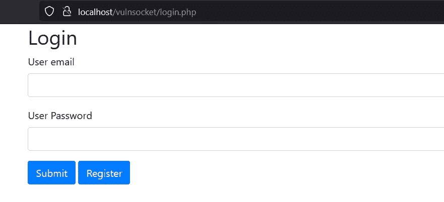

Vulnsocket 登录页面

我们必须在登录前创建一个用户。

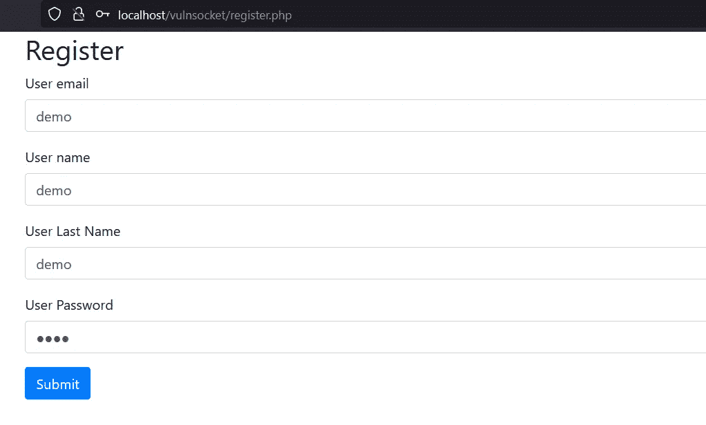

Vulnsocket 注册页面

注册后，我们被重定向到 index.php。我们在这个页面上看到两个不同的漏洞。

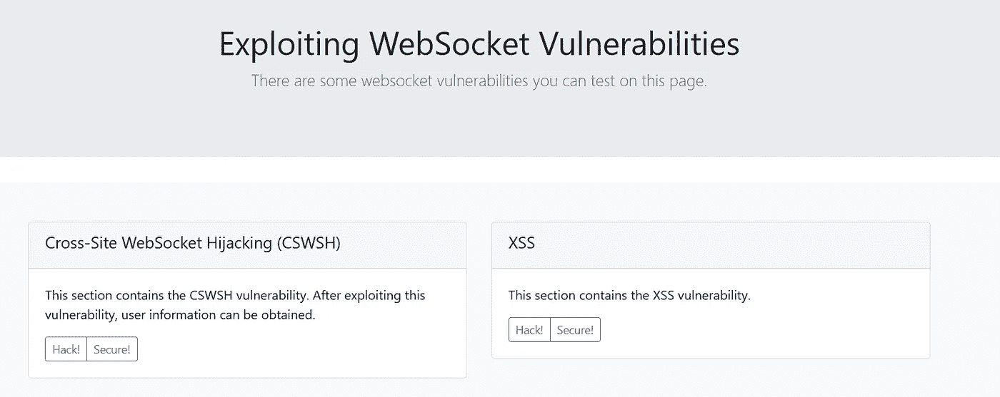

Vulnsocket 索引页面

# CSWSH

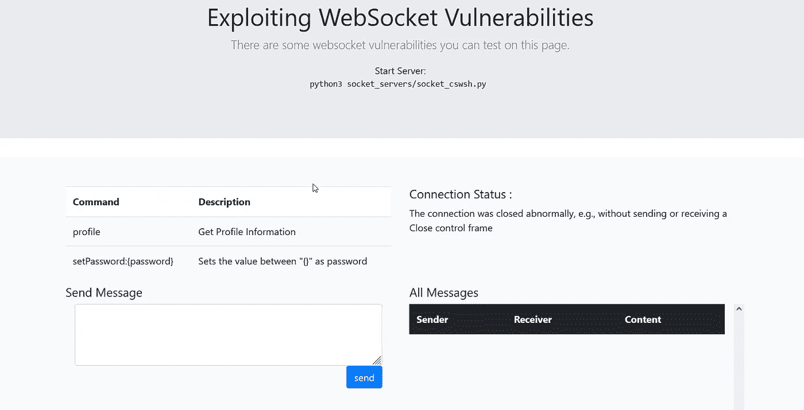

Vulnsocket CSWSH 页面

在这个页面上，我们可以看到一个简单的消息应用程序。我们正在用 python 启动 WebSocket 服务器。

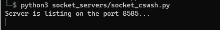

CSWSH 套接字服务器

当我们刷新页面时，我们看到连接状态已经改变。

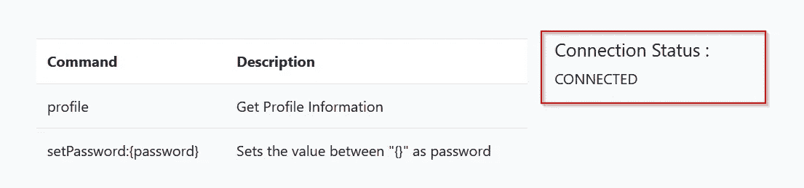

Vulnsocket CSWSH 页面

我们开始发信息。

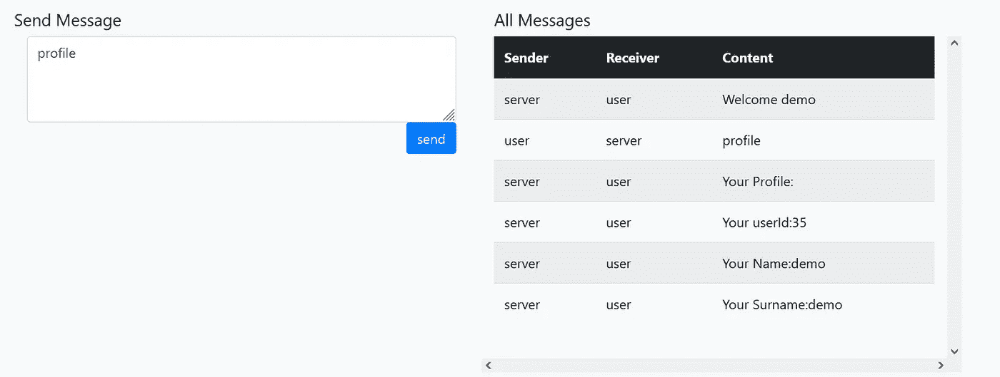

Vulnsocket CSWSH 页面

我们可以在 Burp Suite 上看到 websocket 连接请求

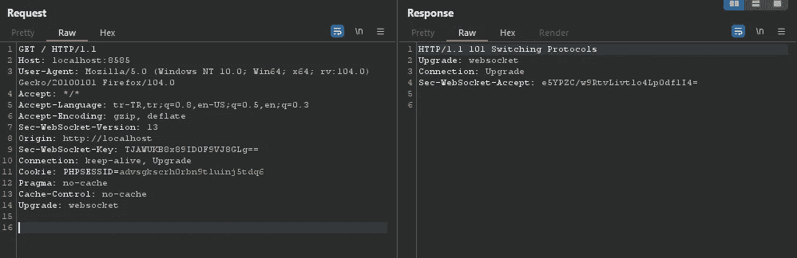

Burp 套件 Web 套接字请求

我们可以看到 websocket 消息。

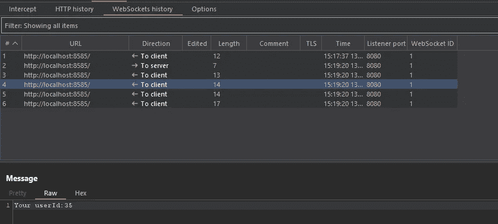

Burp 套件 Web 套接字消息

在上图看到的 websocket 连接请求中，我们看不到任何 csrf 令牌信息。这就是为什么我们开始尝试跨站点 Websocket 劫持漏洞。

为了利用跨站点 Websocket 劫持漏洞，有必要创建一个 HTML/JS poc。这个 HTML 页面应该向 websocket 服务器发送一个连接请求，并且能够提取配置文件信息。在提取配置文件信息后，它应该将配置文件信息发送给 Burp Collaborator。

我们需要测试上面的 HTML 页面是否有效。这就是我们访问这个页面的原因。

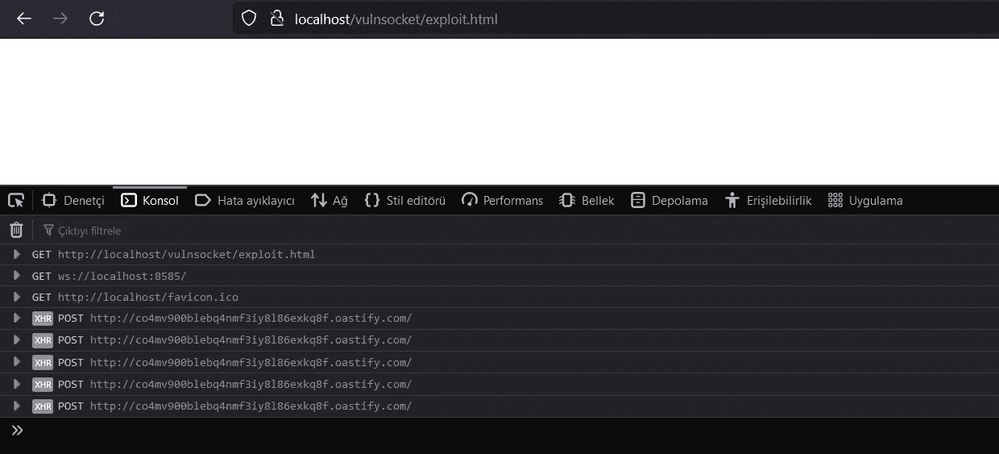

漏洞利用页面

Burp Suite Collaborator 客户端:

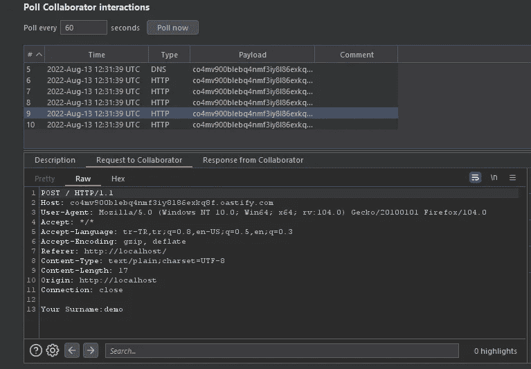

正如我们在上面的图片中所看到的，该页面运行成功。现在我们需要在管理员用户中运行这个页面。为此，我们需要运行 cswsh_exploit.py

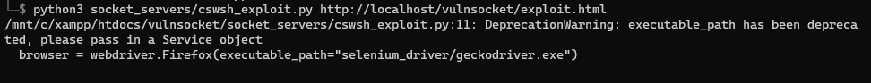

cswsh_exploit.py

Python 代码运行后，我们将看到管理员用户的信息被放入 Collaborator:

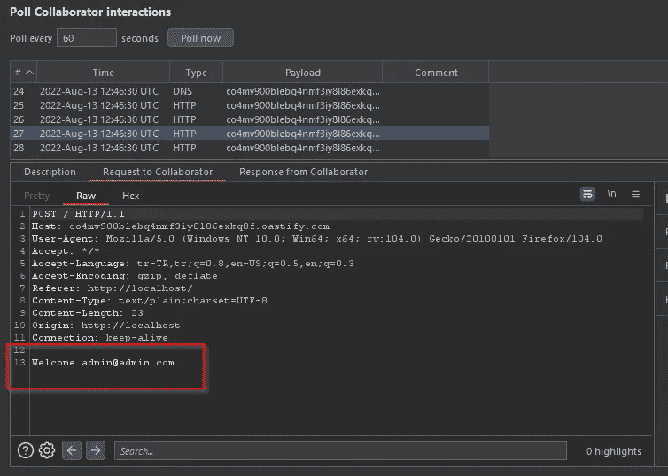

合作者客户

看到 admin 用户的信息后，我们需要做的就是修改 admin 用户的密码。

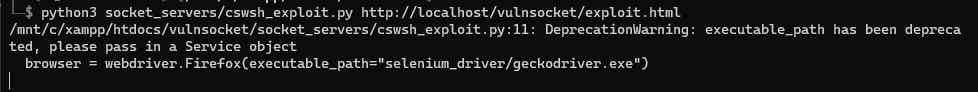

cswsh_exploit.py

Python 代码运行后，我们将看到管理员用户的密码信息被放入 Collaborator:

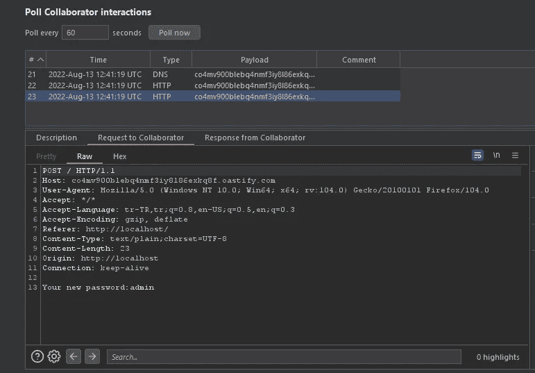

合作者客户

我们将使用管理员用户的信息登录(admin@admin.com:admin)

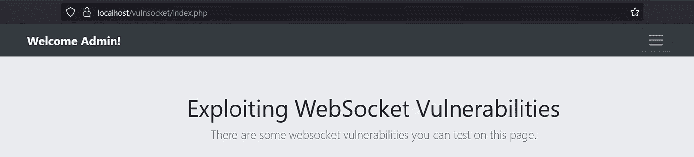

Vulnsocket 索引页面

# 如何预防 CSWSH？

为了理解如何防止漏洞，有必要检查 cswsh_secure.php 页面。在此页面上，Websocket 连接请求按如下方式发送:

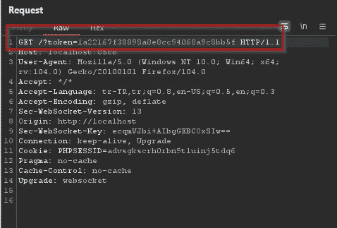

Websocket 连接请求

这个令牌值是用户特定的，并且是可任意使用的。

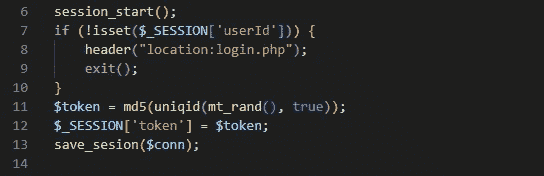

cswsh_secure.php

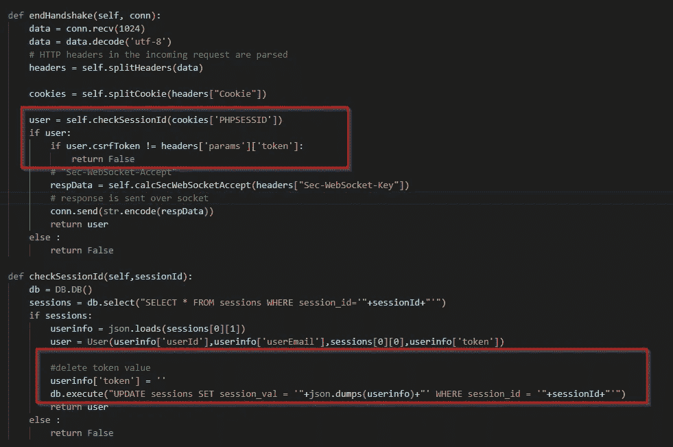

socket_cswsh_secure.py

因为我们不知道 admin 用户的令牌值，所以消除了这个 CSWSH 漏洞。