# VulnHub — Blogger:1 演练

> 原文：<https://infosecwriteups.com/vulnhub-blogger-1-walkthrough-ac7374f338f4?source=collection_archive---------2----------------------->

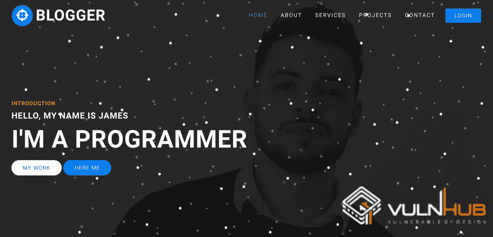

VulnHub Blogger 是一个简单的 boot2root CTF 挑战，你必须进入 WordPress 博客网站，以机器人先生的方式入侵:)让我们进入正题。

首先，我使用 Nmap 找到虚拟机的 IP，如下所示。

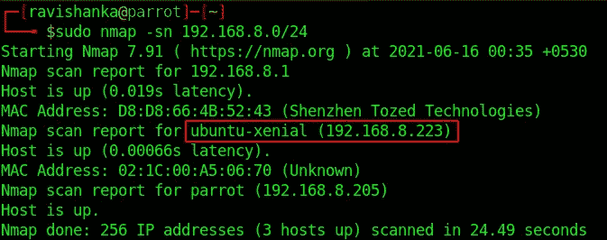

正在查找虚拟机的 IP

然后执行传统的端口扫描来收集信息。

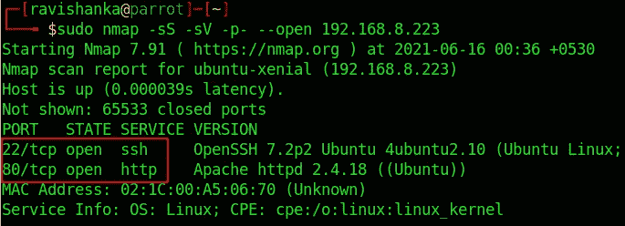

Nmap 端口扫描

我们可以看到两个开放的港口，

*   端口 22 — SSH
*   端口 80 — HTTP

那么，让我们来看看 web 应用程序。我们无法从这个网络界面获得太多信息。然而，我们可以碰到一个名叫**的用户。**

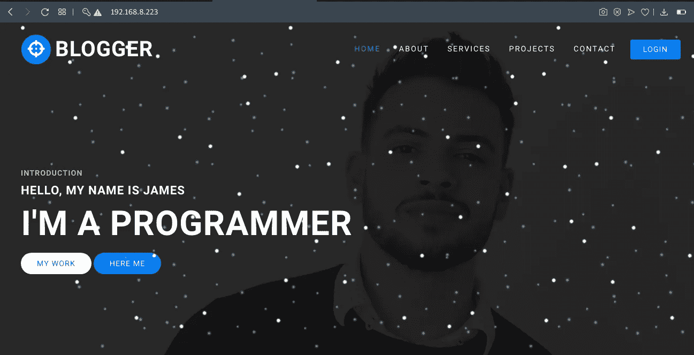

网络应用

我尝试了不同的登录和注册形式的攻击，如 SQL 注入和蛮力，但没有运气。

然后我使用 Gobuster 执行了一次目录暴力，得到了以下结果。

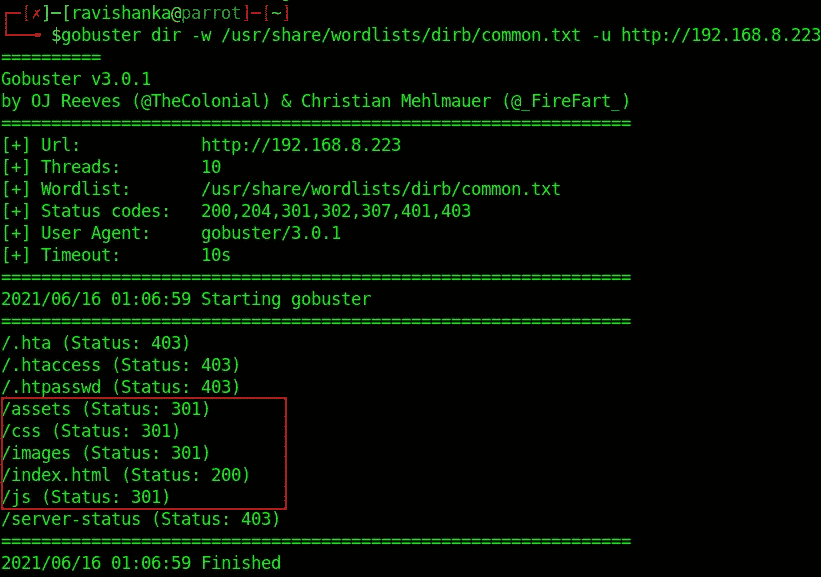

目录暴力

**资产**目录看起来很有趣。它具有代表永久重定向的状态代码 301。

让我们去资产目录。你会遇到一些其他的目录。除了**字体**之外的所有目录都以无用的结果告终。

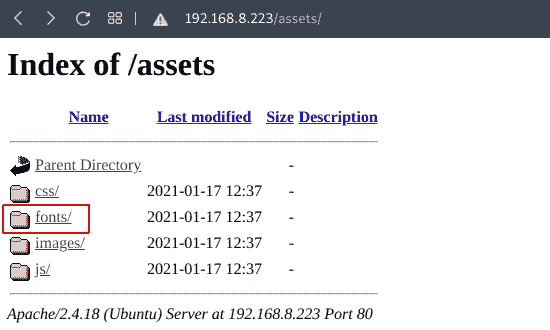

资产目录

Fonts 目录包含另一个名为 **blog 的目录，**这很有趣。

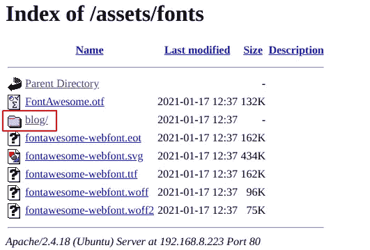

/资产/字体

点击**博客**后，您将被重定向到另一个网络应用程序。

您可能需要将 **blogger.thm** 添加到 **/etc/hosts** 文件中，以使 web 应用程序正常工作。

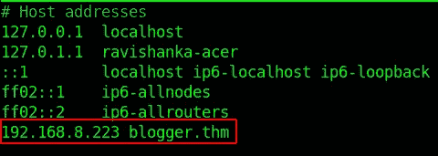

/etc/hosts

经过一番调查，我发现这个网络应用程序是用 WordPress 构建的。

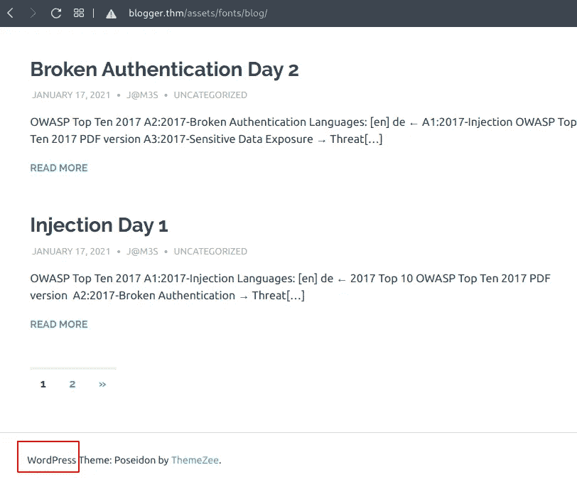

CMS = WordPress

因此，我启动了 WPScan 并执行了各种扫描，如用户名、主题和插件枚举。

我可以找到一些用户名，如 **jm3s、**，我执行了密码暴力破解，但没有成功。

然而，我可以找到两个积极检测的插件。

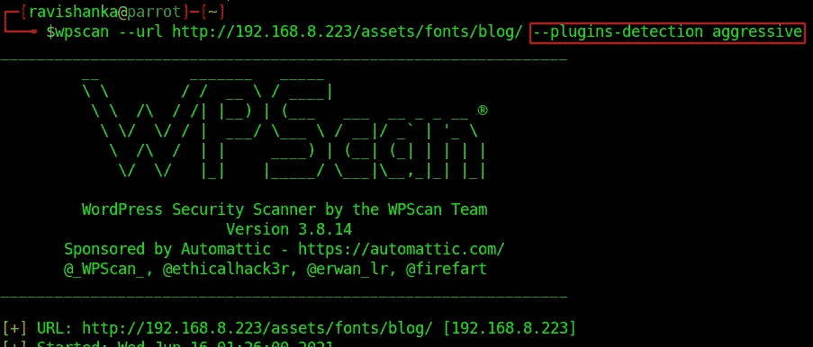

积极检测插件

wpdiscuz 插件已过期，此版本容易受到任意文件上载的攻击。

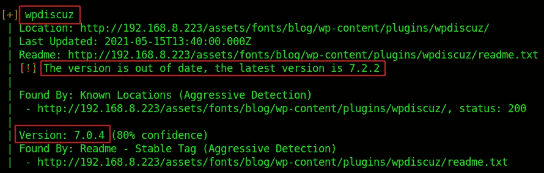

检测到有漏洞的插件

你可以从[这里](https://www.wordfence.com/blog/2020/07/critical-arbitrary-file-upload-vulnerability-patched-in-wpdiscuz-plugin/)获得更多关于这个漏洞的信息。

我可以在这里找到与此漏洞[相关的 metasploit 漏洞利用。然而，它对我不起作用。你可以试一试。我如下执行手工开发。](https://github.com/hoanx-2146/wpDiscuz_unauthenticated_arbitrary_file_upload)

如果你看一下任何一篇博客文章，都会有一个评论区，允许用户上传图片。

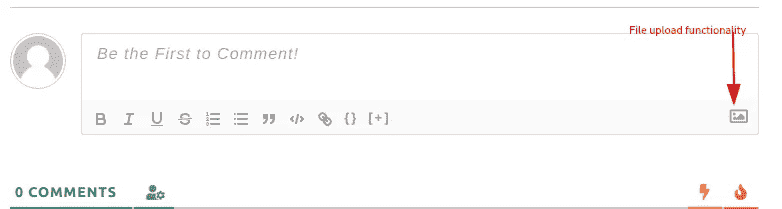

用户可以上传图片

于是，我试着上传了位于**/usr/share/webshell/PHP**目录下的**php-reverse-shell.php**。确保按如下方式编辑主机的 IP。

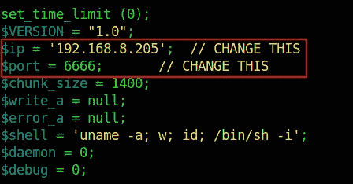

更改主机 IP

但是，由于出现错误，无法上传。所以，我尝试了一些黑名单和白名单过滤旁路技术。

对我有用的是，用文件类型头愚弄服务器。通常，如果上传功能接受图像，它也会接受 GIF 文件。我们可以加**gif 89 a；**对 shell 的开始技巧上传如下。

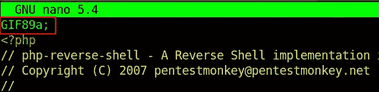

追加 GIF89a 到 shell 的开头

在上传 shell 之前，创建一个 netcat 监听器。

netcat 监听器

用一些随机数据填写评论字段并上传 php shell，然后点击**发表评论**。

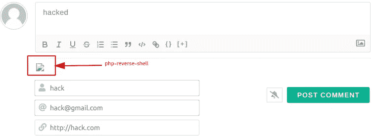

上传成功

如果您看一看 netcat 监听器，您可能会遇到相反的 shell。

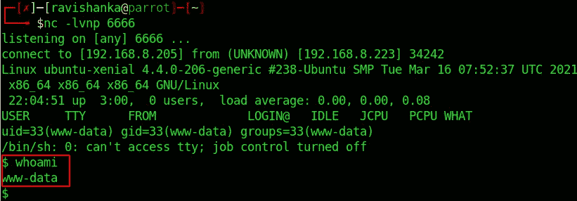

反向外壳

我们可以在这个系统中立足。我们仍然不是这个系统的用户。

首先，将当前的哑外壳升级为完全交互式的外壳。你可以按照这个[指令](https://null-byte.wonderhowto.com/how-to/upgrade-dumb-shell-fully-interactive-shell-for-more-flexibility-0197224/)去做。

如果我们查看主目录，我们可以看到 3 个用户。

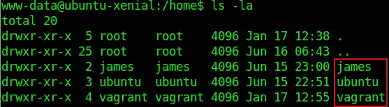

三个用户

您可以发现用户 james 拥有用户标志。

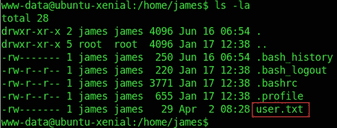

用户 james 拥有用户标志

由于缺少权限，我们无法查看标志。

缺乏权限

在花了一些时间研究如何获得用户访问权限后，我发现用户流浪者的密码也是**流浪者**。

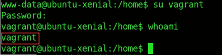

密码=流浪者

当我查看这个用户作为根用户可以运行什么时，我发现，流浪者可以作为根用户执行任何命令。

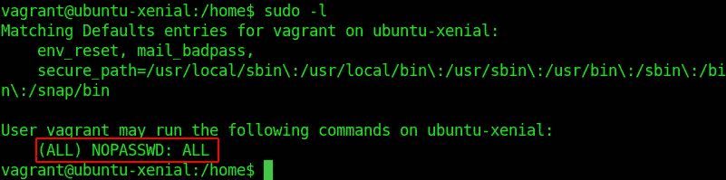

流浪者可以作为根用户执行任何事情

因此，让我们将 user 改为 james，以便获得用户标志。

将用户更改为 James

我们可以从詹姆斯的主目录中获得该标志。但是，它是 base64 编码的。您可以对其进行解码并读取用户标志，如下所示。

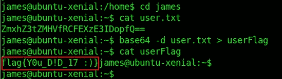

用户标志

同样，我们也可以成为 root。首先你需要退出用户 james，然后执行 **sudo su** 命令将用户改为 root。

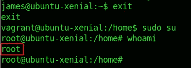

将用户更改为 root

瞧啊。！！我们是根！！！

您可以从根目录的主目录中获取根标志。但是，它也是 base64 编码的。

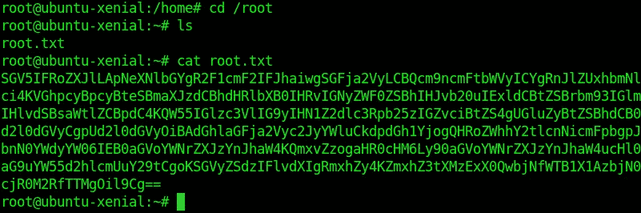

根标志是 base64 编码的

因此，您可以对其进行解码并读取根标志，如下所示。

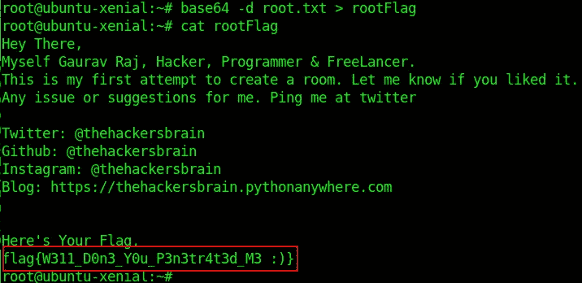

根标志

w311 _ d0n 3 _ Y0u _ p 3n 3 tr 4t 3d _ b 10g g3r:)

我希望你喜欢这个挑战，也学到了一些东西。通过 [LinkedIn](https://www.linkedin.com/in/ravishanka-silva-a632351a0/) 联系我。