# VulnHub —蓝月亮:2021 年漫游

> 原文：<https://infosecwriteups.com/vulnhub-bluemoon-2021-walkthrough-68a3aa952107?source=collection_archive---------1----------------------->

VulnHub blue moon([https://www.vulnhub.com/entry/bluemoon-2021,679/](https://www.vulnhub.com/entry/bluemoon-2021,679/))是一个简单的 boot2root CTF 挑战，你必须在通往 root 的路上抓住 3 面旗帜。让我们从找到盒子的 IP 开始。

Nmap 用于查找 BlueMoon 虚拟机的 IP，如下所示。

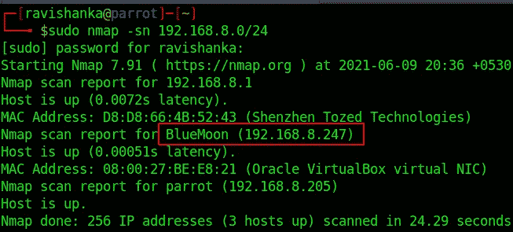

寻找蓝月亮虚拟机的 IP 地址

然后我们需要收集关于机器的信息。因此，使用 Nmap 执行传统的端口扫描，如下所示。

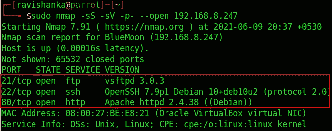

Nmap 端口扫描

我们会发现有 3 种服务是开放的，

*   FTP —端口 21
*   SSH —端口 22
*   HTTP —端口 80

由于 HTTP 是最大的攻击面，让我们看看网页。

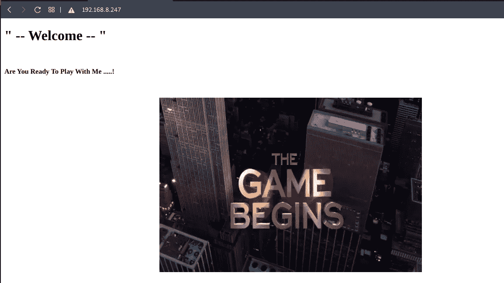

网页

我们在主网页上找不到任何有用的信息。我试过页面来源，但没有运气。然后我尝试了目录暴力。

Gobuster 被用来暴力破解目录。但是，我不得不使用位于**/usr/share/word lists/dir buster**目录下的“**directory-list-2.3-medium . txt**”词表，以获得有效的结果。

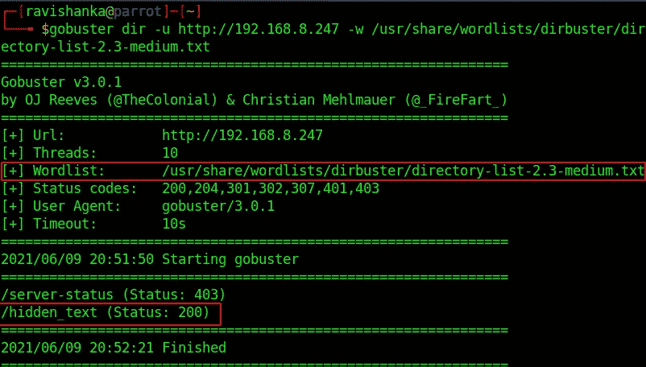

Gobuster 结果

有一个名为“ **hidden_text** 的目录，其状态代码为 200，这很有趣。当我们转到该目录时，系统会提示我们以下消息，还有另一个名为“**谢谢…** ”的链接。

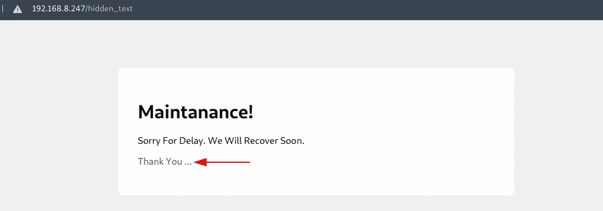

隐藏 _ 文本目录

那个链接提示我们一个二维码的图像。所以，我们来下载吧。

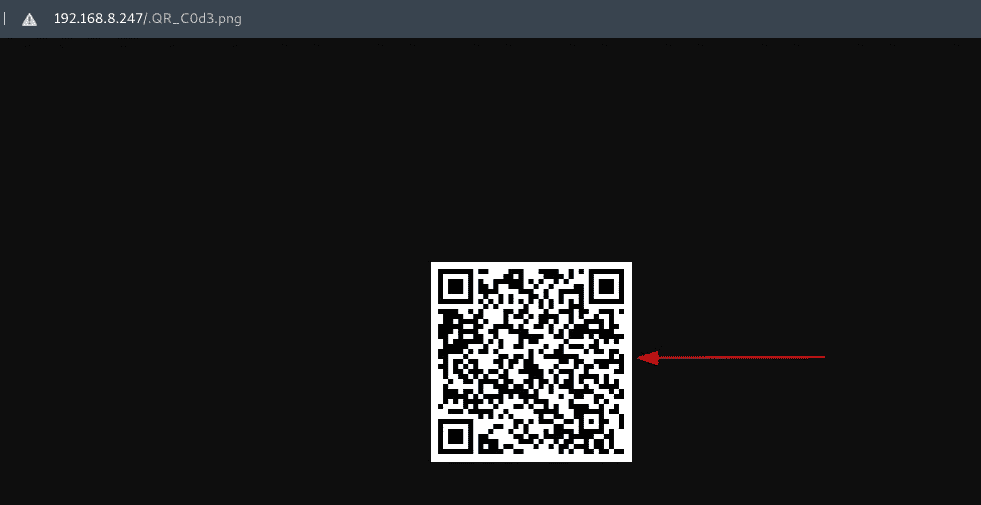

谢谢你…

前往[https://zxing.org/w/decode.jspx](https://zxing.org/w/decode.jspx)上传下载的图像以便解码。解码二维码如下。

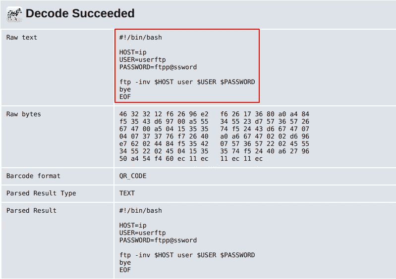

解码二维码

我们可以清楚地了解到，那些是 FTP 的凭证。因此，继续使用给定的凭证登录 FTP。

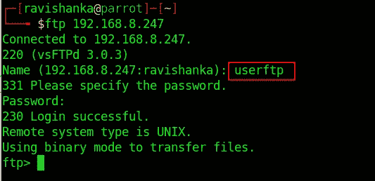

FTP 登录

把文件列表下来，有两个文件叫做 **information.txt** 和 **p_lists.txt**

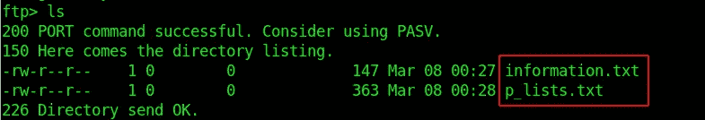

列出文件

使用 **get** 命令将这些文件下载到您的主机上。

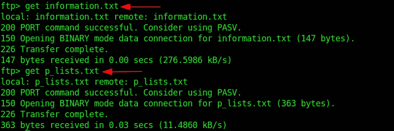

下载文件

在查看 information.txt 文件时，我们可以碰到一个名叫 Robin 的用户，它讲述了一个密码列表。

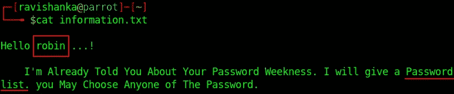

信息. txt

在 p_lists.txt 文件中，我们可以找到这些密码。

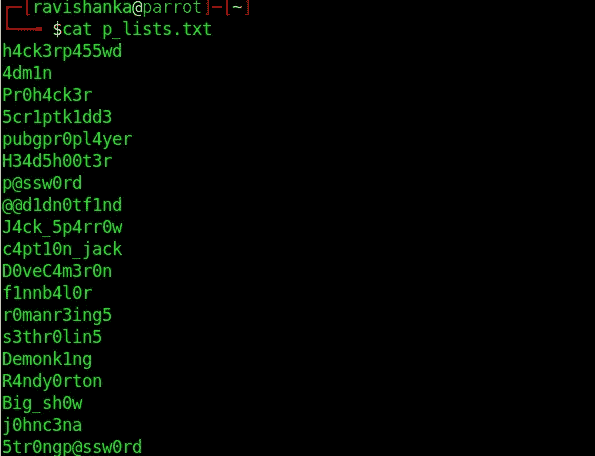

p_lists.txt

因此，让我们使用给定的密码列表，启动 THC Hydra 来破解用户 Robin 的密码。

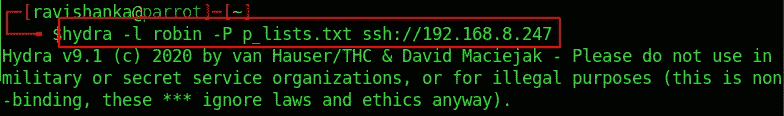

点燃九头蛇

不用费多大力气，九头蛇就能破解罗宾的密码。

破解了罗宾的密码

所以，让我们使用 SSH 作为 Robin 登录。

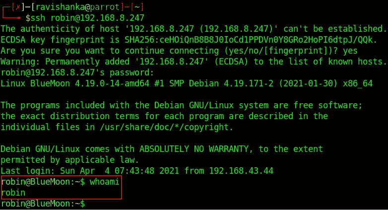

以罗宾的身份登录

我们可以如下获得第一个标志。

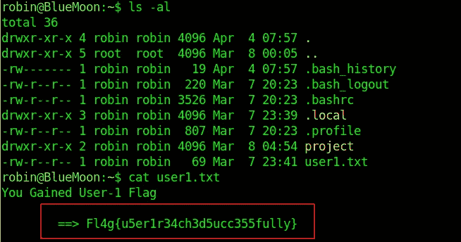

第一面旗帜

## 横向权限提升

当使用 **sudo -l** 命令列出这个用户可以作为 sudo 运行的内容时，我们会遇到一个名为 **feedback.sh** 的文件，它可以作为另一个名为 **Jerry 的用户运行。**

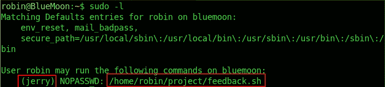

须岛一号

来看看反馈吧. sh

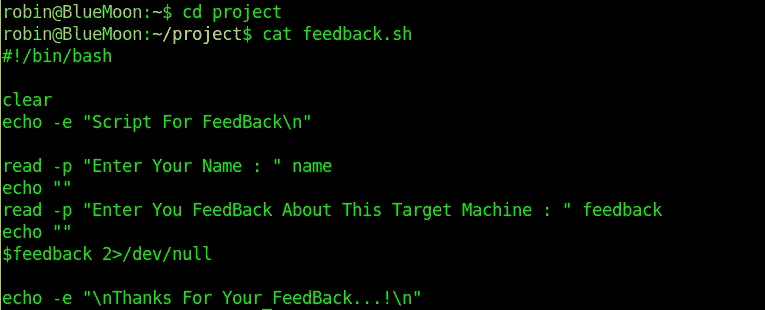

feedback.sh

这个脚本将执行我们在 **$feedback** 变量中添加的任何命令。

因此，首先作为用户 Jerry 执行它。

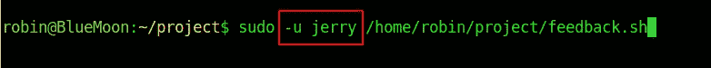

作为 Jerry 执行 feedback.sh

在反馈部分键入 **/bin/bash** 命令以获得 bash shell，如下所示。

/bin/bash

我们被提示用户 Jerry 的 bash shell。

我们可以从 Jerry 的主目录中获得第二个标志。

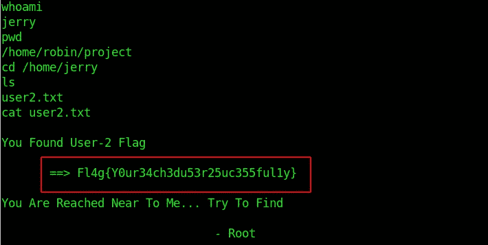

标志 2

然而，我们仍然不是根。因此，让我们朝着这个目标努力。

## 垂直权限提升

首先，将当前 shell 升级为交互式 shell，如下所示。

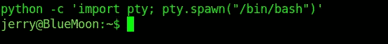

交互式外壳

如果我们像之前一样执行 **sudo -l，**它会询问密码。

sudo -l 询问密码

在寻找特权提升向量时，我发现 docker 组被分配给用户 Jerry。

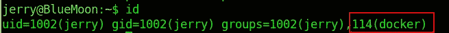

码头工人组被分配给杰瑞

让我们来看看 docker 图片。

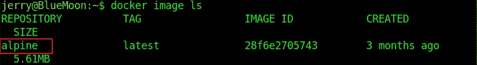

查看 docker 图像

GTFOBins 包含我们可以在 docker 中使用的命令，以便将我们的权限提升到 root。(gtfobins[https://gtfobins.github.io/gtfobins/docker/](https://gtfobins.github.io/gtfobins/docker/))因此，我们可以利用 Alpine image 并在 docker 容器中挂载根目录，这将提示我们 root shell。

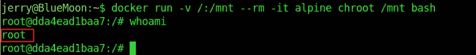

剥削码头工人

瞧啊。！！我们是根！！！

然后，我们可以毫不费力地从 root 的主目录中获得最终的标志，如下所示。

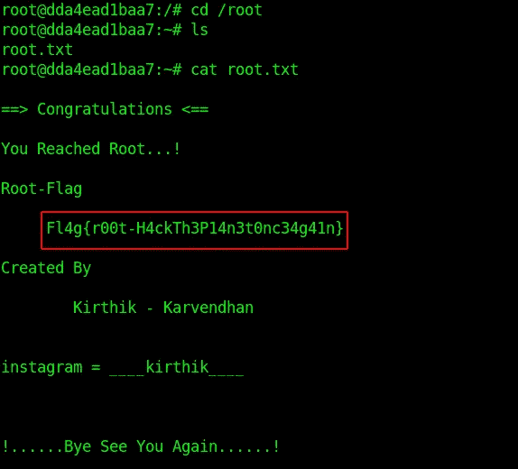

最终旗帜

我希望你喜欢这台机器，并学到了一些新东西。通过 LinkedIn 联系我，[https://www.linkedin.com/in/ravishanka-silva-a632351a0/](https://www.linkedin.com/in/ravishanka-silva-a632351a0/)

祝你在前方捕捉旗帜时好运！！！