# VulnHub — FristiLeaks 1.3 演练

> 原文：<https://infosecwriteups.com/vulnhub-fristileaks-1-3-walkthrough-994d7770d363?source=collection_archive---------1----------------------->

VulnHub FristiLeaks([https://www.vulnhub.com/entry/fristileaks-13,133/](https://www.vulnhub.com/entry/fristileaks-13,133/))是一个 *boot2root* CTF 挑战，你必须利用一个无限制的文件上传漏洞，并在获得根标志的过程中努力学习某种解码技能。

从 vulnhub 下载虚拟机后，确保网络设置为桥接模式，如果您使用 vmware，则需要在网络设置中手动分配给定的 mac 地址(08:00:27:A5:A6:76)。如果所有设置正确，您将能够在屏幕上看到机器 IP 地址，如下所示。

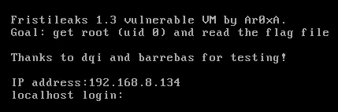

FristiLeaks 虚拟机的开始屏幕

让我们一步一步来。

首先，启动您的 pentesting OS 并执行传统的 nmap 扫描，如下所示。

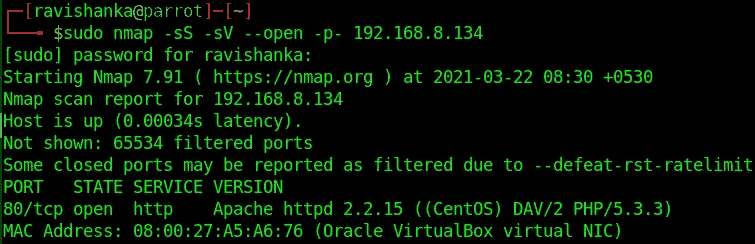

nmap 扫描结果

正如您所看到的，唯一开放的端口是 80，由此我们可以假设其中包含了一个 web 应用程序。因此，通过在浏览器中提供 IP 地址来访问 web 应用程序。您将看到如下页面。

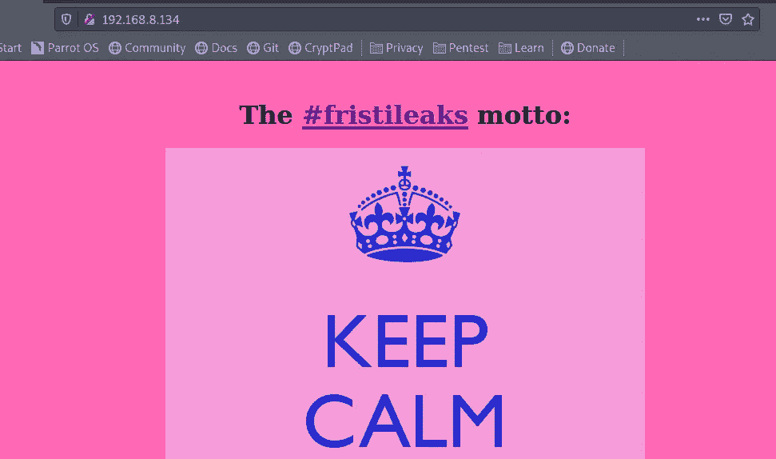

网络应用

然后使用 gobuster 执行目录暴力。

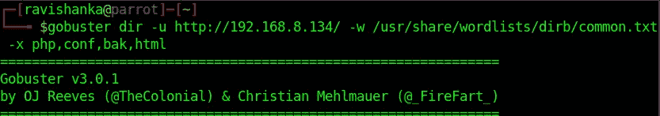

目录暴力

你会遇到一个有趣的目录；robots.txt

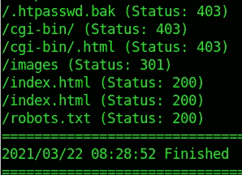

gobuster 结果

robots.txt 中还有一些不允许用户访问的目录。

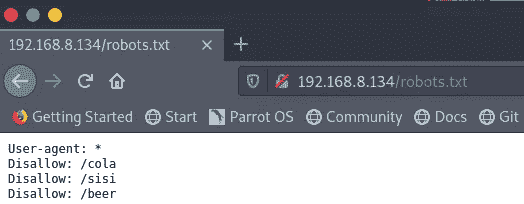

robots.txt

当访问上面列出的每个目录时，它会显示以下 meme。

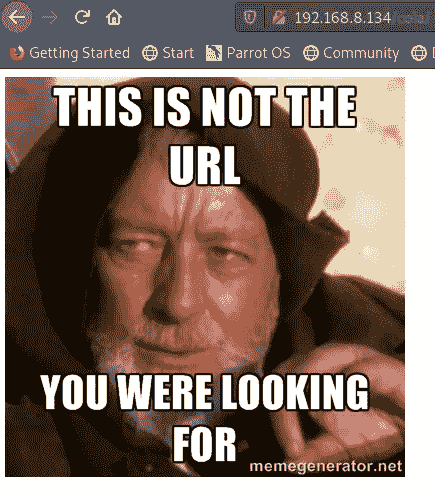

所以，我们必须假设我们在一个兔子洞里。

首页的图片呢？上面说喝“弗里斯蒂”。Fristi 是一种饮料，以上目录都是以饮料命名的。所以，我试着把“fristi”作为一个如下的目录，它提示我一个登录页面。

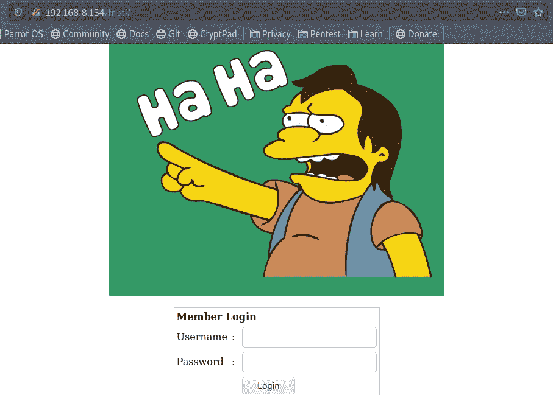

登录页面在<ip>/弗里斯蒂</ip>

我试过默认密码和 SQL 注入，但都没用。所以，我查看了页面源代码，发现了一些有趣的评论。

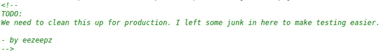

评论 1

从上面的评论中，我们可以碰到两个用户名；TODO 和 eezeepz。然后还有另一个注释，看起来是 base64 编码的字符串。

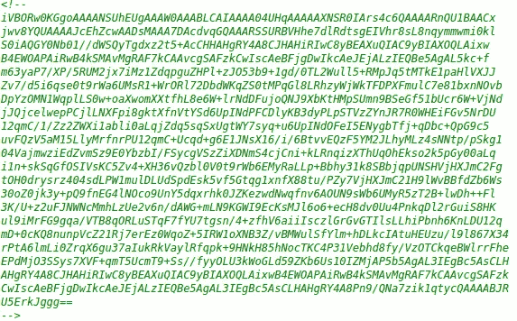

注释 2 — base64 编码字符串

我把它保存在一个名为“enc”的文本文件中，解码如下。

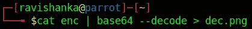

解码

然后给出下面的图像作为输出；很可能是我们的密码！

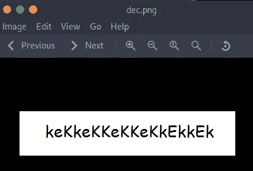

解码图像

当尝试以上用户名和密码组合时，以下组合使我成功登录。

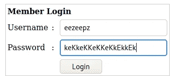

用户名/密码

该页面中有一个文件上传功能。它只接受图片。我们可以尝试上传逆向 php shell，它位于“/usr/share/web shell/PHP”位置。您需要使用您的机器 IP 进行编辑，如下所示。

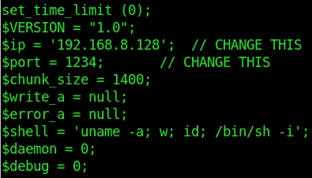

编辑反向外壳

当我试图上传 php shell 时，它给出了以下错误。

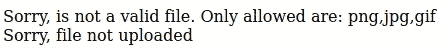

文件格式错误

因此，这背后可能有某种过滤，我们需要绕过它。我尝试了不同的方法，比如将扩展名重命名为“php5”并附加“GIF98”到外壳的开始等。但是什么都没用。然后，我使用了如下的双扩展。

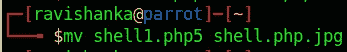

双重延伸

当我上传这个文件时，网络应用程序认为它是合法文件。

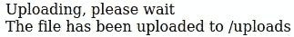

然后为您在 php shell 中选择的端口(在我的例子中是端口 1234)创建一个 netcat 监听器，如下所示。

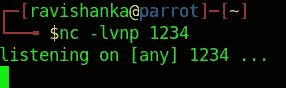

netcat 监听器

然后转到 shell 上传的 url，如下所示。

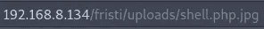

如果一切顺利，您将得到如下的反向 shell 提示。

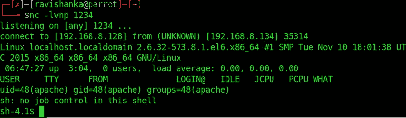

反向外壳

如果您愿意，可以使用下面的命令使 shell 稳定，

*python-c ' import pty；pty.spawn("/bin/bash")'*

我们可以在这个系统中立足。然而，我们仍然不是该系统的用户。

在枚举的时候，我碰到了一些主目录下的用户。

用户

eezeepz 的主目录里面有一个说明，说要更改一些权限设置，如下。

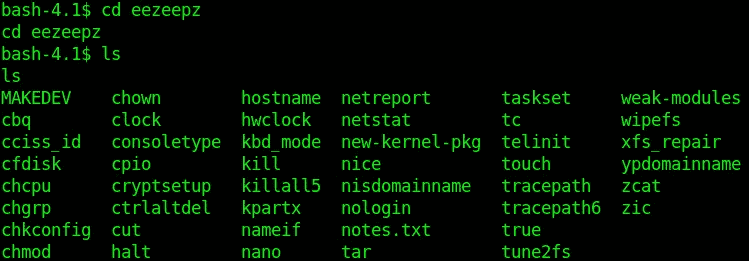

将目录更改为 eezeepz 的主页

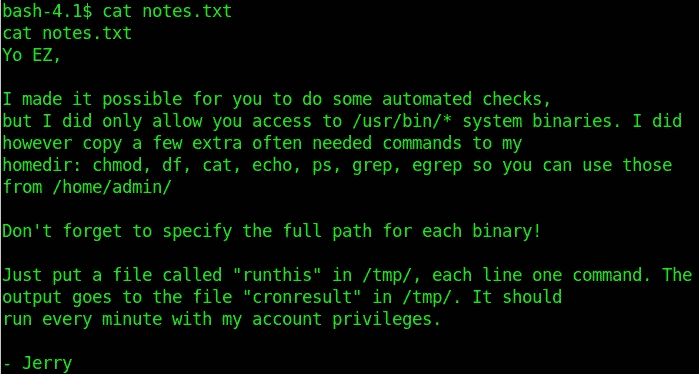

查看 notes.txt

因此，让我们继续执行上述任务如下。

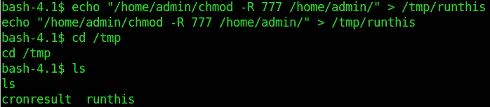

更改权限

然后转到/home/admin 目录并列出其内容。您可以看到一些 txt 文件以及一些 python 脚本，如下所示。

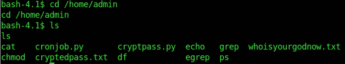

/home/admin 中的内容

在查看它们时，我们可以在“whoisyourgodnow.txt”中找到一个编码字符串，并在“cryptpass.py”中找到用于编码它的 python 脚本，如下所示。

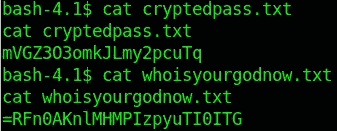

编码字符串

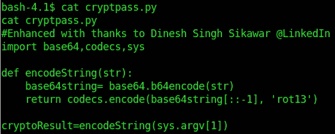

用于编码的 python 脚本

因此，我们必须根据上面的 python 脚本反转我们的思维，构造一个 python 脚本来解码上面的字符串。可以这样做。

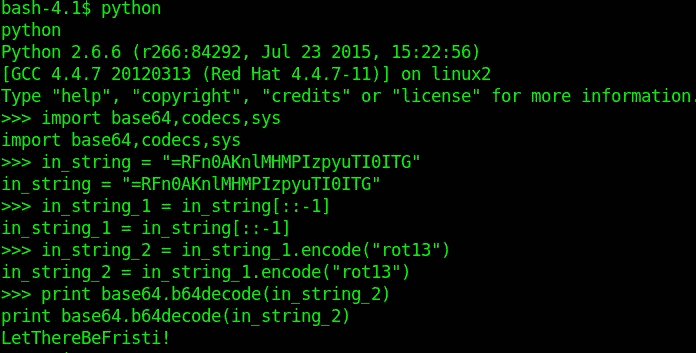

要解码的 python 脚本

我们得到了解码后的字符串。这可能是另一个用户的密码。我把用户改成了 fristigod，并提供了上面的密码，如下。

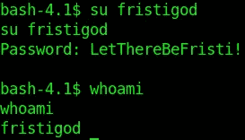

将用户更改为 fristigod

我可以成功登录。因此，现在我们有了对系统的用户访问权。让我们为根而努力。

我执行了“sudo -l”命令，以便找出这个用户作为根用户可以运行什么命令。

须岛一号

如上图所示，该用户可以以 root 用户身份运行“doCom”SUID 二进制文件。所以，让我们如下把“/bin/bash”附加到“doCom”上，看看是否有效，

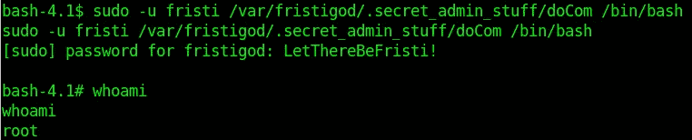

将/bin/bash 附加到 doCom SUID 二进制文件

瞧啊。系统会提示我们一个根 shell。我们可以在如下更改一些目录后读取根标志。

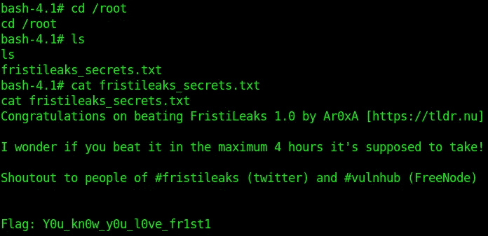

根标志

我希望你喜欢这台机器。帮我联系 https://www.linkedin.com/in/ravishanka-silva-a632351a0/的 LinkedIn

黑客快乐！！！

感谢你对 OSCP 考试的一点帮助，

[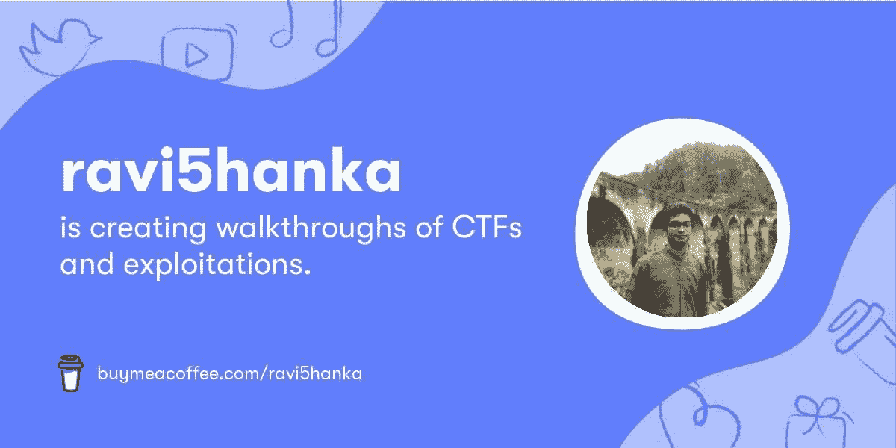](https://www.buymeacoffee.com/ravi5hanka)