# VulnHub — Hacksudo:比邻星演练

> 原文：<https://infosecwriteups.com/vulnhub-hacksudo-proximacentauri-walkthrough-327aff6acfb6?source=collection_archive---------3----------------------->

[VulnHub—hack sudo:proxima Centauri](https://www.vulnhub.com/entry/hacksudo-proximacentauri,709/)是一个中级 boot2root 挑战，您必须彻底枚举机器并利用 CMS 漏洞才能获得访问权限。

先从找到机器的 IP 开始。

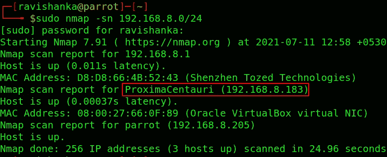

寻找 IP

让我们用 Nmap 扫描机器，找出开放的端口。

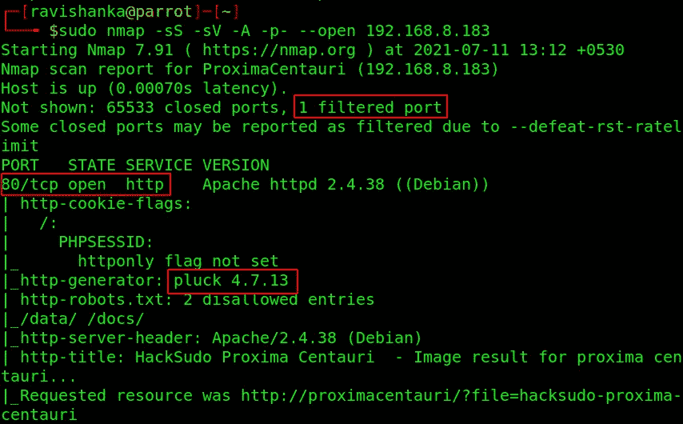

Nmap 端口扫描

根据以上分析，我们可以得出以下结论:

*   有一个过滤端口。
*   端口 80 已打开。
*   使用的 CMS 拔毛 4.7.13

上面摘下的版本容易受到 [**认证** **文件上传远程代码执行**](https://www.exploit-db.com/exploits/49909) 的攻击，这意味着如果我们拥有管理员密码，就可以利用系统。所以，让我们努力找到密码。

让我们启动 Gobuster 来找到隐藏的目录/文件/网页。

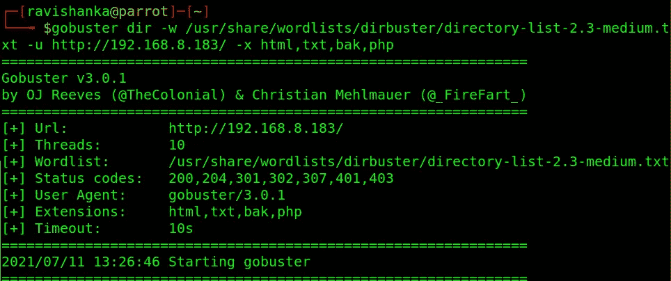

点火敢死队

Gobuster 给出了以下结果。

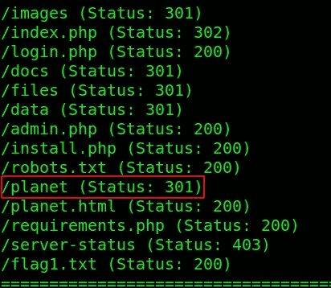

Gobuster 结果

除了**login.php**和**星球**之外的所有页面都没用。

让我们去参观 login.php 吧。这是一个正常的登录页面，我们不知道密码。

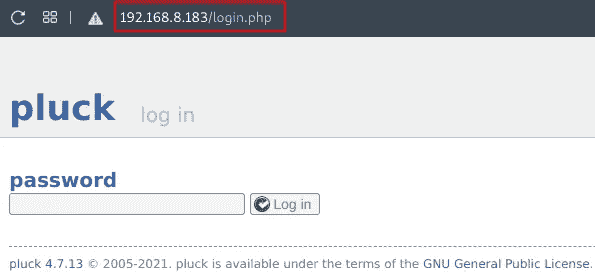

login.php

如果我们访问 **/planet** 目录，我们可以看到另一个叫做 **travel** 的网页。

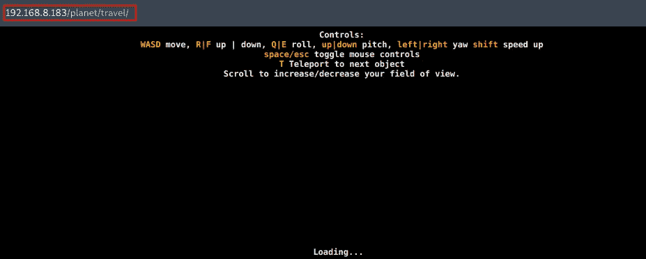

/星球/旅行

源代码中有一个有趣的注释。

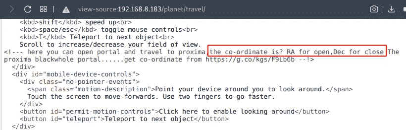

/planet/travel 源代码

我们可以从这个评论中获得以下信息:

*   我们应该找到比邻星的坐标。
*   **赤经** (RA)代表**开启。**
*   **下倾** (Dec)代表**收盘。**

“打开”和“关闭”短语可以指打开和关闭的端口。还记得我们在使用 Nmap 时遇到的过滤端口吗？

这个注释可能是在提示我们执行端口敲门，以便打开过滤的端口。

首先，让我们在谷歌上搜索一下坐标。

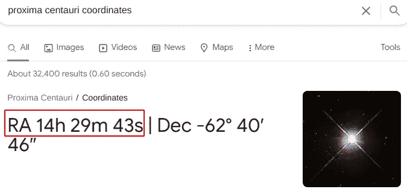

比邻星的坐标

正如评论所建议的，让我们使用 RA 的数量来执行端口敲门。

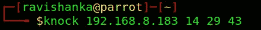

左舷敲击

然后，让我们再次执行 Nmap 扫描，看看是否有新的开放端口。

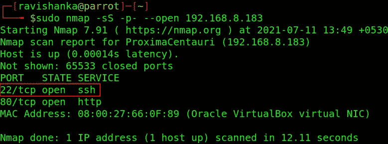

端口敲门后 Nmap 扫描

我们可以碰到 **SSH** 是开着的。我们没有通过 SSH 登录的密码。但是，我们可以尝试抓取横幅。

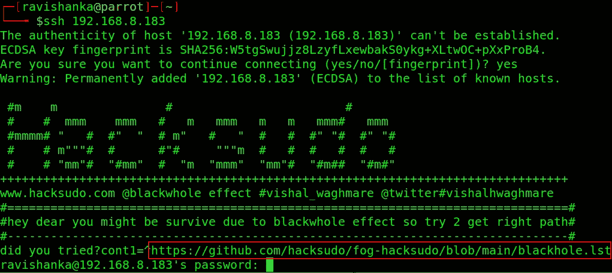

SSH 横幅抓取

有一个 GitHub 页面的链接。当我们访问该页面时，我们可以看到一个单词列表。

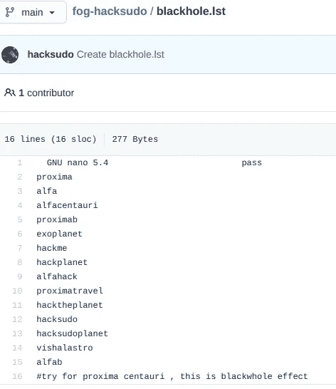

词表

你记得那个登录页面吗？我们可以试着用这个单词表破解密码。Burpsuite 对于这类任务来说很方便。

打个嗝，用一个随机的单词填充登录页面的密码字段，拦截登录请求。

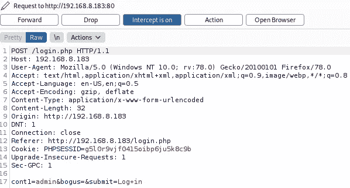

拦截登录请求

向入侵者发送请求，清除所有有效载荷标记，并添加新的有效载荷标记，如下所示。

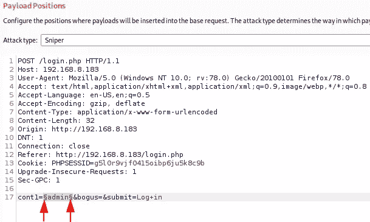

新有效载荷标记

将单词列表复制并粘贴到有效载荷部分。

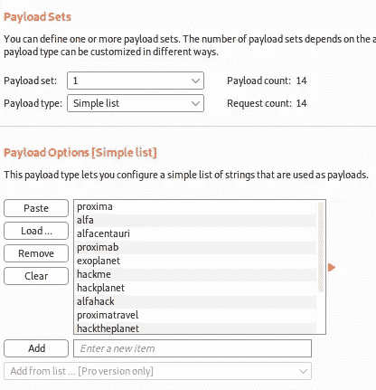

打嗝入侵者的有效载荷部分

然后发动攻击。你会发现密码如下。

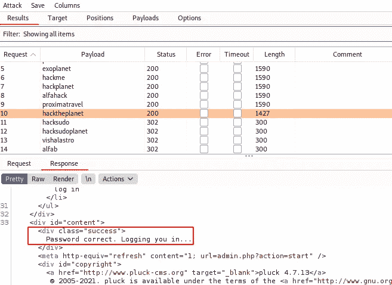

密码

现在我们有了密码，这意味着我们可以利用 Pluck CMS 漏洞。

首先，从[这里](https://www.exploit-db.com/exploits/49909)下载漏洞。然后，您可以按如下方式发起攻击。你只需要指定受害者的 **IP，端口，密码和路径**。

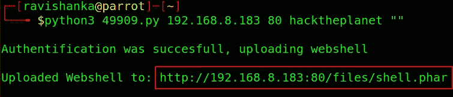

发起攻击

访问上面提到的网址，你会遇到一个基于浏览器的外壳，这是我们系统的立足点。

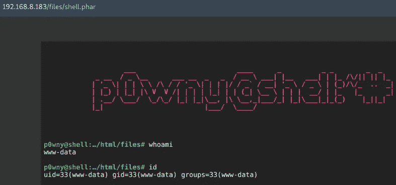

基于浏览器的外壳

我们可以从这个壳中获得一个 Socat 反向壳。你可以按照这些[指令](https://github.com/swisskyrepo/PayloadsAllTheThings/blob/master/Methodology%20and%20Resources/Reverse%20Shell%20Cheatsheet.md#socat)去做。您必须首先在您的主机上创建一个 Socat 监听器，并在受害者上执行以下命令。

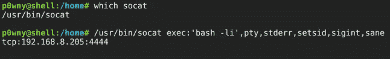

获得 Socat 反向外壳

您将立即获得反向外壳。

我们会遇到这个系统的三个用户。

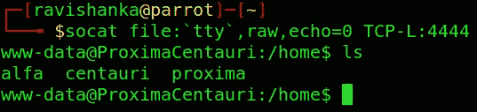

系统的反向外壳和用户

这些用户的主目录不包含任何内容。所以，我们需要列举更多的立足点。

在 **/var/backups** 目录下有一个 **mysql 备份**文件，任何人都可以读取。

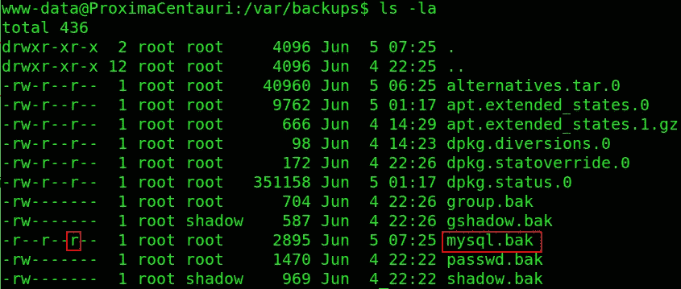

mysql 备份文件

我们可以在查看这个文件时获得 MySQL 的用户名和密码。

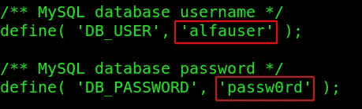

MySQL 用户名和密码

所以，让我们继续登录 MySQL 服务。

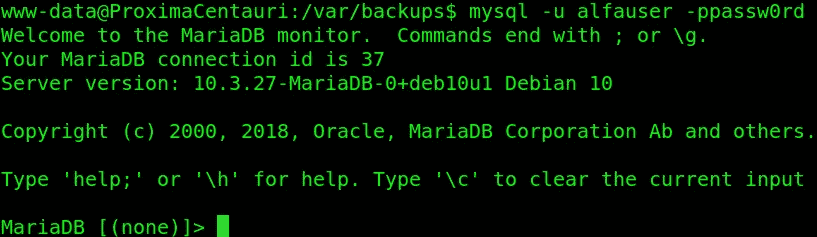

登录 MySQL

让我们看看数据库。

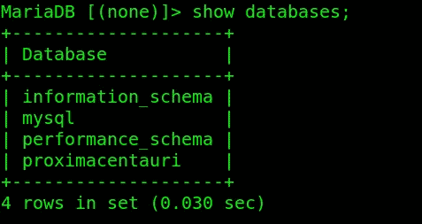

查看数据库

让我们使用 proximacentauri 数据库，并查看这些表。

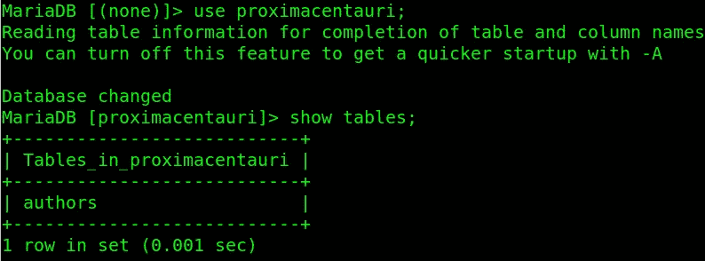

显示表格

让我们转储 authors 表。

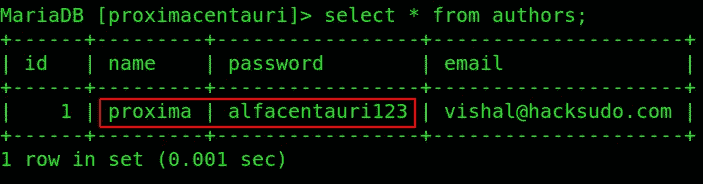

作者表

我们可以找到用户 proxima 的密码。因此，让我们继续将用户更改为 proxima。

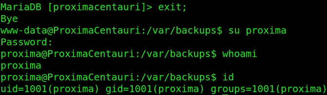

将用户更改为 Proxima

或者，您可以使用 SSH 作为 Proxima 登录。

我们拥有用户！！！可以在 Proxima 的主目录中找到用户标志。

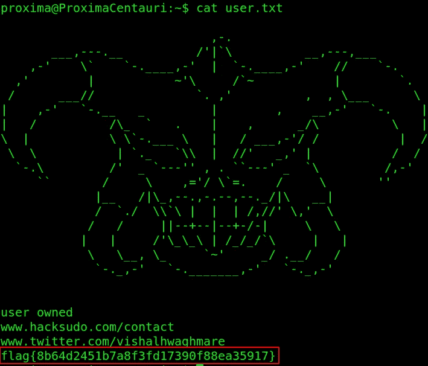

用户标志

现在我们必须向根努力。我尝试了很多事情，

*   须岛一号
*   寻找有趣的 SUID 双星

没有给我有用的结果。我最近完成了 HackTheBox Cap machine，在那里我必须利用 Linux 的能力。因此，我决定找到这台机器的功能，并发现了以下内容。

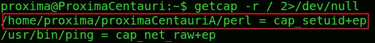

Linux 功能

这意味着有一个具有 SUID 功能的二进制 Perl 副本，我们可以用它来提升权限。访问 [GTFOBINS](https://gtfobins.github.io/gtfobins/perl/#capabilities) 获取说明。

让我们执行以下命令。

1.  CD/home/比邻星/比邻星
2.  。/perl -e '使用 POSIX(setuid)；POSIX::setuid(0)；exec "/bin/bash "；"

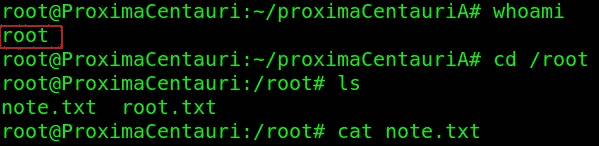

根

瞧啊。！！我们是根！！！

可以从根的主目录中获得根标志。

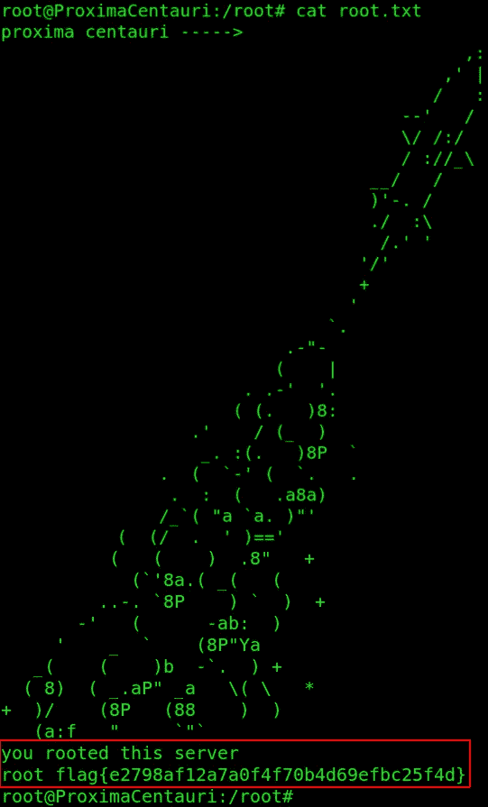

根标志

我认为你很享受这个挑战，也学到了一些东西。通过 [LinkedIn](https://www.linkedin.com/in/ravishanka-silva-a632351a0/) 联系我。

祝你在前方捕捉旗帜时好运！！！