# VulnHub-Momentum 2 演练

> 原文：<https://infosecwriteups.com/vulnhub-momentum-2-walkthrough-8addad2e6a8f?source=collection_archive---------0----------------------->

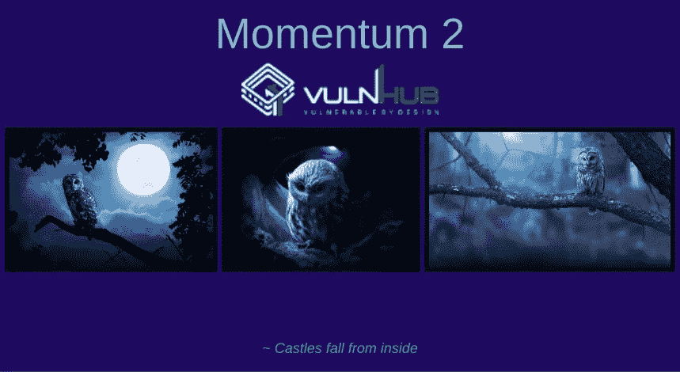

VulnHub Momentum 2 是一个中等级别的 boot2root CTF 挑战，你必须非常彻底地执行一些代码审查，并利用一个无限制的文件上传漏洞来获得访问权限。

让我们从查找虚拟机的 IP 开始。为此，我使用了 Nmap。

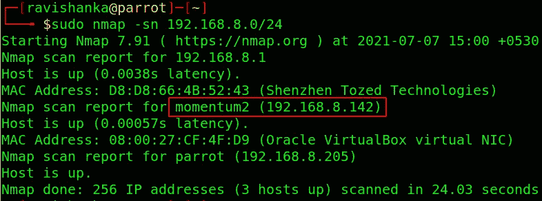

寻找 IP

然后，让我们运行传统的 Nmap 扫描，以找到开放的端口。

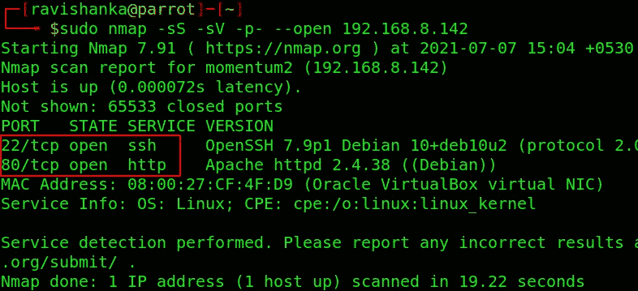

Nmap 扫描以查找打开的端口

我们可以看到两个开放的港口，

*   端口 22 — SSH
*   端口 80 — HTTP

由于 web 应用程序是最大的攻击载体，所以让我们访问网站。

网络应用

在这个主网页界面上，我们找不到任何有用的信息。因此，让我们执行一个目录蛮力，以找出隐藏的目录或文件。

Gobuster 可用于此目的。

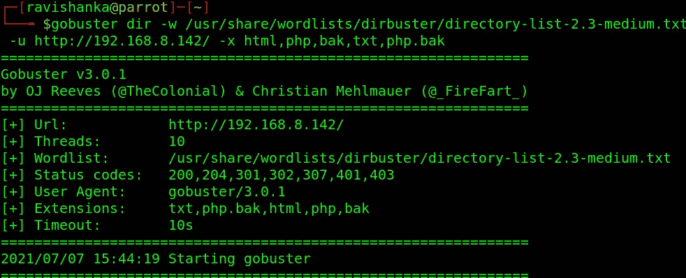

启动 Gobuster

注意:记得使用 **html，php，bak，php.bak** 文件扩展名。否则你会在这一点后卡住。我不得不花很多时间来找出丢失了什么！！！

Gobuster 的结果如下:

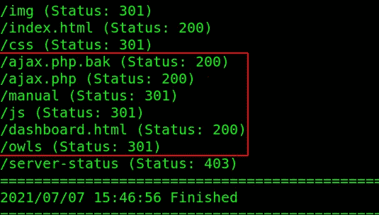

Gobuster 结果

让我们从 dashboard.html 的**开始。这是另一个具有文件上传功能的网页。**

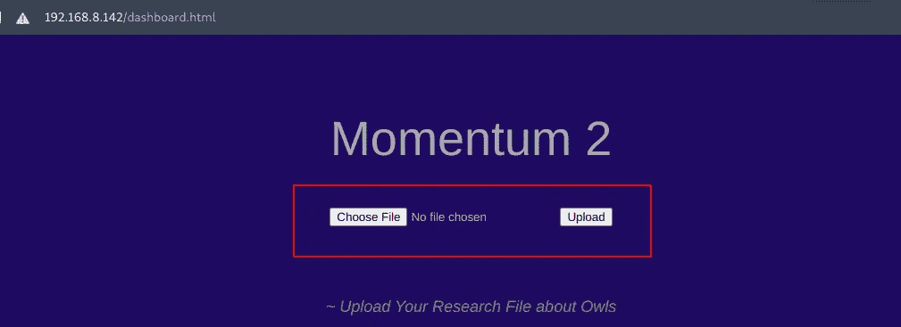

dashboard.html

我试着上传了一个 php 文件。它不成功。只允许上传 **txt** 文件。

在 **js** 目录中，有一个 **main.js** 代码，告诉我们上传的文件发送一个 **POST** 请求到**ajax.php**文件路径。

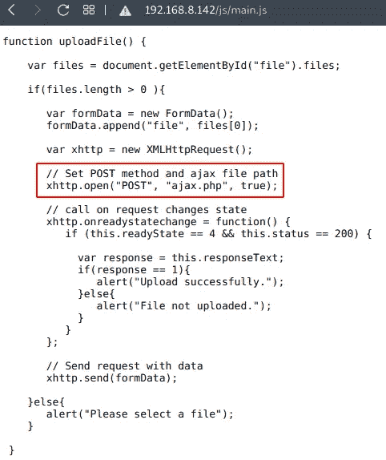

/js/main . JSP

目录 **/owls** 好像是上传文件的存放位置。

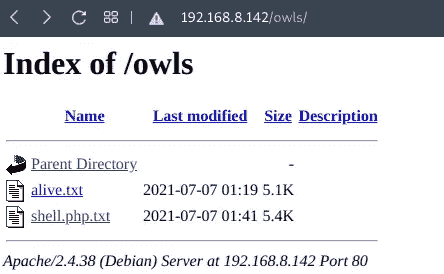

/猫头鹰

ajax.php.bak 文件对我们来说是最珍贵的文件。请仔细阅读。

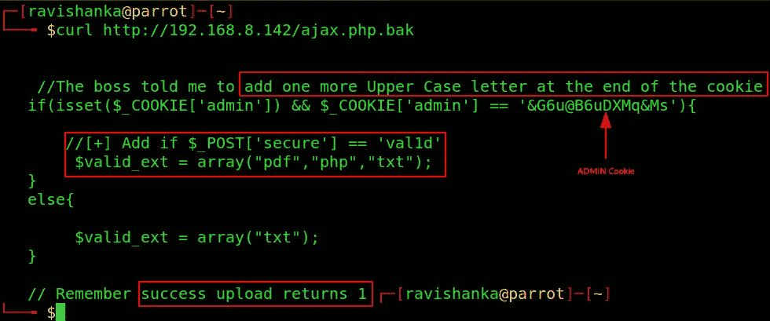

ajax.php.bak

*   admin 有一个 cookie 值。
*   一个更大的字母需要添加在 cookie 的结尾。
*   名为“**安全**的新 POST 参数应该与值“ **val1d** ”一起发送。
*   管理员可以上传 **php** 文件。
*   如果上传成功，则**返回 1。**

这仅仅意味着我们可以在操作 web 请求后，以管理员身份上传一个 php 反向 shell 到系统。

你可以使用 Kali/Parrot OS 中的**php-reverse-shell.php**文件。记得编辑主机 IP 和端口。

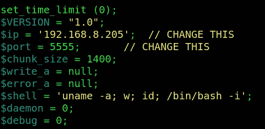

php-reverse-shell.php

点燃炸药。当拦截打开时，上传 php shell。

现在是操纵 web 请求的时候了。添加**管理 cookie** 值和新的 POST 参数**安全**，值为 **val1d** ，如下所示。

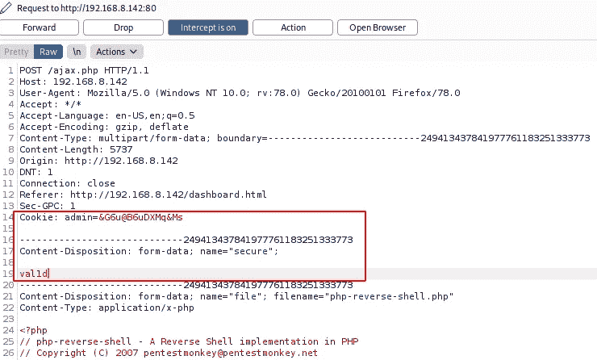

操作 web 请求

但是，admin cookie 值并不完整，因为它的末尾还需要一个大写字母。我们可以利用打嗝闯入者找到那封信。

向**入侵者**发送上述被操纵的请求。清除所有有效负载标记。然后在 cookie 值的末尾插入新的有效负载标记，如下所示。

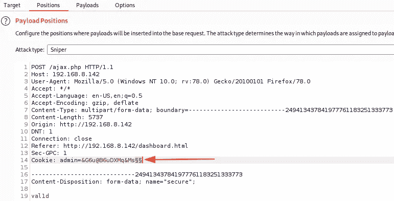

插入新的有效负载标记

现在我们需要一个有效载荷。我们只需要大写的英文字母。

一个简单的 bash 脚本可以用来输出这些字母，如下所示。你可以从我的 [GitHub repo 获得 bash 脚本。](https://github.com/ravi5hanka/English-alphabet-generator-bash)

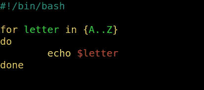

bash 脚本生成英语字母表

执行脚本，复制字母并将其粘贴到 Burp 的有效载荷部分。

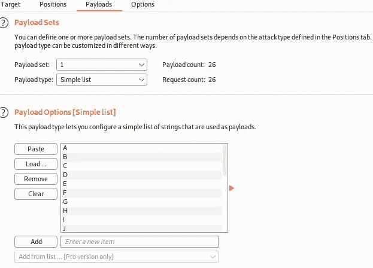

打嗝的有效载荷部分

然后开始攻击。攻击完成后，观察每个字母产生的响应。

你会发现除了 **R.** 之外，每个字母都以 **0** 回应

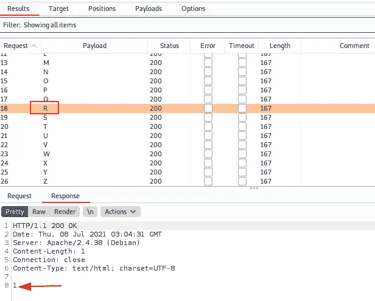

r 答复 1

所以， **R** 是 admin cookie 中缺失的字母。

随着 php 反向 shell 成功上传，我们不再需要打嗝了。

然后用 php shell 中使用的端口设置一个 netcat 监听器。

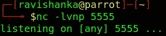

netcat 监听器

进入 **/owls** 目录点击上传的 php 反向 shell。您将立即得到反向 shell 的提示。

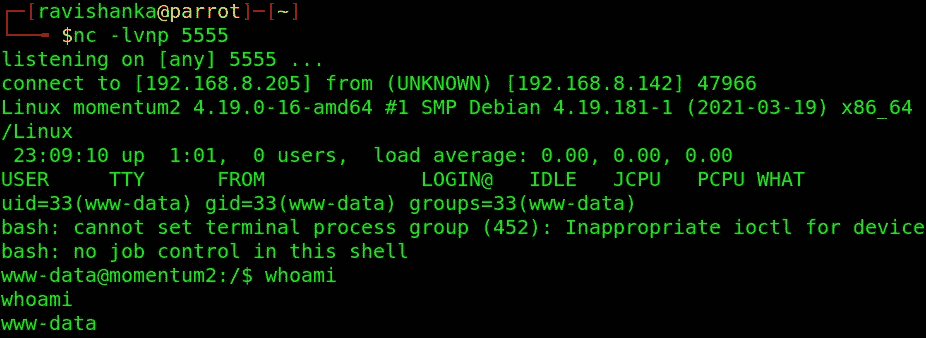

反向外壳

现在，我们得到了系统的立足点。首先推荐你把哑壳升级成全交互的。您可以遵循这些[说明。](https://null-byte.wonderhowto.com/how-to/upgrade-dumb-shell-fully-interactive-shell-for-more-flexibility-0197224/)

经过一些枚举，我们可以在 **athena 的**主目录**中找到用户标志。**

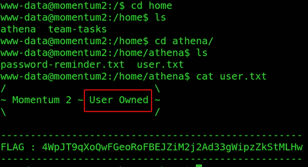

用户标志

还有一个文件叫做 **password-reminder.txt.** 我们可以从那个文件中获取用户 athena 的密码。

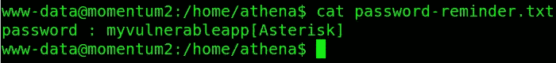

雅典娜的密码

因此，我们可以通过提供密码将用户更改为 athena。记住在密码末尾使用星号( ***** )符号。

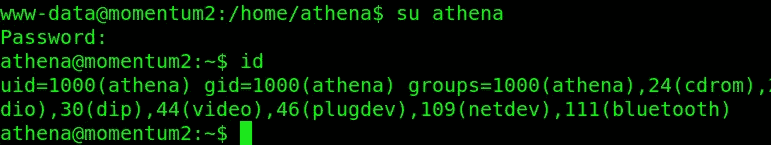

将用户更改为 athena

我们拥有该系统的用户！现在我们需要向根努力。

当列出这个用户可以作为 root 运行的内容时，我们可以看到一个可以作为 root 运行的 python 程序。

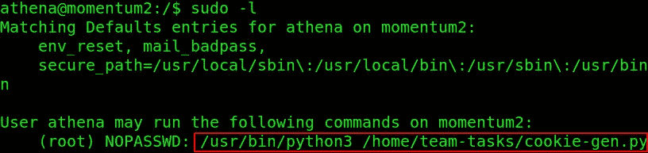

须岛一号

它为给定的输入生成一个随机的 cookie 值。查看代码，我们会发现它执行 bash 命令来回应输出。因此，如果我们可以添加一些命令，它将为我们提供 root 访问权限。

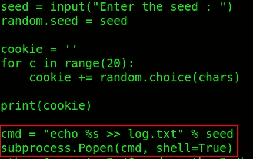

python 程序的源代码

首先，我尝试在种子值后面追加 **bash -i** 。举个例子，“**21；巴什-我”。**成功了，但是不稳定，最后成了个空壳。

因此，我们可以如下附加/bin/bash，

*   将 **/bin/bash** 复制到 **/tmp/bash**
*   然后将 **SUID 位**设置为新的 **/tmp/bash**

最后，您可以执行新创建的 **/tmp/bash** shell，瞧！！！我们是根！！！

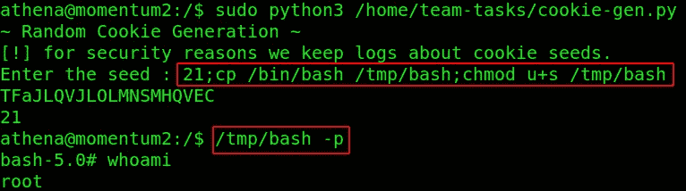

生根

您可以在根目录下找到根标志。

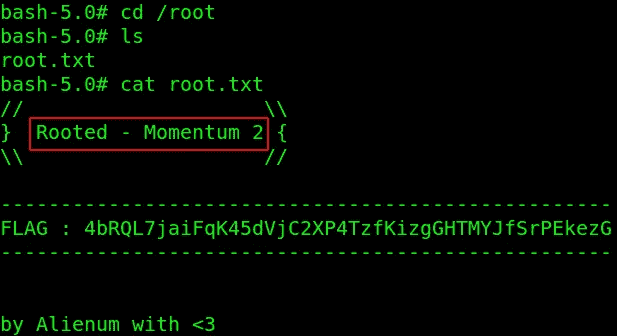

根标志

我希望你喜欢这个挑战，也学到了一些新东西。你可以通过 [LinkedIn 联系我。](https://www.linkedin.com/in/ravishanka-silva-a632351a0/)

祝你在前方捕捉旗帜时好运！！！