# Vulnhub:钱箱 1 演练

> 原文：<https://infosecwriteups.com/vulnhub-moneybox-1-walkthrough-fcee571b52ae?source=collection_archive---------3----------------------->

我再次来到这里给你我的另一篇文章(写于 5 个月前！)的箱子从 **vulnhub *钱箱 1*** 。你可以在[Vulnhub:Pwned 1 walk through](https://hellfire0x01.medium.com/vulnhub-pwned-1-walkthrough-af16ad8cdff9)上阅读我的博客，里面有我以前的文章(我以前是怎么写的)。你可以从这里下载这个盒子，

[](https://www.vulnhub.com/entry/moneybox-1,653/) [## 钱箱:1

### 该网站使用“cookies”为您提供最佳、最相关的体验。使用这个网站意味着你对…

www.vulnhub.com](https://www.vulnhub.com/entry/moneybox-1,653/) 

**扫描网络**

使用`netdiscover`我们将找出机器的 IP 地址，

```
sudo netdiscover -r 10.0.2.0/24
```

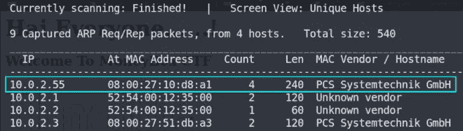

现在我们知道了机器的 IP 地址，我们可能想知道哪些端口是打开的，服务正在运行，等等，我们将通过 nmap 实现这一点，我们将把输出保存在 **nmap.txt** 中。

```
sudo nmap -A -T4 -p- 10.0.2.55 > nmap.txt
```

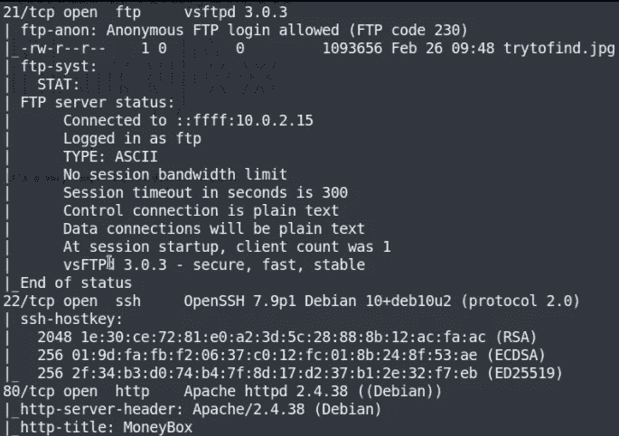

我们可以看到 3 个端口是开放的，FTP(21)、SSH(22)、HTTP(80)[WEB]服务都在这些端口上运行。

现在，试着通过 whatweb 了解网站上运行着什么技术，

```
whatweb 10.0.2.55
```


我们没发现什么特别的。

现在我们将使用 **gobuster** 工具暴力破解目录，并将输出保存在 **gobuster.txt** 文件中，

```
gobuster dir http://10.0.2.55/ -w /usr/share/seclists/Discovery/Web-Content/common.txt -x txt,php 2>/dev/null > gobuster.txt
```

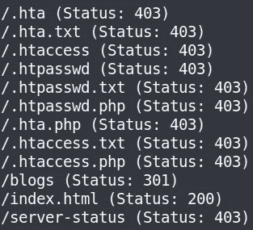

**枚举:**

现在，让我们导航到 [http://10.0.2.55](http://10.0.2.55/) ，我们到达网页，

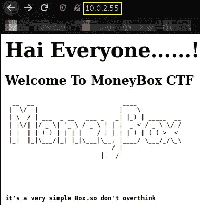

让我们导航到**/博客**路径，看看是否有适合我们的东西，

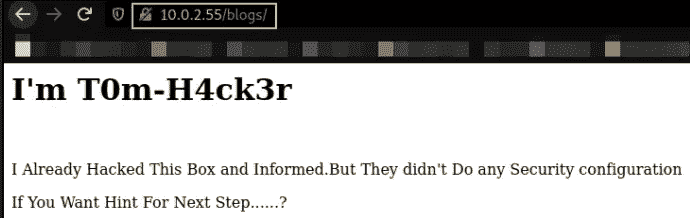

我检查了它的源代码，发现了这个，

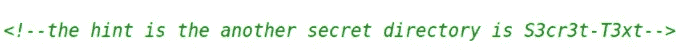

让我们导航到 **/S3cr3t-T3xt** 路径，我找到了这个

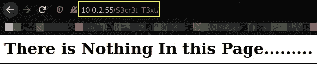

但是看看源代码，我们找到了秘钥，


也许这就是从图像中提取数据的关键。

现在我将通过匿名登录 ftp，

```
ftp 10.0.2.55
```

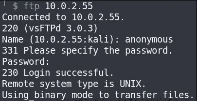

我们连上了 ftp。现在我们来列举一下

使用`ls -la`列出目录的所有内容，

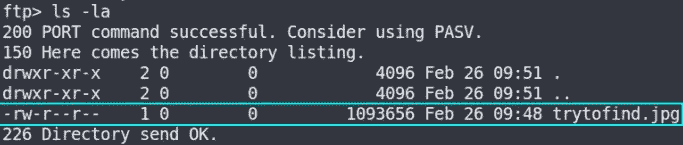

图像被找到，所以我将下载这个图像到我们的本地系统。

使用`get`命令下载该文件，

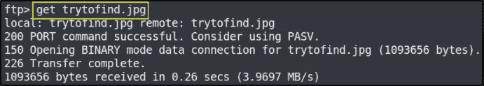

我将退出 ftp。

现在，在我从秘密目录中找到密钥之前，短语 **3********t4** ( **l33t 代码**)意味着**提取数据**，所以我将尝试使用隐写工具从图像中提取数据(**隐写图**)

```
steghide extract -sf trytofind.jpg
```

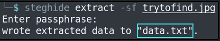

现在正在读取新提取的文件 data.txt 的内容，

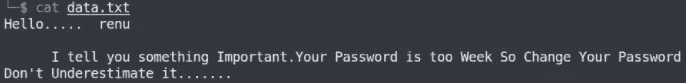

看完这个，我们知道 **renu** 是用户名，消息引用密码太弱，也就是说，我们可以使用 **hydra 工具**破解密码，

```
hydra -l renu -P /usr/share/wordlists/rockyou.txt 10.0.2.55 -t 4 ssh
```

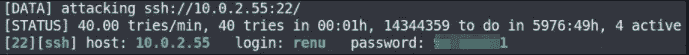

**剥削:**

唉，我们得到了用户名 **renu** 和密码来认证 SSH，

```
ssh renu@10.0.2.55
```

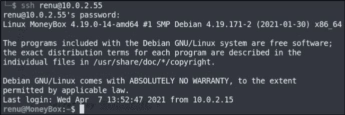

我们被认证为 renu 用户。现在，用户 1 标志，

执行 **ls** 命令列出目录内容，执行 **cat** 命令读取文本文件内容，

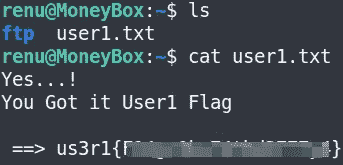

我们得到了 user1 标志，现在我将研究如何得到 user2 标志，

做`ls`将列出目录的内容，我发现有 2 个用户，我决定导航到 lily 目录，做`ls -la`，我发现隐藏目录**。ssh** (可以有办法认证我们是用户 lily)，


在**内导航。ssh** 目录，做`ls`，我们得到 **authorized_keys** ，使用`cat`命令读取文件里面的文本，

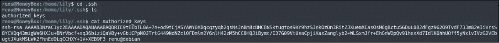

我们知道我们可以在不知道密码的情况下认证我们是 lily 用户，

```
ssh lily@10.0.2.55
```

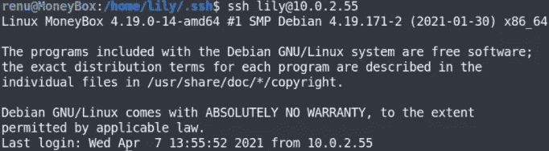

现在我们是 lily 用户。寻找用户 2 标志，

做`ls`然后`cat`，我们得到了我们的用户 2 标志，

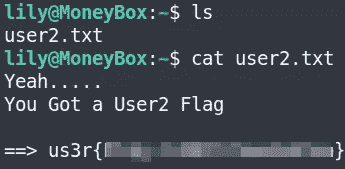

现在，我将运行命令 **sudo -l** ,看看我是否可以在机器上运行命令来获得 root 访问权限，

```
sudo -l
```

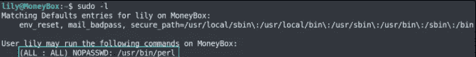

我们可以作为 lily 用户运行命令，

```
sudo perl -e 'exec "/bin/sh";'
python3 -c 'import pty;pty.spawn("/bin/bash")'
```

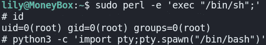

使用`cd`导航到根目录并执行`ls -la`，

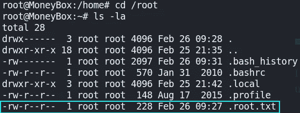

我们有根旗！

抓紧了，我的伙计们，下次再见！再见。