# VulnHub | Odin 漫游

> 原文：<https://infosecwriteups.com/vulnhub-odin-walkthrough-d79f9764519d?source=collection_archive---------2----------------------->

> 奥丁冒险来到约顿海姆附近的米伊美之井，那是巨人之地，他伪装成一个名叫维格坦的行者。守卫这口井的密米尔，为了让他喝井里的水，要求他牺牲自己的左眼，这是他渴望获得知识的象征

你好，在这篇文章中，我们将通过一个简单的 Vulnhub 机器 [Odin](https://www.vulnhub.com/entry/odin-1,619/) 获得根。我建议你先自己尝试一下！如果你真的卡住了，或者你只是想看看我是怎么用我的方式做的，那就回来吧；)

威廉·沃纳。1882.*北欧-德国哥德和赫尔顿*。奥托·斯帕默，莱比锡&柏林。第 7 页

# 列举

我假设您知道如何在您选择的虚拟化软件中设置来自 vulnhub 的盒子。如果没有，这里有一个【virtualbox 的快速指南。首先，我们需要找到机器的 ip 地址。为此，我们需要扫描我们的网络，因此我们需要知道我们网络的 ip 范围。奔跑

> **ip a**

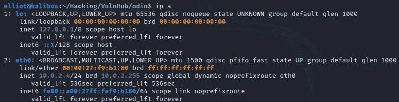

来自 ip a 的结果

如我们所见，我的网络是 10.0.2.255，前缀为/24，因此要扫描我们的网络以找到我们运行的 odin 箱的 ip

> **nmap 10.0.2.0/24**

我们拿回这个

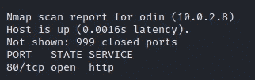

找到了奥丁的 IP

所以它的 ipv4 地址是 10.0.2.8 **(但是不要忘记，从现在开始当你看到 10.0.2.8 时，记得用它在你的网络中的 IP 来替换它)**。我们看到它打开了端口 **80** ，但是让我们运行一个标准的 **nmap** 扫描来了解更多信息

> **nmap -sC -sV 10.0.2.8**

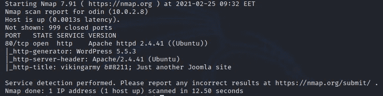

nmap 扫描的结果

我们可以看到我们正在处理一个 **wordpress** 站点，具体来说就是*版本 5.5.3* 。如果我们愿意，我们可以把它记下来，以便将来调查。现在，让我们去现场。但是在我们这样做之前，盒子描述要求我们将 odin 添加到我们的 **/etc/hosts** 文件中，可能是出于稳定性的原因。所以用 **Vim** 打开它(因为你还会用什么(:)，加上

> **10.0.2.8 奥丁**

现在你要做的就是在你的浏览器里写 odin。

# 最初的立足点

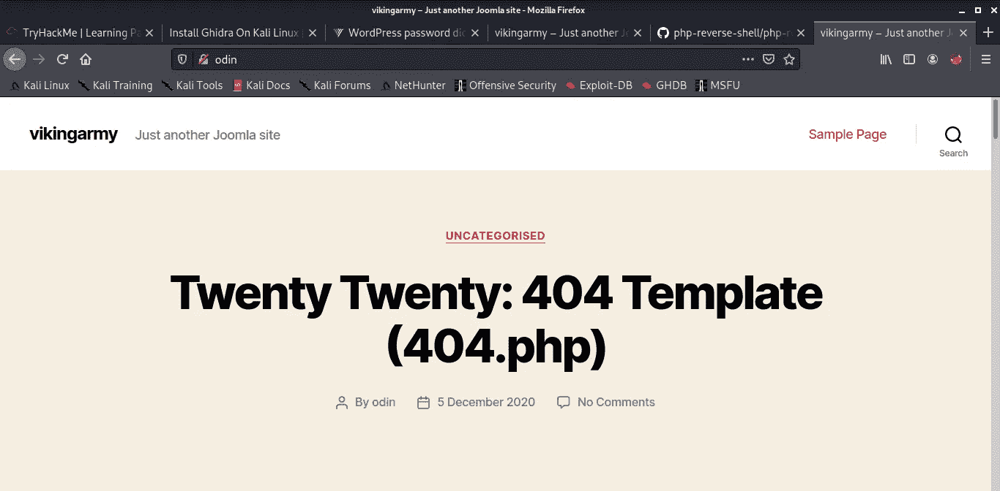

奥丁网站(原谅其他标签:p)

如果你向下滚动一点，你会发现这个奇怪的文本

> **nb 2 hi 4d this 6 z 3 joruhkyromnxw 2l 3 emf xgszlmnvuwk 43 TN rsxel 2 tmvruy 2 ltorzs 6 ytmn 5r c 63 lbon 2 GK 4 rpkbqxg 43 xn 5 zgi 4 zpjrswc 23 fmqwuiylumfrgc 43 fomx xe 33 dn 4 w 65 joor 4 hiltumfzc 4 z 32 ebzg 6y 3 lpfxxkidonfrwkid xn 5 zgi 3d Jon 2 au = = = =**

从它的外观和末尾的=来看，你会认为它是 **base64** 。但如果你破译了它，你就能回去。这是因为这是用 [**base32**](https://en.wikipedia.org/wiki/Base32) 编码的。所以我们需要改变一些事情

> **echo nb 2 hi 4 DTH ixs 6 z 3 joruhkyromnxw 2 l 3 emf xgszlmnvuwk 43 tnrs xel 2 tmvruy 2 ltorzs 6 ytmn 5 RC 63 lbon 2 GK 4 rpkbqxg 43 xn 5 zgi 4 zpjrswc 23 fmqwuiylumfrgc 43 fomx xe 33 dn 4 w 65 joor 4 hiltumfzc 4 z 32 ebzg 6y 3 lpfxxkidonfrwkid xn 5 zgi 3 Jon 2 au = = = = | base 32-d【中**

它返回

> [**https://github . com/danielmiessler/sec lists/blob/master/Passwords/Leaked-Databases/rock you . txt . tar . gz**](https://github.com/danielmiessler/SecLists/blob/master/Passwords/Leaked-Databases/rockyou.txt.tar.gz)**rock you nice word list**

链接到著名的*rock you***词表*。这意味着我们需要**强行**到 *wordpress 管理面板*，它可以在 **wp-admin** 找到。有一个专门针对 wordpress bruteforcing 的工具叫做 **wpscan** ，这里是我用来更新知识的[链接](https://www.wpwhitesecurity.com/strong-wordpress-passwords-wpscan/)。我们需要运行适当的命令。但是在我们运行它之前，我们需要一个用户名。*

*我想到的用户名中有一个是奥丁，所以我在登录表单中写了奥丁:奥丁*

*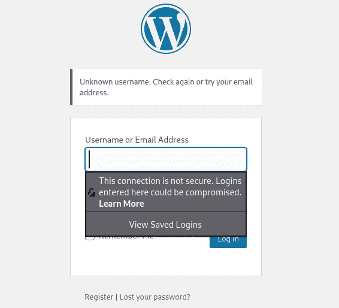*

*回应很有趣*

***未知用户名**是一个奇特的词汇选择。让我们试试另一个常用用户名 **admin** 。*

**

*你可以从回答中学到很多！*

*这就是我喜欢的；).现在我们知道 admin 是用户名，我们可以继续使用 **wpscan***

> ***wps can—URL**[**http://ODI**](http://odin)**n—passwords/usr/share/word lists/rock you . txt—用户名管理***

*在执行了一些其他扫描并开始猜测之后，wpscan 很快找到了一个匹配！*

*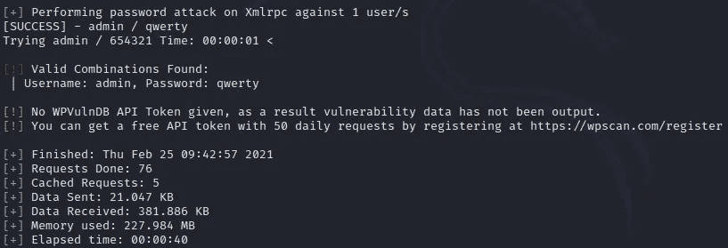*

*wpscan 的结果*

***qwerty** 是密码。所以现在我们可以进入管理面板。*

# *反向外壳*

*一旦进入，我们需要弄清楚如何才能得到一个反向外壳。为此，我找到了这个网站，并遵循第一种方法。我使用了[标准的 php 脚本](https://github.com/pentestmonkey/php-reverse-shell/blob/master/php-reverse-shell.php)(别忘了用你的系统改变 ip，用你选择的端口改变端口)并上传到**主题**。在它进入之后，我在脚本的默认端口设置了一个监听器*

> ***nc -lvnp 1234***

*并且开除了网站给的 **curl** 命令，当然是换了主机之后。*

*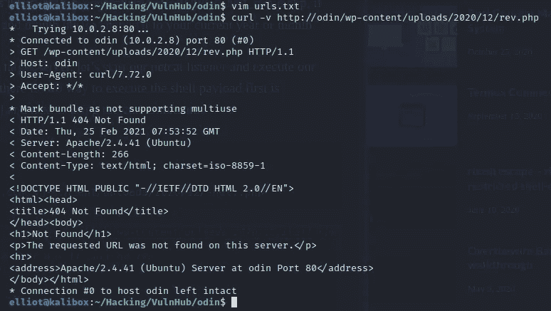*

*不成功卷曲*

*兄弟。还有一些我们应该改变的东西，那就是路径，因为主题没有上传到 *2020/12* ，而是 *2021/02**

*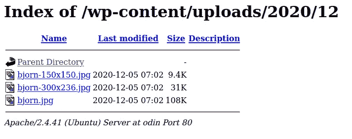*

*2020/12 的内容*

*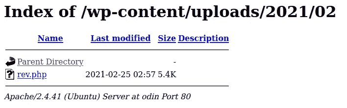*

*2021/02 的内容*

*因此，让我们相应地更改路径，然后再试一次*

> ***curl-v**[**http://Odin/WP-content/uploads/2021/02/rev . PHP**](http://odin/wp-content/uploads/2021/02/rev.php)*

*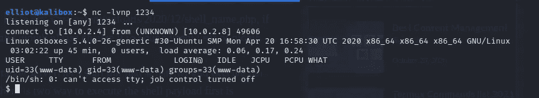*

*我们找到一个弹壳*

*除了那是我喜欢的，我还能说什么；)*

*顺便说一句，我试图创造一个交互式外壳，但是运气不佳。如果你这样做了，那么在评论中写下你是如何做的。*

# *权限提升*

*在这里，你可以像我一样，进入 **/home** ，在那些目录中搜索等等。过了一会儿，我决定尝试访问 www-data s(我们现在的用户)的家。我不记得在哪里，而且 *sh* 不接受 *cd ~* ，所以我用 bash 换了 shells，去了用户主目录*

> ***迎头痛击；cd ~***

*在那里我们找到了 **html** dir，在其中我们找到了多个有趣的 *php* 文件*

*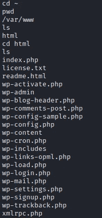*

*我知道没有提示也困扰着我:(*

*在那里我们发现了潜在的辛辣**wp-config.php**。在得到它(好词)后，我们中了头彩*

*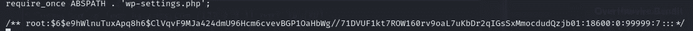*

*多么精彩的一场比赛*

> ***$ 6 $ e 9 hwlnutuxapq 8h 6 $ clvqvf 9 mja 424 DMU 96 HCM 6 cvevbgp 1 oahbwg//71 dvu f1 kt 7 row 160 RV 9 oal 7 uk BDR 2 qigssxmmocdudqzjb 01***

*根用户散列，你可以在 **/etc/shadow** 中找到它。剩下的就是破解了。要做到这一点，我们首先需要分析它。通过一些谷歌搜索，我[发现了一个叫做**哈希德**的工具。它真正的优点是 **-m** 标志，它为您提供了哈希的 **hashcat** 模式。](https://miloserdov.org/?p=1254)*

> ***hashid-m '＄6＄e 9 hwlnutuxapq 8h 6＄clvqvf 9 mja 424 DMU 96 HCM 6 cvevbgp 1 oahbwg//71 dvu f1 kt 7 row 160 RV 9 oal 7 uk BDR 2 qigssxmmocdudqzjb 01 '***

*它返回*

> ***[+] SHA-512 地穴【哈希卡特模式:1800】***

*最后，让我们运行 hashcat 并获得散列*

> ***hashcat-a 0-m 1800 password file/usr/share/word lists/rock you . txt***

*我已经运行过了，所以我在上面的命令中添加了 **— show** 。你应该拿回密码，是**茉莉**。*

> ***苏***

*就像这样，如果我们跑了*

> ***id***

*我们会看到我们想要的。其余的都很典型*

*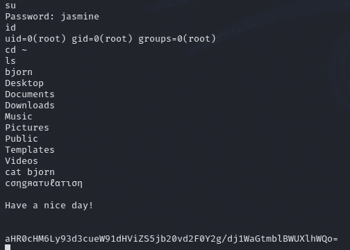*

*结束了*

*好了，就这些了，希望你们喜欢！如果你想看更多我写的文章和文章，那么一定要关注我并为这篇文章鼓掌。你也可以在 [Twitter、](https://twitter.com/3xM4ch1n4)当然还有 [Github](https://github.com/Ckrielle) 上关注我，在那里你可以查看我的一些项目。保重！*