# VulnHub — VulnCMS:1 个演练

> 原文：<https://infosecwriteups.com/vulnhub-vulncms-1-walkthrough-d4f8a071e61?source=collection_archive---------0----------------------->

VulnCMS:1 是一个简单的关卡，机器人先生主题的 boot2root CTF 挑战赛，你必须枚举盒子，找到 CMS 版本，并利用它来获得访问权限。

先从找到受害者的 IP 开始。

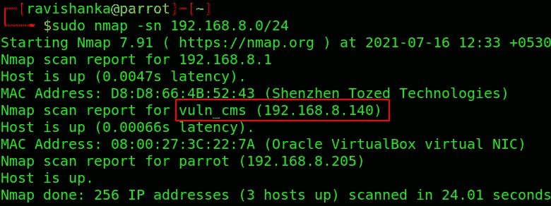

寻找 IP

然后，让我们执行传统的 Nmap 扫描。

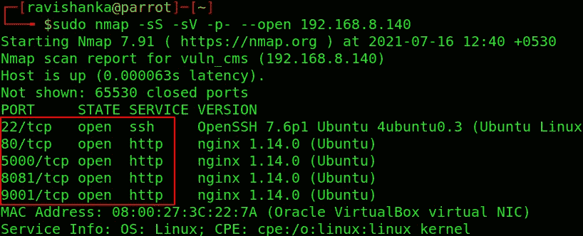

Nmap 扫描

我们会遇到 5 个开放的港口，

*   端口 22 — SSH
*   其他 4 个端口由 web 应用程序组成

让我们用**-一个**标志进行一次积极的扫描。

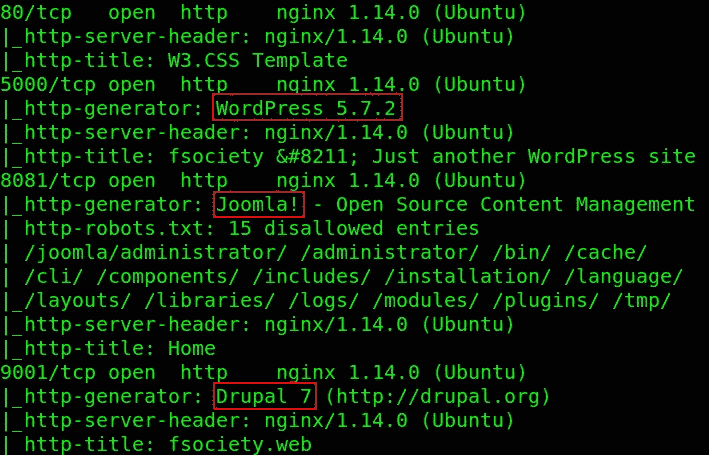

nmap -A

中的 web 应用程序，

*   端口 5000 是用 WordPress 构建的
*   端口 8081 是用 Joomla 构建的
*   端口 9001 是用 Drupal 构建的

我一看到 Drupal is 7 的版本，就想起了 HackTheBox 的末日机器，在那里我不得不利用 Drupalgeddon2 RCE 漏洞。

让我们用 [drupwn](https://github.com/immunIT/drupwn) 来了解一下 Drupal 的确切版本。

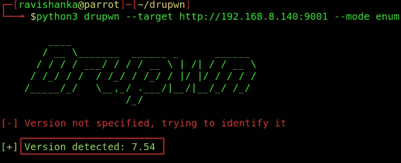

枚举 Drupal 版本

版本为 **7.54** ，意味着易受 [Drupalgeddon2](https://www.exploit-db.com/exploits/44449) 漏洞攻击。

你可以从[这里](https://www.rapid7.com/blog/post/2018/04/27/drupalgeddon-vulnerability-what-is-it-are-you-impacted/)阅读更多关于这个漏洞的信息。

我们可以使用一个 **metasploit 模块**来利用这个漏洞。

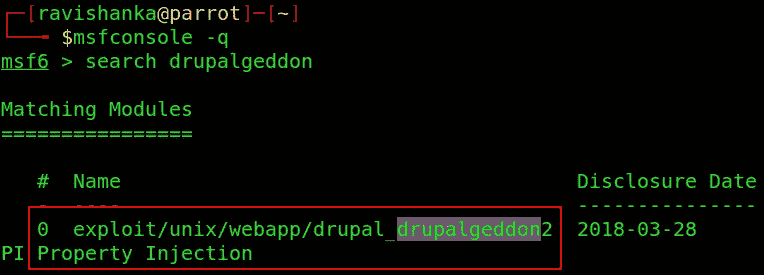

搜索 drupalgeddon

只需提供受害者的 IP，端口和 vhost，并运行利用。

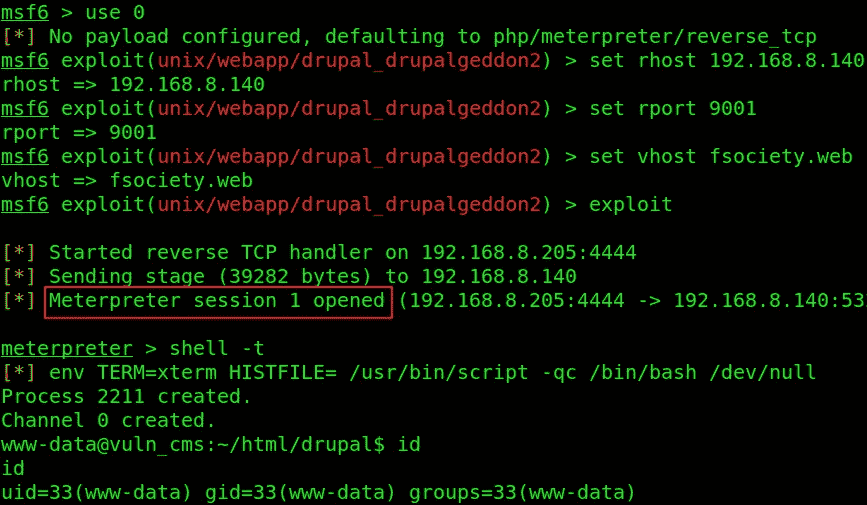

利用

现在我们得到了系统的立足点。我们需要为用户而努力。

当我们查看主目录时，我们可以看到系统的 3 个用户，分别是 **elliot、ghost** 和 **tyrell** 。

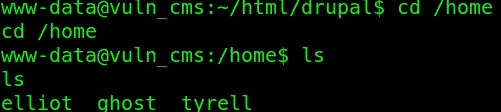

3 个用户

我们可以看到用户标志位于 elliot 的主目录中。但是，我们没有足够的权限打开它。

在 **/var/www/html/drupal 中有一个 **misc** 目录可疑。**

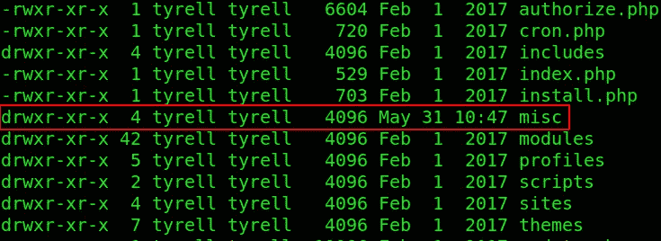

/var/www/html/drupal/misc

misc 目录下有一个名为 **tyrell.pass** 的文件，任何人都可以阅读。

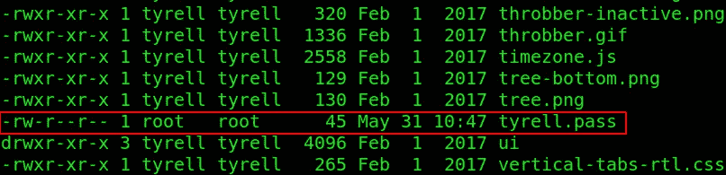

泰里尔，传球

我们可以清楚地了解到它们是用户 Tyrell 的凭据。

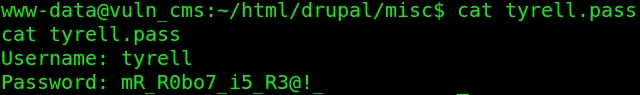

用户 Tyrell 的凭据

所以，让我们继续宋承宪成为受害者作为泰里尔。

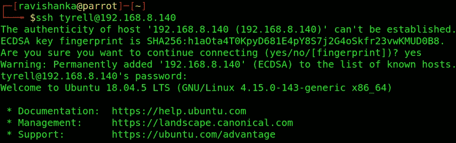

宋承宪饰演泰里尔

我们拥有用户！！！

我们来看看这个用户作为 root 可以执行哪些命令。

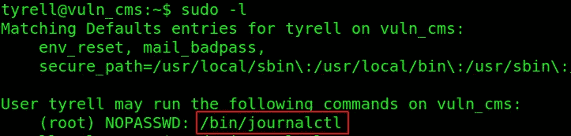

该用户可以根用户身份执行二进制文件。我们可以通过这个来自 GTFOBINS 的二进制文件找到一种方法来提升我们的特权。

我们只需要用 sudo 特权运行二进制文件并添加**！/bin/bash** 如下。

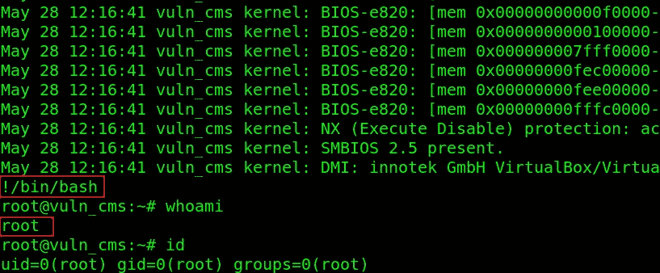

追加！/bin/bash

瞧啊。！！我们拥有 root！！！

首先，让我们从 elliot 的主目录中获取**用户标志**。

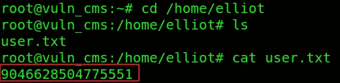

用户标志

然后我们可以从 root 的主目录中抓取**根标志**。

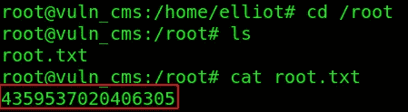

根标志

我希望你在享受挑战的同时也学到了一些东西。通过 [LinkedIn](https://www.linkedin.com/in/ravishanka-silva-a632351a0/) 联系我。

祝你在前方捕捉旗帜时好运！！！