# Vulnhub 向上写 FristiLeaks

> 原文：<https://infosecwriteups.com/vulnhub-write-up-fristileaks-54b8708f7cbb?source=collection_archive---------1----------------------->

*这是来自*[*VulnHub*](https://www.vulnhub.com/)*的机器*[*fristileaks*](https://www.vulnhub.com/entry/fristileaks-13,133/)*的特写。*

# 摘要

FristiLeaks 机器是一个简单的机器，通过利用上传功能拥有低权限外壳，并在 sudo 的帮助下获得根权限。机器设计的很好，几乎没有兔子洞，对新手来说不错。

> 机器作者: [Ar0xA](https://twitter.com/Ar0xA)
> 机器类型:Cent OS(Linux)

# 专有技术

*   Nmap
*   base64 编码

# 吸收技能

*   bash shell 命令:- *base64，rev，tr*
*   使用 *sudo 进行权限升级。*

# 扫描网络

```
$nmap -sC -sV 192.168.0.174
```

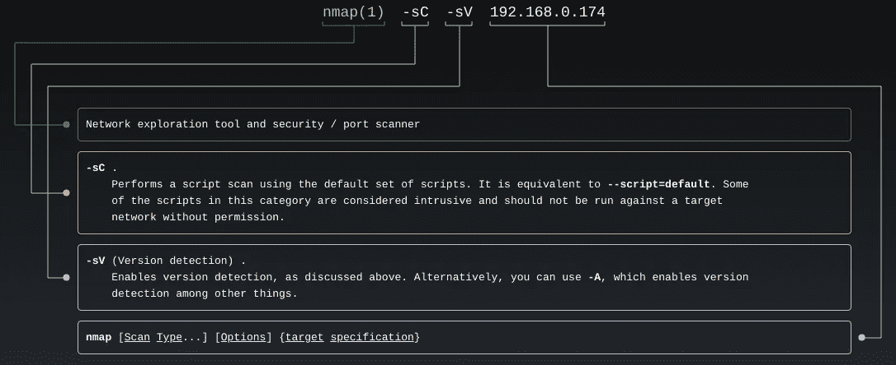

man nmap

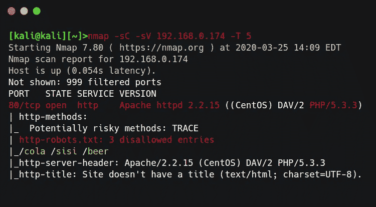

nmap 结果

Nmap 结果显示有 3 个静态页面(*可乐、思思、小熊*)，但是我什么也没找到，我也尝试了目录暴力破解但是没有成功。我试着联系作者，他给了我提示。

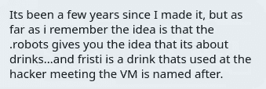

登录页面

页面源码给出了一些提示，用户名是 **eezeepx** ，他们对图片使用 base64 编码。

# 登录管理门户

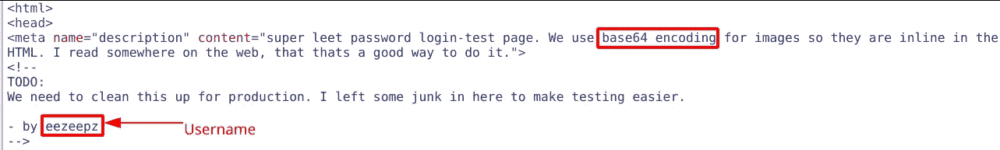

页面源

在页面的底部，有一个用 base64 编码的注释。

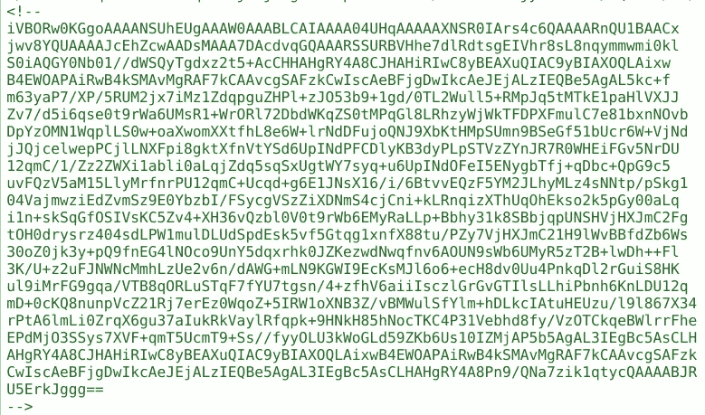

编码图像

我使用 *base64* 命令将 txt 解码并保存到图像中。

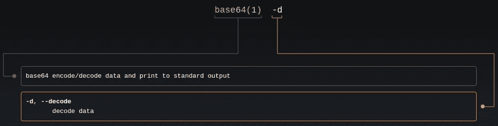

base64 man

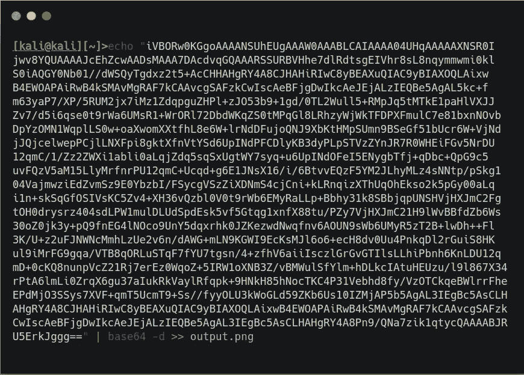

解码图像

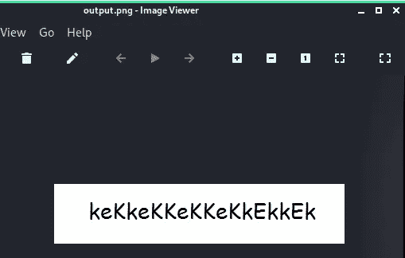

output.png

> 用户名*:*eezeepz密码 *:* keKkeKKeKKeKkEkkEk

# 低特权外壳

登录后，有上传图像功能。

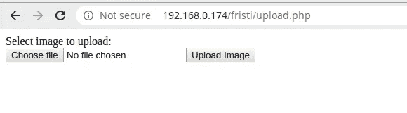

[http://192 . 168 . 0 . 174/fristi/upload . PHP](http://192.168.0.174/fristi/upload.php)

我试着通过 pentest monkey 上传 PHP 反向 shell，但是只允许使用 ***png，jpg，gif*** 扩展名。

 [## PHP-反向-shell

### 该工具专为 pentest 期间的情况而设计，在这种情况下，您可以上传到运行…

pentestmonkey.net](http://pentestmonkey.net/tools/web-shells/php-reverse-shell) 

在尝试了不同的扩展之后，我使用了双扩展来上传 shell，最终它上传成功了。

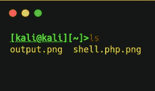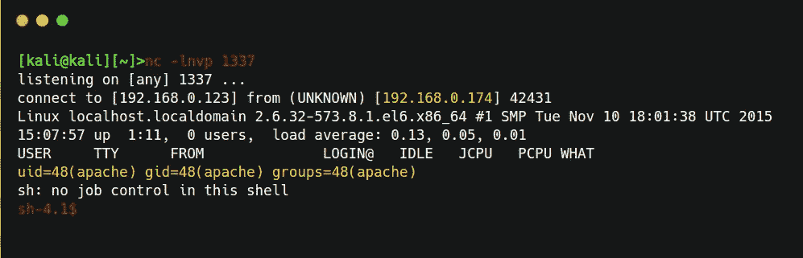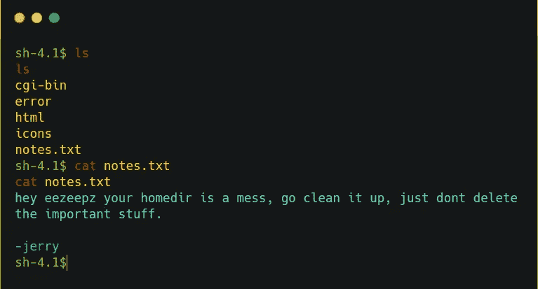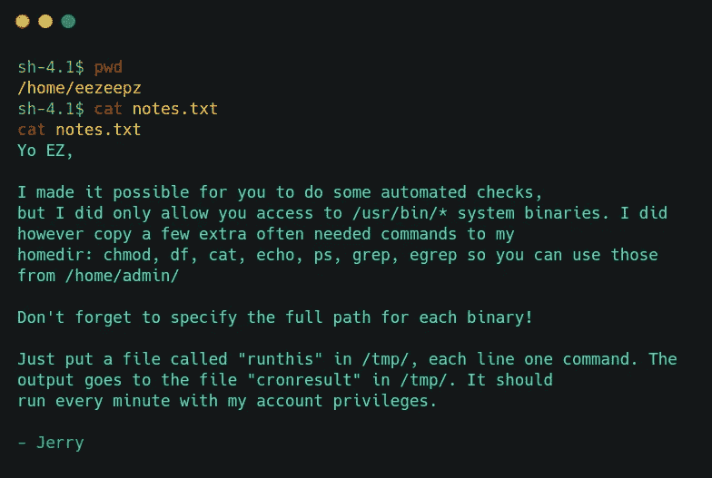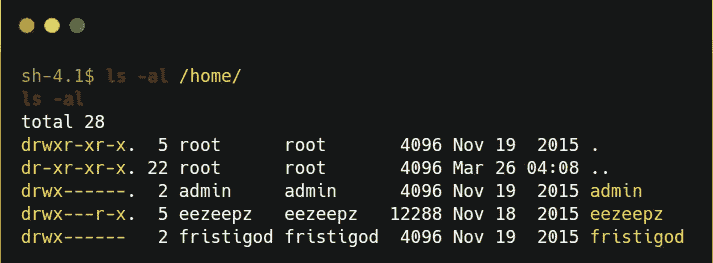

因此，我们可以将命令放在 *tmp* 文件夹中的 *runthis* 文件中，并由 cronjob 以管理员身份运行。

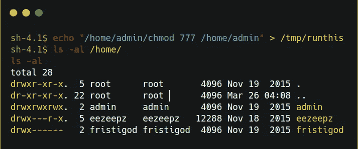

有趣的文件在 *admin* 文件夹中，所以有 cryptpass.py 脚本，它采用 base64 编码，然后反转它并将每个字母表旋转 13°。

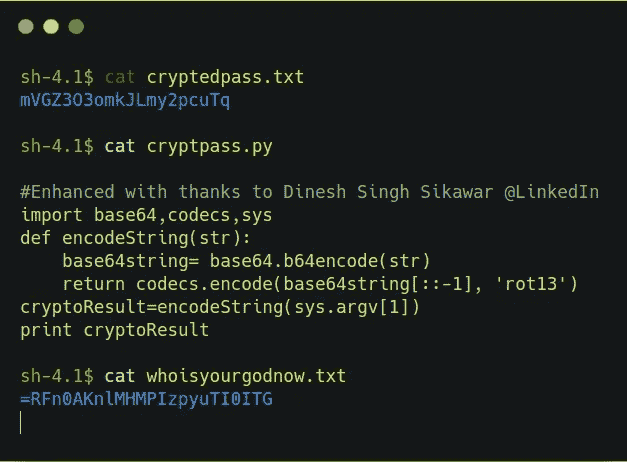

/home/admin/

我使用 bash 一行程序来解码它，借助于 ***rev*** 和 ***tr*** 命令。

```
echo “mVGZ3O3omkJLmy2pcuTq” | rev | tr ‘[A-Za-z]’ ‘[N-ZA-Mn-za-m]’ | base64 -d
echo “”
echo “=RFn0AKnlMHMPIzpyuTI0ITG” | rev | tr ‘[A-Za-z]’ ‘[N-ZA-Mn-za-m]’ | base64 -d
```

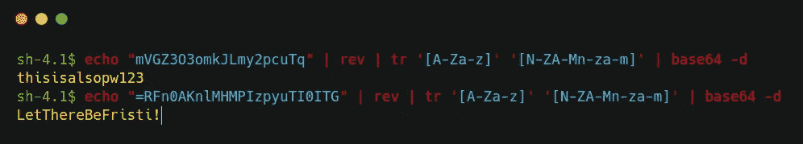

找了一会儿后，我发现***this also pw 123***是 admin 的密码，而 ***是 LetThereBeFristi！*** 是 ***fristigod 的密码。***

# 权限提升

**为*第一次测井后。***

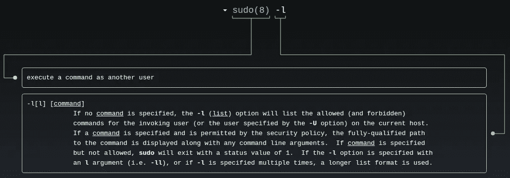

满须藤

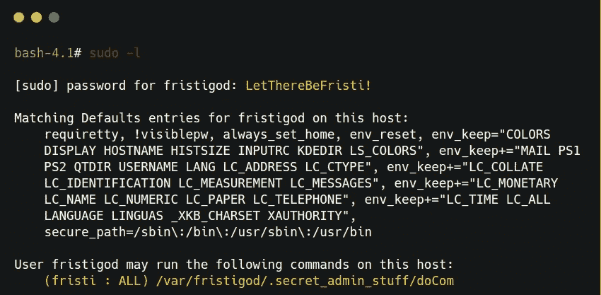

# 自己的根

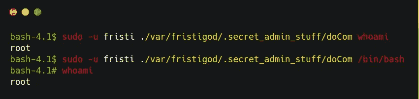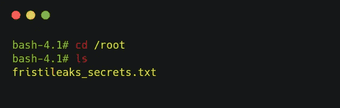

根标志

[](https://medium.com/@yashanand155) [## 增量中等

### 从 inc0gnito 介质上读取文字。夺旗类游戏🚩|| HACKTHEBOX || VULNHUB ||反转。

medium.com](https://medium.com/@yashanand155) 

*感谢阅读！如果你喜欢这个故事，请点击**👏 ***按钮，分享*** *它来帮助别人！欢迎留言评论*💬*下图。有反馈？下面我们连线上* [*推特*](https://twitter.com/yashanand155) *。**

# *❤️由[增加到](https://twitter.com/yashanand155)*

**关注* [*Infosec 报道*](https://medium.com/bugbountywriteup) *获取更多此类精彩报道。**

*[](https://medium.com/bugbountywriteup) [## 信息安全报道

### 收集了世界上最好的黑客的文章，主题从 bug 奖金和 CTF 到 vulnhub…

medium.com](https://medium.com/bugbountywriteup)*