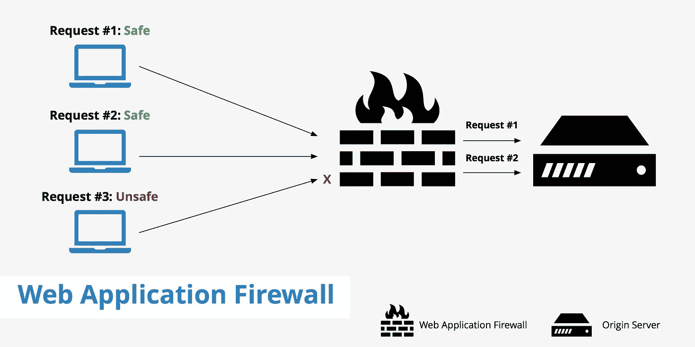
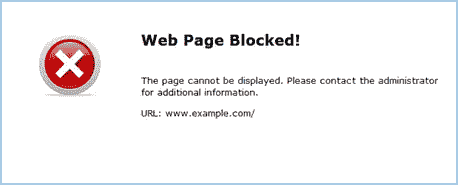

# 晶圆旁路:拆除围墙

> 原文：<https://infosecwriteups.com/waf-bypasses-tearing-down-the-wall-d08fd0f8374a?source=collection_archive---------1----------------------->

**来源:谷歌**

在我们深入实际的旁路部分之前，理解什么是 WAF(Web 应用程序防火墙)及其类型非常重要。

嗨，伙计们，欢迎来到这个新的博客，在这里，我们将讨论 WAFs，它被认为是黑客最大的敌人之一。同样重要的是要记住 WAF 不同于通常的防火墙(网络防火墙)。这里有一个简单的区别:**网络应用防火墙**是一个网络安全防火墙解决方案，可以保护网络应用免受 HTTP/S 和基于网络应用的安全漏洞**T5 的攻击，其中**网络防火墙**是一个控制对安全局域网的访问以防止未经授权的访问的设备。**

因此，通俗地说，一个 **WAF** 位于外部用户和 web 应用程序之间，用于分析所有 HTTP 通信。然后，它会在恶意请求到达用户或 web 应用程序之前检测并阻止它们。因此，WAFs 可以保护业务关键型 web 应用程序和 web 服务器免受零日威胁和其他应用层攻击。随着企业扩展到新的数字计划，这变得越来越重要，这可能使新的 web 应用程序和应用程序编程接口(API)容易受到攻击。如果你想进一步了解它，请点击 [**此处**](https://en.wikipedia.org/wiki/Web_application_firewall) :)此外，你也可以浏览这张图片以获得一个大致的想法:

**来源:谷歌**

现在，有不同类型的 WAF，供应商也是如此。基本上有三种类型的 WAFs:

*   **基于网络的 WAFs**
*   **基于主机的 WAFs**
*   **基于云的 WAFs**

首先，基于网络的 WAFs 是基于硬件的，并且由于本地安装而提供了减少延迟的好处。这意味着 NWAF 安装在靠近应用服务器的地方，很容易访问。

基于主机的 web 应用程序防火墙作为 web 服务器的模块存在。与基于硬件的 WAFs 相比，这是一个非常便宜的解决方案，WAFs 是为小型 web 应用程序设计的。大多数 WAFs 软件都可以很容易地与流行的 web 服务器集成。

基于云的 web 应用程序防火墙提供了与其他基于软件的 WAF 解决方案类似的优势，例如低成本和缺少您必须管理的内部资源。当您不想用性能能力来限制自己或者旨在避免需要维护的系统时，基于云的解决方案是一个极好的选择。云服务提供商可以提供无限的硬件池，并提供合格的设置和支持。

说得够多了，让我们来看看作为攻击者的一些观点。最常见的需要 WAF 旁路的攻击是 **XSS** 和 **SQLi。**或者你也可以说一些类型的注入攻击需要绕过。因此，我们将看到旁路实际上是如何工作的，以及当 WAF 被构建来保护攻击时它为什么会工作:)这里我们以 **Cloudflare** 为例，因为我们在现实生活场景中经常看到它。然而，还有其他[**cdn**](https://www.cloudflare.com/en-in/learning/cdn/what-is-a-cdn/)被用于:

*   **赤麦。**
*   **苏库里。**
*   **亚马逊云锋。**
*   **堆栈路径。**
*   快速地。

假设(只是假设)，你得到了一个搜索字段，并尝试了一个简单的有效载荷，如  。没用:(现在你又试了一个，这次" >。这个也不行。现在，当你检查时，网站阻止了你，你需要现在返回。大概是这样的:

**来源:谷歌**

在这里，你应该假设有一个防火墙来阻止你输入任何被过滤的字符。所以才实施的对！好的，这就是旁路发挥作用的地方。旁路只是避开过滤器的技术。所以，把你的黑客头脑放在这里，尝试一些开箱即用的东西。我们将采用正常的有效载荷来理解它是如何绕过晶片的。让我们来看看这个有效载荷:

**% 22% 3E % 3c img % 20 src % 3Dx % 20 错误% 3Dx 警报(1)%3E**

这与**">**相同，但有时编码可能有效。现在的问题是，为什么 WAF 接受这个有效载荷，而这个有效载荷还带有“警报”。简单地理解如下:**waf 有一些定义好的规则，它们遵循一种包含过滤字符和单词的检查表。**因此，如果没有在清单中进行过滤，这里可以使用简单的编码。然而，现在 WAFs 非常先进，他们甚至过滤 base-64 编码。不管怎样，这就是为什么我们的有效载荷绕过 WAFs 的基本想法。

有多种方法可以绕过 WAF 到达 XSS。你可以随时用谷歌查看，你应该会得到很多有效载荷和备忘单，但我包括其中一些:

*   [**OWASP 过滤规避备忘单**](https://owasp.org/www-community/xss-filter-evasion-cheatsheet)
*   [**city base brooks**](https://github.com/citybasebrooks/XSS-Filter-Evasion/blob/master/payloads)的小抄
*   有效载荷由 [**HackTricks**](https://book.hacktricks.xyz/pentesting-web/xss-cross-site-scripting)

当我们试图利用 SQL 注入时，WAFs 限制了我们很多次，它不允许我们继续我们的有效负载。例如:如果 **/？id=1+union+select+1，2，3/*** 被防火墙屏蔽，我们可以这样试试:

**/？id=1+un/**/ion+sel/**/ect+1，2，3 —**

而且，如果应用程序易受 SQLi 攻击，第二个会绕过它。在这里，我们所做的是，我们把我们的有效载荷发送到服务器，它照原样接收，但我们知道它将作为第一个被执行。由于它阻止了**联合，**我们破坏了它并用/**/发送了它。WAF 没有阻止它，因为它没有被过滤或组织阻止。同样，如果 **union select 1，2，3，4，5#"]** 被阻塞，我们可以将“select”拆分成类似于 **se、【select 1，2，3，4，5】**的内容，它应该会运行良好。以下是 SQLi 筛选器规避的一些列表:

*   [**OWASP SQLi 备忘单**](https://owasp.org/www-community/attacks/SQL_Injection_Bypassing_WAF)
*   [**海德拉斯基的检查表**](https://hydrasky.com/network-security/sql-injection-bypass-cheatsheet/)

嗯，还有几件事没提。在你绕过它之前，有些东西会帮助你找出幕后故事。直到你知道你正在穿越哪个防火墙，你才可以盲目的尝试。所以很少有学生能搞清楚:

*   [**WafW00F 用于识别防火墙**](https://github.com/EnableSecurity/wafw00f)
*   [**这个 GitHub 回购超级好用，帮了大忙:)**](https://github.com/0xInfection/Awesome-WAF)

我提到的第二个环节是我认为 WAFs 最好的事情之一。它的工作原理和 LiveOverflow 的 [**我能接管 XYZ**](https://github.com/EdOverflow/can-i-take-over-xyz) **一样。**您可以查看不同 cdn 和 WAFs 的详细信息，例如:

**云闪**

*   可检测性:简单
*   检测方法:
*   响应头可能有`cf-ray`字段值。
*   `Server`标题字段有值`cloudflare`。
*   `Set-Cookie`响应头有`__cfuid=` cookie 字段。
*   页面内容可能有`Attention Required!`或`Cloudflare Ray ID:`。
*   页面内容可能包含文本形式的`DDoS protection by Cloudflare`。
*   点击无效网址可能会遇到`CLOUDFLARE_ERROR_500S_BOX`。

我强烈建议检查一下，应该会对你有很大帮助。

WAFs 总是挑战被绕过，但也有一些严肃的学习。是的。如果你能以某种方式把它升级到 SQLi，你可以得到相当多的钱。所以总是双赢。也有先进的技术，你挖掘得越深，你获得的想法就越多。

好了，这就是这篇博客的全部内容，我希望你喜欢它。如果你有，请在社区中分享:)你可以在 twitter 上关注我的任何其他相关内容，我非常感谢你的投入，无论是建议还是我需要做的补充:)

保重，快乐黑客！

再见，❤

**推特:- @manasH4rsh**